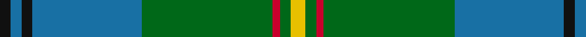
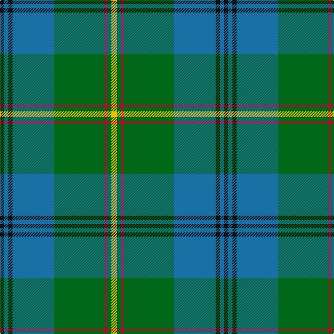

**Bands:** [KBKBGRGY](/stripes/kbkbgrgy/) · **Stripes:** [K B K B G R G LY](/stripes/stripes8/) K B K B G R G LY

This was sourced from register-of-tartans.  It is a [8 band tartan](/bands/bands8/).

Original link https://www.tartanregister.gov.uk/tartanDetails.aspx?ref=4862

## Attestations

This cloth appears in 2 source records; the oldest owns this page.

- undated — Chartered Accountants of Scotland (register-of-tartans, [record](https://www.tartanregister.gov.uk/tartanDetails.aspx?ref=4862))
- Unknown — Chartered Accountants of Scotland (C (tartans-authority, [record](http://www.tartansauthority.com/tartan-ferret/display/3950/))

## Register references

External register numbers recorded for this tartan.

- Scottish Register of Tartans: [4862](https://www.tartanregister.gov.uk/tartanDetails.aspx?ref=4862)
- Scottish Tartans Authority (ITI): 3950

## Thread count
K/6 B6 K6 B60 G72 R4 G6 Y/8

## Palette
Each colour and its ΔE from the base-6 reference it is a variant of.

| Colour | Shade | Base | ΔE (OKLab) |
|---|---|---|---|
| B | <code style="background-color:#1870A4;">#1870A4</code> `#1870A4` | B <code style="background-color:#2A418A;">#2A418A</code> | 0.13 |
| G | <code style="background-color:#006818;">#006818</code> `#006818` | G <code style="background-color:#006100;">#006100</code> | 0.02 |
| K | <code style="background-color:#101010;">#101010</code> `#101010` | K <code style="background-color:#000000;">#000000</code> | 0.17 |
| R | <code style="background-color:#C8002C;">#C8002C</code> `#C8002C` | R <code style="background-color:#CC0000;">#CC0000</code> | 0.03 |
| Y | <code style="background-color:#E8C000;">#E8C000</code> `#E8C000` | Y <code style="background-color:#F2BF00;">#F2BF00</code> | 0.02 |

# Sample pattern

## Nearest tartans

The nearest existing variants by ΔTartan distance.

1. [Fox Hunting](/setts/s8/r4k2g36k2b18ly3b18k2~x2/) — ΔT 0.65
1. [Singh](/setts/s8/db3r3db36g17ly2g21w2r3~x2/) — ΔT 0.98
1. [Downie (Name)](/setts/s10/t24k2r2t2db12g28r4g5t3g3~x2/) — ΔT 1.09
1. [Maine State District Tartan Tartan Number: 502. Earliest known date: 1965 Maine tartan is the oldest of America's tartans. It was woven by the Maine Spinning Company which has now gone out of business. When the tartan was first introduced it was reported in the Glasgow Herald (30.12.65) that it had been 'duly accredited by the State of Maine'. The State archives, however, are unable to locate the authorization. It is now marketed by the Maine Tartan and Tweed company, who hold the copyright. See products available Copyright © Blair Urquhart, Comrie, 2015](/setts/s11/g2r2t21db2t2db6t2db2g33r2t2~x2/) — ΔT 1.21
1. [Hope-Vere (Lochcarron)](/setts/s10/g16k1t2k1g3k5n12k1ly1k3~x4/) — ΔT 1.22
1. [Michigan, State of](/setts/s10/g18w1g4w1ly4dg1ly2dg12r2dg4~x2/) — ΔT 1.22
1. [Gift of Life Michigan (Corporate)](/setts/s7/r2t1r1t11g16dg1w1~x2/) — ΔT 1.25
1. [Carmichael](/setts/s6/k3g36db28r2db2ly3~x2/) — ΔT 1.26
1. [New World Irish (Fashion)](/setts/s8/w9dg2g2w3g18k2dg33lo2~x2/) — ΔT 1.26
1. [Leatherneck, U.S.Marine Corps](/setts/s8/g28r2g2r2g8db24y3r2~x2/) — ΔT 1.30

## Neighbour map

Every grey dot is one of 14313 variants placed by the first two principal components of the ΔTartan feature space (44% of its variance). Red is this tartan; blue dots are its nearest — click one to open its page.

<svg viewBox="0 0 640 380" role="img" style="max-width:100%;height:auto;border:1px solid #e0e0e0;border-radius:4px;display:block" xmlns="http://www.w3.org/2000/svg"><image href="/nn/cloud.v1.png" width="640" height="380"/><a href="/setts/s8/r4k2g36k2b18ly3b18k2~x2/"><circle cx="271.3" cy="163.2" r="4" fill="#3465a4"><title>Fox Hunting</title></circle></a><a href="/setts/s8/db3r3db36g17ly2g21w2r3~x2/"><circle cx="281.6" cy="156.6" r="4" fill="#3465a4"><title>Singh</title></circle></a><a href="/setts/s10/t24k2r2t2db12g28r4g5t3g3~x2/"><circle cx="243.9" cy="160.0" r="4" fill="#3465a4"><title>Downie (Name)</title></circle></a><a href="/setts/s11/g2r2t21db2t2db6t2db2g33r2t2~x2/"><circle cx="317.2" cy="152.8" r="4" fill="#3465a4"><title>Maine State District Tartan Tartan Number: 502. Earliest known date: 1965 Maine tartan is the oldest of America's tartans. It was woven by the Maine Spinning Company which has now gone out of business. When the tartan was first introduced it was reported in the Glasgow Herald (30.12.65) that it had been 'duly accredited by the State of Maine'. The State archives, however, are unable to locate the authorization. It is now marketed by the Maine Tartan and Tweed company, who hold the copyright. See products available Copyright © Blair Urquhart, Comrie, 2015</title></circle></a><a href="/setts/s10/g16k1t2k1g3k5n12k1ly1k3~x4/"><circle cx="253.4" cy="163.3" r="4" fill="#3465a4"><title>Hope-Vere (Lochcarron)</title></circle></a><a href="/setts/s10/g18w1g4w1ly4dg1ly2dg12r2dg4~x2/"><circle cx="268.8" cy="148.2" r="4" fill="#3465a4"><title>Michigan, State of</title></circle></a><a href="/setts/s7/r2t1r1t11g16dg1w1~x2/"><circle cx="289.9" cy="156.7" r="4" fill="#3465a4"><title>Gift of Life Michigan (Corporate)</title></circle></a><a href="/setts/s6/k3g36db28r2db2ly3~x2/"><circle cx="296.6" cy="163.6" r="4" fill="#3465a4"><title>Carmichael</title></circle></a><a href="/setts/s8/w9dg2g2w3g18k2dg33lo2~x2/"><circle cx="270.5" cy="149.9" r="4" fill="#3465a4"><title>New World Irish (Fashion)</title></circle></a><a href="/setts/s8/g28r2g2r2g8db24y3r2~x2/"><circle cx="341.5" cy="187.1" r="4" fill="#3465a4"><title>Leatherneck, U.S.Marine Corps</title></circle></a><circle cx="304.4" cy="159.4" r="5" fill="#c00000"/></svg>

ID: /setts/s8/ly4g3r2g36b30k3b3k3~x2/
