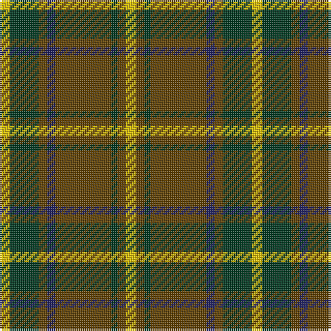

This page is one **sett** — a single exact thread-count. It belongs to the [tartan](/tartans/y5dg14t4db4t27dg3t4y5/)
(the same proportion at any scale), whose colour order is pattern [YGGBGGGY](/stripes/yggbgggy/).

Sourced from house-of-tartan.  It is a [8 stripe tartan](/stripes/stripes8/).

Original link http://www.house-of-tartan.scotland.net/house/TartanViewjs.asp?colr=Def&tnam=1882

## Thread count
Y/5 DG14 T4 DB4 T27 DG3 T4 Y/5

## Palette
Each colour and the base-6 reference it is a variant of.

| Colour | Shade | Base |
|---|---|---|
| DB | <code style="background-color:#202060;">#202060</code> `oklch(28.9% 0.111 276.9)` <small>#202060</small> | B <code style="background-color:#2A418A;">#2A418A</code> |
| DG | <code style="background-color:#003820;">#003820</code> `oklch(30.0% 0.070 158.3)` <small>#003820</small> | G <code style="background-color:#006100;">#006100</code> |
| T | <code style="background-color:#604000;">#604000</code> `oklch(39.8% 0.083 76.8)` <small>#604000</small> | G <code style="background-color:#006100;">#006100</code> |
| Y | <code style="background-color:#E8C000;">#E8C000</code> `oklch(81.9% 0.168 93.7)` <small>#E8C000</small> | Y <code style="background-color:#F2BF00;">#F2BF00</code> |

# Sample pattern

## Nearest tartans

The nearest existing variants by ΔTartan distance, with this tartan at the top so the swatches line up against it.

ΔTartan

Tartan

Sett

—

<a href="/ttd/edit/#slug=ly5dg14dy4db4dy27dg3dy4ly5">Invertere Corporate Tartan Tartan Number: 1882. Earliest known date: 1988 Overstripes are yellow in warp See products available Copyright © Blair Urquhart, Comrie, 2015</a> <a class="nn-out" href="/setts/s8/ly5dg14dy4db4dy27dg3dy4ly5/" title="open its dictionary page">↗</a>

0.72

<a href="/ttd/edit/#slug=r3k2r3g12r3w1r1g1~x4">MacCall/McCall</a> <a class="nn-out" href="/setts/s8/r3k2r3g12r3w1r1g1~x4/" title="open its dictionary page">↗</a>

0.78

<a href="/ttd/edit/#slug=k4lo15dg5k3dg7k3dg30r20dg3~x2">MacKillen</a> <a class="nn-out" href="/setts/s9/k4lo15dg5k3dg7k3dg30r20dg3~x2/" title="open its dictionary page">↗</a>

0.88

<a href="/ttd/edit/#slug=ly5dg14o4db4o27dg3o4ly5~x2">Invertere</a> <a class="nn-out" href="/setts/s8/ly5dg14o4db4o27dg3o4ly5~x2/" title="open its dictionary page">↗</a>

0.91

<a href="/ttd/edit/#slug=dg13ly2dg2ly2dg4r10g2r2~x4">Oakwood</a> <a class="nn-out" href="/setts/s8/dg13ly2dg2ly2dg4r10g2r2~x4/" title="open its dictionary page">↗</a>

1.02

<a href="/ttd/edit/#slug=r4t3r32db30r4g32r3g32r3g3~x2">Unidentified Plaid 6</a> <a class="nn-out" href="/setts/s10/r4t3r32db30r4g32r3g32r3g3~x2/" title="open its dictionary page">↗</a>

1.02

<a href="/ttd/edit/#slug=ly5g14dy4db4dy27g3dy4ly5~x2">Invertere (Daks #2) (Fashion)</a> <a class="nn-out" href="/setts/s8/ly5g14dy4db4dy27g3dy4ly5~x2/" title="open its dictionary page">↗</a>

1.06

<a href="/ttd/edit/#slug=r6dg4do14w4do7dg30lo4~x2">Newfoundland (District)</a> <a class="nn-out" href="/setts/s7/r6dg4do14w4do7dg30lo4~x2/" title="open its dictionary page">↗</a>

1.15

<a href="/ttd/edit/#slug=r6g4do14w4do7g30lo4~x2">Newfoundland</a> <a class="nn-out" href="/setts/s7/r6g4do14w4do7g30lo4~x2/" title="open its dictionary page">↗</a>

1.17

<a href="/ttd/edit/#slug=t2dg1t1dg12r2dg1r6ly2~x2">Manitoba Red</a> <a class="nn-out" href="/setts/s8/t2dg1t1dg12r2dg1r6ly2~x2/" title="open its dictionary page">↗</a>

1.17

<a href="/ttd/edit/#slug=r3g8r2g18m5g3dr3g3dr16g3dr3g3~x2">Dublin</a> <a class="nn-out" href="/setts/s12/r3g8r2g18m5g3dr3g3dr16g3dr3g3~x2/" title="open its dictionary page">↗</a>

## Neighbour map

Every grey dot is one of 14299 variants placed by the first two principal components of the ΔTartan feature space (44% of its variance). Red is this tartan; blue dots are its nearest — click one to open its page.

<svg viewBox="0 0 640 380" role="img" style="max-width:100%;height:auto;border:1px solid #e0e0e0;border-radius:4px;display:block" xmlns="http://www.w3.org/2000/svg"><image href="/nn/cloud.v1.png" width="640" height="380"/><a href="/setts/s8/r3k2r3g12r3w1r1g1~x4/"><circle cx="307.8" cy="182.7" r="4" fill="#3465a4"><title>MacCall/McCall</title></circle></a><a href="/setts/s9/k4lo15dg5k3dg7k3dg30r20dg3~x2/"><circle cx="269.2" cy="196.4" r="4" fill="#3465a4"><title>MacKillen</title></circle></a><a href="/setts/s8/ly5dg14o4db4o27dg3o4ly5~x2/"><circle cx="271.1" cy="188.9" r="4" fill="#3465a4"><title>Invertere</title></circle></a><a href="/setts/s8/dg13ly2dg2ly2dg4r10g2r2~x4/"><circle cx="278.8" cy="216.9" r="4" fill="#3465a4"><title>Oakwood</title></circle></a><a href="/setts/s10/r4t3r32db30r4g32r3g32r3g3~x2/"><circle cx="261.3" cy="183.0" r="4" fill="#3465a4"><title>Unidentified Plaid 6</title></circle></a><a href="/setts/s8/ly5g14dy4db4dy27g3dy4ly5~x2/"><circle cx="278.5" cy="194.4" r="4" fill="#3465a4"><title>Invertere (Daks #2) (Fashion)</title></circle></a><a href="/setts/s7/r6dg4do14w4do7dg30lo4~x2/"><circle cx="237.5" cy="199.6" r="4" fill="#3465a4"><title>Newfoundland (District)</title></circle></a><a href="/setts/s7/r6g4do14w4do7g30lo4~x2/"><circle cx="233.0" cy="196.9" r="4" fill="#3465a4"><title>Newfoundland</title></circle></a><a href="/setts/s8/t2dg1t1dg12r2dg1r6ly2~x2/"><circle cx="274.2" cy="164.0" r="4" fill="#3465a4"><title>Manitoba Red</title></circle></a><a href="/setts/s12/r3g8r2g18m5g3dr3g3dr16g3dr3g3~x2/"><circle cx="292.0" cy="192.6" r="4" fill="#3465a4"><title>Dublin</title></circle></a><circle cx="289.4" cy="201.7" r="5" fill="#c00000"/></svg>

ID: /setts/s8/ly5dg14dy4db4dy27dg3dy4ly5/
