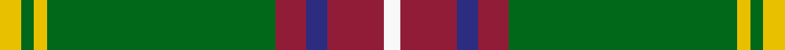

In pattern [WRBRGYGY](/stripes/wrbrgygy/).

This was sourced from tartans-authority.  It is a [8 stripe tartan](/stripes/stripes8/).

Original link http://www.tartansauthority.com/tartan-ferret/display/2619/

## Thread count
Y/10 G6 Y6 G106 DR14 DB10 DR26 W/8

## Palette
Each colour and the base-6 reference it is a variant of.

| Colour | Shade | Base |
|---|---|---|
| DB | <code style="background-color:#2C2C80;">#2C2C80</code> `oklch(35.0% 0.138 276.6)` <small>#2C2C80</small> | B <code style="background-color:#2A418A;">#2A418A</code> |
| DR | <code style="background-color:#901C38;">#901C38</code> `oklch(43.2% 0.150 13.1)` <small>#901C38</small> | R <code style="background-color:#CC0000;">#CC0000</code> |
| G | <code style="background-color:#006818;">#006818</code> `oklch(45.0% 0.142 145.0)` <small>#006818</small> | G <code style="background-color:#006100;">#006100</code> |
| W | <code style="background-color:#F8F8F8;">#F8F8F8</code> `oklch(97.9% 0.000 89.9)` <small>#F8F8F8</small> | W <code style="background-color:#F7F7F7;">#F7F7F7</code> |
| Y | <code style="background-color:#E8C000;">#E8C000</code> `oklch(81.9% 0.168 93.7)` <small>#E8C000</small> | Y <code style="background-color:#F2BF00;">#F2BF00</code> |

# Sample pattern

## Nearest tartans

The nearest existing variants by ΔTartan distance, with this tartan at the top so the swatches line up against it.

ΔTartan

Tartan

Sett

—

<a href="/ttd/edit/#slug=ly5g3ly3g53r7db5r13w4~x2">Hall (P.I.E.) (Personal)</a> <a class="nn-out" href="/setts/s8/ly5g3ly3g53r7db5r13w4~x2/" title="open its dictionary page">↗</a>

0.65

<a href="/ttd/edit/#slug=db3g16ly1r1w1r6g3r1g3w1~x4">Canadian Caledonian</a> <a class="nn-out" href="/setts/s10/db3g16ly1r1w1r6g3r1g3w1~x4/" title="open its dictionary page">↗</a>

0.77

<a href="/ttd/edit/#slug=r5w4db6db2g43db2db4r3~x2">Mullikin (2013)</a> <a class="nn-out" href="/setts/s8/r5w4db6db2g43db2db4r3~x2/" title="open its dictionary page">↗</a>

0.84

<a href="/ttd/edit/#slug=db3g16ly1r1w1r6g3r1g3w1~x2">Canadian Caledonian</a> <a class="nn-out" href="/setts/s10/db3g16ly1r1w1r6g3r1g3w1~x2/" title="open its dictionary page">↗</a>

0.86

<a href="/ttd/edit/#slug=g55p7r24g12db4ly3db4~x2">Crieff, and Strathearn</a> <a class="nn-out" href="/setts/s7/g55p7r24g12db4ly3db4~x2/" title="open its dictionary page">↗</a>

0.99

<a href="/ttd/edit/#slug=g18r1lb2k1lb2r1o6k2~x4">Humphries (Name)</a> <a class="nn-out" href="/setts/s8/g18r1lb2k1lb2r1o6k2~x4/" title="open its dictionary page">↗</a>

0.99

<a href="/ttd/edit/#slug=g55dp7r24g12db4ly3db4~x2">Crieff and Strathearn District Tartan Tartan Number: 664. Earliest known date: 1988 A branch of the Stewart clan from Galloway and the South West of Scotland. See products available Copyright © Blair Urquhart, Comrie, 2015</a> <a class="nn-out" href="/setts/s7/g55dp7r24g12db4ly3db4~x2/" title="open its dictionary page">↗</a>

1.00

<a href="/ttd/edit/#slug=g13k1r1k1b2k1ly4~x8">Alberta (Province)</a> <a class="nn-out" href="/setts/s7/g13k1r1k1b2k1ly4~x8/" title="open its dictionary page">↗</a>

1.04

<a href="/ttd/edit/#slug=k3g2k3g18r2db2lo1~x4">Selvon-Bruce (Personal)</a> <a class="nn-out" href="/setts/s7/k3g2k3g18r2db2lo1~x4/" title="open its dictionary page">↗</a>

1.07

<a href="/ttd/edit/#slug=g71k4r4db9r4db4r36db4w4">Rattray</a> <a class="nn-out" href="/setts/s9/g71k4r4db9r4db4r36db4w4/" title="open its dictionary page">↗</a>

1.13

<a href="/ttd/edit/#slug=w6g5r5g45k4lo24k4g5~x2">O'Neill (Name)</a> <a class="nn-out" href="/setts/s8/w6g5r5g45k4lo24k4g5~x2/" title="open its dictionary page">↗</a>

## Neighbour map

Every grey dot is one of 14299 variants placed by the first two principal components of the ΔTartan feature space (44% of its variance). Red is this tartan; blue dots are its nearest — click one to open its page.

<svg viewBox="0 0 640 380" role="img" style="max-width:100%;height:auto;border:1px solid #e0e0e0;border-radius:4px;display:block" xmlns="http://www.w3.org/2000/svg"><image href="/nn/cloud.v1.png" width="640" height="380"/><a href="/setts/s10/db3g16ly1r1w1r6g3r1g3w1~x4/"><circle cx="334.4" cy="130.3" r="4" fill="#3465a4"><title>Canadian Caledonian</title></circle></a><a href="/setts/s8/r5w4db6db2g43db2db4r3~x2/"><circle cx="367.4" cy="121.8" r="4" fill="#3465a4"><title>Mullikin (2013)</title></circle></a><a href="/setts/s10/db3g16ly1r1w1r6g3r1g3w1~x2/"><circle cx="340.2" cy="133.8" r="4" fill="#3465a4"><title>Canadian Caledonian</title></circle></a><a href="/setts/s7/g55p7r24g12db4ly3db4~x2/"><circle cx="358.7" cy="154.8" r="4" fill="#3465a4"><title>Crieff, and Strathearn</title></circle></a><a href="/setts/s8/g18r1lb2k1lb2r1o6k2~x4/"><circle cx="289.8" cy="129.2" r="4" fill="#3465a4"><title>Humphries (Name)</title></circle></a><a href="/setts/s7/g55dp7r24g12db4ly3db4~x2/"><circle cx="365.9" cy="158.0" r="4" fill="#3465a4"><title>Crieff and Strathearn District Tartan Tartan Number: 664. Earliest known date: 1988 A branch of the Stewart clan from Galloway and the South West of Scotland. See products available Copyright © Blair Urquhart, Comrie, 2015</title></circle></a><a href="/setts/s7/g13k1r1k1b2k1ly4~x8/"><circle cx="290.9" cy="152.6" r="4" fill="#3465a4"><title>Alberta (Province)</title></circle></a><a href="/setts/s7/k3g2k3g18r2db2lo1~x4/"><circle cx="379.4" cy="154.9" r="4" fill="#3465a4"><title>Selvon-Bruce (Personal)</title></circle></a><a href="/setts/s9/g71k4r4db9r4db4r36db4w4/"><circle cx="297.9" cy="118.3" r="4" fill="#3465a4"><title>Rattray</title></circle></a><a href="/setts/s8/w6g5r5g45k4lo24k4g5~x2/"><circle cx="299.6" cy="167.3" r="4" fill="#3465a4"><title>O'Neill (Name)</title></circle></a><circle cx="345.3" cy="131.6" r="5" fill="#c00000"/></svg>

ID: /setts/s8/ly5g3ly3g53r7db5r13w4~x2/
