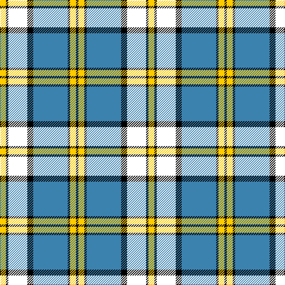

This page is one **sett** — a single exact thread-count. It belongs to the [tartan](/tartans/y5k2w16k5b29k2y5k2/)
(the same proportion at any scale), whose colour order is pattern [KYKBKWKY](/stripes/kykbkwky/).

Sourced from register-of-tartans.  It is a [8 stripe tartan](/stripes/stripes8/).

Original link https://www.tartanregister.gov.uk/tartanDetails.aspx?ref=11074

## Register references

External register numbers recorded for this tartan.

- Scottish Register of Tartans: [11074](https://www.tartanregister.gov.uk/tartanDetails.aspx?ref=11074)

## Thread count
Y/10 K4 W32 K10 B58 K4 Y10 K/4

## Palette
Each colour and the base-6 reference it is a variant of.

| Colour | Shade | Base |
|---|---|---|
| B | <code style="background-color:#3C82AF;">#3C82AF</code> `oklch(58.1% 0.099 239.8)` <small>#3C82AF</small> | B <code style="background-color:#2A418A;">#2A418A</code> |
| K | <code style="background-color:#000000;">#000000</code> `oklch(0.0% 0.000 0.0)` <small>#000000</small> | K <code style="background-color:#000000;">#000000</code> |
| W | <code style="background-color:#FFFFFF;">#FFFFFF</code> `oklch(100.0% 0.000 89.9)` <small>#FFFFFF</small> | W <code style="background-color:#F7F7F7;">#F7F7F7</code> |
| Y | <code style="background-color:#FFCC00;">#FFCC00</code> `oklch(86.5% 0.177 90.4)` <small>#FFCC00</small> | Y <code style="background-color:#F2BF00;">#F2BF00</code> |

# Sample pattern

## Nearest tartans

The nearest existing variants by ΔTartan distance, with this tartan at the top so the swatches line up against it.

ΔTartan

Tartan

Sett

—

<a href="/ttd/edit/#slug=ly5k2w16k5t29k2ly5k2~x2">Children's Wish Foundation of Canada, The</a> <a class="nn-out" href="/setts/s8/ly5k2w16k5t29k2ly5k2~x2/" title="open its dictionary page">↗</a>

0.73

<a href="/ttd/edit/#slug=ly5k2w16k5lg29k2ly2k2~x2">Children's Wish Foundation of Canada</a> <a class="nn-out" href="/setts/s8/ly5k2w16k5lg29k2ly2k2~x2/" title="open its dictionary page">↗</a>

1.06

<a href="/ttd/edit/#slug=r4w4k4w4k4w4k2y23w2~x2">Virtuoso</a> <a class="nn-out" href="/setts/s9/r4w4k4w4k4w4k2y23w2~x2/" title="open its dictionary page">↗</a>

1.15

<a href="/ttd/edit/#slug=r2k9t4w2k22w2t4w22t2w8r2~x2">MacRae, Dress</a> <a class="nn-out" href="/setts/s11/r2k9t4w2k22w2t4w22t2w8r2~x2/" title="open its dictionary page">↗</a>

1.17

<a href="/ttd/edit/#slug=w5db32g12db2w30k4~x2">Bonnie Royal</a> <a class="nn-out" href="/setts/s6/w5db32g12db2w30k4~x2/" title="open its dictionary page">↗</a>

1.19

<a href="/ttd/edit/#slug=r4w4k4w4k4w4k2o23w2~x2">Virtuoso (Corporate)</a> <a class="nn-out" href="/setts/s9/r4w4k4w4k4w4k2o23w2~x2/" title="open its dictionary page">↗</a>

1.22

<a href="/ttd/edit/#slug=ly5lb36o5lb5o56k5o8k5o5k34ly5">Chartered Institute of Bankers in Scotland</a> <a class="nn-out" href="/setts/s11/ly5lb36o5lb5o56k5o8k5o5k34ly5/" title="open its dictionary page">↗</a>

1.26

<a href="/ttd/edit/#slug=w1b6w4b1w16k1g4k6ly1~x2">Henderson Dress</a> <a class="nn-out" href="/setts/s9/w1b6w4b1w16k1g4k6ly1~x2/" title="open its dictionary page">↗</a>

1.26

<a href="/ttd/edit/#slug=r2db2w26g25k14db13w26db2r2~x2">MacNaughton Dress</a> <a class="nn-out" href="/setts/s9/r2db2w26g25k14db13w26db2r2~x2/" title="open its dictionary page">↗</a>

1.28

<a href="/ttd/edit/#slug=dg4g3dg3g4dg4db8dg3db9w29r2w4r2~x2">Ross Hunting Dress</a> <a class="nn-out" href="/setts/s12/dg4g3dg3g4dg4db8dg3db9w29r2w4r2~x2/" title="open its dictionary page">↗</a>

1.28

<a href="/ttd/edit/#slug=db14w2db3w2g10w32g10db10w2db3~x2">Fraser, Arisaid</a> <a class="nn-out" href="/setts/s10/db14w2db3w2g10w32g10db10w2db3~x2/" title="open its dictionary page">↗</a>

## Neighbour map

Every grey dot is one of 14299 variants placed by the first two principal components of the ΔTartan feature space (44% of its variance). Red is this tartan; blue dots are its nearest — click one to open its page.

<svg viewBox="0 0 640 380" role="img" style="max-width:100%;height:auto;border:1px solid #e0e0e0;border-radius:4px;display:block" xmlns="http://www.w3.org/2000/svg"><image href="/nn/cloud.v1.png" width="640" height="380"/><a href="/setts/s8/ly5k2w16k5lg29k2ly2k2~x2/"><circle cx="216.2" cy="134.4" r="4" fill="#3465a4"><title>Children's Wish Foundation of Canada</title></circle></a><a href="/setts/s9/r4w4k4w4k4w4k2y23w2~x2/"><circle cx="206.7" cy="137.6" r="4" fill="#3465a4"><title>Virtuoso</title></circle></a><a href="/setts/s11/r2k9t4w2k22w2t4w22t2w8r2~x2/"><circle cx="192.0" cy="136.0" r="4" fill="#3465a4"><title>MacRae, Dress</title></circle></a><a href="/setts/s6/w5db32g12db2w30k4~x2/"><circle cx="197.9" cy="161.8" r="4" fill="#3465a4"><title>Bonnie Royal</title></circle></a><a href="/setts/s9/r4w4k4w4k4w4k2o23w2~x2/"><circle cx="217.5" cy="144.3" r="4" fill="#3465a4"><title>Virtuoso (Corporate)</title></circle></a><a href="/setts/s11/ly5lb36o5lb5o56k5o8k5o5k34ly5/"><circle cx="209.9" cy="142.7" r="4" fill="#3465a4"><title>Chartered Institute of Bankers in Scotland</title></circle></a><a href="/setts/s9/w1b6w4b1w16k1g4k6ly1~x2/"><circle cx="217.2" cy="114.2" r="4" fill="#3465a4"><title>Henderson Dress</title></circle></a><a href="/setts/s9/r2db2w26g25k14db13w26db2r2~x2/"><circle cx="168.8" cy="140.4" r="4" fill="#3465a4"><title>MacNaughton Dress</title></circle></a><a href="/setts/s12/dg4g3dg3g4dg4db8dg3db9w29r2w4r2~x2/"><circle cx="178.2" cy="103.6" r="4" fill="#3465a4"><title>Ross Hunting Dress</title></circle></a><a href="/setts/s10/db14w2db3w2g10w32g10db10w2db3~x2/"><circle cx="235.1" cy="154.3" r="4" fill="#3465a4"><title>Fraser, Arisaid</title></circle></a><circle cx="192.1" cy="135.7" r="5" fill="#c00000"/></svg>

ID: /setts/s8/ly5k2w16k5t29k2ly5k2~x2/
