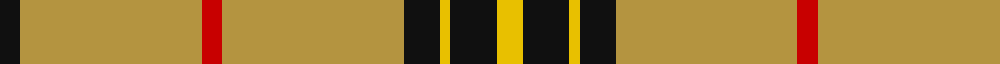
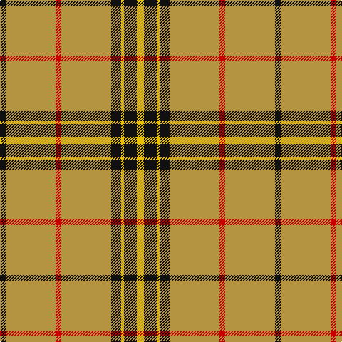

**Bands:** [KYRYKYKY](/stripes/kyrykyky/) · **Stripes:** [K LO R LO K LY K LY](/stripes/stripes8/) K LO R LO K LY K LY

This was sourced from register-of-tartans.  It is a [8 band tartan](/bands/bands8/).

Original link https://www.tartanregister.gov.uk/tartanDetails.aspx?ref=5274

## Attestations

This cloth appears in 2 source records; the oldest owns this page.

- 01/01/2007 — Wilbers (register-of-tartans, [record](https://www.tartanregister.gov.uk/tartanDetails.aspx?ref=5274))
- pre 2007 — Wilbers (Personal) (tartans-authority, [record](http://www.tartansauthority.com/tartan-ferret/display/7151/))

## Register references

External register numbers recorded for this tartan.

- Scottish Register of Tartans: [5274](https://www.tartanregister.gov.uk/tartanDetails.aspx?ref=5274)
- Scottish Tartans Authority (ITI): 7151

## Thread count
K/8 DO70 R8 DO70 K14 Y4 K18 Y/10

## Palette
Each colour and its ΔE from the base-6 reference it is a variant of.

| Colour | Shade | Base | ΔE (OKLab) |
|---|---|---|---|
| DO | <code style="background-color:#B49440;">#B49440</code> `#B49440` | Y <code style="background-color:#F2BF00;">#F2BF00</code> | 0.16 |
| K | <code style="background-color:#101010;">#101010</code> `#101010` | K <code style="background-color:#000000;">#000000</code> | 0.17 |
| R | <code style="background-color:#C80000;">#C80000</code> `#C80000` | R <code style="background-color:#CC0000;">#CC0000</code> | 0.01 |
| Y | <code style="background-color:#E8C000;">#E8C000</code> `#E8C000` | Y <code style="background-color:#F2BF00;">#F2BF00</code> | 0.02 |

# Sample pattern

## Nearest tartans

The nearest existing variants by ΔTartan distance.

1. [Bro-Dreger](/setts/s7/lo3k2lo32r3lo3k5w3~x2/) — ΔT 1.20
1. [Glenlivet Dress Reproduction (Corp)](/setts/s8/dy6r2dy42db2dy5w16dy5db2~x2/) — ΔT 1.34
1. [Wilbers #2 (Personal)](/setts/s8/ly5k9ly2k7o10r4o35k4~x2/) — ΔT 1.47
1. [Deer Park (Loton) (Personal)](/setts/s7/lg60r7w10dg16lg15w3lg15~x2/) — ΔT 1.57
1. [Lermontov Bicentenary](/setts/s8/lo5r6k5r6lo36db3lo2k1~x2/) — ΔT 1.60
1. [Baileville (Personal)](/setts/s7/ly1k4ly1k4ly11r1ly1~x4/) — ΔT 1.66
1. [Lermontov Bicentenary](/setts/s8/lo5r6k5r6lo36b3lo2k1~x2/) — ΔT 1.69
1. [Glenlivet Dress Reproduction](/setts/s14/w16dy5db2dy42r2dy6r2dy42db2dy5w16dy5db2dy5~x2/) — ΔT 1.69
1. [Loch Tummel](/setts/s5/o38w9o3dr9w3~x2/) — ΔT 1.70
1. [Coca Cola (Corporate)](/setts/s5/w15dy15w15dy80r6/) — ΔT 1.70

## Neighbour map

Every grey dot is one of 14313 variants placed by the first two principal components of the ΔTartan feature space (44% of its variance). Red is this tartan; blue dots are its nearest — click one to open its page.

<svg viewBox="0 0 640 380" role="img" style="max-width:100%;height:auto;border:1px solid #e0e0e0;border-radius:4px;display:block" xmlns="http://www.w3.org/2000/svg"><image href="/nn/cloud.v1.png" width="640" height="380"/><a href="/setts/s7/lo3k2lo32r3lo3k5w3~x2/"><circle cx="469.9" cy="144.6" r="4" fill="#3465a4"><title>Bro-Dreger</title></circle></a><a href="/setts/s8/dy6r2dy42db2dy5w16dy5db2~x2/"><circle cx="453.1" cy="136.6" r="4" fill="#3465a4"><title>Glenlivet Dress Reproduction (Corp)</title></circle></a><a href="/setts/s8/ly5k9ly2k7o10r4o35k4~x2/"><circle cx="331.4" cy="141.7" r="4" fill="#3465a4"><title>Wilbers #2 (Personal)</title></circle></a><a href="/setts/s7/lg60r7w10dg16lg15w3lg15~x2/"><circle cx="430.1" cy="168.7" r="4" fill="#3465a4"><title>Deer Park (Loton) (Personal)</title></circle></a><a href="/setts/s8/lo5r6k5r6lo36db3lo2k1~x2/"><circle cx="438.6" cy="103.7" r="4" fill="#3465a4"><title>Lermontov Bicentenary</title></circle></a><a href="/setts/s7/ly1k4ly1k4ly11r1ly1~x4/"><circle cx="336.1" cy="174.2" r="4" fill="#3465a4"><title>Baileville (Personal)</title></circle></a><a href="/setts/s8/lo5r6k5r6lo36b3lo2k1~x2/"><circle cx="448.8" cy="109.1" r="4" fill="#3465a4"><title>Lermontov Bicentenary</title></circle></a><a href="/setts/s14/w16dy5db2dy42r2dy6r2dy42db2dy5w16dy5db2dy5~x2/"><circle cx="438.3" cy="114.5" r="4" fill="#3465a4"><title>Glenlivet Dress Reproduction</title></circle></a><a href="/setts/s5/o38w9o3dr9w3~x2/"><circle cx="408.5" cy="198.3" r="4" fill="#3465a4"><title>Loch Tummel</title></circle></a><a href="/setts/s5/w15dy15w15dy80r6/"><circle cx="445.8" cy="198.0" r="4" fill="#3465a4"><title>Coca Cola (Corporate)</title></circle></a><circle cx="400.4" cy="150.5" r="5" fill="#c00000"/></svg>

ID: /setts/s8/ly5k9ly2k7lo35r4lo35k4~x2/
