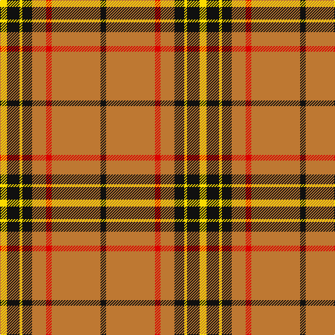

This page is one **sett** — a single exact thread-count. It belongs to the [tartan](/tartans/ly5k9ly2k7o10r4o35k4/)
(the same proportion at any scale), whose colour order is pattern [KRRRKYKY](/stripes/krrrkyky/).

Sourced from register-of-tartans.  It is a [8 stripe tartan](/stripes/stripes8/).

Original link https://www.tartanregister.gov.uk/tartanDetails.aspx?ref=5862

## Register references

External register numbers recorded for this tartan.

- Scottish Register of Tartans: [5862](https://www.tartanregister.gov.uk/tartanDetails.aspx?ref=5862)
- Scottish Tartans World Register: 3166

## Thread count
Y/10 K18 Y4 K14 DO20 R8 DO70 K/8

## Palette

Palette: <strong>Tartan Register</strong> <small style="color:#888">(3 of 4 colours)</small>
<table><thead><tr><th>Colour</th><th>Threads</th><th>Shade</th><th>Base</th><th>OKLCh</th></tr></thead><tbody><tr><td>Y/</td><td style="text-align:right;font-variant-numeric:tabular-nums">10</td><td><code style="background-color:#FADC00;">#FADC00</code> <small style="color:#888">#FADC00</small></td><td>Y <code style="background-color:#F2BF00;">#F2BF00</code></td><td><small style="color:#888">oklch(89.2% 0.185 99.2)</small></td></tr><tr><td>K</td><td style="text-align:right;font-variant-numeric:tabular-nums">18</td><td><code style="background-color:#101010;">#101010</code> <small style="color:#888">#101010</small></td><td>K <code style="background-color:#000000;">#000000</code></td><td><small style="color:#888">oklch(17.3% 0.000 89.9)</small></td></tr><tr><td>Y</td><td style="text-align:right;font-variant-numeric:tabular-nums">4</td><td><code style="background-color:#FADC00;">#FADC00</code> <small style="color:#888">#FADC00</small></td><td>Y <code style="background-color:#F2BF00;">#F2BF00</code></td><td><small style="color:#888">oklch(89.2% 0.185 99.2)</small></td></tr><tr><td>K</td><td style="text-align:right;font-variant-numeric:tabular-nums">14</td><td><code style="background-color:#101010;">#101010</code> <small style="color:#888">#101010</small></td><td>K <code style="background-color:#000000;">#000000</code></td><td><small style="color:#888">oklch(17.3% 0.000 89.9)</small></td></tr><tr><td>DO</td><td style="text-align:right;font-variant-numeric:tabular-nums">20</td><td><code style="background-color:#BE7832;">#BE7832</code> <small style="color:#888">#BE7832</small></td><td>R <code style="background-color:#CC0000;">#CC0000</code></td><td><small style="color:#888">oklch(63.5% 0.121 62.2)</small></td></tr><tr><td>R</td><td style="text-align:right;font-variant-numeric:tabular-nums">8</td><td><code style="background-color:#DC0000;">#DC0000</code> <small style="color:#888">#DC0000</small></td><td>R <code style="background-color:#CC0000;">#CC0000</code></td><td><small style="color:#888">oklch(56.2% 0.230 29.2)</small></td></tr><tr><td>DO</td><td style="text-align:right;font-variant-numeric:tabular-nums">70</td><td><code style="background-color:#BE7832;">#BE7832</code> <small style="color:#888">#BE7832</small></td><td>R <code style="background-color:#CC0000;">#CC0000</code></td><td><small style="color:#888">oklch(63.5% 0.121 62.2)</small></td></tr><tr><td>K/</td><td style="text-align:right;font-variant-numeric:tabular-nums">8</td><td><code style="background-color:#101010;">#101010</code> <small style="color:#888">#101010</small></td><td>K <code style="background-color:#000000;">#000000</code></td><td><small style="color:#888">oklch(17.3% 0.000 89.9)</small></td></tr></tbody></table>

# Sample pattern

## Nearest tartans

The nearest existing variants by ΔTartan distance, with this tartan at the top so the swatches line up against it.

ΔTartan

Tartan

Sett

—

<a href="/ttd/edit/#slug=ly5k9ly2k7o10r4o35k4~x2">Wilbers #2 (Personal)</a> <a class="nn-out" href="/setts/s8/ly5k9ly2k7o10r4o35k4~x2/" title="open its dictionary page">↗</a>

1.09

<a href="/ttd/edit/#slug=w1r12g2r2w16r2g2r12lo1~x4">MacFie Dress</a> <a class="nn-out" href="/setts/s9/w1r12g2r2w16r2g2r12lo1~x4/" title="open its dictionary page">↗</a>

1.13

<a href="/ttd/edit/#slug=r35g16r5g5w2k3~x2">MacGregor</a> <a class="nn-out" href="/setts/s6/r35g16r5g5w2k3~x2/" title="open its dictionary page">↗</a>

1.13

<a href="/ttd/edit/#slug=k1g6k1g6r16db1~x2">Denny, hunting</a> <a class="nn-out" href="/setts/s6/k1g6k1g6r16db1~x2/" title="open its dictionary page">↗</a>

1.17

<a href="/ttd/edit/#slug=k2r16g6r3g8w1~x2">MacAulay</a> <a class="nn-out" href="/setts/s6/k2r16g6r3g8w1~x2/" title="open its dictionary page">↗</a>

1.19

<a href="/ttd/edit/#slug=r4g8w1g8r4g4r2g4r24k2~x2">Cumming, Comyn</a> <a class="nn-out" href="/setts/s10/r4g8w1g8r4g4r2g4r24k2~x2/" title="open its dictionary page">↗</a>

1.20

<a href="/ttd/edit/#slug=r4ly34do20ly4do8ly6r2ly5do2ly3r4">Morgan of Wales</a> <a class="nn-out" href="/setts/s11/r4ly34do20ly4do8ly6r2ly5do2ly3r4/" title="open its dictionary page">↗</a>

1.25

<a href="/ttd/edit/#slug=ly5db9r3db5ly2db4ly26t3r4~x2">Bracken</a> <a class="nn-out" href="/setts/s9/ly5db9r3db5ly2db4ly26t3r4~x2/" title="open its dictionary page">↗</a>

1.29

<a href="/ttd/edit/#slug=ly20db27r6db15ly8db11ly78db10r12">Bracken</a> <a class="nn-out" href="/setts/s9/ly20db27r6db15ly8db11ly78db10r12/" title="open its dictionary page">↗</a>

1.29

<a href="/ttd/edit/#slug=r5g20r5g3r4g5r36do2w4~x2">Baluch Regiment (Military)</a> <a class="nn-out" href="/setts/s9/r5g20r5g3r4g5r36do2w4~x2/" title="open its dictionary page">↗</a>

1.31

<a href="/ttd/edit/#slug=r4g4w3g4r4g14r28k2r2g3~x2">Scott Red Clan Tartan Tartan Number: 4. Earliest known date: 1930-50 The Red Scott tartan is the sett most often seen today. The earliest recording appears to come from a sample in the MacKinlay collection at the Scottish Tartans Society. Sir Walter Scott, despite his assertion that Lowlanders never wore plaids, was largely responsible for the wide spread introduction of tartans to the Lowland families. There is also a Green Scott tartan. See products available Copyright © Blair Urquhart, Comrie, 2015</a> <a class="nn-out" href="/setts/s10/r4g4w3g4r4g14r28k2r2g3~x2/" title="open its dictionary page">↗</a>

## Neighbour map

Every grey dot is one of 14299 variants placed by the first two principal components of the ΔTartan feature space (44% of its variance). Red is this tartan; blue dots are its nearest — click one to open its page.

<svg viewBox="0 0 640 380" role="img" style="max-width:100%;height:auto;border:1px solid #e0e0e0;border-radius:4px;display:block" xmlns="http://www.w3.org/2000/svg"><image href="/nn/cloud.v1.png" width="640" height="380"/><a href="/setts/s9/w1r12g2r2w16r2g2r12lo1~x4/"><circle cx="309.4" cy="134.0" r="4" fill="#3465a4"><title>MacFie Dress</title></circle></a><a href="/setts/s6/r35g16r5g5w2k3~x2/"><circle cx="380.5" cy="161.6" r="4" fill="#3465a4"><title>MacGregor</title></circle></a><a href="/setts/s6/k1g6k1g6r16db1~x2/"><circle cx="323.7" cy="169.3" r="4" fill="#3465a4"><title>Denny, hunting</title></circle></a><a href="/setts/s6/k2r16g6r3g8w1~x2/"><circle cx="315.2" cy="181.0" r="4" fill="#3465a4"><title>MacAulay</title></circle></a><a href="/setts/s10/r4g8w1g8r4g4r2g4r24k2~x2/"><circle cx="366.5" cy="135.5" r="4" fill="#3465a4"><title>Cumming, Comyn</title></circle></a><a href="/setts/s11/r4ly34do20ly4do8ly6r2ly5do2ly3r4/"><circle cx="308.7" cy="116.3" r="4" fill="#3465a4"><title>Morgan of Wales</title></circle></a><a href="/setts/s9/ly5db9r3db5ly2db4ly26t3r4~x2/"><circle cx="270.0" cy="139.4" r="4" fill="#3465a4"><title>Bracken</title></circle></a><a href="/setts/s9/ly20db27r6db15ly8db11ly78db10r12/"><circle cx="275.0" cy="139.8" r="4" fill="#3465a4"><title>Bracken</title></circle></a><a href="/setts/s9/r5g20r5g3r4g5r36do2w4~x2/"><circle cx="384.0" cy="141.4" r="4" fill="#3465a4"><title>Baluch Regiment (Military)</title></circle></a><a href="/setts/s10/r4g4w3g4r4g14r28k2r2g3~x2/"><circle cx="353.9" cy="147.9" r="4" fill="#3465a4"><title>Scott Red Clan Tartan Tartan Number: 4. Earliest known date: 1930-50 The Red Scott tartan is the sett most often seen today. The earliest recording appears to come from a sample in the MacKinlay collection at the Scottish Tartans Society. Sir Walter Scott, despite his assertion that Lowlanders never wore plaids, was largely responsible for the wide spread introduction of tartans to the Lowland families. There is also a Green Scott tartan. See products available Copyright © Blair Urquhart, Comrie, 2015</title></circle></a><circle cx="331.0" cy="141.5" r="5" fill="#c00000"/></svg>

ID: /setts/s8/ly5k9ly2k7o10r4o35k4~x2/
