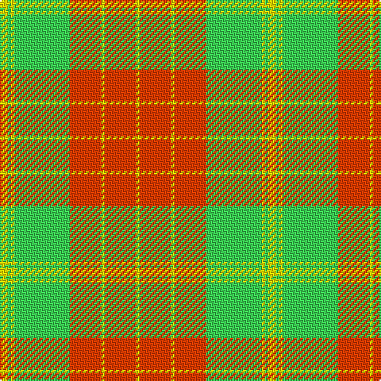

In pattern [YRYRYYYY](/stripes/yryryyyy/).

This was sourced from register-of-tartans.  It is a [8 stripe tartan](/stripes/stripes8/).

Original link https://www.tartanregister.gov.uk/tartanDetails.aspx?ref=3307

## Also known as

This cloth is also recorded under:

- PeachyKeen

## Attestations

This cloth appears in 2 source records; the oldest owns this page.

- 01/06/2007 — PeachyKeen (register-of-tartans, [record](https://www.tartanregister.gov.uk/tartanDetails.aspx?ref=3307))
- June 2007 — Peachy Keen (Corporate) (tartans-authority, [record](http://www.tartansauthority.com/tartan-ferret/display/7208/))

## Register references

External register numbers recorded for this tartan.

- Scottish Register of Tartans: [3307](https://www.tartanregister.gov.uk/tartanDetails.aspx?ref=3307)
- Scottish Tartans Authority (ITI): 7208

## Thread count
Y/5 LG2 Y2 LG35 R20 Y2 R20 Y/2

## Palette
Each colour and the base-6 reference it is a variant of.

| Colour | Shade | Base |
|---|---|---|
| LG | <code style="background-color:#3CD454;">#3CD454</code> `oklch(76.5% 0.212 145.5)` <small>#3CD454</small> | Y <code style="background-color:#F2BF00;">#F2BF00</code> |
| R | <code style="background-color:#FC3C00;">#FC3C00</code> `oklch(64.8% 0.233 34.0)` <small>#FC3C00</small> | R <code style="background-color:#CC0000;">#CC0000</code> |
| Y | <code style="background-color:#FCE800;">#FCE800</code> `oklch(91.8% 0.193 103.2)` <small>#FCE800</small> | Y <code style="background-color:#F2BF00;">#F2BF00</code> |

# Sample pattern

## Nearest tartans

The nearest existing variants by ΔTartan distance.

1. [Ulster Irish District Tartan Tartan Number: 1196. Earliest known date: c.1590-1650 The Dungiven costume was discovered in 1956 by Mr William Dixon, a farmer at 'The Hill', Flanders Townland, Dungiven, County Derry, Northern Ireland. The tartan cloth was probably green but had been stained brown and tan by the peat. See products available Copyright © Blair Urquhart, Comrie, 2015](/setts/s10/ly28k2ly28k2ly2k2lo29k2r2k2~x2/) — ΔT 1.60
1. [MacKintosh Fragment](/setts/s7/r1g14r1g1r14g1w1~x2/) — ΔT 1.62
1. [Dunbarton (Quebec)](/setts/s11/ly30r2ly2k5ly3y2ly3y22ly3k2ly3~x2/) — ΔT 1.67
1. [Glassary #3](/setts/s8/db4ly1r12ly2r2ly12r1ly4~x4/) — ΔT 1.81
1. [Scrymgeour Family Tartan Tartan Number: 1627. Earliest known date: 1971 Yellow ochre. A note in STS files says "Not Adopted" with no explanation. The STS research report reads, "The tartan detailed above was displayed at a gathering of Scrymgeours held at Dudhope Castle, Dundee, in 1971 and was later adopted as the official tartan. The sett was designed by Donald C Stewart, author of 'The Setts of the Scottish Tartans' in 1970." See products available Copyright © Blair Urquhart, Comrie, 2015](/setts/s7/o15k1ly2db3o2k1ly15~x4/) — ΔT 1.84
1. [Fernandes (Personal)](/setts/s7/g5ly5g5ly35r44r3r3~x2/) — ΔT 1.89
1. [MacDonald of Kingsburgh](/setts/s9/r3g3ly1r18w1g21ly1g1ly3~x2/) — ΔT 1.94
1. [Dunbarton Trade Tartan Tartan Number: 1886. Earliest known date: pre 2003 Dunbarton, Quebec. Different warp and weft See products available Copyright © Blair Urquhart, Comrie, 2015](/setts/s11/ly30r2ly2k5ly3dy2ly3dy22ly3k2ly3~x2/) — ΔT 2.00
1. [Dunbarton](/setts/s11/ly30r2ly2k5ly3o2ly3o22ly3k2ly3~x2/) — ΔT 2.01
1. [Meredith (Welsh Name)](/setts/s12/g4ly20ly3ly2ly3ly20g24ly3g2ly3g24ly4/) — ΔT 2.02

## Neighbour map

Every grey dot is one of 14299 variants placed by the first two principal components of the ΔTartan feature space (44% of its variance). Red is this tartan; blue dots are its nearest — click one to open its page.

<svg viewBox="0 0 640 380" role="img" style="max-width:100%;height:auto;border:1px solid #e0e0e0;border-radius:4px;display:block" xmlns="http://www.w3.org/2000/svg"><image href="/nn/cloud.v1.png" width="640" height="380"/><a href="/setts/s10/ly28k2ly28k2ly2k2lo29k2r2k2~x2/"><circle cx="337.2" cy="131.4" r="4" fill="#3465a4"><title>Ulster Irish District Tartan Tartan Number: 1196. Earliest known date: c.1590-1650 The Dungiven costume was discovered in 1956 by Mr William Dixon, a farmer at 'The Hill', Flanders Townland, Dungiven, County Derry, Northern Ireland. The tartan cloth was probably green but had been stained brown and tan by the peat. See products available Copyright © Blair Urquhart, Comrie, 2015</title></circle></a><a href="/setts/s7/r1g14r1g1r14g1w1~x2/"><circle cx="358.9" cy="169.6" r="4" fill="#3465a4"><title>MacKintosh Fragment</title></circle></a><a href="/setts/s11/ly30r2ly2k5ly3y2ly3y22ly3k2ly3~x2/"><circle cx="332.4" cy="120.3" r="4" fill="#3465a4"><title>Dunbarton (Quebec)</title></circle></a><a href="/setts/s8/db4ly1r12ly2r2ly12r1ly4~x4/"><circle cx="298.1" cy="171.5" r="4" fill="#3465a4"><title>Glassary #3</title></circle></a><a href="/setts/s7/o15k1ly2db3o2k1ly15~x4/"><circle cx="267.6" cy="145.8" r="4" fill="#3465a4"><title>Scrymgeour Family Tartan Tartan Number: 1627. Earliest known date: 1971 Yellow ochre. A note in STS files says &quot;Not Adopted&quot; with no explanation. The STS research report reads, &quot;The tartan detailed above was displayed at a gathering of Scrymgeours held at Dudhope Castle, Dundee, in 1971 and was later adopted as the official tartan. The sett was designed by Donald C Stewart, author of 'The Setts of the Scottish Tartans' in 1970.&quot; See products available Copyright © Blair Urquhart, Comrie, 2015</title></circle></a><a href="/setts/s7/g5ly5g5ly35r44r3r3~x2/"><circle cx="284.6" cy="143.2" r="4" fill="#3465a4"><title>Fernandes (Personal)</title></circle></a><a href="/setts/s9/r3g3ly1r18w1g21ly1g1ly3~x2/"><circle cx="325.7" cy="130.9" r="4" fill="#3465a4"><title>MacDonald of Kingsburgh</title></circle></a><a href="/setts/s11/ly30r2ly2k5ly3dy2ly3dy22ly3k2ly3~x2/"><circle cx="317.9" cy="114.4" r="4" fill="#3465a4"><title>Dunbarton Trade Tartan Tartan Number: 1886. Earliest known date: pre 2003 Dunbarton, Quebec. Different warp and weft See products available Copyright © Blair Urquhart, Comrie, 2015</title></circle></a><a href="/setts/s11/ly30r2ly2k5ly3o2ly3o22ly3k2ly3~x2/"><circle cx="313.8" cy="110.4" r="4" fill="#3465a4"><title>Dunbarton</title></circle></a><a href="/setts/s12/g4ly20ly3ly2ly3ly20g24ly3g2ly3g24ly4/"><circle cx="283.2" cy="173.6" r="4" fill="#3465a4"><title>Meredith (Welsh Name)</title></circle></a><circle cx="302.3" cy="154.3" r="5" fill="#c00000"/></svg>

ID: /setts/s8/ly5lg2ly2lg35r20ly2r20ly2/
