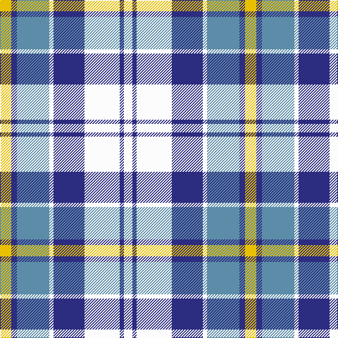

This page is one **sett** — a single exact thread-count. It belongs to the [tartan](/tartans/ly8db4t23w3db22w25db3w6/)
(the same proportion at any scale), whose colour order is pattern [WBWBWBBY](/stripes/wbwbwbby/).

Sourced from register-of-tartans.  It is a [8 stripe tartan](/stripes/stripes8/).

Original link https://www.tartanregister.gov.uk/tartanDetails.aspx?ref=831

## Also known as

This cloth is also recorded under:

- Culloden Dress, Blue
- Culloden, Blue Dress
- Culloden, Blue dress

4 attestations — the source records this cloth was collapsed from (oldest owns this page)

<ul>
<li>01/01/1997 — Culloden, Blue Dress (Dance) (register-of-tartans, <a href="https://www.tartanregister.gov.uk/tartanDetails.aspx?ref=831">record</a>)</li>
<li>1997 — Culloden Dress, Blue (Dance) (tartans-authority, <a href="http://www.tartansauthority.com/tartan-ferret/display/1792/">record</a>)</li>
<li>undated — Culloden, Blue dress (weddslist, <a href="http://www.weddslist.com/cgi-bin/tartans/pg.pl?source=sts">record</a>)</li>
<li>undated — Culloden Blue Dress Fancy Tartan Tartan Number: 1792. Earliest known date: 1980 One of a number of dress tartans produced by Hugh Macpherson, a kiltmaker in Edinburgh, intended for dancing and other informal occassions. The 'dress' version of clan tartan is usually created by substituting white for one of the 'ground' colours. See products available Copyright © Blair Urquhart, Comrie, 2015 (house-of-tartan, <a href="http://www.house-of-tartan.scotland.net/house/TartanViewjs.asp?colr=Def&tnam=1792">record</a>)</li>
</ul>

## Register references

External register numbers recorded for this tartan.

- Scottish Register of Tartans: [831](https://www.tartanregister.gov.uk/tartanDetails.aspx?ref=831)
- Scottish Tartans Authority (ITI): 1792
- Scottish Tartans World Register: 1792

## Thread count
Y/16 DB8 B46 W6 DB44 W50 DB6 W/12

## Palette

Palette: <strong>Tartan Register</strong>
<table><thead><tr><th>Colour</th><th>Threads</th><th>Shade</th><th>Base</th><th>OKLCh</th></tr></thead><tbody><tr><td>Y/</td><td style="text-align:right;font-variant-numeric:tabular-nums">16</td><td><code style="background-color:#E8C000;">#E8C000</code> <small style="color:#888">#E8C000</small></td><td>Y <code style="background-color:#F2BF00;">#F2BF00</code></td><td><small style="color:#888">oklch(81.9% 0.168 93.7)</small></td></tr><tr><td>DB</td><td style="text-align:right;font-variant-numeric:tabular-nums">8</td><td><code style="background-color:#2C2C80;">#2C2C80</code> <small style="color:#888">#2C2C80</small></td><td>B <code style="background-color:#2A418A;">#2A418A</code></td><td><small style="color:#888">oklch(35.0% 0.138 276.6)</small></td></tr><tr><td>B</td><td style="text-align:right;font-variant-numeric:tabular-nums">46</td><td><code style="background-color:#5C8CA8;">#5C8CA8</code> <small style="color:#888">#5C8CA8</small></td><td>B <code style="background-color:#2A418A;">#2A418A</code></td><td><small style="color:#888">oklch(61.7% 0.067 235.0)</small></td></tr><tr><td>W</td><td style="text-align:right;font-variant-numeric:tabular-nums">6</td><td><code style="background-color:#FCFCFC;">#FCFCFC</code> <small style="color:#888">#FCFCFC</small></td><td>W <code style="background-color:#F7F7F7;">#F7F7F7</code></td><td><small style="color:#888">oklch(99.1% 0.000 89.9)</small></td></tr><tr><td>DB</td><td style="text-align:right;font-variant-numeric:tabular-nums">44</td><td><code style="background-color:#2C2C80;">#2C2C80</code> <small style="color:#888">#2C2C80</small></td><td>B <code style="background-color:#2A418A;">#2A418A</code></td><td><small style="color:#888">oklch(35.0% 0.138 276.6)</small></td></tr><tr><td>W</td><td style="text-align:right;font-variant-numeric:tabular-nums">50</td><td><code style="background-color:#FCFCFC;">#FCFCFC</code> <small style="color:#888">#FCFCFC</small></td><td>W <code style="background-color:#F7F7F7;">#F7F7F7</code></td><td><small style="color:#888">oklch(99.1% 0.000 89.9)</small></td></tr><tr><td>DB</td><td style="text-align:right;font-variant-numeric:tabular-nums">6</td><td><code style="background-color:#2C2C80;">#2C2C80</code> <small style="color:#888">#2C2C80</small></td><td>B <code style="background-color:#2A418A;">#2A418A</code></td><td><small style="color:#888">oklch(35.0% 0.138 276.6)</small></td></tr><tr><td>W/</td><td style="text-align:right;font-variant-numeric:tabular-nums">12</td><td><code style="background-color:#FCFCFC;">#FCFCFC</code> <small style="color:#888">#FCFCFC</small></td><td>W <code style="background-color:#F7F7F7;">#F7F7F7</code></td><td><small style="color:#888">oklch(99.1% 0.000 89.9)</small></td></tr></tbody></table>

# Sample pattern

## Nearest tartans

The nearest existing variants by ΔTartan distance, with this tartan at the top so the swatches line up against it.

ΔTartan

Tartan

Sett

—

<a href="/ttd/edit/#slug=ly8db4t23w3db22w25db3w6~x2">Culloden, Blue Dress (Dance)</a> <a class="nn-out" href="/setts/s8/ly8db4t23w3db22w25db3w6~x2/" title="open its dictionary page">↗</a>

0.57

<a href="/ttd/edit/#slug=k2lb16w2dt16w15k2w2~x2">Strathclyde District Tartan Tartan Number: 1072. Earliest known date: 1975 The navy blue and white are said to represent the 'Scottish Sporting Colours'. This sett is also produced with light blue in place of white. See products available Copyright © Blair Urquhart, Comrie, 2015</a> <a class="nn-out" href="/setts/s7/k2lb16w2dt16w15k2w2~x2/" title="open its dictionary page">↗</a>

0.73

<a href="/ttd/edit/#slug=k4t2w11t5o5w2k1t2~x2">Conquergood (Name)</a> <a class="nn-out" href="/setts/s8/k4t2w11t5o5w2k1t2~x2/" title="open its dictionary page">↗</a>

0.93

<a href="/ttd/edit/#slug=k2lb16w2db16w15k2w2~x2">Strathclyde 1975 (District)</a> <a class="nn-out" href="/setts/s7/k2lb16w2db16w15k2w2~x2/" title="open its dictionary page">↗</a>

0.95

<a href="/ttd/edit/#slug=r2ly1b8r1lg7ly1r2~x6">Cercle de Fermières de Saint-Élie d'Orford</a> <a class="nn-out" href="/setts/s7/r2ly1b8r1lg7ly1r2~x6/" title="open its dictionary page">↗</a>

1.20

<a href="/ttd/edit/#slug=db25lg8db8lg8db8lg46w46lb8w46lg46db46lg8db8">Poulter SG 104 (Fashion)</a> <a class="nn-out" href="/setts/s13/db25lg8db8lg8db8lg46w46lb8w46lg46db46lg8db8/" title="open its dictionary page">↗</a>

1.21

<a href="/ttd/edit/#slug=lb16w2db16w15k2w2k2w15db16w2lb16k2~x2">Strathclyde (Official)</a> <a class="nn-out" href="/setts/s12/lb16w2db16w15k2w2k2w15db16w2lb16k2~x2/" title="open its dictionary page">↗</a>

1.26

<a href="/ttd/edit/#slug=dt69lb14dt13lb14dt13lb69w72r13w72lb69dt68lb14dt13">Poulter Sonic</a> <a class="nn-out" href="/setts/s13/dt69lb14dt13lb14dt13lb69w72r13w72lb69dt68lb14dt13/" title="open its dictionary page">↗</a>

1.28

<a href="/ttd/edit/#slug=w20db14dt14w4dbi2b2dt7~x2">Earl of St. Andrews Dress</a> <a class="nn-out" href="/setts/s7/w20db14dt14w4dbi2b2dt7~x2/" title="open its dictionary page">↗</a>

1.32

<a href="/ttd/edit/#slug=b15w13dy6b2dy2r2dy2b2dy6w13b15r3~x4">Thompson (Pendleton)</a> <a class="nn-out" href="/setts/s12/b15w13dy6b2dy2r2dy2b2dy6w13b15r3~x4/" title="open its dictionary page">↗</a>

1.33

<a href="/ttd/edit/#slug=w20db14b14w4dt2t2b7~x2">Earl of St. Andrews Dress (Dance)</a> <a class="nn-out" href="/setts/s7/w20db14b14w4dt2t2b7~x2/" title="open its dictionary page">↗</a>

## Neighbour map

Every grey dot is one of 14359 variants placed by the first two principal components of the ΔTartan feature space (44% of its variance). Red is this tartan; blue dots are its nearest — click one to open its page.

<svg viewBox="0 0 640 380" role="img" style="max-width:100%;height:auto;border:1px solid #e0e0e0;border-radius:4px;display:block" xmlns="http://www.w3.org/2000/svg"><image href="/nn/cloud.v1.png" width="640" height="380"/><a href="/setts/s7/k2lb16w2dt16w15k2w2~x2/"><circle cx="138.8" cy="184.7" r="4" fill="#3465a4"><title>Strathclyde District Tartan Tartan Number: 1072. Earliest known date: 1975 The navy blue and white are said to represent the 'Scottish Sporting Colours'. This sett is also produced with light blue in place of white. See products available Copyright © Blair Urquhart, Comrie, 2015</title></circle></a><a href="/setts/s8/k4t2w11t5o5w2k1t2~x2/"><circle cx="159.1" cy="179.2" r="4" fill="#3465a4"><title>Conquergood (Name)</title></circle></a><a href="/setts/s7/k2lb16w2db16w15k2w2~x2/"><circle cx="127.9" cy="177.3" r="4" fill="#3465a4"><title>Strathclyde 1975 (District)</title></circle></a><a href="/setts/s7/r2ly1b8r1lg7ly1r2~x6/"><circle cx="150.1" cy="183.6" r="4" fill="#3465a4"><title>Cercle de Fermières de Saint-Élie d'Orford</title></circle></a><a href="/setts/s13/db25lg8db8lg8db8lg46w46lb8w46lg46db46lg8db8/"><circle cx="122.9" cy="180.0" r="4" fill="#3465a4"><title>Poulter SG 104 (Fashion)</title></circle></a><a href="/setts/s12/lb16w2db16w15k2w2k2w15db16w2lb16k2~x2/"><circle cx="110.9" cy="162.7" r="4" fill="#3465a4"><title>Strathclyde (Official)</title></circle></a><a href="/setts/s13/dt69lb14dt13lb14dt13lb69w72r13w72lb69dt68lb14dt13/"><circle cx="104.8" cy="182.8" r="4" fill="#3465a4"><title>Poulter Sonic</title></circle></a><a href="/setts/s7/w20db14dt14w4dbi2b2dt7~x2/"><circle cx="128.5" cy="172.9" r="4" fill="#3465a4"><title>Earl of St. Andrews Dress</title></circle></a><a href="/setts/s12/b15w13dy6b2dy2r2dy2b2dy6w13b15r3~x4/"><circle cx="170.0" cy="179.2" r="4" fill="#3465a4"><title>Thompson (Pendleton)</title></circle></a><a href="/setts/s7/w20db14b14w4dt2t2b7~x2/"><circle cx="143.4" cy="182.5" r="4" fill="#3465a4"><title>Earl of St. Andrews Dress (Dance)</title></circle></a><circle cx="129.9" cy="179.9" r="5" fill="#c00000"/></svg>

ID: /setts/s8/ly8db4t23w3db22w25db3w6~x2/
