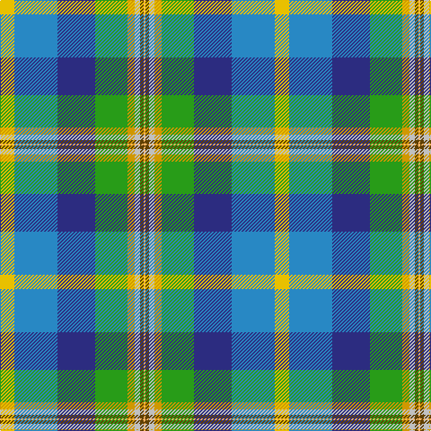

In pattern [YBBGYWGY](/stripes/ybbgywgy/).

This was sourced from tartans-authority.  It is a [8 stripe tartan](/stripes/stripes8/).

Original link http://www.tartansauthority.com/tartan-ferret/display/10931/

## Thread count
Y/16 B48 DB42 G36 DY8 N6 T4 LG/2

## Palette
Each colour and its ΔE from the base-6 reference it is a variant of.

| Colour | Shade | Base | ΔE (OKLab) |
|---|---|---|---|
| B | <code style="background-color:#2888C4;">#2888C4</code> `#2888C4` | B <code style="background-color:#2A418A;">#2A418A</code> | 0.21 |
| DB | <code style="background-color:#2C2C80;">#2C2C80</code> `#2C2C80` | B <code style="background-color:#2A418A;">#2A418A</code> | 0.06 |
| DY | <code style="background-color:#D09800;">#D09800</code> `#D09800` | Y <code style="background-color:#F2BF00;">#F2BF00</code> | 0.12 |
| G | <code style="background-color:#289C18;">#289C18</code> `#289C18` | G <code style="background-color:#006100;">#006100</code> | 0.19 |
| LG | <code style="background-color:#FCB464;">#FCB464</code> `#FCB464` | Y <code style="background-color:#F2BF00;">#F2BF00</code> | 0.07 |
| N | <code style="background-color:#C0C0C0;">#C0C0C0</code> `#C0C0C0` | W <code style="background-color:#F7F7F7;">#F7F7F7</code> | 0.17 |
| T | <code style="background-color:#604000;">#604000</code> `#604000` | G <code style="background-color:#006100;">#006100</code> | 0.14 |
| Y | <code style="background-color:#E8C000;">#E8C000</code> `#E8C000` | Y <code style="background-color:#F2BF00;">#F2BF00</code> | 0.02 |

# Sample pattern

## Nearest tartans

The nearest existing variants by ΔTartan distance.

1. [Thistle Stop LLC](/setts/s9/lg16g1g1g1t24k12m16dp2g2~x2/) — ΔT 1.24
1. [Philpotts, Brian](/setts/s8/w8lt24db21g18lo4lb3dy2lb1~x2/) — ΔT 1.24
1. [Rwanda](/setts/s11/w4k1db16k1dg12ly12b24lo2b1lo4b2~x2/) — ΔT 1.43
1. [Dundee Carers' Centre](/setts/s11/lp66db2lo14db2ly5p8db12g60g60lp2db25/) — ΔT 1.43
1. [Isle of Jura](/setts/s8/lb12lg12db7w1do5o5lo2ly2~x2/) — ΔT 1.57
1. [Hughes Interconnection Int. (Pers)](/setts/s9/w4k2b18ly4b18dy26g18k1m2~x2/) — ΔT 1.64
1. [Bouguet, Adrian Hunting (Personal)](/setts/s12/lb15lr6dg15lr4lb3dg3lb3lr4dg15lr2w3r1~x2/) — ΔT 1.70
1. [Okanagan(District)](/setts/s13/lb17r2w2db9ly2y16w1r6w1g5ly1y8ly2~x2/) — ΔT 1.76
1. [Lanark Highlands](/setts/s10/o2w11t3g2ly1g1r2g10db4lo2~x4/) — ΔT 1.78
1. [Pearl of the Orient](/setts/s13/dp4dt20db4dt6g6w2ly4g4r2g18db4r1w4~x2/) — ΔT 1.79

## Neighbour map

Every grey dot is one of 14299 variants placed by the first two principal components of the ΔTartan feature space (44% of its variance). Red is this tartan; blue dots are its nearest — click one to open its page.

<svg viewBox="0 0 640 380" role="img" style="max-width:100%;height:auto;border:1px solid #e0e0e0;border-radius:4px;display:block" xmlns="http://www.w3.org/2000/svg"><image href="/nn/cloud.v1.png" width="640" height="380"/><a href="/setts/s9/lg16g1g1g1t24k12m16dp2g2~x2/"><circle cx="136.2" cy="104.1" r="4" fill="#3465a4"><title>Thistle Stop LLC</title></circle></a><a href="/setts/s8/w8lt24db21g18lo4lb3dy2lb1~x2/"><circle cx="61.1" cy="80.5" r="4" fill="#3465a4"><title>Philpotts, Brian</title></circle></a><a href="/setts/s11/w4k1db16k1dg12ly12b24lo2b1lo4b2~x2/"><circle cx="110.4" cy="77.9" r="4" fill="#3465a4"><title>Rwanda</title></circle></a><a href="/setts/s11/lp66db2lo14db2ly5p8db12g60g60lp2db25/"><circle cx="121.9" cy="75.3" r="4" fill="#3465a4"><title>Dundee Carers' Centre</title></circle></a><a href="/setts/s8/lb12lg12db7w1do5o5lo2ly2~x2/"><circle cx="17.2" cy="122.1" r="4" fill="#3465a4"><title>Isle of Jura</title></circle></a><a href="/setts/s9/w4k2b18ly4b18dy26g18k1m2~x2/"><circle cx="182.1" cy="120.4" r="4" fill="#3465a4"><title>Hughes Interconnection Int. (Pers)</title></circle></a><a href="/setts/s12/lb15lr6dg15lr4lb3dg3lb3lr4dg15lr2w3r1~x2/"><circle cx="41.5" cy="100.3" r="4" fill="#3465a4"><title>Bouguet, Adrian Hunting (Personal)</title></circle></a><a href="/setts/s13/lb17r2w2db9ly2y16w1r6w1g5ly1y8ly2~x2/"><circle cx="30.3" cy="68.5" r="4" fill="#3465a4"><title>Okanagan(District)</title></circle></a><a href="/setts/s10/o2w11t3g2ly1g1r2g10db4lo2~x4/"><circle cx="63.3" cy="94.9" r="4" fill="#3465a4"><title>Lanark Highlands</title></circle></a><a href="/setts/s13/dp4dt20db4dt6g6w2ly4g4r2g18db4r1w4~x2/"><circle cx="113.2" cy="90.9" r="4" fill="#3465a4"><title>Pearl of the Orient</title></circle></a><circle cx="89.9" cy="97.9" r="5" fill="#c00000"/></svg>

ID: /setts/s8/ly8t24db21g18lo4lb3dy2lo1~x2/
