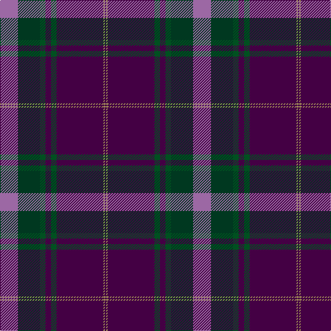

In pattern [BYBGBGGR](/stripes/bybgbggr/).

This was sourced from register-of-tartans.  It is a [8 stripe tartan](/stripes/stripes8/).

Original link https://www.tartanregister.gov.uk/tartanDetails.aspx?ref=10967

## Register references

External register numbers recorded for this tartan.

- Scottish Register of Tartans: [10967](https://www.tartanregister.gov.uk/tartanDetails.aspx?ref=10967)

## Thread count
LP/26 DG32 G8 DP8 G8 DP68 LT2 DP/2

## Palette
Each colour and the base-6 reference it is a variant of.

| Colour | Shade | Base |
|---|---|---|
| DG | <code style="background-color:#003820;">#003820</code> `oklch(30.0% 0.070 158.3)` <small>#003820</small> | G <code style="background-color:#006100;">#006100</code> |
| DP | <code style="background-color:#440044;">#440044</code> `oklch(27.1% 0.125 328.4)` <small>#440044</small> | B <code style="background-color:#2A418A;">#2A418A</code> |
| G | <code style="background-color:#005020;">#005020</code> `oklch(37.7% 0.105 149.6)` <small>#005020</small> | G <code style="background-color:#006100;">#006100</code> |
| LP | <code style="background-color:#9C68A4;">#9C68A4</code> `oklch(59.4% 0.107 322.0)` <small>#9C68A4</small> | R <code style="background-color:#CC0000;">#CC0000</code> |
| LT | <code style="background-color:#A08858;">#A08858</code> `oklch(63.7% 0.071 84.0)` <small>#A08858</small> | Y <code style="background-color:#F2BF00;">#F2BF00</code> |

# Sample pattern

## Nearest tartans

The nearest existing variants by ΔTartan distance, with this tartan at the top so the swatches line up against it.

ΔTartan

Tartan

Sett

—

<a href="/ttd/edit/#slug=m13dg16dg4dp4dg4dp34lo1dp1~x2">Heather Mead (Personal)</a> <a class="nn-out" href="/setts/s8/m13dg16dg4dp4dg4dp34lo1dp1~x2/" title="open its dictionary page">↗</a>

0.69

<a href="/ttd/edit/#slug=dp13dg16g4dp1g4dp34ly1dp1~x2">Heather Mead (Personal)</a> <a class="nn-out" href="/setts/s8/dp13dg16g4dp1g4dp34ly1dp1~x2/" title="open its dictionary page">↗</a>

1.00

<a href="/ttd/edit/#slug=w2dp5m34k5n9k12dp1~x2">Thomson, Reona Ellen (Personal)</a> <a class="nn-out" href="/setts/s7/w2dp5m34k5n9k12dp1~x2/" title="open its dictionary page">↗</a>

1.13

<a href="/ttd/edit/#slug=r3g10k12db3k2db2k2db30r4w1~x2">McClafferty</a> <a class="nn-out" href="/setts/s10/r3g10k12db3k2db2k2db30r4w1~x2/" title="open its dictionary page">↗</a>

1.23

<a href="/ttd/edit/#slug=r30db5r3db33g8k3db8w2~x2">St. Margaret Youth Group (Corporate)</a> <a class="nn-out" href="/setts/s8/r30db5r3db33g8k3db8w2~x2/" title="open its dictionary page">↗</a>

1.27

<a href="/ttd/edit/#slug=dp72k40dg23r4dg23k2w4~x2">Ferguson Unidentified</a> <a class="nn-out" href="/setts/s7/dp72k40dg23r4dg23k2w4~x2/" title="open its dictionary page">↗</a>

1.29

<a href="/ttd/edit/#slug=r4db10dg2db2dg24dp2dg2dp16dg2w1~x2">Kinfauns Castle</a> <a class="nn-out" href="/setts/s10/r4db10dg2db2dg24dp2dg2dp16dg2w1~x2/" title="open its dictionary page">↗</a>

1.34

<a href="/ttd/edit/#slug=n4dt2n7dt30n8dt7r5dt1w2~x2">Hebridean Heather</a> <a class="nn-out" href="/setts/s9/n4dt2n7dt30n8dt7r5dt1w2~x2/" title="open its dictionary page">↗</a>

1.36

<a href="/ttd/edit/#slug=k8r4k36db48r6g3lo2~x2">Royal Marines Condor</a> <a class="nn-out" href="/setts/s7/k8r4k36db48r6g3lo2~x2/" title="open its dictionary page">↗</a>

1.36

<a href="/ttd/edit/#slug=db3dg1r22k12db28lb3~x2">Diaspora</a> <a class="nn-out" href="/setts/s6/db3dg1r22k12db28lb3~x2/" title="open its dictionary page">↗</a>

1.40

<a href="/ttd/edit/#slug=k2dr1dt17dr17db1ly2~x4">Murdoch (Geoffrey)</a> <a class="nn-out" href="/setts/s6/k2dr1dt17dr17db1ly2~x4/" title="open its dictionary page">↗</a>

## Neighbour map

Every grey dot is one of 14299 variants placed by the first two principal components of the ΔTartan feature space (44% of its variance). Red is this tartan; blue dots are its nearest — click one to open its page.

<svg viewBox="0 0 640 380" role="img" style="max-width:100%;height:auto;border:1px solid #e0e0e0;border-radius:4px;display:block" xmlns="http://www.w3.org/2000/svg"><image href="/nn/cloud.v1.png" width="640" height="380"/><a href="/setts/s8/dp13dg16g4dp1g4dp34ly1dp1~x2/"><circle cx="351.4" cy="147.1" r="4" fill="#3465a4"><title>Heather Mead (Personal)</title></circle></a><a href="/setts/s7/w2dp5m34k5n9k12dp1~x2/"><circle cx="332.1" cy="137.3" r="4" fill="#3465a4"><title>Thomson, Reona Ellen (Personal)</title></circle></a><a href="/setts/s10/r3g10k12db3k2db2k2db30r4w1~x2/"><circle cx="341.0" cy="140.1" r="4" fill="#3465a4"><title>McClafferty</title></circle></a><a href="/setts/s8/r30db5r3db33g8k3db8w2~x2/"><circle cx="321.8" cy="170.4" r="4" fill="#3465a4"><title>St. Margaret Youth Group (Corporate)</title></circle></a><a href="/setts/s7/dp72k40dg23r4dg23k2w4~x2/"><circle cx="281.4" cy="144.3" r="4" fill="#3465a4"><title>Ferguson Unidentified</title></circle></a><a href="/setts/s10/r4db10dg2db2dg24dp2dg2dp16dg2w1~x2/"><circle cx="319.9" cy="153.7" r="4" fill="#3465a4"><title>Kinfauns Castle</title></circle></a><a href="/setts/s9/n4dt2n7dt30n8dt7r5dt1w2~x2/"><circle cx="368.8" cy="142.2" r="4" fill="#3465a4"><title>Hebridean Heather</title></circle></a><a href="/setts/s7/k8r4k36db48r6g3lo2~x2/"><circle cx="320.8" cy="163.4" r="4" fill="#3465a4"><title>Royal Marines Condor</title></circle></a><a href="/setts/s6/db3dg1r22k12db28lb3~x2/"><circle cx="282.0" cy="165.6" r="4" fill="#3465a4"><title>Diaspora</title></circle></a><a href="/setts/s6/k2dr1dt17dr17db1ly2~x4/"><circle cx="327.8" cy="183.4" r="4" fill="#3465a4"><title>Murdoch (Geoffrey)</title></circle></a><circle cx="342.6" cy="143.2" r="5" fill="#c00000"/></svg>

ID: /setts/s8/m13dg16dg4dp4dg4dp34lo1dp1~x2/
