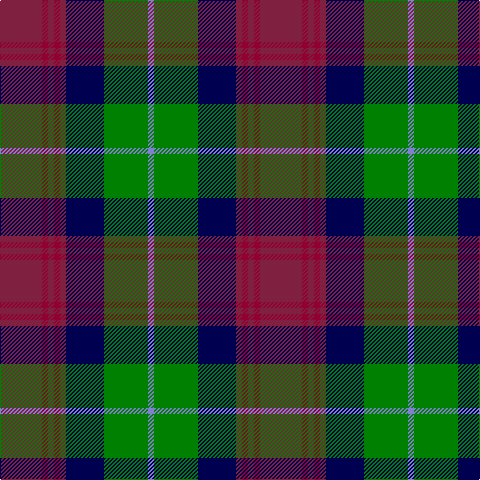

In pattern [BGBRRRRR](/stripes/bgbrrrrr/).

This was sourced from weddslist.  It is a [8 stripe tartan](/stripes/stripes8/).

Original link http://www.weddslist.com/cgi-bin/tartans/pg.pl?source=sts

## Thread count
DR/42 DRa6 DR6 DRa6 DR6 DB38 G44 B/6

## Palette
Each colour and the base-6 reference it is a variant of.

| Colour | Shade | Base |
|---|---|---|
| B | <code style="background-color:#8080D0;">#8080D0</code> `oklch(63.4% 0.119 282.5)` <small>#8080D0</small> | B <code style="background-color:#2A418A;">#2A418A</code> |
| DB | <code style="background-color:#000050;">#000050</code> `oklch(19.5% 0.135 264.1)` <small>#000050</small> | B <code style="background-color:#2A418A;">#2A418A</code> |
| DR | <code style="background-color:#802040;">#802040</code> `oklch(40.8% 0.132 5.2)` <small>#802040</small> | R <code style="background-color:#CC0000;">#CC0000</code> |
| DRa | <code style="background-color:#900030;">#900030</code> `oklch(41.6% 0.166 13.6)` <small>#900030</small> | R <code style="background-color:#CC0000;">#CC0000</code> |
| G | <code style="background-color:#008000;">#008000</code> `oklch(52.0% 0.177 142.5)` <small>#008000</small> | G <code style="background-color:#006100;">#006100</code> |

# Sample pattern

## Nearest tartans

The nearest existing variants by ΔTartan distance.

1. [Akins Clan (Personal)](/setts/s8/r21r3r3r3r3db19g22lt3~x2/) — ΔT 0.56
1. [Ryukoku University Heian JHS (Corp)](/setts/s10/m4k16o5n8o2dp2o2dp2n8k3~x2/) — ΔT 0.64
1. [Coffield-Limesand (Personal)](/setts/s9/dp8k1g2k1dy2k6g8k1w2~x4/) — ΔT 0.67
1. [Zangenberg (Personal)](/setts/s7/dp2r2dp16k17dg16k2ly2~x2/) — ΔT 0.69
1. [Heart of the Highlands](/setts/s9/o18k3o4lb3o4k18n20k2m4~x2/) — ΔT 0.71
1. [Curry (Personal)](/setts/s8/r3g2r6g20k15g3db18w2~x2/) — ΔT 0.74
1. [Swankie (Personal)](/setts/s7/k4b21dy10y4k20r6b3~x2/) — ΔT 0.78
1. [Sikh](/setts/s8/o56k12o7k12o7g50db50ly10/) — ΔT 0.87
1. [Law Society of Scotland (Corporate)](/setts/s10/r6g3r24t7r4t7k18g4k7g3/) — ΔT 0.89
1. [Rattray of Lude](/setts/s10/k1g8k4r1db8r1db1r8g1w1~x4/) — ΔT 0.90

## Neighbour map

Every grey dot is one of 14299 variants placed by the first two principal components of the ΔTartan feature space (44% of its variance). Red is this tartan; blue dots are its nearest — click one to open its page.

<svg viewBox="0 0 640 380" role="img" style="max-width:100%;height:auto;border:1px solid #e0e0e0;border-radius:4px;display:block" xmlns="http://www.w3.org/2000/svg"><image href="/nn/cloud.v1.png" width="640" height="380"/><a href="/setts/s8/r21r3r3r3r3db19g22lt3~x2/"><circle cx="145.6" cy="181.3" r="4" fill="#3465a4"><title>Akins Clan (Personal)</title></circle></a><a href="/setts/s10/m4k16o5n8o2dp2o2dp2n8k3~x2/"><circle cx="159.5" cy="186.7" r="4" fill="#3465a4"><title>Ryukoku University Heian JHS (Corp)</title></circle></a><a href="/setts/s9/dp8k1g2k1dy2k6g8k1w2~x4/"><circle cx="128.9" cy="183.9" r="4" fill="#3465a4"><title>Coffield-Limesand (Personal)</title></circle></a><a href="/setts/s7/dp2r2dp16k17dg16k2ly2~x2/"><circle cx="172.5" cy="194.8" r="4" fill="#3465a4"><title>Zangenberg (Personal)</title></circle></a><a href="/setts/s9/o18k3o4lb3o4k18n20k2m4~x2/"><circle cx="161.2" cy="174.3" r="4" fill="#3465a4"><title>Heart of the Highlands</title></circle></a><a href="/setts/s8/r3g2r6g20k15g3db18w2~x2/"><circle cx="163.6" cy="187.8" r="4" fill="#3465a4"><title>Curry (Personal)</title></circle></a><a href="/setts/s7/k4b21dy10y4k20r6b3~x2/"><circle cx="147.4" cy="213.4" r="4" fill="#3465a4"><title>Swankie (Personal)</title></circle></a><a href="/setts/s8/o56k12o7k12o7g50db50ly10/"><circle cx="142.6" cy="188.6" r="4" fill="#3465a4"><title>Sikh</title></circle></a><a href="/setts/s10/r6g3r24t7r4t7k18g4k7g3/"><circle cx="164.5" cy="187.3" r="4" fill="#3465a4"><title>Law Society of Scotland (Corporate)</title></circle></a><a href="/setts/s10/k1g8k4r1db8r1db1r8g1w1~x4/"><circle cx="123.8" cy="165.9" r="4" fill="#3465a4"><title>Rattray of Lude</title></circle></a><circle cx="158.8" cy="190.3" r="5" fill="#c00000"/></svg>

ID: /setts/s8/m21r3m3r3m3db19g22b3~x2/
