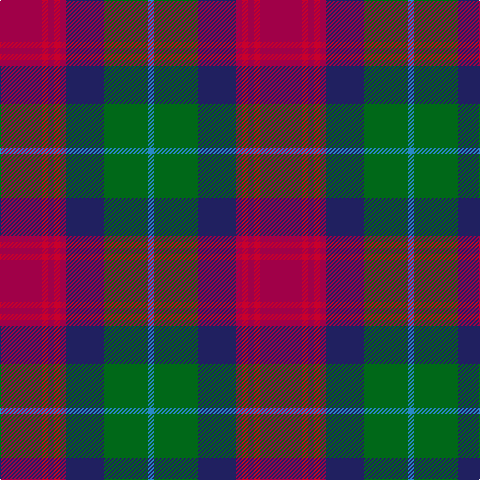

This page is one **sett** — a single exact thread-count. It belongs to the [tartan](/tartans/m21r3m3r3m3db19g22t3/)
(the same proportion at any scale), whose colour order is pattern [BGBRRRRR](/stripes/bgbrrrrr/).

Sourced from tartans-authority.  It is a [8 stripe tartan](/stripes/stripes8/).

Original link http://www.tartansauthority.com/tartan-ferret/display/2426/

## Register references

External register numbers recorded for this tartan.

- Scottish Tartans Authority (ITI): 2426

## Thread count
R/42 Ra6 R6 Ra6 R6 DB38 G44 B/6

## Palette

Palette: <strong>Tartan Register</strong>
<table><thead><tr><th>Colour</th><th>Threads</th><th>Shade</th><th>Base</th><th>OKLCh</th></tr></thead><tbody><tr><td>R/</td><td style="text-align:right;font-variant-numeric:tabular-nums">42</td><td><code style="background-color:#A00048;">#A00048</code> <small style="color:#888">#A00048</small></td><td>R <code style="background-color:#CC0000;">#CC0000</code></td><td><small style="color:#888">oklch(45.4% 0.182 5.3)</small></td></tr><tr><td>Ra</td><td style="text-align:right;font-variant-numeric:tabular-nums">6</td><td><code style="background-color:#C8002C;">#C8002C</code> <small style="color:#888">#C8002C</small></td><td>R <code style="background-color:#CC0000;">#CC0000</code></td><td><small style="color:#888">oklch(52.6% 0.212 22.0)</small></td></tr><tr><td>R</td><td style="text-align:right;font-variant-numeric:tabular-nums">6</td><td><code style="background-color:#A00048;">#A00048</code> <small style="color:#888">#A00048</small></td><td>R <code style="background-color:#CC0000;">#CC0000</code></td><td><small style="color:#888">oklch(45.4% 0.182 5.3)</small></td></tr><tr><td>Ra</td><td style="text-align:right;font-variant-numeric:tabular-nums">6</td><td><code style="background-color:#C8002C;">#C8002C</code> <small style="color:#888">#C8002C</small></td><td>R <code style="background-color:#CC0000;">#CC0000</code></td><td><small style="color:#888">oklch(52.6% 0.212 22.0)</small></td></tr><tr><td>R</td><td style="text-align:right;font-variant-numeric:tabular-nums">6</td><td><code style="background-color:#A00048;">#A00048</code> <small style="color:#888">#A00048</small></td><td>R <code style="background-color:#CC0000;">#CC0000</code></td><td><small style="color:#888">oklch(45.4% 0.182 5.3)</small></td></tr><tr><td>DB</td><td style="text-align:right;font-variant-numeric:tabular-nums">38</td><td><code style="background-color:#202060;">#202060</code> <small style="color:#888">#202060</small></td><td>B <code style="background-color:#2A418A;">#2A418A</code></td><td><small style="color:#888">oklch(28.9% 0.111 276.9)</small></td></tr><tr><td>G</td><td style="text-align:right;font-variant-numeric:tabular-nums">44</td><td><code style="background-color:#006818;">#006818</code> <small style="color:#888">#006818</small></td><td>G <code style="background-color:#006100;">#006100</code></td><td><small style="color:#888">oklch(45.0% 0.142 145.0)</small></td></tr><tr><td>B/</td><td style="text-align:right;font-variant-numeric:tabular-nums">6</td><td><code style="background-color:#2888C4;">#2888C4</code> <small style="color:#888">#2888C4</small></td><td>B <code style="background-color:#2A418A;">#2A418A</code></td><td><small style="color:#888">oklch(60.1% 0.125 241.5)</small></td></tr></tbody></table>

# Sample pattern

## Nearest tartans

The nearest existing variants by ΔTartan distance, with this tartan at the top so the swatches line up against it.

ΔTartan

Tartan

Sett

—

<a href="/ttd/edit/#slug=m21r3m3r3m3db19g22t3~x2">Akins (Clan)</a> <a class="nn-out" href="/setts/s8/m21r3m3r3m3db19g22t3~x2/" title="open its dictionary page">↗</a>

0.75

<a href="/ttd/edit/#slug=r6g3r24t7r4t7k18g4k7g3">Law Society of Scotland (Corporate)</a> <a class="nn-out" href="/setts/s10/r6g3r24t7r4t7k18g4k7g3/" title="open its dictionary page">↗</a>

0.82

<a href="/ttd/edit/#slug=m6y2db12k2y12m9k2lo2~x2">Orkney</a> <a class="nn-out" href="/setts/s8/m6y2db12k2y12m9k2lo2~x2/" title="open its dictionary page">↗</a>

0.95

<a href="/ttd/edit/#slug=m21r3m3r3m3db19g22b3~x2">Akins</a> <a class="nn-out" href="/setts/s8/m21r3m3r3m3db19g22b3~x2/" title="open its dictionary page">↗</a>

1.00

<a href="/ttd/edit/#slug=m4k16o5n8o2dp2o2dp2n8k3~x2">Ryukoku University Heian JHS (Corp)</a> <a class="nn-out" href="/setts/s10/m4k16o5n8o2dp2o2dp2n8k3~x2/" title="open its dictionary page">↗</a>

1.04

<a href="/ttd/edit/#slug=dp2r2dp16k17dg16k2ly2~x2">Zangenberg (Personal)</a> <a class="nn-out" href="/setts/s7/dp2r2dp16k17dg16k2ly2~x2/" title="open its dictionary page">↗</a>

1.09

<a href="/ttd/edit/#slug=dt23lo2r3db7r3lo2g15r21lo5~x2">Land's End Maroon</a> <a class="nn-out" href="/setts/s9/dt23lo2r3db7r3lo2g15r21lo5~x2/" title="open its dictionary page">↗</a>

1.12

<a href="/ttd/edit/#slug=r4dy14lo2dy4lo2k6dy3k6db14r2db4r4~x2">Kinloch Anderson</a> <a class="nn-out" href="/setts/s12/r4dy14lo2dy4lo2k6dy3k6db14r2db4r4~x2/" title="open its dictionary page">↗</a>

1.14

<a href="/ttd/edit/#slug=r12dbi3g5db16ly2g2~x2">Dunbog Primary School Corporate Tartan Tartan Number: 954. Earliest known date: 1985 C. Armstrong is a pupil at the school. See products available Copyright © Blair Urquhart, Comrie, 2015</a> <a class="nn-out" href="/setts/s6/r12dbi3g5db16ly2g2~x2/" title="open its dictionary page">↗</a>

1.18

<a href="/ttd/edit/#slug=k3dg17k9r2db17r2db2r17dg2w2~x2">MacInroy (Rattray)</a> <a class="nn-out" href="/setts/s10/k3dg17k9r2db17r2db2r17dg2w2~x2/" title="open its dictionary page">↗</a>

1.20

<a href="/ttd/edit/#slug=db1n8w1db4m8w1~x6">Little's Chauffeur Drive</a> <a class="nn-out" href="/setts/s6/db1n8w1db4m8w1~x6/" title="open its dictionary page">↗</a>

## Neighbour map

Every grey dot is one of 14359 variants placed by the first two principal components of the ΔTartan feature space (44% of its variance). Red is this tartan; blue dots are its nearest — click one to open its page.

<svg viewBox="0 0 640 380" role="img" style="max-width:100%;height:auto;border:1px solid #e0e0e0;border-radius:4px;display:block" xmlns="http://www.w3.org/2000/svg"><image href="/nn/cloud.v1.png" width="640" height="380"/><a href="/setts/s10/r6g3r24t7r4t7k18g4k7g3/"><circle cx="164.2" cy="188.4" r="4" fill="#3465a4"><title>Law Society of Scotland (Corporate)</title></circle></a><a href="/setts/s8/m6y2db12k2y12m9k2lo2~x2/"><circle cx="141.2" cy="218.8" r="4" fill="#3465a4"><title>Orkney</title></circle></a><a href="/setts/s8/m21r3m3r3m3db19g22b3~x2/"><circle cx="158.6" cy="191.4" r="4" fill="#3465a4"><title>Akins</title></circle></a><a href="/setts/s10/m4k16o5n8o2dp2o2dp2n8k3~x2/"><circle cx="159.3" cy="187.8" r="4" fill="#3465a4"><title>Ryukoku University Heian JHS (Corp)</title></circle></a><a href="/setts/s7/dp2r2dp16k17dg16k2ly2~x2/"><circle cx="172.3" cy="195.9" r="4" fill="#3465a4"><title>Zangenberg (Personal)</title></circle></a><a href="/setts/s9/dt23lo2r3db7r3lo2g15r21lo5~x2/"><circle cx="185.9" cy="184.2" r="4" fill="#3465a4"><title>Land's End Maroon</title></circle></a><a href="/setts/s12/r4dy14lo2dy4lo2k6dy3k6db14r2db4r4~x2/"><circle cx="138.4" cy="194.0" r="4" fill="#3465a4"><title>Kinloch Anderson</title></circle></a><a href="/setts/s6/r12dbi3g5db16ly2g2~x2/"><circle cx="180.0" cy="200.4" r="4" fill="#3465a4"><title>Dunbog Primary School Corporate Tartan Tartan Number: 954. Earliest known date: 1985 C. Armstrong is a pupil at the school. See products available Copyright © Blair Urquhart, Comrie, 2015</title></circle></a><a href="/setts/s10/k3dg17k9r2db17r2db2r17dg2w2~x2/"><circle cx="133.3" cy="172.9" r="4" fill="#3465a4"><title>MacInroy (Rattray)</title></circle></a><a href="/setts/s6/db1n8w1db4m8w1~x6/"><circle cx="208.2" cy="229.9" r="4" fill="#3465a4"><title>Little's Chauffeur Drive</title></circle></a><circle cx="179.9" cy="195.3" r="5" fill="#c00000"/></svg>

ID: /setts/s8/m21r3m3r3m3db19g22t3~x2/
