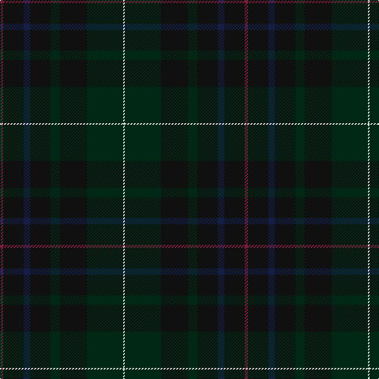

**Bands:** [RKBKGKGW](/stripes/rkbkgkgw/) · **Stripes:** [M K DB K DG K DG W](/stripes/stripes8/) M K DB K DG K DG W

This was sourced from register-of-tartans.  It is a [8 band tartan](/bands/bands8/).

Original link https://www.tartanregister.gov.uk/tartanDetails.aspx?ref=5932

## Register references

External register numbers recorded for this tartan.

- Scottish Register of Tartans: [5932](https://www.tartanregister.gov.uk/tartanDetails.aspx?ref=5932)
- Scottish Tartans World Register: 3175

## Thread count
DR/4 K26 DB8 K26 DG12 K34 DG46 LN/2

## Palette
Each colour and its ΔE from the base-6 reference it is a variant of.

| Colour | Shade | Base | ΔE (OKLab) |
|---|---|---|---|
| DB | <code style="background-color:#141E46;">#141E46</code> `#141E46` | B <code style="background-color:#2A418A;">#2A418A</code> | 0.16 |
| DG | <code style="background-color:#002814;">#002814</code> `#002814` | G <code style="background-color:#006100;">#006100</code> | 0.20 |
| DR | <code style="background-color:#781C38;">#781C38</code> `#781C38` | R <code style="background-color:#CC0000;">#CC0000</code> | 0.18 |
| K | <code style="background-color:#101010;">#101010</code> `#101010` | K <code style="background-color:#000000;">#000000</code> | 0.17 |
| LN | <code style="background-color:#E0E0E0;">#E0E0E0</code> `#E0E0E0` | W <code style="background-color:#F7F7F7;">#F7F7F7</code> | 0.07 |

# Sample pattern

## Nearest tartans

The nearest existing variants by ΔTartan distance.

1. [Basel Tattoo (Official)](/setts/s9/db1k8db2dg16dr6dg16db2k8w1~x2/) — ΔT 1.17
1. [Ryder Cup 2006](/setts/s10/k10lo1k3dt8dg8dg1dg8dt8k15lo1~x2/) — ΔT 1.88
1. [Alasdair Dhana](/setts/s12/dg3dt20dg16r2dg2r3dg3r5dg16dt20ly1k2~x2/) — ΔT 1.92
1. [Tern House](/setts/s7/dg23db3k8db4dg4db56dy8/) — ΔT 2.20
1. [Phillips Welsh Name Tartan Tartan Number: 5751. Earliest known date: 2002 The tartan for this Welsh surname and its variations, Filpin, Phelps, Philipson, Phillips, Philpin, Phipps is actually woven in Wales at the Cambrian Woollen Mill, weaving on the same site since 1830. This tartan differs from many traditional patterns in that the warp and weft differ, giving the finished worsted wool cloth more of a predominant stripe, noticeable in the finished Kilt, or Cilt in Wales. See products available Copyright © Blair Urquhart, Comrie, 2015](/setts/s11/k2k20dg30k2dg4k2dg30k3db30k35r2/) — ΔT 2.23
1. [Bute Heather, Weathered](/setts/s11/dy6w1do18k6do4k4do8k1do8k2dy5~x2/) — ΔT 2.24
1. [Hueg (Bavaria) Hunting (Personal)](/setts/s10/dp17dg5dp5dg17dp4dg17k2k2k2dg5~x2/) — ΔT 2.24
1. [Mack of Stoneywood Hunting (Personal)](/setts/s11/dg18dg4b1dg5dg6dg3k1dy6k1dg25b1~x2/) — ΔT 2.26
1. [Highlander (Corporate)](/setts/s12/dg33dg4dg4dg4dg5dg13o13dg13o2dg11o1dg2~x2/) — ΔT 2.26
1. [St. Mirren (Corporate)](/setts/s12/do10k4do16k4do10k16do8k24do28r3do4r3/) — ΔT 2.28

## Neighbour map

Every grey dot is one of 14299 variants placed by the first two principal components of the ΔTartan feature space (44% of its variance). Red is this tartan; blue dots are its nearest — click one to open its page.

<svg viewBox="0 0 640 380" role="img" style="max-width:100%;height:auto;border:1px solid #e0e0e0;border-radius:4px;display:block" xmlns="http://www.w3.org/2000/svg"><image href="/nn/cloud.v1.png" width="640" height="380"/><a href="/setts/s9/db1k8db2dg16dr6dg16db2k8w1~x2/"><circle cx="400.8" cy="251.1" r="4" fill="#3465a4"><title>Basel Tattoo (Official)</title></circle></a><a href="/setts/s10/k10lo1k3dt8dg8dg1dg8dt8k15lo1~x2/"><circle cx="332.6" cy="255.9" r="4" fill="#3465a4"><title>Ryder Cup 2006</title></circle></a><a href="/setts/s12/dg3dt20dg16r2dg2r3dg3r5dg16dt20ly1k2~x2/"><circle cx="382.4" cy="219.3" r="4" fill="#3465a4"><title>Alasdair Dhana</title></circle></a><a href="/setts/s7/dg23db3k8db4dg4db56dy8/"><circle cx="527.1" cy="265.1" r="4" fill="#3465a4"><title>Tern House</title></circle></a><a href="/setts/s11/k2k20dg30k2dg4k2dg30k3db30k35r2/"><circle cx="360.5" cy="231.8" r="4" fill="#3465a4"><title>Phillips Welsh Name Tartan Tartan Number: 5751. Earliest known date: 2002 The tartan for this Welsh surname and its variations, Filpin, Phelps, Philipson, Phillips, Philpin, Phipps is actually woven in Wales at the Cambrian Woollen Mill, weaving on the same site since 1830. This tartan differs from many traditional patterns in that the warp and weft differ, giving the finished worsted wool cloth more of a predominant stripe, noticeable in the finished Kilt, or Cilt in Wales. See products available Copyright © Blair Urquhart, Comrie, 2015</title></circle></a><a href="/setts/s11/dy6w1do18k6do4k4do8k1do8k2dy5~x2/"><circle cx="447.4" cy="243.4" r="4" fill="#3465a4"><title>Bute Heather, Weathered</title></circle></a><a href="/setts/s10/dp17dg5dp5dg17dp4dg17k2k2k2dg5~x2/"><circle cx="470.0" cy="299.1" r="4" fill="#3465a4"><title>Hueg (Bavaria) Hunting (Personal)</title></circle></a><a href="/setts/s11/dg18dg4b1dg5dg6dg3k1dy6k1dg25b1~x2/"><circle cx="461.5" cy="218.1" r="4" fill="#3465a4"><title>Mack of Stoneywood Hunting (Personal)</title></circle></a><a href="/setts/s12/dg33dg4dg4dg4dg5dg13o13dg13o2dg11o1dg2~x2/"><circle cx="406.7" cy="201.8" r="4" fill="#3465a4"><title>Highlander (Corporate)</title></circle></a><a href="/setts/s12/do10k4do16k4do10k16do8k24do28r3do4r3/"><circle cx="390.2" cy="284.0" r="4" fill="#3465a4"><title>St. Mirren (Corporate)</title></circle></a><circle cx="454.5" cy="266.5" r="5" fill="#c00000"/></svg>

ID: /setts/s8/m2k13db4k13dg6k17dg23w1~x2/
