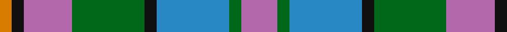
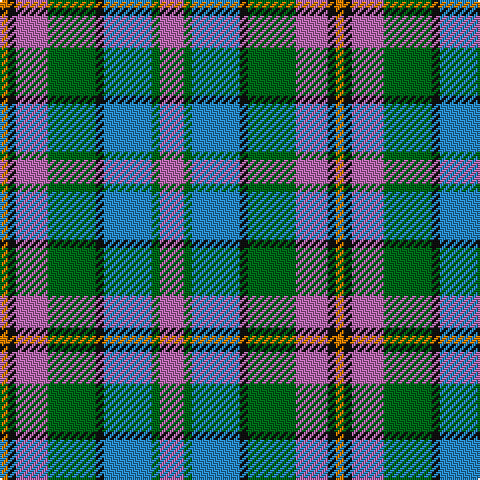

**Bands:** [RGBKGRKY](/stripes/rgbkgrky/) · **Stripes:** [M G T K G M K LO](/stripes/stripes8/) M G T K G M K LO

This was sourced from house-of-tartan.  It is a [8 band tartan](/bands/bands8/).

Original link http://www.house-of-tartan.scotland.net/house/TartanViewjs.asp?colr=Def&tnam=2301

## Thread count
O/4 K4 P16 G24 K4 B24 G4 P/12

## Palette
Each colour and its ΔE from the base-6 reference it is a variant of.

| Colour | Shade | Base | ΔE (OKLab) |
|---|---|---|---|
| B | <code style="background-color:#2888C4;">#2888C4</code> `#2888C4` | B <code style="background-color:#2A418A;">#2A418A</code> | 0.21 |
| G | <code style="background-color:#006818;">#006818</code> `#006818` | G <code style="background-color:#006100;">#006100</code> | 0.02 |
| K | <code style="background-color:#101010;">#101010</code> `#101010` | K <code style="background-color:#000000;">#000000</code> | 0.17 |
| O | <code style="background-color:#D87C00;">#D87C00</code> `#D87C00` | Y <code style="background-color:#F2BF00;">#F2BF00</code> | 0.17 |
| P | <code style="background-color:#B468AC;">#B468AC</code> `#B468AC` | R <code style="background-color:#CC0000;">#CC0000</code> | 0.21 |

# Sample pattern

## Nearest tartans

The nearest existing variants by ΔTartan distance.

1. [Caitriot](/setts/s9/w3t2n14o8t14db16n13t2w3~x2/) — ΔT 0.88
1. [Orkney (District?)](/setts/s8/r9g3b19k3g19r13k3lo3~x2/) — ΔT 1.11
1. [Caitriot](/setts/s9/w3t2n14lr8t14db16n13t2w3~x2/) — ΔT 1.23
1. [Unidentified #47](/setts/s10/db10t5lo2t2lb2t5o4t2o4lb2~x4/) — ΔT 1.23
1. [Cercle de Fermières Varennes](/setts/s6/b30r3w10dg14r3o30~x2/) — ΔT 1.26
1. [Idaho, Centennial](/setts/s8/db12r2db2r2db2g10w12o3~x2/) — ΔT 1.29
1. [McLion](/setts/s9/lo1m5g4db1g1db1g1db6w1~x4/) — ΔT 1.30
1. [Newmill Corporate Tartan Tartan Number: 2053. Earliest known date: March 1992 Designed to be used in the refurbishing of Johnstons of Elgin new mill shop and based on the colours of the mill shop house style. The lighter square is represented here as green from the 'Antique' colour range, a speciality of Johnstons of Elgin. See products available Copyright © Blair Urquhart, Comrie, 2015](/setts/s7/lo5o20dt13db42dt13o20r5/) — ΔT 1.32
1. [Casely (Name)](/setts/s6/r4g11k11g2n11ly3~x4/) — ΔT 1.34
1. [Bowie (Lochcarron)](/setts/s12/b10r2b3r4b13r2k13dg13r4dg3lo2dg10~x2/) — ΔT 1.36

## Neighbour map

Every grey dot is one of 14313 variants placed by the first two principal components of the ΔTartan feature space (44% of its variance). Red is this tartan; blue dots are its nearest — click one to open its page.

<svg viewBox="0 0 640 380" role="img" style="max-width:100%;height:auto;border:1px solid #e0e0e0;border-radius:4px;display:block" xmlns="http://www.w3.org/2000/svg"><image href="/nn/cloud.v1.png" width="640" height="380"/><a href="/setts/s9/w3t2n14o8t14db16n13t2w3~x2/"><circle cx="136.0" cy="203.9" r="4" fill="#3465a4"><title>Caitriot</title></circle></a><a href="/setts/s8/r9g3b19k3g19r13k3lo3~x2/"><circle cx="151.6" cy="221.2" r="4" fill="#3465a4"><title>Orkney (District?)</title></circle></a><a href="/setts/s9/w3t2n14lr8t14db16n13t2w3~x2/"><circle cx="114.0" cy="193.6" r="4" fill="#3465a4"><title>Caitriot</title></circle></a><a href="/setts/s10/db10t5lo2t2lb2t5o4t2o4lb2~x4/"><circle cx="96.6" cy="205.5" r="4" fill="#3465a4"><title>Unidentified #47</title></circle></a><a href="/setts/s6/b30r3w10dg14r3o30~x2/"><circle cx="147.1" cy="194.2" r="4" fill="#3465a4"><title>Cercle de Fermières Varennes</title></circle></a><a href="/setts/s8/db12r2db2r2db2g10w12o3~x2/"><circle cx="106.2" cy="185.5" r="4" fill="#3465a4"><title>Idaho, Centennial</title></circle></a><a href="/setts/s9/lo1m5g4db1g1db1g1db6w1~x4/"><circle cx="120.7" cy="177.1" r="4" fill="#3465a4"><title>McLion</title></circle></a><a href="/setts/s7/lo5o20dt13db42dt13o20r5/"><circle cx="177.2" cy="218.3" r="4" fill="#3465a4"><title>Newmill Corporate Tartan Tartan Number: 2053. Earliest known date: March 1992 Designed to be used in the refurbishing of Johnstons of Elgin new mill shop and based on the colours of the mill shop house style. The lighter square is represented here as green from the 'Antique' colour range, a speciality of Johnstons of Elgin. See products available Copyright © Blair Urquhart, Comrie, 2015</title></circle></a><a href="/setts/s6/r4g11k11g2n11ly3~x4/"><circle cx="98.3" cy="243.0" r="4" fill="#3465a4"><title>Casely (Name)</title></circle></a><a href="/setts/s12/b10r2b3r4b13r2k13dg13r4dg3lo2dg10~x2/"><circle cx="123.9" cy="201.4" r="4" fill="#3465a4"><title>Bowie (Lochcarron)</title></circle></a><circle cx="117.8" cy="211.9" r="5" fill="#c00000"/></svg>

ID: /setts/s8/m3g1t6k1g6m4k1lo1~x4/
