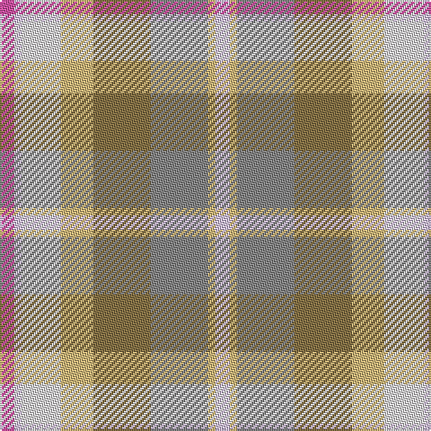

This page is one **sett** — a single exact thread-count. It belongs to the [tartan](/tartans/p4ln2lna11lg9lt16n16lg2ln4/)
(the same proportion at any scale), whose colour order is pattern [RWWYGRYW](/stripes/rwwygryw/).

Sourced from register-of-tartans.  It is a [8 stripe tartan](/stripes/stripes8/).

Original link https://www.tartanregister.gov.uk/tartanDetails.aspx?ref=4065

## Register references

External register numbers recorded for this tartan.

- Scottish Register of Tartans: [4065](https://www.tartanregister.gov.uk/tartanDetails.aspx?ref=4065)
- Scottish Tartans Authority (ITI): 7092

## Thread count
P/8 LN4 LNa22 LG18 LT32 N32 LG4 LN/8

## Palette
Each colour and the base-6 reference it is a variant of.

| Colour | Shade | Base |
|---|---|---|
| LG | <code style="background-color:#D0B87C;">#D0B87C</code> `oklch(78.9% 0.083 88.6)` <small>#D0B87C</small> | Y <code style="background-color:#F2BF00;">#F2BF00</code> |
| LN | <code style="background-color:#D8C4F0;">#D8C4F0</code> `oklch(85.1% 0.064 305.7)` <small>#D8C4F0</small> | W <code style="background-color:#F7F7F7;">#F7F7F7</code> |
| LNa | <code style="background-color:#E0DCE0;">#E0DCE0</code> `oklch(89.9% 0.007 325.6)` <small>#E0DCE0</small> | W <code style="background-color:#F7F7F7;">#F7F7F7</code> |
| LT | <code style="background-color:#887448;">#887448</code> `oklch(56.7% 0.066 85.9)` <small>#887448</small> | G <code style="background-color:#006100;">#006100</code> |
| N | <code style="background-color:#888888;">#888888</code> `oklch(62.7% 0.000 89.9)` <small>#888888</small> | R <code style="background-color:#CC0000;">#CC0000</code> |
| P | <code style="background-color:#D054A4;">#D054A4</code> `oklch(63.1% 0.179 343.9)` <small>#D054A4</small> | R <code style="background-color:#CC0000;">#CC0000</code> |

# Sample pattern

## Nearest tartans

The nearest existing variants by ΔTartan distance, with this tartan at the top so the swatches line up against it.

ΔTartan

Tartan

Sett

—

<a href="/ttd/edit/#slug=m4lb2w11ly9y16o16ly2lb4~x2">Takashimaya Dm Rose</a> <a class="nn-out" href="/setts/s8/m4lb2w11ly9y16o16ly2lb4~x2/" title="open its dictionary page">↗</a>

1.54

<a href="/ttd/edit/#slug=lb19lo12m4lo8o4g6lg16~x2">Aberdeenshire Home Colours</a> <a class="nn-out" href="/setts/s7/lb19lo12m4lo8o4g6lg16~x2/" title="open its dictionary page">↗</a>

1.85

<a href="/ttd/edit/#slug=w6lr27dr6o40lr44w8o4">Susan G Komen 06</a> <a class="nn-out" href="/setts/s7/w6lr27dr6o40lr44w8o4/" title="open its dictionary page">↗</a>

1.85

<a href="/ttd/edit/#slug=t19lo12r4ly8o4g6g16~x2">Aberdeenshire Home Colours</a> <a class="nn-out" href="/setts/s7/t19lo12r4ly8o4g6g16~x2/" title="open its dictionary page">↗</a>

1.92

<a href="/ttd/edit/#slug=r1g1ly1t9ly3w3lr9t1~x4">Curd (2013)</a> <a class="nn-out" href="/setts/s8/r1g1ly1t9ly3w3lr9t1~x4/" title="open its dictionary page">↗</a>

1.96

<a href="/ttd/edit/#slug=dr2lo12dr3lo3dr12y12n12y12y1ly2~x2">Auld Scotland</a> <a class="nn-out" href="/setts/s10/dr2lo12dr3lo3dr12y12n12y12y1ly2~x2/" title="open its dictionary page">↗</a>

2.00

<a href="/ttd/edit/#slug=r5lr1r1lr1r1n5o6r1o6n5lr5r1~x4">Lakin (Personal)</a> <a class="nn-out" href="/setts/s12/r5lr1r1lr1r1n5o6r1o6n5lr5r1~x4/" title="open its dictionary page">↗</a>

2.00

<a href="/ttd/edit/#slug=y25w2t4lo7t4w2lo25w2t4lo7~x2">O'Monaghan (Personal)</a> <a class="nn-out" href="/setts/s10/y25w2t4lo7t4w2lo25w2t4lo7~x2/" title="open its dictionary page">↗</a>

2.10

<a href="/ttd/edit/#slug=lb16g5lr20lb3g3lb3lr4y14lr2lb2r1~x2">Bouguet, Adrian Dress (Personal)</a> <a class="nn-out" href="/setts/s11/lb16g5lr20lb3g3lb3lr4y14lr2lb2r1~x2/" title="open its dictionary page">↗</a>

2.13

<a href="/ttd/edit/#slug=lb14t9lb14lr4dg3lb3dg3lr4t14lr2w3~x2">Bouguet, Adrian (Personal)</a> <a class="nn-out" href="/setts/s11/lb14t9lb14lr4dg3lb3dg3lr4t14lr2w3~x2/" title="open its dictionary page">↗</a>

2.13

<a href="/ttd/edit/#slug=g4o2r4w3r4o4r6m21o4g2o2g20o4g2ly4">Jewel Look JTB (Corporate)</a> <a class="nn-out" href="/setts/s15/g4o2r4w3r4o4r6m21o4g2o2g20o4g2ly4/" title="open its dictionary page">↗</a>

## Neighbour map

Every grey dot is one of 14299 variants placed by the first two principal components of the ΔTartan feature space (44% of its variance). Red is this tartan; blue dots are its nearest — click one to open its page.

<svg viewBox="0 0 640 380" role="img" style="max-width:100%;height:auto;border:1px solid #e0e0e0;border-radius:4px;display:block" xmlns="http://www.w3.org/2000/svg"><image href="/nn/cloud.v1.png" width="640" height="380"/><a href="/setts/s7/lb19lo12m4lo8o4g6lg16~x2/"><circle cx="67.1" cy="223.8" r="4" fill="#3465a4"><title>Aberdeenshire Home Colours</title></circle></a><a href="/setts/s7/w6lr27dr6o40lr44w8o4/"><circle cx="219.1" cy="195.6" r="4" fill="#3465a4"><title>Susan G Komen 06</title></circle></a><a href="/setts/s7/t19lo12r4ly8o4g6g16~x2/"><circle cx="52.9" cy="220.7" r="4" fill="#3465a4"><title>Aberdeenshire Home Colours</title></circle></a><a href="/setts/s8/r1g1ly1t9ly3w3lr9t1~x4/"><circle cx="164.8" cy="162.6" r="4" fill="#3465a4"><title>Curd (2013)</title></circle></a><a href="/setts/s10/dr2lo12dr3lo3dr12y12n12y12y1ly2~x2/"><circle cx="129.5" cy="189.1" r="4" fill="#3465a4"><title>Auld Scotland</title></circle></a><a href="/setts/s12/r5lr1r1lr1r1n5o6r1o6n5lr5r1~x4/"><circle cx="156.4" cy="215.4" r="4" fill="#3465a4"><title>Lakin (Personal)</title></circle></a><a href="/setts/s10/y25w2t4lo7t4w2lo25w2t4lo7~x2/"><circle cx="212.4" cy="171.2" r="4" fill="#3465a4"><title>O'Monaghan (Personal)</title></circle></a><a href="/setts/s11/lb16g5lr20lb3g3lb3lr4y14lr2lb2r1~x2/"><circle cx="194.0" cy="126.5" r="4" fill="#3465a4"><title>Bouguet, Adrian Dress (Personal)</title></circle></a><a href="/setts/s11/lb14t9lb14lr4dg3lb3dg3lr4t14lr2w3~x2/"><circle cx="153.0" cy="186.6" r="4" fill="#3465a4"><title>Bouguet, Adrian (Personal)</title></circle></a><a href="/setts/s15/g4o2r4w3r4o4r6m21o4g2o2g20o4g2ly4/"><circle cx="174.4" cy="140.4" r="4" fill="#3465a4"><title>Jewel Look JTB (Corporate)</title></circle></a><circle cx="110.2" cy="198.5" r="5" fill="#c00000"/></svg>

ID: /setts/s8/m4lb2w11ly9y16o16ly2lb4~x2/
