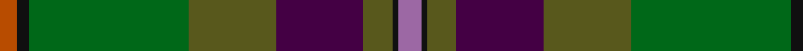
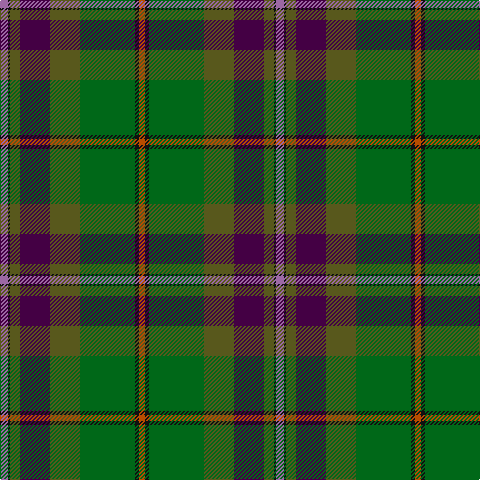

**Bands:** [RKGGBGKR](/stripes/rkggbgkr/) · **Stripes:** [O K G Y DP Y K M](/stripes/stripes8/) O K G Y DP Y K M

This was sourced from house-of-tartan.  It is a [8 band tartan](/bands/bands8/).

Original link http://www.house-of-tartan.scotland.net/house/TartanViewjs.asp?colr=Def&tnam=6814

## Thread count
LP/8 K2 Gb10 DP30 Gb30 G55 K4 DO/6

## Palette
Each colour and its ΔE from the base-6 reference it is a variant of.

| Colour | Shade | Base | ΔE (OKLab) |
|---|---|---|---|
| DG | <code style="background-color:#003820;">#003820</code> `#003820` | G <code style="background-color:#006100;">#006100</code> | 0.15 |
| DO | <code style="background-color:#B84C00;">#B84C00</code> `#B84C00` | R <code style="background-color:#CC0000;">#CC0000</code> | 0.08 |
| DP | <code style="background-color:#440044;">#440044</code> `#440044` | B <code style="background-color:#2A418A;">#2A418A</code> | 0.18 |
| DR | <code style="background-color:#880000;">#880000</code> `#880000` | R <code style="background-color:#CC0000;">#CC0000</code> | 0.15 |
| G | <code style="background-color:#006818;">#006818</code> `#006818` | G <code style="background-color:#006100;">#006100</code> | 0.02 |
| Ga | <code style="background-color:#285800;">#285800</code> `#285800` | G <code style="background-color:#006100;">#006100</code> | 0.03 |
| Gb | <code style="background-color:#58581C;">#58581C</code> `#58581C` | G <code style="background-color:#006100;">#006100</code> | 0.09 |
| K | <code style="background-color:#101010;">#101010</code> `#101010` | K <code style="background-color:#000000;">#000000</code> | 0.17 |
| LP | <code style="background-color:#9C68A4;">#9C68A4</code> `#9C68A4` | R <code style="background-color:#CC0000;">#CC0000</code> | 0.21 |
| LT | <code style="background-color:#8C7038;">#8C7038</code> `#8C7038` | G <code style="background-color:#006100;">#006100</code> | 0.18 |

# Sample pattern

## Nearest tartans

The nearest existing variants by ΔTartan distance.

1. [Aberuchill](/setts/s8/m8k2dy10dp30dy30g55k4lo6/) — ΔT 0.69
1. [Batten of Argyll (Baddenach)](/setts/s8/dp10k2dg10dp30dg30dg55k4r8/) — ΔT 1.02
1. [Batten of Argyll Clan Tartan Tartan Number: 5768. Earliest known date: 2003 The Baddenach family originally emigrated from Argyll, Scotland to Jamestown, Virginia. This can be worn by all of the name or its anglicised variants (Batten, Batton, Battin, Badden etc). IT is also to serve as the official tartan for the St Andrews Legion/St Andrews Legion Pipes & Drums headquartered in Richmond Virginia, whose founder is the designer of this tartan. It may also serve as a tartan for anyone having Scottish ancestors who settled in the Virginia Colony. See products available Copyright © Blair Urquhart, Comrie, 2015](/setts/s8/dp5k1y5dp15dg15g28k2r4~x2/) — ΔT 1.07
1. [Telfer Green](/setts/s8/g7lo2g5dg37db6r16db5b2~x2/) — ΔT 1.08
1. [Isle of Skye](/setts/s11/o20dp2o2dp2o3dp8dg9g8y8dg1lr2~x2/) — ΔT 1.18
1. [Teviotdale](/setts/s8/k5b3dy4ly1db13dy13g29w2~x2/) — ΔT 1.24
1. [Isle of Skye District Tartan Tartan Number: 2155. Earliest known date: 1993 The tartan was instigated and registered by Mrs Rosemary Nicolson Samios in 1992, an Australian of Skye descent, now living in Skye. It was selected through a worldwide competition won by Angus MacLeod from Lewis. Angus, a weaver by trade, produced the first commercial quantities in the traditional kilt weight in 1993 at Lochcarron Weavers in North Strome. The colours of the tartan depict those of the island, often called the 'Misty Isle'. Worn by the Torphican and Bathgate pipe band. (A patented design No. 0600930) See products available Copyright © Blair Urquhart, Comrie, 2015](/setts/s11/dy20dp2dy2dp2dy3dp8dg9g8y8dg1lr2~x2/) — ΔT 1.26
1. [Redgate Htg #1 (Name)](/setts/s9/db1r4db12r1k7y12k7dy21lb1~x2/) — ΔT 1.27
1. [Chisholm Colonial](/setts/s10/dt6w1lo24g6n3g1n3g1n12r1~x2/) — ΔT 1.31
1. [Chan (Name?)](/setts/s8/r2dg13r2dg13k13dt30k1ly2~x2/) — ΔT 1.35

## Neighbour map

Every grey dot is one of 14299 variants placed by the first two principal components of the ΔTartan feature space (44% of its variance). Red is this tartan; blue dots are its nearest — click one to open its page.

<svg viewBox="0 0 640 380" role="img" style="max-width:100%;height:auto;border:1px solid #e0e0e0;border-radius:4px;display:block" xmlns="http://www.w3.org/2000/svg"><image href="/nn/cloud.v1.png" width="640" height="380"/><a href="/setts/s8/m8k2dy10dp30dy30g55k4lo6/"><circle cx="232.4" cy="141.4" r="4" fill="#3465a4"><title>Aberuchill</title></circle></a><a href="/setts/s8/dp10k2dg10dp30dg30dg55k4r8/"><circle cx="255.9" cy="168.0" r="4" fill="#3465a4"><title>Batten of Argyll (Baddenach)</title></circle></a><a href="/setts/s8/dp5k1y5dp15dg15g28k2r4~x2/"><circle cx="201.1" cy="133.3" r="4" fill="#3465a4"><title>Batten of Argyll Clan Tartan Tartan Number: 5768. Earliest known date: 2003 The Baddenach family originally emigrated from Argyll, Scotland to Jamestown, Virginia. This can be worn by all of the name or its anglicised variants (Batten, Batton, Battin, Badden etc). IT is also to serve as the official tartan for the St Andrews Legion/St Andrews Legion Pipes &amp; Drums headquartered in Richmond Virginia, whose founder is the designer of this tartan. It may also serve as a tartan for anyone having Scottish ancestors who settled in the Virginia Colony. See products available Copyright © Blair Urquhart, Comrie, 2015</title></circle></a><a href="/setts/s8/g7lo2g5dg37db6r16db5b2~x2/"><circle cx="285.3" cy="163.1" r="4" fill="#3465a4"><title>Telfer Green</title></circle></a><a href="/setts/s11/o20dp2o2dp2o3dp8dg9g8y8dg1lr2~x2/"><circle cx="192.4" cy="138.2" r="4" fill="#3465a4"><title>Isle of Skye</title></circle></a><a href="/setts/s8/k5b3dy4ly1db13dy13g29w2~x2/"><circle cx="224.0" cy="124.1" r="4" fill="#3465a4"><title>Teviotdale</title></circle></a><a href="/setts/s11/dy20dp2dy2dp2dy3dp8dg9g8y8dg1lr2~x2/"><circle cx="227.8" cy="154.9" r="4" fill="#3465a4"><title>Isle of Skye District Tartan Tartan Number: 2155. Earliest known date: 1993 The tartan was instigated and registered by Mrs Rosemary Nicolson Samios in 1992, an Australian of Skye descent, now living in Skye. It was selected through a worldwide competition won by Angus MacLeod from Lewis. Angus, a weaver by trade, produced the first commercial quantities in the traditional kilt weight in 1993 at Lochcarron Weavers in North Strome. The colours of the tartan depict those of the island, often called the 'Misty Isle'. Worn by the Torphican and Bathgate pipe band. (A patented design No. 0600930) See products available Copyright © Blair Urquhart, Comrie, 2015</title></circle></a><a href="/setts/s9/db1r4db12r1k7y12k7dy21lb1~x2/"><circle cx="191.0" cy="159.6" r="4" fill="#3465a4"><title>Redgate Htg #1 (Name)</title></circle></a><a href="/setts/s10/dt6w1lo24g6n3g1n3g1n12r1~x2/"><circle cx="265.1" cy="127.5" r="4" fill="#3465a4"><title>Chisholm Colonial</title></circle></a><a href="/setts/s8/r2dg13r2dg13k13dt30k1ly2~x2/"><circle cx="284.4" cy="169.2" r="4" fill="#3465a4"><title>Chan (Name?)</title></circle></a><circle cx="243.5" cy="151.0" r="5" fill="#c00000"/></svg>

ID: /setts/s8/m8k2y10dp30y30g55k4o6/
