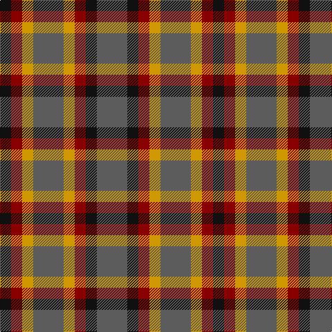

**Bands:** [BKRYBYRK](/stripes/bkrybyrk/) · **Stripes:** [N K R LO N LO R K](/stripes/stripes8/) N K R LO N LO R K

This was sourced from register-of-tartans.  It is a [8 band tartan](/bands/bands8/).

Original link https://www.tartanregister.gov.uk/tartanDetails.aspx?ref=1813

## Register references

External register numbers recorded for this tartan.

- Scottish Register of Tartans: [1813](https://www.tartanregister.gov.uk/tartanDetails.aspx?ref=1813)
- Scottish Tartans Authority (ITI): 2212
- Scottish Tartans World Register: 2212

## Thread count
K/16 DR16 DY16 N44 DY16 DR16 K16 N/44

## Palette
Each colour and its ΔE from the base-6 reference it is a variant of.

| Colour | Shade | Base | ΔE (OKLab) |
|---|---|---|---|
| DR | <code style="background-color:#880000;">#880000</code> `#880000` | R <code style="background-color:#CC0000;">#CC0000</code> | 0.15 |
| DY | <code style="background-color:#D09800;">#D09800</code> `#D09800` | Y <code style="background-color:#F2BF00;">#F2BF00</code> | 0.12 |
| K | <code style="background-color:#101010;">#101010</code> `#101010` | K <code style="background-color:#000000;">#000000</code> | 0.17 |
| N | <code style="background-color:#5C5C5C;">#5C5C5C</code> `#5C5C5C` | B <code style="background-color:#2A418A;">#2A418A</code> | 0.15 |

# Sample pattern

## Nearest tartans

The nearest existing variants by ΔTartan distance.

1. [Holden Monaro Corporate Tartan Tartan Number: 8700. Earliest known date: 1831 Holden Monaro GTS 1978 car seats. Reproduction colours. Warp 162 threads Weft 202 threads. Last weaving went through with slight difference. Sett size = 4 3/8th - 4 3/4 inch (112mm - 120mm) See products available Copyright © Blair Urquhart, Comrie, 2015](/setts/s8/lr10dt3lr3dt3lr3dt11dy11o3~x2/) — ΔT 1.24
1. [Wilson's No.137](/setts/s8/g6dp3k3dp3k3dp3g6r2~x2/) — ΔT 1.29
1. [Stewart (Artefact)](/setts/s7/r2g4db8r9g9k2r2~x4/) — ΔT 1.30
1. [MacDonagh (Name)](/setts/s7/r20dg29db10dg16r6dg10k19~x2/) — ΔT 1.34
1. [Wilson's No.214](/setts/s8/t3k1t1r3g4r3t1k1~x4/) — ΔT 1.40
1. [Stewart/Stuart C18th - Cf 1314 & 4454](/setts/s12/g4db9r9g9k2r2k2g9r9db8g4r2~x4/) — ΔT 1.42
1. [MacDonagh](/setts/s7/r20g29db10g16r6g10k19~x2/) — ΔT 1.42
1. [Gleneagles Group](/setts/s7/r5g6ly2g6r5b6r2~x2/) — ΔT 1.44
1. [Stewart, Plaid](/setts/s7/r2g4db8r9g9k2r2~x2/) — ΔT 1.47
1. [Gleneagles Group](/setts/s7/dr5g6y2g6dr5db6dr2~x2/) — ΔT 1.53

## Neighbour map

Every grey dot is one of 14313 variants placed by the first two principal components of the ΔTartan feature space (44% of its variance). Red is this tartan; blue dots are its nearest — click one to open its page.

<svg viewBox="0 0 640 380" role="img" style="max-width:100%;height:auto;border:1px solid #e0e0e0;border-radius:4px;display:block" xmlns="http://www.w3.org/2000/svg"><image href="/nn/cloud.v1.png" width="640" height="380"/><a href="/setts/s8/lr10dt3lr3dt3lr3dt11dy11o3~x2/"><circle cx="141.5" cy="250.1" r="4" fill="#3465a4"><title>Holden Monaro Corporate Tartan Tartan Number: 8700. Earliest known date: 1831 Holden Monaro GTS 1978 car seats. Reproduction colours. Warp 162 threads Weft 202 threads. Last weaving went through with slight difference. Sett size = 4 3/8th - 4 3/4 inch (112mm - 120mm) See products available Copyright © Blair Urquhart, Comrie, 2015</title></circle></a><a href="/setts/s8/g6dp3k3dp3k3dp3g6r2~x2/"><circle cx="131.8" cy="295.3" r="4" fill="#3465a4"><title>Wilson's No.137</title></circle></a><a href="/setts/s7/r2g4db8r9g9k2r2~x4/"><circle cx="160.1" cy="252.5" r="4" fill="#3465a4"><title>Stewart (Artefact)</title></circle></a><a href="/setts/s7/r20dg29db10dg16r6dg10k19~x2/"><circle cx="209.5" cy="280.2" r="4" fill="#3465a4"><title>MacDonagh (Name)</title></circle></a><a href="/setts/s8/t3k1t1r3g4r3t1k1~x4/"><circle cx="117.4" cy="249.9" r="4" fill="#3465a4"><title>Wilson's No.214</title></circle></a><a href="/setts/s12/g4db9r9g9k2r2k2g9r9db8g4r2~x4/"><circle cx="145.0" cy="238.7" r="4" fill="#3465a4"><title>Stewart/Stuart C18th - Cf 1314 &amp; 4454</title></circle></a><a href="/setts/s7/r20g29db10g16r6g10k19~x2/"><circle cx="197.2" cy="275.5" r="4" fill="#3465a4"><title>MacDonagh</title></circle></a><a href="/setts/s7/r5g6ly2g6r5b6r2~x2/"><circle cx="138.2" cy="310.0" r="4" fill="#3465a4"><title>Gleneagles Group</title></circle></a><a href="/setts/s7/r2g4db8r9g9k2r2~x2/"><circle cx="146.0" cy="246.5" r="4" fill="#3465a4"><title>Stewart, Plaid</title></circle></a><a href="/setts/s7/dr5g6y2g6dr5db6dr2~x2/"><circle cx="131.5" cy="312.1" r="4" fill="#3465a4"><title>Gleneagles Group</title></circle></a><circle cx="174.4" cy="276.5" r="5" fill="#c00000"/></svg>

ID: /setts/s8/n11k4r4lo4n11lo4r4k4~x4/
