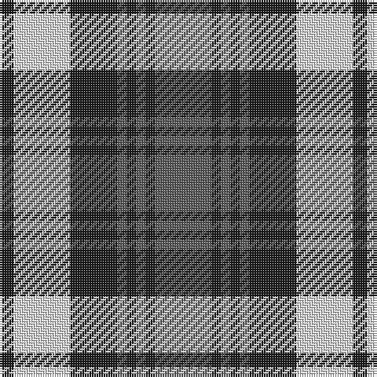

This page is one **sett** — a single exact thread-count. It belongs to the [tartan](/tartans/n12dt2n2dt2n2dt10w12dt3/)
(the same proportion at any scale), whose colour order is pattern [BBBBBBWB](/stripes/bbbbbbwb/).

Sourced from tartans-authority.  It is a [8 stripe tartan](/stripes/stripes8/).

Original link http://www.tartansauthority.com/tartan-ferret/display/1286/

## Register references

External register numbers recorded for this tartan.

- Scottish Tartans Authority (ITI): 1286

## Thread count
N/24 K4 N4 K4 N4 K20 LN24 K/6

## Palette

Palette: <strong>Tartan Register</strong> <small style="color:#888">(2 of 3 colours)</small>
<table><thead><tr><th>Colour</th><th>Threads</th><th>Shade</th><th>Base</th><th>OKLCh</th></tr></thead><tbody><tr><td>N/</td><td style="text-align:right;font-variant-numeric:tabular-nums">24</td><td><code style="background-color:#5C5C5C;">#5C5C5C</code> <small style="color:#888">#5C5C5C</small></td><td>B <code style="background-color:#2A418A;">#2A418A</code></td><td><small style="color:#888">oklch(47.5% 0.000 89.9)</small></td></tr><tr><td>K</td><td style="text-align:right;font-variant-numeric:tabular-nums">4</td><td><code style="background-color:#1C1C1C;">#1C1C1C</code> <small style="color:#888">#1C1C1C</small></td><td>B <code style="background-color:#2A418A;">#2A418A</code></td><td><small style="color:#888">oklch(22.6% 0.000 89.9)</small></td></tr><tr><td>N</td><td style="text-align:right;font-variant-numeric:tabular-nums">4</td><td><code style="background-color:#5C5C5C;">#5C5C5C</code> <small style="color:#888">#5C5C5C</small></td><td>B <code style="background-color:#2A418A;">#2A418A</code></td><td><small style="color:#888">oklch(47.5% 0.000 89.9)</small></td></tr><tr><td>K</td><td style="text-align:right;font-variant-numeric:tabular-nums">4</td><td><code style="background-color:#1C1C1C;">#1C1C1C</code> <small style="color:#888">#1C1C1C</small></td><td>B <code style="background-color:#2A418A;">#2A418A</code></td><td><small style="color:#888">oklch(22.6% 0.000 89.9)</small></td></tr><tr><td>N</td><td style="text-align:right;font-variant-numeric:tabular-nums">4</td><td><code style="background-color:#5C5C5C;">#5C5C5C</code> <small style="color:#888">#5C5C5C</small></td><td>B <code style="background-color:#2A418A;">#2A418A</code></td><td><small style="color:#888">oklch(47.5% 0.000 89.9)</small></td></tr><tr><td>K</td><td style="text-align:right;font-variant-numeric:tabular-nums">20</td><td><code style="background-color:#1C1C1C;">#1C1C1C</code> <small style="color:#888">#1C1C1C</small></td><td>B <code style="background-color:#2A418A;">#2A418A</code></td><td><small style="color:#888">oklch(22.6% 0.000 89.9)</small></td></tr><tr><td>LN</td><td style="text-align:right;font-variant-numeric:tabular-nums">24</td><td><code style="background-color:#E0E0E0;">#E0E0E0</code> <small style="color:#888">#E0E0E0</small></td><td>W <code style="background-color:#F7F7F7;">#F7F7F7</code></td><td><small style="color:#888">oklch(90.7% 0.000 89.9)</small></td></tr><tr><td>K/</td><td style="text-align:right;font-variant-numeric:tabular-nums">6</td><td><code style="background-color:#1C1C1C;">#1C1C1C</code> <small style="color:#888">#1C1C1C</small></td><td>B <code style="background-color:#2A418A;">#2A418A</code></td><td><small style="color:#888">oklch(22.6% 0.000 89.9)</small></td></tr></tbody></table>

# Sample pattern

## Nearest tartans

The nearest existing variants by ΔTartan distance, with this tartan at the top so the swatches line up against it.

ΔTartan

Tartan

Sett

—

<a href="/ttd/edit/#slug=n12dt2n2dt2n2dt10w12dt3~x2">Grey Watch Dress (Fashion)</a> <a class="nn-out" href="/setts/s8/n12dt2n2dt2n2dt10w12dt3~x2/" title="open its dictionary page">↗</a>

0.93

<a href="/ttd/edit/#slug=k11g3k3g3k3g9w18k3~x2">Lamont Dress</a> <a class="nn-out" href="/setts/s8/k11g3k3g3k3g9w18k3~x2/" title="open its dictionary page">↗</a>

1.01

<a href="/ttd/edit/#slug=o6k1o1k1o2k4lo6k1o2k2~x8">Tyndrum</a> <a class="nn-out" href="/setts/s10/o6k1o1k1o2k4lo6k1o2k2~x8/" title="open its dictionary page">↗</a>

1.04

<a href="/ttd/edit/#slug=n12dt2n2dt2n2dt10w12dt3w12dt10n12dt2n2~x2">Grey Watch Dress (1989)</a> <a class="nn-out" href="/setts/s13/n12dt2n2dt2n2dt10w12dt3w12dt10n12dt2n2~x2/" title="open its dictionary page">↗</a>

1.06

<a href="/ttd/edit/#slug=y25k4y4k4y4w20k5w20k20y4k4y4~x2">Grey Watch</a> <a class="nn-out" href="/setts/s12/y25k4y4k4y4w20k5w20k20y4k4y4~x2/" title="open its dictionary page">↗</a>

1.10

<a href="/ttd/edit/#slug=n22k2n2k2n2k16w16k3~x2">Laksaa (Manx)</a> <a class="nn-out" href="/setts/s8/n22k2n2k2n2k16w16k3~x2/" title="open its dictionary page">↗</a>

1.11

<a href="/ttd/edit/#slug=w25k4w4k4w4k23n23w4n23k23w23k4w4~x2">Poulter, Grey (Corporate)</a> <a class="nn-out" href="/setts/s13/w25k4w4k4w4k23n23w4n23k23w23k4w4~x2/" title="open its dictionary page">↗</a>

1.14

<a href="/ttd/edit/#slug=o25k4o4k4o4w20k5w20k20o4k4o4~x2">Grey Watch Trade Tartan Tartan Number: 1286. Earliest known date: pre 2003 From a sample woven by Peter Anderson Ltd, Galashiels. The Gray family can be Septs of either Clan Stewart or Clan Sutherland. A rebel son of the Stewarts changed his name to MacGlashan (anglicised to Gray). In the north the Grays of Sutherland possessed lands at Skibo, Sordell and Ardinish. See products available Copyright © Blair Urquhart, Comrie, 2015</a> <a class="nn-out" href="/setts/s12/o25k4o4k4o4w20k5w20k20o4k4o4~x2/" title="open its dictionary page">↗</a>

1.15

<a href="/ttd/edit/#slug=g6db11w8k4w8k4w8k27w4~x2">Breton District Tartan Tartan Number: 3902. Earliest known date: 2001 Commissioned by Richard Duclos of Le Coudray-Montceaux, France and produced by House of Tartan. See products available Copyright © Blair Urquhart, Comrie, 2015</a> <a class="nn-out" href="/setts/s9/g6db11w8k4w8k4w8k27w4~x2/" title="open its dictionary page">↗</a>

1.16

<a href="/ttd/edit/#slug=y21k2y2k2y2k15w17k3~x2">Laksaa</a> <a class="nn-out" href="/setts/s8/y21k2y2k2y2k15w17k3~x2/" title="open its dictionary page">↗</a>

1.17

<a href="/ttd/edit/#slug=n1lb1n6k6lb1k6lb1n2lb1n3lb1~x2">Clergy (Grey)</a> <a class="nn-out" href="/setts/s11/n1lb1n6k6lb1k6lb1n2lb1n3lb1~x2/" title="open its dictionary page">↗</a>

## Neighbour map

Every grey dot is one of 14359 variants placed by the first two principal components of the ΔTartan feature space (44% of its variance). Red is this tartan; blue dots are its nearest — click one to open its page.

<svg viewBox="0 0 640 380" role="img" style="max-width:100%;height:auto;border:1px solid #e0e0e0;border-radius:4px;display:block" xmlns="http://www.w3.org/2000/svg"><image href="/nn/cloud.v1.png" width="640" height="380"/><a href="/setts/s8/k11g3k3g3k3g9w18k3~x2/"><circle cx="156.3" cy="216.3" r="4" fill="#3465a4"><title>Lamont Dress</title></circle></a><a href="/setts/s10/o6k1o1k1o2k4lo6k1o2k2~x8/"><circle cx="202.7" cy="226.2" r="4" fill="#3465a4"><title>Tyndrum</title></circle></a><a href="/setts/s13/n12dt2n2dt2n2dt10w12dt3w12dt10n12dt2n2~x2/"><circle cx="148.3" cy="203.0" r="4" fill="#3465a4"><title>Grey Watch Dress (1989)</title></circle></a><a href="/setts/s12/y25k4y4k4y4w20k5w20k20y4k4y4~x2/"><circle cx="138.9" cy="187.4" r="4" fill="#3465a4"><title>Grey Watch</title></circle></a><a href="/setts/s8/n22k2n2k2n2k16w16k3~x2/"><circle cx="215.2" cy="183.6" r="4" fill="#3465a4"><title>Laksaa (Manx)</title></circle></a><a href="/setts/s13/w25k4w4k4w4k23n23w4n23k23w23k4w4~x2/"><circle cx="148.7" cy="193.6" r="4" fill="#3465a4"><title>Poulter, Grey (Corporate)</title></circle></a><a href="/setts/s12/o25k4o4k4o4w20k5w20k20o4k4o4~x2/"><circle cx="146.1" cy="188.0" r="4" fill="#3465a4"><title>Grey Watch Trade Tartan Tartan Number: 1286. Earliest known date: pre 2003 From a sample woven by Peter Anderson Ltd, Galashiels. The Gray family can be Septs of either Clan Stewart or Clan Sutherland. A rebel son of the Stewarts changed his name to MacGlashan (anglicised to Gray). In the north the Grays of Sutherland possessed lands at Skibo, Sordell and Ardinish. See products available Copyright © Blair Urquhart, Comrie, 2015</title></circle></a><a href="/setts/s9/g6db11w8k4w8k4w8k27w4~x2/"><circle cx="158.4" cy="192.4" r="4" fill="#3465a4"><title>Breton District Tartan Tartan Number: 3902. Earliest known date: 2001 Commissioned by Richard Duclos of Le Coudray-Montceaux, France and produced by House of Tartan. See products available Copyright © Blair Urquhart, Comrie, 2015</title></circle></a><a href="/setts/s8/y21k2y2k2y2k15w17k3~x2/"><circle cx="194.5" cy="179.3" r="4" fill="#3465a4"><title>Laksaa</title></circle></a><a href="/setts/s11/n1lb1n6k6lb1k6lb1n2lb1n3lb1~x2/"><circle cx="208.5" cy="217.2" r="4" fill="#3465a4"><title>Clergy (Grey)</title></circle></a><circle cx="172.4" cy="218.6" r="5" fill="#c00000"/></svg>

ID: /setts/s8/n12dt2n2dt2n2dt10w12dt3~x2/
