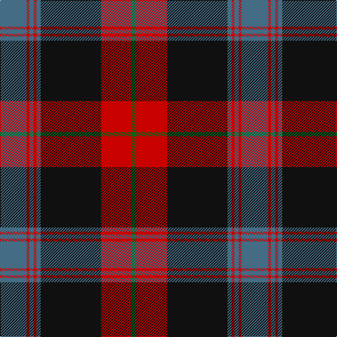

This page is one **sett** — a single exact thread-count. It belongs to the [tartan](/tartans/n19r2n3r2n3k43r22g3/)
(the same proportion at any scale), whose colour order is pattern [BRBRBKRG](/stripes/brbrbkrg/).

Sourced from register-of-tartans.  It is a [8 stripe tartan](/stripes/stripes8/).

Original link https://www.tartanregister.gov.uk/tartanDetails.aspx?ref=580

2 attestations — the source records this cloth was collapsed from (oldest owns this page)

<ul>
<li>01/01/1996 — Carson Red (Personal) (register-of-tartans, <a href="https://www.tartanregister.gov.uk/tartanDetails.aspx?ref=580">record</a>)</li>
<li>1996 — Carson Red (Personal) (tartans-authority, <a href="http://www.tartansauthority.com/tartan-ferret/display/7056/">record</a>)</li>
</ul>

## Register references

External register numbers recorded for this tartan.

- Scottish Register of Tartans: [580](https://www.tartanregister.gov.uk/tartanDetails.aspx?ref=580)
- Scottish Tartans Authority (ITI): 7056

## Thread count
B/38 R4 B6 R4 B6 K86 R44 G/6

## Palette

Palette: <strong>Tartan Register</strong> <small style="color:#888">(3 of 4 colours)</small>
<table><thead><tr><th>Colour</th><th>Threads</th><th>Shade</th><th>Base</th><th>OKLCh</th></tr></thead><tbody><tr><td>B/</td><td style="text-align:right;font-variant-numeric:tabular-nums">38</td><td><code style="background-color:#446C84;">#446C84</code> <small style="color:#888">#446C84</small></td><td>B <code style="background-color:#2A418A;">#2A418A</code></td><td><small style="color:#888">oklch(51.2% 0.059 235.9)</small></td></tr><tr><td>R</td><td style="text-align:right;font-variant-numeric:tabular-nums">4</td><td><code style="background-color:#C80000;">#C80000</code> <small style="color:#888">#C80000</small></td><td>R <code style="background-color:#CC0000;">#CC0000</code></td><td><small style="color:#888">oklch(52.3% 0.215 29.2)</small></td></tr><tr><td>B</td><td style="text-align:right;font-variant-numeric:tabular-nums">6</td><td><code style="background-color:#446C84;">#446C84</code> <small style="color:#888">#446C84</small></td><td>B <code style="background-color:#2A418A;">#2A418A</code></td><td><small style="color:#888">oklch(51.2% 0.059 235.9)</small></td></tr><tr><td>R</td><td style="text-align:right;font-variant-numeric:tabular-nums">4</td><td><code style="background-color:#C80000;">#C80000</code> <small style="color:#888">#C80000</small></td><td>R <code style="background-color:#CC0000;">#CC0000</code></td><td><small style="color:#888">oklch(52.3% 0.215 29.2)</small></td></tr><tr><td>B</td><td style="text-align:right;font-variant-numeric:tabular-nums">6</td><td><code style="background-color:#446C84;">#446C84</code> <small style="color:#888">#446C84</small></td><td>B <code style="background-color:#2A418A;">#2A418A</code></td><td><small style="color:#888">oklch(51.2% 0.059 235.9)</small></td></tr><tr><td>K</td><td style="text-align:right;font-variant-numeric:tabular-nums">86</td><td><code style="background-color:#101010;">#101010</code> <small style="color:#888">#101010</small></td><td>K <code style="background-color:#000000;">#000000</code></td><td><small style="color:#888">oklch(17.3% 0.000 89.9)</small></td></tr><tr><td>R</td><td style="text-align:right;font-variant-numeric:tabular-nums">44</td><td><code style="background-color:#C80000;">#C80000</code> <small style="color:#888">#C80000</small></td><td>R <code style="background-color:#CC0000;">#CC0000</code></td><td><small style="color:#888">oklch(52.3% 0.215 29.2)</small></td></tr><tr><td>G/</td><td style="text-align:right;font-variant-numeric:tabular-nums">6</td><td><code style="background-color:#006818;">#006818</code> <small style="color:#888">#006818</small></td><td>G <code style="background-color:#006100;">#006100</code></td><td><small style="color:#888">oklch(45.0% 0.142 145.0)</small></td></tr></tbody></table>

# Sample pattern

## Nearest tartans

The nearest existing variants by ΔTartan distance, with this tartan at the top so the swatches line up against it.

ΔTartan

Tartan

Sett

—

<a href="/ttd/edit/#slug=n19r2n3r2n3k43r22g3~x2">Carson Red (Personal)</a> <a class="nn-out" href="/setts/s8/n19r2n3r2n3k43r22g3~x2/" title="open its dictionary page">↗</a>

0.74

<a href="/ttd/edit/#slug=db6r1db2r1db2k18r8g2~x4">Brown Family Tartan Tartan Number: 432. Earliest known date: 1850 The Scott Adie collection, a book of manufacturers samples, was recently sold at auction. The book is dated 1850 and the samples are thought to represent the tartans available for purchase between 1840-50. See products available Copyright © Blair Urquhart, Comrie, 2015</a> <a class="nn-out" href="/setts/s8/db6r1db2r1db2k18r8g2~x4/" title="open its dictionary page">↗</a>

0.86

<a href="/ttd/edit/#slug=n3r3k38n25ly3n6r7n3ly2~x2">Greater St Louis Area Firefighters Highland Guard</a> <a class="nn-out" href="/setts/s9/n3r3k38n25ly3n6r7n3ly2~x2/" title="open its dictionary page">↗</a>

0.94

<a href="/ttd/edit/#slug=k8r1k3w5k5w3k5dr23r3~x2">Southdown Tartan Tartan Number: 1194. Earliest known date: pre 2003 Designed for the Glasgow conference in 2002 See products available Copyright © Blair Urquhart, Comrie, 2015</a> <a class="nn-out" href="/setts/s9/k8r1k3w5k5w3k5dr23r3~x2/" title="open its dictionary page">↗</a>

0.98

<a href="/ttd/edit/#slug=g22k3g1k3g2p8m1p8m16~x2">Queen of Scots</a> <a class="nn-out" href="/setts/s9/g22k3g1k3g2p8m1p8m16~x2/" title="open its dictionary page">↗</a>

1.02

<a href="/ttd/edit/#slug=w6k1y28k24dp25y3dp3y3dp3y4~x2">Rennie (Personal)</a> <a class="nn-out" href="/setts/s10/w6k1y28k24dp25y3dp3y3dp3y4~x2/" title="open its dictionary page">↗</a>

1.10

<a href="/ttd/edit/#slug=lr3dg15db18r30dg1r2~x2">Ruthven</a> <a class="nn-out" href="/setts/s6/lr3dg15db18r30dg1r2~x2/" title="open its dictionary page">↗</a>

1.11

<a href="/ttd/edit/#slug=r8dg8k1dg3k1dg1k10r20lb3~x2">Hunter of Bute (Clan ?)</a> <a class="nn-out" href="/setts/s9/r8dg8k1dg3k1dg1k10r20lb3~x2/" title="open its dictionary page">↗</a>

1.16

<a href="/setts/s10/r47g14k5ly2k3g7~x2/">Harbor Club (Corporate)</a>

1.17

<a href="/ttd/edit/#slug=k3r8k3r8lo19r7dt36r3~x2">Private SA Club</a> <a class="nn-out" href="/setts/s8/k3r8k3r8lo19r7dt36r3~x2/" title="open its dictionary page">↗</a>

1.17

<a href="/ttd/edit/#slug=w3dr10k38o11dr6k2w3~x2">Phantom (Corporate)</a> <a class="nn-out" href="/setts/s7/w3dr10k38o11dr6k2w3~x2/" title="open its dictionary page">↗</a>

## Neighbour map

Every grey dot is one of 14359 variants placed by the first two principal components of the ΔTartan feature space (44% of its variance). Red is this tartan; blue dots are its nearest — click one to open its page.

<svg viewBox="0 0 640 380" role="img" style="max-width:100%;height:auto;border:1px solid #e0e0e0;border-radius:4px;display:block" xmlns="http://www.w3.org/2000/svg"><image href="/nn/cloud.v1.png" width="640" height="380"/><a href="/setts/s8/db6r1db2r1db2k18r8g2~x4/"><circle cx="284.4" cy="165.2" r="4" fill="#3465a4"><title>Brown Family Tartan Tartan Number: 432. Earliest known date: 1850 The Scott Adie collection, a book of manufacturers samples, was recently sold at auction. The book is dated 1850 and the samples are thought to represent the tartans available for purchase between 1840-50. See products available Copyright © Blair Urquhart, Comrie, 2015</title></circle></a><a href="/setts/s9/n3r3k38n25ly3n6r7n3ly2~x2/"><circle cx="270.5" cy="145.3" r="4" fill="#3465a4"><title>Greater St Louis Area Firefighters Highland Guard</title></circle></a><a href="/setts/s9/k8r1k3w5k5w3k5dr23r3~x2/"><circle cx="247.3" cy="142.6" r="4" fill="#3465a4"><title>Southdown Tartan Tartan Number: 1194. Earliest known date: pre 2003 Designed for the Glasgow conference in 2002 See products available Copyright © Blair Urquhart, Comrie, 2015</title></circle></a><a href="/setts/s9/g22k3g1k3g2p8m1p8m16~x2/"><circle cx="230.9" cy="149.5" r="4" fill="#3465a4"><title>Queen of Scots</title></circle></a><a href="/setts/s10/w6k1y28k24dp25y3dp3y3dp3y4~x2/"><circle cx="250.6" cy="140.6" r="4" fill="#3465a4"><title>Rennie (Personal)</title></circle></a><a href="/setts/s6/lr3dg15db18r30dg1r2~x2/"><circle cx="300.3" cy="163.6" r="4" fill="#3465a4"><title>Ruthven</title></circle></a><a href="/setts/s9/r8dg8k1dg3k1dg1k10r20lb3~x2/"><circle cx="310.8" cy="161.0" r="4" fill="#3465a4"><title>Hunter of Bute (Clan ?)</title></circle></a><a href="/setts/s10/r47g14k5ly2k3g7~x2/"><circle cx="324.0" cy="139.3" r="4" fill="#3465a4"><title>Harbor Club (Corporate)</title></circle></a><a href="/setts/s8/k3r8k3r8lo19r7dt36r3~x2/"><circle cx="229.0" cy="173.9" r="4" fill="#3465a4"><title>Private SA Club</title></circle></a><a href="/setts/s7/w3dr10k38o11dr6k2w3~x2/"><circle cx="314.2" cy="157.6" r="4" fill="#3465a4"><title>Phantom (Corporate)</title></circle></a><circle cx="284.3" cy="148.4" r="5" fill="#c00000"/></svg>

ID: /setts/s8/n19r2n3r2n3k43r22g3~x2/
