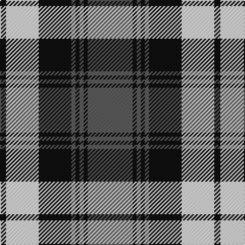

**Bands:** [BKBKBKWK](/stripes/bkbkbkwk/) · **Stripes:** [N K N K N K W K](/stripes/stripes8/) N K N K N K W K

This was sourced from register-of-tartans.  It is a [8 band tartan](/bands/bands8/).

Original link https://www.tartanregister.gov.uk/tartanDetails.aspx?ref=2031

## Attestations

This cloth appears in 2 source records; the oldest owns this page.

- 01/01/1985 — Laksaa (Manx) (register-of-tartans, [record](https://www.tartanregister.gov.uk/tartanDetails.aspx?ref=2031))
- pre 1985 — Laksaa (Manx) (District) (tartans-authority, [record](http://www.tartansauthority.com/tartan-ferret/display/1233/))

## Register references

External register numbers recorded for this tartan.

- Scottish Register of Tartans: [2031](https://www.tartanregister.gov.uk/tartanDetails.aspx?ref=2031)
- Scottish Tartans Authority (ITI): 1233
- Scottish Tartans World Register: 1233

## Thread count
K/6 LN32 K32 N4 K4 N4 K4 N/44

## Palette
Each colour and its ΔE from the base-6 reference it is a variant of.

| Colour | Shade | Base | ΔE (OKLab) |
|---|---|---|---|
| K | <code style="background-color:#101010;">#101010</code> `#101010` | K <code style="background-color:#000000;">#000000</code> | 0.17 |
| LN | <code style="background-color:#E0E0E0;">#E0E0E0</code> `#E0E0E0` | W <code style="background-color:#F7F7F7;">#F7F7F7</code> | 0.07 |
| N | <code style="background-color:#5C5C5C;">#5C5C5C</code> `#5C5C5C` | B <code style="background-color:#2A418A;">#2A418A</code> | 0.15 |

# Sample pattern

## Nearest tartans

The nearest existing variants by ΔTartan distance.

1. [Laksaa](/setts/s8/y21k2y2k2y2k15w17k3~x2/) — ΔT 0.48
1. [Alma College](/setts/s9/g24k3g2k3g4k4m20k3m6~x2/) — ΔT 0.81
1. [Grey Watch Dress (Fashion)](/setts/s8/n12dt2n2dt2n2dt10w12dt3~x2/) — ΔT 1.10
1. [Napier](/setts/s11/k4w2k2w2k2w4k2w2k4db12w1~x4/) — ΔT 1.16
1. [Clark (Clan)](/setts/s11/t2w2t15k15w2k15w2t3w2t7w2~x2/) — ΔT 1.18
1. [Sunderland](/setts/s7/db12w4db1w4r8w2r1~x4/) — ΔT 1.21
1. [Chieftain](/setts/s10/ly1k4db2k10w1db2w10db1w4ly1~x4/) — ΔT 1.22
1. [Swansea City AFC](/setts/s9/k2n2w4n6w27n15k42n2w2/) — ΔT 1.22
1. [Bannock Bane M.407](/setts/s8/db4dy3db21dy2w14o22dy3o4~x2/) — ΔT 1.24
1. [Lindsay Dress](/setts/s9/dg33db4dg4db4dg4db12w33db3w6~x2/) — ΔT 1.25

## Neighbour map

Every grey dot is one of 14313 variants placed by the first two principal components of the ΔTartan feature space (44% of its variance). Red is this tartan; blue dots are its nearest — click one to open its page.

<svg viewBox="0 0 640 380" role="img" style="max-width:100%;height:auto;border:1px solid #e0e0e0;border-radius:4px;display:block" xmlns="http://www.w3.org/2000/svg"><image href="/nn/cloud.v1.png" width="640" height="380"/><a href="/setts/s8/y21k2y2k2y2k15w17k3~x2/"><circle cx="195.2" cy="178.3" r="4" fill="#3465a4"><title>Laksaa</title></circle></a><a href="/setts/s9/g24k3g2k3g4k4m20k3m6~x2/"><circle cx="249.2" cy="174.7" r="4" fill="#3465a4"><title>Alma College</title></circle></a><a href="/setts/s8/n12dt2n2dt2n2dt10w12dt3~x2/"><circle cx="172.9" cy="217.4" r="4" fill="#3465a4"><title>Grey Watch Dress (Fashion)</title></circle></a><a href="/setts/s11/k4w2k2w2k2w4k2w2k4db12w1~x4/"><circle cx="188.8" cy="174.4" r="4" fill="#3465a4"><title>Napier</title></circle></a><a href="/setts/s11/t2w2t15k15w2k15w2t3w2t7w2~x2/"><circle cx="214.9" cy="187.7" r="4" fill="#3465a4"><title>Clark (Clan)</title></circle></a><a href="/setts/s7/db12w4db1w4r8w2r1~x4/"><circle cx="212.4" cy="187.3" r="4" fill="#3465a4"><title>Sunderland</title></circle></a><a href="/setts/s10/ly1k4db2k10w1db2w10db1w4ly1~x4/"><circle cx="173.6" cy="154.9" r="4" fill="#3465a4"><title>Chieftain</title></circle></a><a href="/setts/s9/k2n2w4n6w27n15k42n2w2/"><circle cx="255.6" cy="136.7" r="4" fill="#3465a4"><title>Swansea City AFC</title></circle></a><a href="/setts/s8/db4dy3db21dy2w14o22dy3o4~x2/"><circle cx="159.5" cy="166.9" r="4" fill="#3465a4"><title>Bannock Bane M.407</title></circle></a><a href="/setts/s9/dg33db4dg4db4dg4db12w33db3w6~x2/"><circle cx="213.4" cy="172.9" r="4" fill="#3465a4"><title>Lindsay Dress</title></circle></a><circle cx="215.9" cy="182.7" r="5" fill="#c00000"/></svg>

ID: /setts/s8/n22k2n2k2n2k16w16k3~x2/
