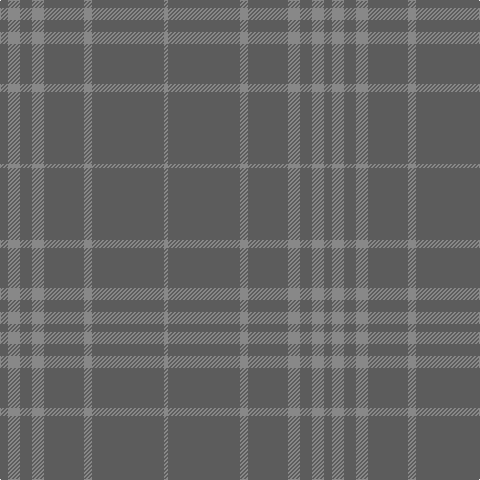

This page is one **sett** — a single exact thread-count. It belongs to the [tartan](/tartans/n2na3n3na3n10na2n18na1/)
(the same proportion at any scale), whose colour order is pattern [BRBRBRBR](/stripes/brbrbrbr/).

Sourced from tartans-authority.  It is a [8 stripe tartan](/stripes/stripes8/).

Original link http://www.tartansauthority.com/tartan-ferret/display/6822/

## Also known as

This cloth is also recorded under:

- Hebridean Mist

3 attestations — the source records this cloth was collapsed from (oldest owns this page)

<ul>
<li>2005 December — Hebridean Cairn (Fashion) (tartans-authority, <a href="http://www.tartansauthority.com/tartan-ferret/display/6822/">record</a>)</li>
<li>2005 December — Hebridean Mist (Fashion) (tartans-authority, <a href="http://www.tartansauthority.com/tartan-ferret/display/6823/">record</a>)</li>
<li>undated — Hebridean Mist Fashion Tartan Tartan Number: 6823. Earliest known date: 2005 For a new House of Edgar Collection in wedding gray. This is the same sett and colours as 6822 but as in Dark Island, the sett has been highlighted in the weaving process by with parts of the patern being woven 'face up' and the remainder 'back up'. To further accentuate the sett, the weft is slightly darker than the warp. Theoretically only one of these setts should be included but we have stretched a point to provide dated documentation for the weaver. See products available Copyright © Blair Urquhart, Comrie, 2015 (house-of-tartan, <a href="http://www.house-of-tartan.scotland.net/house/TartanViewjs.asp?colr=Def&tnam=6823">record</a>)</li>
</ul>

## Thread count
N/8 Na12 N12 Na12 N40 Na8 N72 Na/4

## Palette
Each colour and the base-6 reference it is a variant of.

| Colour | Shade | Base |
|---|---|---|
| N | <code style="background-color:#5C5C5C;">#5C5C5C</code> `oklch(47.5% 0.000 89.9)` <small>#5C5C5C</small> | B <code style="background-color:#2A418A;">#2A418A</code> |
| Na | <code style="background-color:#888888;">#888888</code> `oklch(62.7% 0.000 89.9)` <small>#888888</small> | R <code style="background-color:#CC0000;">#CC0000</code> |

# Sample pattern

## Nearest tartans

The nearest existing variants by ΔTartan distance, with this tartan at the top so the swatches line up against it.

ΔTartan

Tartan

Sett

—

<a href="/ttd/edit/#slug=n2o3n3o3n10o2n18o1~x4">Hebridean Cairn (Fashion)</a> <a class="nn-out" href="/setts/s8/n2o3n3o3n10o2n18o1~x4/" title="open its dictionary page">↗</a>

1.15

<a href="/ttd/edit/#slug=n18o2n10o3n3o3n2o3n3o3n10o2n18o1~x4">Hebridean Cairn</a> <a class="nn-out" href="/setts/s14/n18o2n10o3n3o3n2o3n3o3n10o2n18o1~x4/" title="open its dictionary page">↗</a>

1.55

<a href="/ttd/edit/#slug=n2y3n3y3n10y2n18y1~x4">Hebridean Cairn Fashion Tartan Tartan Number: 6822. Earliest known date: 2005 For a new House of Edgar Collection in wedding gray. See products available Copyright © Blair Urquhart, Comrie, 2015</a> <a class="nn-out" href="/setts/s8/n2y3n3y3n10y2n18y1~x4/" title="open its dictionary page">↗</a>

2.44

<a href="/ttd/edit/#slug=do13k2do38k13do28k8do17k2do17k4do11">Bute Heather, Black (Fashion)</a> <a class="nn-out" href="/setts/s11/do13k2do38k13do28k8do17k2do17k4do11/" title="open its dictionary page">↗</a>

2.83

<a href="/ttd/edit/#slug=lo81g6lo8g8~x2">Young in Australia (Name)</a> <a class="nn-out" href="/setts/s4/lo81g6lo8g8~x2/" title="open its dictionary page">↗</a>

3.04

<a href="/ttd/edit/#slug=do11n1do4n8r1~x8">Cairns, David (Personal)</a> <a class="nn-out" href="/setts/s5/do11n1do4n8r1~x8/" title="open its dictionary page">↗</a>

3.05

<a href="/ttd/edit/#slug=n11o1n4o8r1~x8">Cairns, David (Personal)</a> <a class="nn-out" href="/setts/s5/n11o1n4o8r1~x8/" title="open its dictionary page">↗</a>

3.05

<a href="/ttd/edit/#slug=t4lo15t4lo15t4w2~x2">Takla Makan #2</a> <a class="nn-out" href="/setts/s6/t4lo15t4lo15t4w2~x2/" title="open its dictionary page">↗</a>

3.08

<a href="/ttd/edit/#slug=do5k2do28k10do26k4do4~x2">Dunbar, John Telfer (Personal)</a> <a class="nn-out" href="/setts/s7/do5k2do28k10do26k4do4~x2/" title="open its dictionary page">↗</a>

3.09

<a href="/ttd/edit/#slug=do18k5do34k12do8k8do24k5do24k5do14">Black Shadow</a> <a class="nn-out" href="/setts/s11/do18k5do34k12do8k8do24k5do24k5do14/" title="open its dictionary page">↗</a>

3.13

<a href="/ttd/edit/#slug=y37dy9y3do9dy3~x2">Glen Boig Trade Tartan Tartan Number: 915. Earliest known date: Modern Many new designs have been given district names to promote their Scottish connections. However, these names should not be confused with the District tartans which have earned their title through 'use and wont' and not a little history. See products available Copyright © Blair Urquhart, Comrie, 2015</a> <a class="nn-out" href="/setts/s5/y37dy9y3do9dy3~x2/" title="open its dictionary page">↗</a>

## Neighbour map

Every grey dot is one of 14299 variants placed by the first two principal components of the ΔTartan feature space (44% of its variance). Red is this tartan; blue dots are its nearest — click one to open its page.

<svg viewBox="0 0 640 380" role="img" style="max-width:100%;height:auto;border:1px solid #e0e0e0;border-radius:4px;display:block" xmlns="http://www.w3.org/2000/svg"><image href="/nn/cloud.v1.png" width="640" height="380"/><a href="/setts/s14/n18o2n10o3n3o3n2o3n3o3n10o2n18o1~x4/"><circle cx="626.0" cy="279.9" r="4" fill="#3465a4"><title>Hebridean Cairn</title></circle></a><a href="/setts/s8/n2y3n3y3n10y2n18y1~x4/"><circle cx="626.0" cy="322.6" r="4" fill="#3465a4"><title>Hebridean Cairn Fashion Tartan Tartan Number: 6822. Earliest known date: 2005 For a new House of Edgar Collection in wedding gray. See products available Copyright © Blair Urquhart, Comrie, 2015</title></circle></a><a href="/setts/s11/do13k2do38k13do28k8do17k2do17k4do11/"><circle cx="626.0" cy="298.2" r="4" fill="#3465a4"><title>Bute Heather, Black (Fashion)</title></circle></a><a href="/setts/s4/lo81g6lo8g8~x2/"><circle cx="626.0" cy="314.0" r="4" fill="#3465a4"><title>Young in Australia (Name)</title></circle></a><a href="/setts/s5/do11n1do4n8r1~x8/"><circle cx="545.1" cy="340.1" r="4" fill="#3465a4"><title>Cairns, David (Personal)</title></circle></a><a href="/setts/s5/n11o1n4o8r1~x8/"><circle cx="504.7" cy="311.4" r="4" fill="#3465a4"><title>Cairns, David (Personal)</title></circle></a><a href="/setts/s6/t4lo15t4lo15t4w2~x2/"><circle cx="521.4" cy="315.0" r="4" fill="#3465a4"><title>Takla Makan #2</title></circle></a><a href="/setts/s7/do5k2do28k10do26k4do4~x2/"><circle cx="626.0" cy="356.2" r="4" fill="#3465a4"><title>Dunbar, John Telfer (Personal)</title></circle></a><a href="/setts/s11/do18k5do34k12do8k8do24k5do24k5do14/"><circle cx="599.9" cy="341.0" r="4" fill="#3465a4"><title>Black Shadow</title></circle></a><a href="/setts/s5/y37dy9y3do9dy3~x2/"><circle cx="554.6" cy="298.1" r="4" fill="#3465a4"><title>Glen Boig Trade Tartan Tartan Number: 915. Earliest known date: Modern Many new designs have been given district names to promote their Scottish connections. However, these names should not be confused with the District tartans which have earned their title through 'use and wont' and not a little history. See products available Copyright © Blair Urquhart, Comrie, 2015</title></circle></a><circle cx="626.0" cy="297.9" r="5" fill="#c00000"/></svg>

ID: /setts/s8/n2o3n3o3n10o2n18o1~x4/
