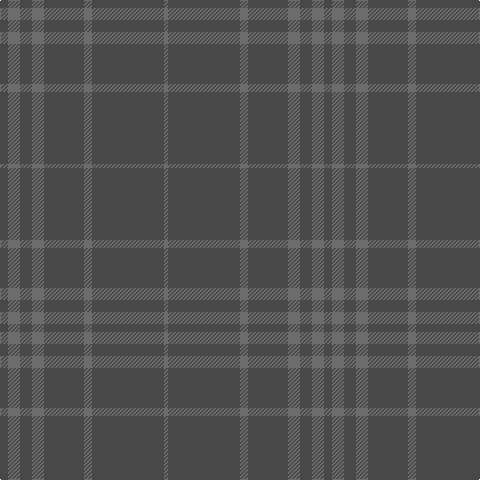

In pattern [BGBGBGBG](/stripes/bgbgbgbg/).

This was sourced from house-of-tartan.  It is a [8 stripe tartan](/stripes/stripes8/).

Original link http://www.house-of-tartan.scotland.net/house/TartanViewjs.asp?colr=Def&tnam=6822

## Thread count
Na/8 Nb12 Na12 Nb12 Na40 Nb8 Na72 Nb/4

## Palette
Each colour and the base-6 reference it is a variant of.

| Colour | Shade | Base |
|---|---|---|
| N | <code style="background-color:#888888;">#888888</code> `oklch(62.7% 0.000 89.9)` <small>#888888</small> | R <code style="background-color:#CC0000;">#CC0000</code> |
| Na | <code style="background-color:#484848;">#484848</code> `oklch(40.2% 0.000 89.9)` <small>#484848</small> | B <code style="background-color:#2A418A;">#2A418A</code> |
| Nb | <code style="background-color:#6C6C6C;">#6C6C6C</code> `oklch(53.1% 0.000 89.9)` <small>#6C6C6C</small> | G <code style="background-color:#006100;">#006100</code> |

# Sample pattern

## Nearest tartans

The nearest existing variants by ΔTartan distance.

1. [Hebridean Cairn (Fashion)](/setts/s8/n2o3n3o3n10o2n18o1~x4/) — ΔT 1.55
1. [Hebridean Cairn](/setts/s14/n18o2n10o3n3o3n2o3n3o3n10o2n18o1~x4/) — ΔT 1.92
1. [Dunbar, John Telfer (Personal)](/setts/s7/do5k2do28k10do26k4do4~x2/) — ΔT 2.09
1. [Young in Australia (Name)](/setts/s4/lo81g6lo8g8~x2/) — ΔT 2.92
1. [STLTH (Corporate)](/setts/s7/dt4k2dt4k45n2k3n2~x2/) — ΔT 2.98
1. [Cairns, David (Personal)](/setts/s5/do11n1do4n8r1~x8/) — ΔT 3.03
1. [Scottish Football Association (Corp)](/setts/s6/k120db4k12dt36dg3k6/) — ΔT 3.09
1. [Ben Dubh (The Black Mount)](/setts/s6/dt4k2dt16k2dt16k1~x4/) — ΔT 3.15
1. [Taiheiyo Club, Inc.](/setts/s7/k46dg6k6dg6k42dg47k12/) — ΔT 3.20
1. [Bute Heather, Black (Fashion)](/setts/s11/do13k2do38k13do28k8do17k2do17k4do11/) — ΔT 3.22

## Neighbour map

Every grey dot is one of 14299 variants placed by the first two principal components of the ΔTartan feature space (44% of its variance). Red is this tartan; blue dots are its nearest — click one to open its page.

<svg viewBox="0 0 640 380" role="img" style="max-width:100%;height:auto;border:1px solid #e0e0e0;border-radius:4px;display:block" xmlns="http://www.w3.org/2000/svg"><image href="/nn/cloud.v1.png" width="640" height="380"/><a href="/setts/s8/n2o3n3o3n10o2n18o1~x4/"><circle cx="626.0" cy="297.9" r="4" fill="#3465a4"><title>Hebridean Cairn (Fashion)</title></circle></a><a href="/setts/s14/n18o2n10o3n3o3n2o3n3o3n10o2n18o1~x4/"><circle cx="626.0" cy="279.9" r="4" fill="#3465a4"><title>Hebridean Cairn</title></circle></a><a href="/setts/s7/do5k2do28k10do26k4do4~x2/"><circle cx="626.0" cy="356.2" r="4" fill="#3465a4"><title>Dunbar, John Telfer (Personal)</title></circle></a><a href="/setts/s4/lo81g6lo8g8~x2/"><circle cx="626.0" cy="314.0" r="4" fill="#3465a4"><title>Young in Australia (Name)</title></circle></a><a href="/setts/s7/dt4k2dt4k45n2k3n2~x2/"><circle cx="626.0" cy="265.5" r="4" fill="#3465a4"><title>STLTH (Corporate)</title></circle></a><a href="/setts/s5/do11n1do4n8r1~x8/"><circle cx="545.1" cy="340.1" r="4" fill="#3465a4"><title>Cairns, David (Personal)</title></circle></a><a href="/setts/s6/k120db4k12dt36dg3k6/"><circle cx="626.0" cy="264.9" r="4" fill="#3465a4"><title>Scottish Football Association (Corp)</title></circle></a><a href="/setts/s6/dt4k2dt16k2dt16k1~x4/"><circle cx="626.0" cy="366.0" r="4" fill="#3465a4"><title>Ben Dubh (The Black Mount)</title></circle></a><a href="/setts/s7/k46dg6k6dg6k42dg47k12/"><circle cx="576.1" cy="366.0" r="4" fill="#3465a4"><title>Taiheiyo Club, Inc.</title></circle></a><a href="/setts/s11/do13k2do38k13do28k8do17k2do17k4do11/"><circle cx="626.0" cy="298.2" r="4" fill="#3465a4"><title>Bute Heather, Black (Fashion)</title></circle></a><circle cx="626.0" cy="322.6" r="5" fill="#c00000"/></svg>

ID: /setts/s8/n2y3n3y3n10y2n18y1~x4/
