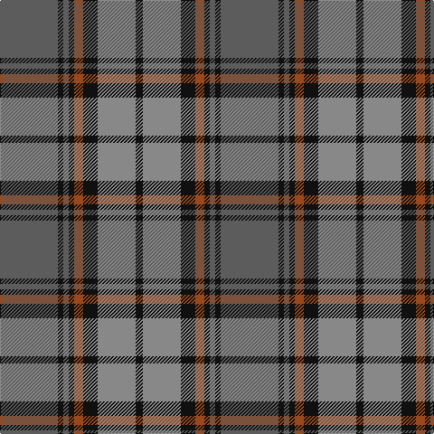

This page is one **sett** — a single exact thread-count. It belongs to the [tartan](/tartans/n32k3n3k3o5k8o21k4/)
(the same proportion at any scale), whose colour order is pattern [BKBKRKRK](/stripes/bkbkrkrk/).

Sourced from tartans-authority.  It is a [8 stripe tartan](/stripes/stripes8/).

Original link http://www.tartansauthority.com/tartan-ferret/display/8972/

## Thread count
N/64 K6 N6 K6 T10 K16 Na42 K/8

## Palette

Palette: <strong>Tartan Register</strong> <small style="color:#888">(3 of 4 colours)</small>
<table><thead><tr><th>Colour</th><th>Threads</th><th>Shade</th><th>Base</th><th>OKLCh</th></tr></thead><tbody><tr><td>N/</td><td style="text-align:right;font-variant-numeric:tabular-nums">64</td><td><code style="background-color:#5C5C5C;">#5C5C5C</code> <small style="color:#888">#5C5C5C</small></td><td>B <code style="background-color:#2A418A;">#2A418A</code></td><td><small style="color:#888">oklch(47.5% 0.000 89.9)</small></td></tr><tr><td>K</td><td style="text-align:right;font-variant-numeric:tabular-nums">6</td><td><code style="background-color:#101010;">#101010</code> <small style="color:#888">#101010</small></td><td>K <code style="background-color:#000000;">#000000</code></td><td><small style="color:#888">oklch(17.3% 0.000 89.9)</small></td></tr><tr><td>N</td><td style="text-align:right;font-variant-numeric:tabular-nums">6</td><td><code style="background-color:#5C5C5C;">#5C5C5C</code> <small style="color:#888">#5C5C5C</small></td><td>B <code style="background-color:#2A418A;">#2A418A</code></td><td><small style="color:#888">oklch(47.5% 0.000 89.9)</small></td></tr><tr><td>K</td><td style="text-align:right;font-variant-numeric:tabular-nums">6</td><td><code style="background-color:#101010;">#101010</code> <small style="color:#888">#101010</small></td><td>K <code style="background-color:#000000;">#000000</code></td><td><small style="color:#888">oklch(17.3% 0.000 89.9)</small></td></tr><tr><td>T</td><td style="text-align:right;font-variant-numeric:tabular-nums">10</td><td><code style="background-color:#98481C;">#98481C</code> <small style="color:#888">#98481C</small></td><td>R <code style="background-color:#CC0000;">#CC0000</code></td><td><small style="color:#888">oklch(49.6% 0.121 46.1)</small></td></tr><tr><td>K</td><td style="text-align:right;font-variant-numeric:tabular-nums">16</td><td><code style="background-color:#101010;">#101010</code> <small style="color:#888">#101010</small></td><td>K <code style="background-color:#000000;">#000000</code></td><td><small style="color:#888">oklch(17.3% 0.000 89.9)</small></td></tr><tr><td>Na</td><td style="text-align:right;font-variant-numeric:tabular-nums">42</td><td><code style="background-color:#888888;">#888888</code> <small style="color:#888">#888888</small></td><td>R <code style="background-color:#CC0000;">#CC0000</code></td><td><small style="color:#888">oklch(62.7% 0.000 89.9)</small></td></tr><tr><td>K/</td><td style="text-align:right;font-variant-numeric:tabular-nums">8</td><td><code style="background-color:#101010;">#101010</code> <small style="color:#888">#101010</small></td><td>K <code style="background-color:#000000;">#000000</code></td><td><small style="color:#888">oklch(17.3% 0.000 89.9)</small></td></tr></tbody></table>

# Sample pattern

## Nearest tartans

The nearest existing variants by ΔTartan distance, with this tartan at the top so the swatches line up against it.

ΔTartan

Tartan

Sett

—

<a href="/ttd/edit/#slug=n32k3n3k3o5k8o21k4~x2">Speyside Grey (Fashion)</a> <a class="nn-out" href="/setts/s8/n32k3n3k3o5k8o21k4~x2/" title="open its dictionary page">↗</a>

0.33

<a href="/ttd/edit/#slug=n32k3n3k3b5k8o21k4~x2">Speyside Blue (Fashion)</a> <a class="nn-out" href="/setts/s8/n32k3n3k3b5k8o21k4~x2/" title="open its dictionary page">↗</a>

0.79

<a href="/ttd/edit/#slug=db4o17db4y4db2y4db4y27db4ly4~x2">Cape Breton University Chemistry Society</a> <a class="nn-out" href="/setts/s10/db4o17db4y4db2y4db4y27db4ly4~x2/" title="open its dictionary page">↗</a>

0.83

<a href="/ttd/edit/#slug=y5dt2y18lo2dt5lo2o5dt17y2lo4~x2">Antrim, County</a> <a class="nn-out" href="/setts/s10/y5dt2y18lo2dt5lo2o5dt17y2lo4~x2/" title="open its dictionary page">↗</a>

0.89

<a href="/ttd/edit/#slug=g28r12g4db20lo2db3lo2db3g7~x2">Cork Irish County Tartan Tartan Number: 2253. Earliest known date: 1996 One of a series of Irish District tartans designed by Polly Wittering of the House of Edgar, with colours reminiscent of the Country with soft warm colours dominating. See products available Copyright © Blair Urquhart, Comrie, 2015</a> <a class="nn-out" href="/setts/s9/g28r12g4db20lo2db3lo2db3g7~x2/" title="open its dictionary page">↗</a>

1.01

<a href="/ttd/edit/#slug=r1o1m1o7dg7m1dg1m1~x6">Beck-McSorley</a> <a class="nn-out" href="/setts/s8/r1o1m1o7dg7m1dg1m1~x6/" title="open its dictionary page">↗</a>

1.03

<a href="/ttd/edit/#slug=k5o5k5o34do33k6do5t2">Brave for Men</a> <a class="nn-out" href="/setts/s8/k5o5k5o34do33k6do5t2/" title="open its dictionary page">↗</a>

1.05

<a href="/ttd/edit/#slug=db12r1db1r1db1r4g12ly1g2~x4">Durie (Clan)</a> <a class="nn-out" href="/setts/s9/db12r1db1r1db1r4g12ly1g2~x4/" title="open its dictionary page">↗</a>

1.09

<a href="/ttd/edit/#slug=r4t3r32db30r4dg32r3dg32r3dg3~x2">Unidentified Plaid #15</a> <a class="nn-out" href="/setts/s10/r4t3r32db30r4dg32r3dg32r3dg3~x2/" title="open its dictionary page">↗</a>

1.09

<a href="/ttd/edit/#slug=k1n1k1n7dy7k1dy1lt1~x6">Auld Lang Syne</a> <a class="nn-out" href="/setts/s8/k1n1k1n7dy7k1dy1lt1~x6/" title="open its dictionary page">↗</a>

1.09

<a href="/ttd/edit/#slug=y19k2w2k2n5k2n5~x4">Kyle</a> <a class="nn-out" href="/setts/s7/y19k2w2k2n5k2n5~x4/" title="open its dictionary page">↗</a>

## Neighbour map

Every grey dot is one of 14299 variants placed by the first two principal components of the ΔTartan feature space (44% of its variance). Red is this tartan; blue dots are its nearest — click one to open its page.

<svg viewBox="0 0 640 380" role="img" style="max-width:100%;height:auto;border:1px solid #e0e0e0;border-radius:4px;display:block" xmlns="http://www.w3.org/2000/svg"><image href="/nn/cloud.v1.png" width="640" height="380"/><a href="/setts/s8/n32k3n3k3b5k8o21k4~x2/"><circle cx="267.1" cy="197.7" r="4" fill="#3465a4"><title>Speyside Blue (Fashion)</title></circle></a><a href="/setts/s10/db4o17db4y4db2y4db4y27db4ly4~x2/"><circle cx="280.9" cy="175.4" r="4" fill="#3465a4"><title>Cape Breton University Chemistry Society</title></circle></a><a href="/setts/s10/y5dt2y18lo2dt5lo2o5dt17y2lo4~x2/"><circle cx="249.3" cy="206.2" r="4" fill="#3465a4"><title>Antrim, County</title></circle></a><a href="/setts/s9/g28r12g4db20lo2db3lo2db3g7~x2/"><circle cx="303.8" cy="192.7" r="4" fill="#3465a4"><title>Cork Irish County Tartan Tartan Number: 2253. Earliest known date: 1996 One of a series of Irish District tartans designed by Polly Wittering of the House of Edgar, with colours reminiscent of the Country with soft warm colours dominating. See products available Copyright © Blair Urquhart, Comrie, 2015</title></circle></a><a href="/setts/s8/r1o1m1o7dg7m1dg1m1~x6/"><circle cx="235.7" cy="203.5" r="4" fill="#3465a4"><title>Beck-McSorley</title></circle></a><a href="/setts/s8/k5o5k5o34do33k6do5t2/"><circle cx="310.2" cy="188.0" r="4" fill="#3465a4"><title>Brave for Men</title></circle></a><a href="/setts/s9/db12r1db1r1db1r4g12ly1g2~x4/"><circle cx="267.4" cy="182.6" r="4" fill="#3465a4"><title>Durie (Clan)</title></circle></a><a href="/setts/s10/r4t3r32db30r4dg32r3dg32r3dg3~x2/"><circle cx="266.1" cy="183.6" r="4" fill="#3465a4"><title>Unidentified Plaid #15</title></circle></a><a href="/setts/s8/k1n1k1n7dy7k1dy1lt1~x6/"><circle cx="243.9" cy="216.0" r="4" fill="#3465a4"><title>Auld Lang Syne</title></circle></a><a href="/setts/s7/y19k2w2k2n5k2n5~x4/"><circle cx="292.9" cy="192.6" r="4" fill="#3465a4"><title>Kyle</title></circle></a><circle cx="270.3" cy="197.1" r="5" fill="#c00000"/></svg>

ID: /setts/s8/n32k3n3k3o5k8o21k4~x2/
