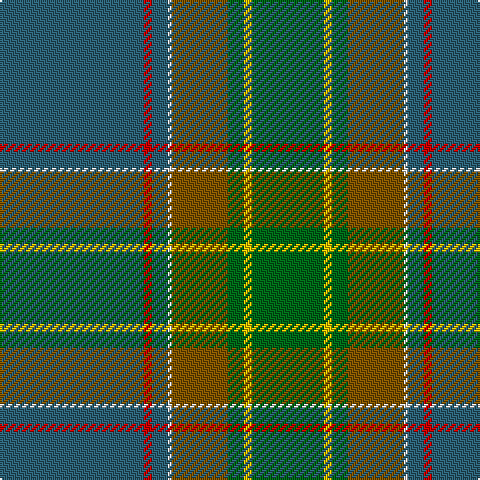

This page is one **sett** — a single exact thread-count. It belongs to the [tartan](/tartans/n36r2n4w1y14g4ly2g18/)
(the same proportion at any scale), whose colour order is pattern [BRBWGGYG](/stripes/brbwggyg/).

Sourced from register-of-tartans.  It is a [8 stripe tartan](/stripes/stripes8/).

Original link https://www.tartanregister.gov.uk/tartanDetails.aspx?ref=4794

2 attestations — the source records this cloth was collapsed from (oldest owns this page)

<ul>
<li>01/02/1997 — Yorkland (Personal) (register-of-tartans, <a href="https://www.tartanregister.gov.uk/tartanDetails.aspx?ref=4794">record</a>)</li>
<li>1997 — Yorkland (Fashion) (tartans-authority, <a href="http://www.tartansauthority.com/tartan-ferret/display/2370/">record</a>)</li>
</ul>

## Register references

External register numbers recorded for this tartan.

- Scottish Register of Tartans: [4794](https://www.tartanregister.gov.uk/tartanDetails.aspx?ref=4794)
- Scottish Tartans Authority (ITI): 2370
- Scottish Tartans World Register: 2370

## Thread count
B/72 R4 B8 LN2 T28 G8 Y4 G/36

## Palette

Palette: <strong>Tartan Register</strong> <small style="color:#888">(4 of 6 colours)</small>
<table><thead><tr><th>Colour</th><th>Threads</th><th>Shade</th><th>Base</th><th>OKLCh</th></tr></thead><tbody><tr><td>B/</td><td style="text-align:right;font-variant-numeric:tabular-nums">72</td><td><code style="background-color:#2C6074;">#2C6074</code> <small style="color:#888">#2C6074</small></td><td>B <code style="background-color:#2A418A;">#2A418A</code></td><td><small style="color:#888">oklch(46.2% 0.064 225.9)</small></td></tr><tr><td>R</td><td style="text-align:right;font-variant-numeric:tabular-nums">4</td><td><code style="background-color:#C80000;">#C80000</code> <small style="color:#888">#C80000</small></td><td>R <code style="background-color:#CC0000;">#CC0000</code></td><td><small style="color:#888">oklch(52.3% 0.215 29.2)</small></td></tr><tr><td>B</td><td style="text-align:right;font-variant-numeric:tabular-nums">8</td><td><code style="background-color:#2C6074;">#2C6074</code> <small style="color:#888">#2C6074</small></td><td>B <code style="background-color:#2A418A;">#2A418A</code></td><td><small style="color:#888">oklch(46.2% 0.064 225.9)</small></td></tr><tr><td>LN</td><td style="text-align:right;font-variant-numeric:tabular-nums">2</td><td><code style="background-color:#E0E0E0;">#E0E0E0</code> <small style="color:#888">#E0E0E0</small></td><td>W <code style="background-color:#F7F7F7;">#F7F7F7</code></td><td><small style="color:#888">oklch(90.7% 0.000 89.9)</small></td></tr><tr><td>T</td><td style="text-align:right;font-variant-numeric:tabular-nums">28</td><td><code style="background-color:#805400;">#805400</code> <small style="color:#888">#805400</small></td><td>G <code style="background-color:#006100;">#006100</code></td><td><small style="color:#888">oklch(48.3% 0.102 74.1)</small></td></tr><tr><td>G</td><td style="text-align:right;font-variant-numeric:tabular-nums">8</td><td><code style="background-color:#006818;">#006818</code> <small style="color:#888">#006818</small></td><td>G <code style="background-color:#006100;">#006100</code></td><td><small style="color:#888">oklch(45.0% 0.142 145.0)</small></td></tr><tr><td>Y</td><td style="text-align:right;font-variant-numeric:tabular-nums">4</td><td><code style="background-color:#E8C000;">#E8C000</code> <small style="color:#888">#E8C000</small></td><td>Y <code style="background-color:#F2BF00;">#F2BF00</code></td><td><small style="color:#888">oklch(81.9% 0.168 93.7)</small></td></tr><tr><td>G/</td><td style="text-align:right;font-variant-numeric:tabular-nums">36</td><td><code style="background-color:#006818;">#006818</code> <small style="color:#888">#006818</small></td><td>G <code style="background-color:#006100;">#006100</code></td><td><small style="color:#888">oklch(45.0% 0.142 145.0)</small></td></tr></tbody></table>

# Sample pattern

## Nearest tartans

The nearest existing variants by ΔTartan distance, with this tartan at the top so the swatches line up against it.

ΔTartan

Tartan

Sett

—

<a href="/ttd/edit/#slug=n36r2n4w1y14g4ly2g18~x2">Yorkland (Personal)</a> <a class="nn-out" href="/setts/s8/n36r2n4w1y14g4ly2g18~x2/" title="open its dictionary page">↗</a>

1.26

<a href="/ttd/edit/#slug=dp4g4y2w3g27y30ly1r3~x2">Hannigan of Dirleton (Personal)</a> <a class="nn-out" href="/setts/s8/dp4g4y2w3g27y30ly1r3~x2/" title="open its dictionary page">↗</a>

1.34

<a href="/ttd/edit/#slug=dgi28dg6dt4dg6dgi5dp4dgi5dt11k1w2~x2">Camenisch Enveglan Family (Personal)</a> <a class="nn-out" href="/setts/s10/dgi28dg6dt4dg6dgi5dp4dgi5dt11k1w2~x2/" title="open its dictionary page">↗</a>

1.51

<a href="/ttd/edit/#slug=g33b4g4b4g5g13dg13dp13dg2b11dg1o2~x2">Highlander</a> <a class="nn-out" href="/setts/s12/g33b4g4b4g5g13dg13dp13dg2b11dg1o2~x2/" title="open its dictionary page">↗</a>

1.52

<a href="/ttd/edit/#slug=o4dg2o7n30o8n7g5dg1w2~x2">Inchforth (Personal)</a> <a class="nn-out" href="/setts/s9/o4dg2o7n30o8n7g5dg1w2~x2/" title="open its dictionary page">↗</a>

1.57

<a href="/ttd/edit/#slug=n8o4lb2o4n1o12g9n24r4~x2">Willsher Wedding (Personal)</a> <a class="nn-out" href="/setts/s9/n8o4lb2o4n1o12g9n24r4~x2/" title="open its dictionary page">↗</a>

1.69

<a href="/ttd/edit/#slug=o6w1o24db6g2db1g2db1g12r1~x2">Chisholm hunting</a> <a class="nn-out" href="/setts/s10/o6w1o24db6g2db1g2db1g12r1~x2/" title="open its dictionary page">↗</a>

1.72

<a href="/ttd/edit/#slug=dy6w1dy24db6g2db1g2db1g12r1~x2">Chisholm Hunting Clan Tartan Tartan Number: 1458. Earliest known date: 1906 This is a classic example of the process that began during the late Victorian period when the new analine dyes of the 1860s were considered to be too bright. Subtler forms of the tartan were produced, often replacing the red ground with green or brown. See products available Copyright © Blair Urquhart, Comrie, 2015</a> <a class="nn-out" href="/setts/s10/dy6w1dy24db6g2db1g2db1g12r1~x2/" title="open its dictionary page">↗</a>

1.73

<a href="/setts/s14/dp4g4y2w3g27y30ly1r3~x2/">Hannigan of Dirleton (Personal)</a>

1.73

<a href="/ttd/edit/#slug=dg2lo6g24r2y2dg1y6dg10g2~x2">Fitzgibbon (Name)</a> <a class="nn-out" href="/setts/s9/dg2lo6g24r2y2dg1y6dg10g2~x2/" title="open its dictionary page">↗</a>

1.76

<a href="/setts/s9/lb2dg2ni1dg30n10ni20dg1ni2lo1~x2/">Scottish Borderland (Fashion)</a>

## Neighbour map

Every grey dot is one of 14359 variants placed by the first two principal components of the ΔTartan feature space (44% of its variance). Red is this tartan; blue dots are its nearest — click one to open its page.

<svg viewBox="0 0 640 380" role="img" style="max-width:100%;height:auto;border:1px solid #e0e0e0;border-radius:4px;display:block" xmlns="http://www.w3.org/2000/svg"><image href="/nn/cloud.v1.png" width="640" height="380"/><a href="/setts/s8/dp4g4y2w3g27y30ly1r3~x2/"><circle cx="332.8" cy="146.3" r="4" fill="#3465a4"><title>Hannigan of Dirleton (Personal)</title></circle></a><a href="/setts/s10/dgi28dg6dt4dg6dgi5dp4dgi5dt11k1w2~x2/"><circle cx="347.1" cy="165.6" r="4" fill="#3465a4"><title>Camenisch Enveglan Family (Personal)</title></circle></a><a href="/setts/s12/g33b4g4b4g5g13dg13dp13dg2b11dg1o2~x2/"><circle cx="370.0" cy="166.4" r="4" fill="#3465a4"><title>Highlander</title></circle></a><a href="/setts/s9/o4dg2o7n30o8n7g5dg1w2~x2/"><circle cx="408.5" cy="160.6" r="4" fill="#3465a4"><title>Inchforth (Personal)</title></circle></a><a href="/setts/s9/n8o4lb2o4n1o12g9n24r4~x2/"><circle cx="349.2" cy="189.8" r="4" fill="#3465a4"><title>Willsher Wedding (Personal)</title></circle></a><a href="/setts/s10/o6w1o24db6g2db1g2db1g12r1~x2/"><circle cx="382.3" cy="151.9" r="4" fill="#3465a4"><title>Chisholm hunting</title></circle></a><a href="/setts/s10/dy6w1dy24db6g2db1g2db1g12r1~x2/"><circle cx="389.7" cy="159.4" r="4" fill="#3465a4"><title>Chisholm Hunting Clan Tartan Tartan Number: 1458. Earliest known date: 1906 This is a classic example of the process that began during the late Victorian period when the new analine dyes of the 1860s were considered to be too bright. Subtler forms of the tartan were produced, often replacing the red ground with green or brown. See products available Copyright © Blair Urquhart, Comrie, 2015</title></circle></a><a href="/setts/s14/dp4g4y2w3g27y30ly1r3~x2/"><circle cx="354.1" cy="137.7" r="4" fill="#3465a4"><title>Hannigan of Dirleton (Personal)</title></circle></a><a href="/setts/s9/dg2lo6g24r2y2dg1y6dg10g2~x2/"><circle cx="328.9" cy="171.5" r="4" fill="#3465a4"><title>Fitzgibbon (Name)</title></circle></a><a href="/setts/s9/lb2dg2ni1dg30n10ni20dg1ni2lo1~x2/"><circle cx="415.0" cy="184.6" r="4" fill="#3465a4"><title>Scottish Borderland (Fashion)</title></circle></a><circle cx="364.2" cy="154.5" r="5" fill="#c00000"/></svg>

ID: /setts/s8/n36r2n4w1y14g4ly2g18~x2/
