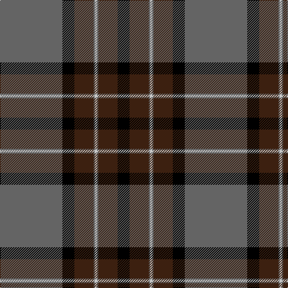

In pattern [BKBBWBBK](/stripes/bkbbwbbk/).

This was sourced from register-of-tartans.  It is a [8 stripe tartan](/stripes/stripes8/).

Original link https://www.tartanregister.gov.uk/tartanDetails.aspx?ref=4513

## Register references

External register numbers recorded for this tartan.

- Scottish Register of Tartans: [4513](https://www.tartanregister.gov.uk/tartanDetails.aspx?ref=4513)
- Scottish Tartans Authority (ITI): 4317

## Thread count
N/104 K20 Ka32 N2 Na4 N2 Ka32 K/20

## Palette
Each colour and its ΔE from the base-6 reference it is a variant of.

| Colour | Shade | Base | ΔE (OKLab) |
|---|---|---|---|
| K | <code style="background-color:#000000;">#000000</code> `#000000` | K <code style="background-color:#000000;">#000000</code> | 0.00 |
| Ka | <code style="background-color:#3C2010;">#3C2010</code> `#3C2010` | B <code style="background-color:#2A418A;">#2A418A</code> | 0.21 |
| N | <code style="background-color:#646464;">#646464</code> `#646464` | B <code style="background-color:#2A418A;">#2A418A</code> | 0.16 |
| Na | <code style="background-color:#C8C8C8;">#C8C8C8</code> `#C8C8C8` | W <code style="background-color:#F7F7F7;">#F7F7F7</code> | 0.14 |

# Sample pattern

## Nearest tartans

The nearest existing variants by ΔTartan distance.

1. [Cirse 3D](/setts/s8/lo8n5r1n15k2lo1k36n1~x2/) — ΔT 0.86
1. [Black Thistle](/setts/s9/b10k6g42k2g1k2r1k24r2~x2/) — ΔT 1.19
1. [MacDiarmid #2](/setts/s8/k83r16dg56k2w5k2dg56r5~x2/) — ΔT 1.21
1. [Hot Boontjie](/setts/s8/r4k32dg18k1w2k1dg4m4~x2/) — ΔT 1.27
1. [Kunbi](/setts/s8/k76dt11k3ly6k3dt13k11o76/) — ΔT 1.28
1. [MacEvil (Corporate)](/setts/s8/r35w8k85o6k4o14k2dp4/) — ΔT 1.36
1. [Distripress (Corporate)](/setts/s8/r6k1w4k4n15r1k35o2~x2/) — ΔT 1.38
1. [Unidentified (School)](/setts/s9/y35k3db2k5db3k1db20k3w3~x2/) — ΔT 1.38
1. [Midnight Balmoral (Fashion)](/setts/s9/o4w1k36db2r4w1db14r8w1~x2/) — ΔT 1.43
1. [MacDiarmid](/setts/s9/k12r2k28dg12k1w3k1dg12r4~x2/) — ΔT 1.44

## Neighbour map

Every grey dot is one of 14299 variants placed by the first two principal components of the ΔTartan feature space (44% of its variance). Red is this tartan; blue dots are its nearest — click one to open its page.

<svg viewBox="0 0 640 380" role="img" style="max-width:100%;height:auto;border:1px solid #e0e0e0;border-radius:4px;display:block" xmlns="http://www.w3.org/2000/svg"><image href="/nn/cloud.v1.png" width="640" height="380"/><a href="/setts/s8/lo8n5r1n15k2lo1k36n1~x2/"><circle cx="377.4" cy="131.7" r="4" fill="#3465a4"><title>Cirse 3D</title></circle></a><a href="/setts/s9/b10k6g42k2g1k2r1k24r2~x2/"><circle cx="336.5" cy="118.8" r="4" fill="#3465a4"><title>Black Thistle</title></circle></a><a href="/setts/s8/k83r16dg56k2w5k2dg56r5~x2/"><circle cx="358.6" cy="151.7" r="4" fill="#3465a4"><title>MacDiarmid #2</title></circle></a><a href="/setts/s8/r4k32dg18k1w2k1dg4m4~x2/"><circle cx="340.1" cy="130.4" r="4" fill="#3465a4"><title>Hot Boontjie</title></circle></a><a href="/setts/s8/k76dt11k3ly6k3dt13k11o76/"><circle cx="298.7" cy="139.4" r="4" fill="#3465a4"><title>Kunbi</title></circle></a><a href="/setts/s8/r35w8k85o6k4o14k2dp4/"><circle cx="362.6" cy="98.6" r="4" fill="#3465a4"><title>MacEvil (Corporate)</title></circle></a><a href="/setts/s8/r6k1w4k4n15r1k35o2~x2/"><circle cx="355.5" cy="110.0" r="4" fill="#3465a4"><title>Distripress (Corporate)</title></circle></a><a href="/setts/s9/y35k3db2k5db3k1db20k3w3~x2/"><circle cx="332.0" cy="130.7" r="4" fill="#3465a4"><title>Unidentified (School)</title></circle></a><a href="/setts/s9/o4w1k36db2r4w1db14r8w1~x2/"><circle cx="328.8" cy="111.3" r="4" fill="#3465a4"><title>Midnight Balmoral (Fashion)</title></circle></a><a href="/setts/s9/k12r2k28dg12k1w3k1dg12r4~x2/"><circle cx="352.3" cy="157.8" r="4" fill="#3465a4"><title>MacDiarmid</title></circle></a><circle cx="346.2" cy="124.4" r="5" fill="#c00000"/></svg>

ID: /setts/s8/n52k10do16n1lb2~x2/
