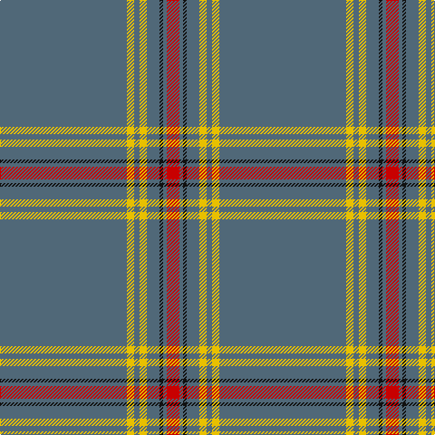

This page is one **sett** — a single exact thread-count. It belongs to the [tartan](/tartans/n70ly4n3ly4n7k2n2r7/)
(the same proportion at any scale), whose colour order is pattern [BYBYBKBR](/stripes/bybybkbr/).

Sourced from register-of-tartans.  It is a [8 stripe tartan](/stripes/stripes8/).

Original link https://www.tartanregister.gov.uk/tartanDetails.aspx?ref=1138

## Register references

External register numbers recorded for this tartan.

- Scottish Register of Tartans: [1138](https://www.tartanregister.gov.uk/tartanDetails.aspx?ref=1138)
- Scottish Tartans Authority (ITI): 6191
- Scottish Tartans World Register: 2726

## Thread count
N/140 Y8 N6 Y8 N14 K4 N4 R/14

## Palette

Palette: <strong>Tartan Register</strong> <small style="color:#888">(3 of 4 colours)</small>
<table><thead><tr><th>Colour</th><th>Threads</th><th>Shade</th><th>Base</th><th>OKLCh</th></tr></thead><tbody><tr><td>N/</td><td style="text-align:right;font-variant-numeric:tabular-nums">140</td><td><code style="background-color:#506878;">#506878</code> <small style="color:#888">#506878</small></td><td>B <code style="background-color:#2A418A;">#2A418A</code></td><td><small style="color:#888">oklch(50.4% 0.038 237.7)</small></td></tr><tr><td>Y</td><td style="text-align:right;font-variant-numeric:tabular-nums">8</td><td><code style="background-color:#E8C000;">#E8C000</code> <small style="color:#888">#E8C000</small></td><td>Y <code style="background-color:#F2BF00;">#F2BF00</code></td><td><small style="color:#888">oklch(81.9% 0.168 93.7)</small></td></tr><tr><td>N</td><td style="text-align:right;font-variant-numeric:tabular-nums">6</td><td><code style="background-color:#506878;">#506878</code> <small style="color:#888">#506878</small></td><td>B <code style="background-color:#2A418A;">#2A418A</code></td><td><small style="color:#888">oklch(50.4% 0.038 237.7)</small></td></tr><tr><td>Y</td><td style="text-align:right;font-variant-numeric:tabular-nums">8</td><td><code style="background-color:#E8C000;">#E8C000</code> <small style="color:#888">#E8C000</small></td><td>Y <code style="background-color:#F2BF00;">#F2BF00</code></td><td><small style="color:#888">oklch(81.9% 0.168 93.7)</small></td></tr><tr><td>N</td><td style="text-align:right;font-variant-numeric:tabular-nums">14</td><td><code style="background-color:#506878;">#506878</code> <small style="color:#888">#506878</small></td><td>B <code style="background-color:#2A418A;">#2A418A</code></td><td><small style="color:#888">oklch(50.4% 0.038 237.7)</small></td></tr><tr><td>K</td><td style="text-align:right;font-variant-numeric:tabular-nums">4</td><td><code style="background-color:#101010;">#101010</code> <small style="color:#888">#101010</small></td><td>K <code style="background-color:#000000;">#000000</code></td><td><small style="color:#888">oklch(17.3% 0.000 89.9)</small></td></tr><tr><td>N</td><td style="text-align:right;font-variant-numeric:tabular-nums">4</td><td><code style="background-color:#506878;">#506878</code> <small style="color:#888">#506878</small></td><td>B <code style="background-color:#2A418A;">#2A418A</code></td><td><small style="color:#888">oklch(50.4% 0.038 237.7)</small></td></tr><tr><td>R/</td><td style="text-align:right;font-variant-numeric:tabular-nums">14</td><td><code style="background-color:#C80000;">#C80000</code> <small style="color:#888">#C80000</small></td><td>R <code style="background-color:#CC0000;">#CC0000</code></td><td><small style="color:#888">oklch(52.3% 0.215 29.2)</small></td></tr></tbody></table>

# Sample pattern

## Nearest tartans

The nearest existing variants by ΔTartan distance, with this tartan at the top so the swatches line up against it.

ΔTartan

Tartan

Sett

—

<a href="/ttd/edit/#slug=n70ly4n3ly4n7k2n2r7~x2">European</a> <a class="nn-out" href="/setts/s8/n70ly4n3ly4n7k2n2r7~x2/" title="open its dictionary page">↗</a>

1.35

<a href="/ttd/edit/#slug=n45ly3n10o4k1w2~x4">Wylie (Name)</a> <a class="nn-out" href="/setts/s6/n45ly3n10o4k1w2~x4/" title="open its dictionary page">↗</a>

1.36

<a href="/setts/s12/db3o1w1o25w1o1dp3~x4/">St. Giles Check</a>

1.40

<a href="/ttd/edit/#slug=db3o1w1o25w1o1dp3~x2">St Giles Check Tartan Tartan Number: 387. Earliest known date: 1984 St Giles Church is in the Royal Mile, Edinburgh See products available Copyright © Blair Urquhart, Comrie, 2015</a> <a class="nn-out" href="/setts/s7/db3o1w1o25w1o1dp3~x2/" title="open its dictionary page">↗</a>

1.41

<a href="/ttd/edit/#slug=w2lo44db8lo2db2lo3r1~x2">Reece (Name)</a> <a class="nn-out" href="/setts/s7/w2lo44db8lo2db2lo3r1~x2/" title="open its dictionary page">↗</a>

1.44

<a href="/ttd/edit/#slug=db3y1w1y25w1y1p3~x2">St Giles, Check</a> <a class="nn-out" href="/setts/s7/db3y1w1y25w1y1p3~x2/" title="open its dictionary page">↗</a>

1.51

<a href="/ttd/edit/#slug=db3o1w1o25w1o1dp3~x4">St. Giles Check (Corporate)</a> <a class="nn-out" href="/setts/s7/db3o1w1o25w1o1dp3~x4/" title="open its dictionary page">↗</a>

1.60

<a href="/ttd/edit/#slug=t8lo2t8dg7t57k3lb1~x2">Cullen (Christian Hill) (Personal)</a> <a class="nn-out" href="/setts/s7/t8lo2t8dg7t57k3lb1~x2/" title="open its dictionary page">↗</a>

1.61

<a href="/setts/s6/n45k3n10o4ki1w2~x4/">Wylie</a>

1.69

<a href="/ttd/edit/#slug=w2o44dt8o2dt2o3r1~x2">Reece, Mathew</a> <a class="nn-out" href="/setts/s7/w2o44dt8o2dt2o3r1~x2/" title="open its dictionary page">↗</a>

1.70

<a href="/ttd/edit/#slug=n43db2n2db1n1r11n2db2n1n1n20w4n7~x2">Highland Dusk (Fashion)</a> <a class="nn-out" href="/setts/s13/n43db2n2db1n1r11n2db2n1n1n20w4n7~x2/" title="open its dictionary page">↗</a>

## Neighbour map

Every grey dot is one of 14359 variants placed by the first two principal components of the ΔTartan feature space (44% of its variance). Red is this tartan; blue dots are its nearest — click one to open its page.

<svg viewBox="0 0 640 380" role="img" style="max-width:100%;height:auto;border:1px solid #e0e0e0;border-radius:4px;display:block" xmlns="http://www.w3.org/2000/svg"><image href="/nn/cloud.v1.png" width="640" height="380"/><a href="/setts/s6/n45ly3n10o4k1w2~x4/"><circle cx="621.3" cy="133.2" r="4" fill="#3465a4"><title>Wylie (Name)</title></circle></a><a href="/setts/s12/db3o1w1o25w1o1dp3~x4/"><circle cx="610.2" cy="123.6" r="4" fill="#3465a4"><title>St. Giles Check</title></circle></a><a href="/setts/s7/db3o1w1o25w1o1dp3~x2/"><circle cx="556.2" cy="144.0" r="4" fill="#3465a4"><title>St Giles Check Tartan Tartan Number: 387. Earliest known date: 1984 St Giles Church is in the Royal Mile, Edinburgh See products available Copyright © Blair Urquhart, Comrie, 2015</title></circle></a><a href="/setts/s7/w2lo44db8lo2db2lo3r1~x2/"><circle cx="588.1" cy="118.4" r="4" fill="#3465a4"><title>Reece (Name)</title></circle></a><a href="/setts/s7/db3y1w1y25w1y1p3~x2/"><circle cx="573.3" cy="153.6" r="4" fill="#3465a4"><title>St Giles, Check</title></circle></a><a href="/setts/s7/db3o1w1o25w1o1dp3~x4/"><circle cx="543.9" cy="137.6" r="4" fill="#3465a4"><title>St. Giles Check (Corporate)</title></circle></a><a href="/setts/s7/t8lo2t8dg7t57k3lb1~x2/"><circle cx="626.0" cy="132.5" r="4" fill="#3465a4"><title>Cullen (Christian Hill) (Personal)</title></circle></a><a href="/setts/s6/n45k3n10o4ki1w2~x4/"><circle cx="597.6" cy="123.9" r="4" fill="#3465a4"><title>Wylie</title></circle></a><a href="/setts/s7/w2o44dt8o2dt2o3r1~x2/"><circle cx="626.0" cy="135.7" r="4" fill="#3465a4"><title>Reece, Mathew</title></circle></a><a href="/setts/s13/n43db2n2db1n1r11n2db2n1n1n20w4n7~x2/"><circle cx="582.9" cy="103.6" r="4" fill="#3465a4"><title>Highland Dusk (Fashion)</title></circle></a><circle cx="626.0" cy="132.6" r="5" fill="#c00000"/></svg>

ID: /setts/s8/n70ly4n3ly4n7k2n2r7~x2/
