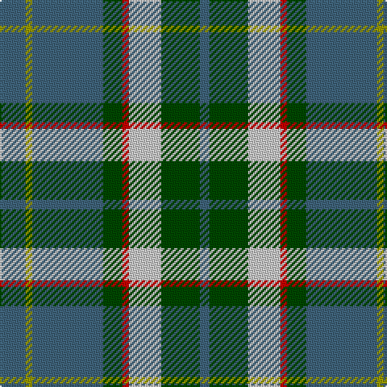

This page is one **sett** — a single exact thread-count. It belongs to the [tartan](/tartans/g8lg2g22ga6r2n10ga12g3/)
(the same proportion at any scale), whose colour order is pattern [BGWRGBYB](/stripes/bgwrgbyb/).

Sourced from register-of-tartans.  It is a [8 stripe tartan](/stripes/stripes8/).

Original link https://www.tartanregister.gov.uk/tartanDetails.aspx?ref=158

## Register references

External register numbers recorded for this tartan.

- Scottish Register of Tartans: [158](https://www.tartanregister.gov.uk/tartanDetails.aspx?ref=158)
- Scottish Tartans Authority (ITI): 2089
- Scottish Tartans World Register: 2089

## Thread count
G/16 LG4 G44 Ga12 R4 N20 Ga24 G/6

## Palette
Each colour and the base-6 reference it is a variant of.

| Colour | Shade | Base |
|---|---|---|
| DR | <code style="background-color:#880000;">#880000</code> `oklch(39.4% 0.162 29.2)` <small>#880000</small> | R <code style="background-color:#CC0000;">#CC0000</code> |
| G | <code style="background-color:#40647C;">#40647C</code> `oklch(48.6% 0.057 238.7)` <small>#40647C</small> | B <code style="background-color:#2A418A;">#2A418A</code> |
| Ga | <code style="background-color:#004800;">#004800</code> `oklch(34.8% 0.118 142.5)` <small>#004800</small> | G <code style="background-color:#006100;">#006100</code> |
| LG | <code style="background-color:#9C9C00;">#9C9C00</code> `oklch(67.1% 0.146 109.8)` <small>#9C9C00</small> | Y <code style="background-color:#F2BF00;">#F2BF00</code> |
| N | <code style="background-color:#C8C8C8;">#C8C8C8</code> `oklch(83.3% 0.000 89.9)` <small>#C8C8C8</small> | W <code style="background-color:#F7F7F7;">#F7F7F7</code> |
| R | <code style="background-color:#C80000;">#C80000</code> `oklch(52.3% 0.215 29.2)` <small>#C80000</small> | R <code style="background-color:#CC0000;">#CC0000</code> |

# Sample pattern

## Nearest tartans

The nearest existing variants by ΔTartan distance, with this tartan at the top so the swatches line up against it.

ΔTartan

Tartan

Sett

—

<a href="/ttd/edit/#slug=n8ly2n22dg6r2lb10dg12n3~x2">Bahamas</a> <a class="nn-out" href="/setts/s8/n8ly2n22dg6r2lb10dg12n3~x2/" title="open its dictionary page">↗</a>

0.72

<a href="/ttd/edit/#slug=n8ly2n22g6r2lb10g12n3~x2">Bahamas (District)</a> <a class="nn-out" href="/setts/s8/n8ly2n22g6r2lb10g12n3~x2/" title="open its dictionary page">↗</a>

0.83

<a href="/ttd/edit/#slug=db22g6db5t2g22r6g5r4g9w3~x2">MacConnell</a> <a class="nn-out" href="/setts/s10/db22g6db5t2g22r6g5r4g9w3~x2/" title="open its dictionary page">↗</a>

0.87

<a href="/ttd/edit/#slug=lo3g17n3g3n3k5n18r2n8r2~x2">Donegal Irish County Tartan Tartan Number: 2247. Earliest known date: 1996 One of a series of Irish District tartans designed by Polly Wittering of the House of Edgar, with colours reminiscent of the Country with soft warm colours dominating. See products available Copyright © Blair Urquhart, Comrie, 2015</a> <a class="nn-out" href="/setts/s10/lo3g17n3g3n3k5n18r2n8r2~x2/" title="open its dictionary page">↗</a>

0.94

<a href="/ttd/edit/#slug=g13dp1g1dp1g3b5k4ly2~x4">Carrick Hunting (Personal)</a> <a class="nn-out" href="/setts/s8/g13dp1g1dp1g3b5k4ly2~x4/" title="open its dictionary page">↗</a>

0.97

<a href="/ttd/edit/#slug=g25r4db25r13g25ly2t6~x2">Rotary</a> <a class="nn-out" href="/setts/s7/g25r4db25r13g25ly2t6~x2/" title="open its dictionary page">↗</a>

1.00

<a href="/ttd/edit/#slug=y3g17db3g3db3dr5db18r2db8r2~x2">Donegal</a> <a class="nn-out" href="/setts/s10/y3g17db3g3db3dr5db18r2db8r2~x2/" title="open its dictionary page">↗</a>

1.07

<a href="/ttd/edit/#slug=g15r3t15r8g15ly2db4~x2">Rotary International</a> <a class="nn-out" href="/setts/s7/g15r3t15r8g15ly2db4~x2/" title="open its dictionary page">↗</a>

1.08

<a href="/ttd/edit/#slug=g21db4w4db32g12ly4g8r4g6db12">Harkness</a> <a class="nn-out" href="/setts/s10/g21db4w4db32g12ly4g8r4g6db12/" title="open its dictionary page">↗</a>

1.11

<a href="/ttd/edit/#slug=t4g16ly2db7t28w4~x2">Allanton (Fashion)</a> <a class="nn-out" href="/setts/s6/t4g16ly2db7t28w4~x2/" title="open its dictionary page">↗</a>

1.11

<a href="/ttd/edit/#slug=lo3dg17b3dg3b3do5b18r2b8r2~x2">Donegal, County</a> <a class="nn-out" href="/setts/s10/lo3dg17b3dg3b3do5b18r2b8r2~x2/" title="open its dictionary page">↗</a>

## Neighbour map

Every grey dot is one of 14299 variants placed by the first two principal components of the ΔTartan feature space (44% of its variance). Red is this tartan; blue dots are its nearest — click one to open its page.

<svg viewBox="0 0 640 380" role="img" style="max-width:100%;height:auto;border:1px solid #e0e0e0;border-radius:4px;display:block" xmlns="http://www.w3.org/2000/svg"><image href="/nn/cloud.v1.png" width="640" height="380"/><a href="/setts/s8/n8ly2n22g6r2lb10g12n3~x2/"><circle cx="261.0" cy="201.8" r="4" fill="#3465a4"><title>Bahamas (District)</title></circle></a><a href="/setts/s10/db22g6db5t2g22r6g5r4g9w3~x2/"><circle cx="246.6" cy="180.2" r="4" fill="#3465a4"><title>MacConnell</title></circle></a><a href="/setts/s10/lo3g17n3g3n3k5n18r2n8r2~x2/"><circle cx="249.0" cy="184.4" r="4" fill="#3465a4"><title>Donegal Irish County Tartan Tartan Number: 2247. Earliest known date: 1996 One of a series of Irish District tartans designed by Polly Wittering of the House of Edgar, with colours reminiscent of the Country with soft warm colours dominating. See products available Copyright © Blair Urquhart, Comrie, 2015</title></circle></a><a href="/setts/s8/g13dp1g1dp1g3b5k4ly2~x4/"><circle cx="293.4" cy="171.5" r="4" fill="#3465a4"><title>Carrick Hunting (Personal)</title></circle></a><a href="/setts/s7/g25r4db25r13g25ly2t6~x2/"><circle cx="242.9" cy="204.8" r="4" fill="#3465a4"><title>Rotary</title></circle></a><a href="/setts/s10/y3g17db3g3db3dr5db18r2db8r2~x2/"><circle cx="259.1" cy="190.8" r="4" fill="#3465a4"><title>Donegal</title></circle></a><a href="/setts/s7/g15r3t15r8g15ly2db4~x2/"><circle cx="205.9" cy="226.5" r="4" fill="#3465a4"><title>Rotary International</title></circle></a><a href="/setts/s10/g21db4w4db32g12ly4g8r4g6db12/"><circle cx="221.7" cy="192.5" r="4" fill="#3465a4"><title>Harkness</title></circle></a><a href="/setts/s6/t4g16ly2db7t28w4~x2/"><circle cx="281.5" cy="189.8" r="4" fill="#3465a4"><title>Allanton (Fashion)</title></circle></a><a href="/setts/s10/lo3dg17b3dg3b3do5b18r2b8r2~x2/"><circle cx="266.3" cy="196.2" r="4" fill="#3465a4"><title>Donegal, County</title></circle></a><circle cx="249.2" cy="195.7" r="5" fill="#c00000"/></svg>

ID: /setts/s8/n8ly2n22dg6r2lb10dg12n3~x2/
