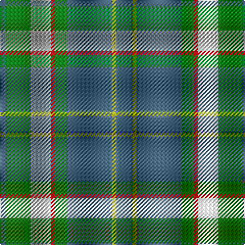

This page is one **sett** — a single exact thread-count. It belongs to the [tartan](/tartans/n8ly2n22g6r2lb10g12n3/)
(the same proportion at any scale), whose colour order is pattern [BGWRGBYB](/stripes/bgwrgbyb/).

Sourced from tartans-authority.  It is a [8 stripe tartan](/stripes/stripes8/).

Original link http://www.tartansauthority.com/tartan-ferret/display/2089/

## Register references

External register numbers recorded for this tartan.

- Scottish Tartans Authority (ITI): 2089

## Thread count
Ga/16 LG4 Ga44 G12 R4 N20 G24 Ga/6

## Palette

Palette: <strong>Tartan Register</strong> <small style="color:#888">(3 of 5 colours)</small>
<table><thead><tr><th>Colour</th><th>Threads</th><th>Shade</th><th>Base</th><th>OKLCh</th></tr></thead><tbody><tr><td>Ga/</td><td style="text-align:right;font-variant-numeric:tabular-nums">16</td><td><code style="background-color:#40647C;">#40647C</code> <small style="color:#888">#40647C</small></td><td>B <code style="background-color:#2A418A;">#2A418A</code></td><td><small style="color:#888">oklch(48.6% 0.057 238.7)</small></td></tr><tr><td>LG</td><td style="text-align:right;font-variant-numeric:tabular-nums">4</td><td><code style="background-color:#9C9C00;">#9C9C00</code> <small style="color:#888">#9C9C00</small></td><td>Y <code style="background-color:#F2BF00;">#F2BF00</code></td><td><small style="color:#888">oklch(67.1% 0.146 109.8)</small></td></tr><tr><td>Ga</td><td style="text-align:right;font-variant-numeric:tabular-nums">44</td><td><code style="background-color:#40647C;">#40647C</code> <small style="color:#888">#40647C</small></td><td>B <code style="background-color:#2A418A;">#2A418A</code></td><td><small style="color:#888">oklch(48.6% 0.057 238.7)</small></td></tr><tr><td>G</td><td style="text-align:right;font-variant-numeric:tabular-nums">12</td><td><code style="background-color:#007C00;">#007C00</code> <small style="color:#888">#007C00</small></td><td>G <code style="background-color:#006100;">#006100</code></td><td><small style="color:#888">oklch(50.8% 0.173 142.5)</small></td></tr><tr><td>R</td><td style="text-align:right;font-variant-numeric:tabular-nums">4</td><td><code style="background-color:#C80000;">#C80000</code> <small style="color:#888">#C80000</small></td><td>R <code style="background-color:#CC0000;">#CC0000</code></td><td><small style="color:#888">oklch(52.3% 0.215 29.2)</small></td></tr><tr><td>N</td><td style="text-align:right;font-variant-numeric:tabular-nums">20</td><td><code style="background-color:#C8C8C8;">#C8C8C8</code> <small style="color:#888">#C8C8C8</small></td><td>W <code style="background-color:#F7F7F7;">#F7F7F7</code></td><td><small style="color:#888">oklch(83.3% 0.000 89.9)</small></td></tr><tr><td>G</td><td style="text-align:right;font-variant-numeric:tabular-nums">24</td><td><code style="background-color:#007C00;">#007C00</code> <small style="color:#888">#007C00</small></td><td>G <code style="background-color:#006100;">#006100</code></td><td><small style="color:#888">oklch(50.8% 0.173 142.5)</small></td></tr><tr><td>Ga/</td><td style="text-align:right;font-variant-numeric:tabular-nums">6</td><td><code style="background-color:#40647C;">#40647C</code> <small style="color:#888">#40647C</small></td><td>B <code style="background-color:#2A418A;">#2A418A</code></td><td><small style="color:#888">oklch(48.6% 0.057 238.7)</small></td></tr></tbody></table>

# Sample pattern

## Nearest tartans

The nearest existing variants by ΔTartan distance, with this tartan at the top so the swatches line up against it.

ΔTartan

Tartan

Sett

—

<a href="/ttd/edit/#slug=n8ly2n22g6r2lb10g12n3~x2">Bahamas (District)</a> <a class="nn-out" href="/setts/s8/n8ly2n22g6r2lb10g12n3~x2/" title="open its dictionary page">↗</a>

0.72

<a href="/ttd/edit/#slug=n8ly2n22dg6r2lb10dg12n3~x2">Bahamas</a> <a class="nn-out" href="/setts/s8/n8ly2n22dg6r2lb10dg12n3~x2/" title="open its dictionary page">↗</a>

0.93

<a href="/ttd/edit/#slug=t29do8g21r3g8t16w3do3w3g8~x2">Morneau (Quebec), Richard (Personal)</a> <a class="nn-out" href="/setts/s10/t29do8g21r3g8t16w3do3w3g8~x2/" title="open its dictionary page">↗</a>

1.05

<a href="/ttd/edit/#slug=g10r3g30y10w2db15r4~x2">Sinclair</a> <a class="nn-out" href="/setts/s7/g10r3g30y10w2db15r4~x2/" title="open its dictionary page">↗</a>

1.07

<a href="/ttd/edit/#slug=g25r4db25r13g25ly2t6~x2">Rotary</a> <a class="nn-out" href="/setts/s7/g25r4db25r13g25ly2t6~x2/" title="open its dictionary page">↗</a>

1.07

<a href="/ttd/edit/#slug=db22g6db5t2g22r6g5r4g9w3~x2">MacConnell</a> <a class="nn-out" href="/setts/s10/db22g6db5t2g22r6g5r4g9w3~x2/" title="open its dictionary page">↗</a>

1.09

<a href="/ttd/edit/#slug=t4g16ly2db7t28w4~x2">Allanton (Fashion)</a> <a class="nn-out" href="/setts/s6/t4g16ly2db7t28w4~x2/" title="open its dictionary page">↗</a>

1.15

<a href="/ttd/edit/#slug=lo3dg17b3dg3b3do5b18r2b8r2~x2">Donegal, County</a> <a class="nn-out" href="/setts/s10/lo3dg17b3dg3b3do5b18r2b8r2~x2/" title="open its dictionary page">↗</a>

1.16

<a href="/ttd/edit/#slug=w4r13g54dg22k4y20g48r13w4">Wynberg Boys' High School</a> <a class="nn-out" href="/setts/s9/w4r13g54dg22k4y20g48r13w4/" title="open its dictionary page">↗</a>

1.22

<a href="/ttd/edit/#slug=g13dp1g1dp1g3b5k4ly2~x4">Carrick Hunting (Personal)</a> <a class="nn-out" href="/setts/s8/g13dp1g1dp1g3b5k4ly2~x4/" title="open its dictionary page">↗</a>

1.24

<a href="/ttd/edit/#slug=g15r3t15r8g15ly2db4~x2">Rotary International</a> <a class="nn-out" href="/setts/s7/g15r3t15r8g15ly2db4~x2/" title="open its dictionary page">↗</a>

## Neighbour map

Every grey dot is one of 14359 variants placed by the first two principal components of the ΔTartan feature space (44% of its variance). Red is this tartan; blue dots are its nearest — click one to open its page.

<svg viewBox="0 0 640 380" role="img" style="max-width:100%;height:auto;border:1px solid #e0e0e0;border-radius:4px;display:block" xmlns="http://www.w3.org/2000/svg"><image href="/nn/cloud.v1.png" width="640" height="380"/><a href="/setts/s8/n8ly2n22dg6r2lb10dg12n3~x2/"><circle cx="248.8" cy="196.5" r="4" fill="#3465a4"><title>Bahamas</title></circle></a><a href="/setts/s10/t29do8g21r3g8t16w3do3w3g8~x2/"><circle cx="231.8" cy="189.3" r="4" fill="#3465a4"><title>Morneau (Quebec), Richard (Personal)</title></circle></a><a href="/setts/s7/g10r3g30y10w2db15r4~x2/"><circle cx="288.8" cy="190.0" r="4" fill="#3465a4"><title>Sinclair</title></circle></a><a href="/setts/s7/g25r4db25r13g25ly2t6~x2/"><circle cx="242.5" cy="205.6" r="4" fill="#3465a4"><title>Rotary</title></circle></a><a href="/setts/s10/db22g6db5t2g22r6g5r4g9w3~x2/"><circle cx="246.2" cy="180.8" r="4" fill="#3465a4"><title>MacConnell</title></circle></a><a href="/setts/s6/t4g16ly2db7t28w4~x2/"><circle cx="281.0" cy="190.4" r="4" fill="#3465a4"><title>Allanton (Fashion)</title></circle></a><a href="/setts/s10/lo3dg17b3dg3b3do5b18r2b8r2~x2/"><circle cx="266.1" cy="196.9" r="4" fill="#3465a4"><title>Donegal, County</title></circle></a><a href="/setts/s9/w4r13g54dg22k4y20g48r13w4/"><circle cx="266.8" cy="162.5" r="4" fill="#3465a4"><title>Wynberg Boys' High School</title></circle></a><a href="/setts/s8/g13dp1g1dp1g3b5k4ly2~x4/"><circle cx="292.9" cy="172.0" r="4" fill="#3465a4"><title>Carrick Hunting (Personal)</title></circle></a><a href="/setts/s7/g15r3t15r8g15ly2db4~x2/"><circle cx="205.6" cy="227.5" r="4" fill="#3465a4"><title>Rotary International</title></circle></a><circle cx="260.6" cy="202.5" r="5" fill="#c00000"/></svg>

ID: /setts/s8/n8ly2n22g6r2lb10g12n3~x2/
