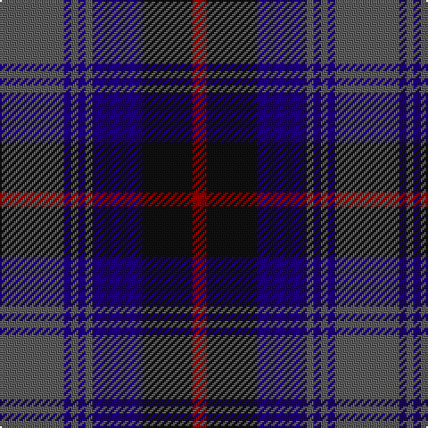

This page is one **sett** — a single exact thread-count. It belongs to the [tartan](/tartans/n9db1n1db1n1db7k7dr2/)
(the same proportion at any scale), whose colour order is pattern [BBBBBBKR](/stripes/bbbbbbkr/).

Sourced from register-of-tartans.  It is a [8 stripe tartan](/stripes/stripes8/).

Original link https://www.tartanregister.gov.uk/tartanDetails.aspx?ref=474

## Register references

External register numbers recorded for this tartan.

- Scottish Register of Tartans: [474](https://www.tartanregister.gov.uk/tartanDetails.aspx?ref=474)
- Scottish Tartans Authority (ITI): 2215
- Scottish Tartans World Register: 2215

## Thread count
N/36 DB4 N4 DB4 N4 DB28 K28 DR/8

## Palette
Each colour and the base-6 reference it is a variant of.

| Colour | Shade | Base |
|---|---|---|
| DB | <code style="background-color:#1C0070;">#1C0070</code> `oklch(26.3% 0.162 277.1)` <small>#1C0070</small> | B <code style="background-color:#2A418A;">#2A418A</code> |
| DR | <code style="background-color:#880000;">#880000</code> `oklch(39.4% 0.162 29.2)` <small>#880000</small> | R <code style="background-color:#CC0000;">#CC0000</code> |
| K | <code style="background-color:#101010;">#101010</code> `oklch(17.3% 0.000 89.9)` <small>#101010</small> | K <code style="background-color:#000000;">#000000</code> |
| N | <code style="background-color:#5C5C5C;">#5C5C5C</code> `oklch(47.5% 0.000 89.9)` <small>#5C5C5C</small> | B <code style="background-color:#2A418A;">#2A418A</code> |

# Sample pattern

## Nearest tartans

The nearest existing variants by ΔTartan distance, with this tartan at the top so the swatches line up against it.

ΔTartan

Tartan

Sett

—

<a href="/ttd/edit/#slug=n9db1n1db1n1db7k7r2~x4">Caledonian Hotel (Corporate)</a> <a class="nn-out" href="/setts/s8/n9db1n1db1n1db7k7r2~x4/" title="open its dictionary page">↗</a>

0.85

<a href="/ttd/edit/#slug=n9db1n1db1n1db7dg7r2~x4">Caledonian Hotel (Corporate)</a> <a class="nn-out" href="/setts/s8/n9db1n1db1n1db7dg7r2~x4/" title="open its dictionary page">↗</a>

0.94

<a href="/ttd/edit/#slug=db16k2db2k2db2k6dg13ly2dg3~x2">Christian Dewar (Personal)</a> <a class="nn-out" href="/setts/s9/db16k2db2k2db2k6dg13ly2dg3~x2/" title="open its dictionary page">↗</a>

0.94

<a href="/ttd/edit/#slug=db28k3db6k3db6k20dy28k3w6~x2">Forbes #5</a> <a class="nn-out" href="/setts/s9/db28k3db6k3db6k20dy28k3w6~x2/" title="open its dictionary page">↗</a>

0.95

<a href="/ttd/edit/#slug=k1g4r1k4db1k1db7g1~x6">Brabender</a> <a class="nn-out" href="/setts/s8/k1g4r1k4db1k1db7g1~x6/" title="open its dictionary page">↗</a>

0.96

<a href="/ttd/edit/#slug=n6k6n21k16db36ly4">Bareback (Corporate)</a> <a class="nn-out" href="/setts/s6/n6k6n21k16db36ly4/" title="open its dictionary page">↗</a>

1.03

<a href="/ttd/edit/#slug=db3k2db8k8g8dp1g1dp3~x4">Baird (Modern)</a> <a class="nn-out" href="/setts/s8/db3k2db8k8g8dp1g1dp3~x4/" title="open its dictionary page">↗</a>

1.03

<a href="/ttd/edit/#slug=db3k2db8k8g8dp1g1dp3~x2">Baird Clan Tartan Tartan Number: 104. Earliest known date: 1906 This tartan is first recorded in Johnston's work of 1906, and the sample from the Highland Society of London probably dates from the same period. In both these early references the triple stripes are rendered in red. Today, however, they are generally woven in purple. The name originates from 'bard' meaning poet. The Bairds owned estates in Aberdeenshire which were later purchased by the Gordons. See products available Copyright © Blair Urquhart, Comrie, 2015</a> <a class="nn-out" href="/setts/s8/db3k2db8k8g8dp1g1dp3~x2/" title="open its dictionary page">↗</a>

1.07

<a href="/ttd/edit/#slug=db8k2db2k2db2k8dg7k1w1~x2">Forbes #3</a> <a class="nn-out" href="/setts/s9/db8k2db2k2db2k8dg7k1w1~x2/" title="open its dictionary page">↗</a>

1.07

<a href="/ttd/edit/#slug=db10k1db1k1db2k8dg10w1~x4">Lamont</a> <a class="nn-out" href="/setts/s8/db10k1db1k1db2k8dg10w1~x4/" title="open its dictionary page">↗</a>

1.08

<a href="/ttd/edit/#slug=dp11dy2dp2dy2dp2dy11dg14w2~x2">Lamont #2</a> <a class="nn-out" href="/setts/s8/dp11dy2dp2dy2dp2dy11dg14w2~x2/" title="open its dictionary page">↗</a>

## Neighbour map

Every grey dot is one of 14299 variants placed by the first two principal components of the ΔTartan feature space (44% of its variance). Red is this tartan; blue dots are its nearest — click one to open its page.

<svg viewBox="0 0 640 380" role="img" style="max-width:100%;height:auto;border:1px solid #e0e0e0;border-radius:4px;display:block" xmlns="http://www.w3.org/2000/svg"><image href="/nn/cloud.v1.png" width="640" height="380"/><a href="/setts/s8/n9db1n1db1n1db7dg7r2~x4/"><circle cx="256.2" cy="235.2" r="4" fill="#3465a4"><title>Caledonian Hotel (Corporate)</title></circle></a><a href="/setts/s9/db16k2db2k2db2k6dg13ly2dg3~x2/"><circle cx="272.9" cy="232.2" r="4" fill="#3465a4"><title>Christian Dewar (Personal)</title></circle></a><a href="/setts/s9/db28k3db6k3db6k20dy28k3w6~x2/"><circle cx="219.0" cy="207.5" r="4" fill="#3465a4"><title>Forbes #5</title></circle></a><a href="/setts/s8/k1g4r1k4db1k1db7g1~x6/"><circle cx="223.5" cy="233.1" r="4" fill="#3465a4"><title>Brabender</title></circle></a><a href="/setts/s6/n6k6n21k16db36ly4/"><circle cx="233.0" cy="240.3" r="4" fill="#3465a4"><title>Bareback (Corporate)</title></circle></a><a href="/setts/s8/db3k2db8k8g8dp1g1dp3~x4/"><circle cx="181.2" cy="242.0" r="4" fill="#3465a4"><title>Baird (Modern)</title></circle></a><a href="/setts/s8/db3k2db8k8g8dp1g1dp3~x2/"><circle cx="181.2" cy="242.0" r="4" fill="#3465a4"><title>Baird Clan Tartan Tartan Number: 104. Earliest known date: 1906 This tartan is first recorded in Johnston's work of 1906, and the sample from the Highland Society of London probably dates from the same period. In both these early references the triple stripes are rendered in red. Today, however, they are generally woven in purple. The name originates from 'bard' meaning poet. The Bairds owned estates in Aberdeenshire which were later purchased by the Gordons. See products available Copyright © Blair Urquhart, Comrie, 2015</title></circle></a><a href="/setts/s9/db8k2db2k2db2k8dg7k1w1~x2/"><circle cx="226.4" cy="233.2" r="4" fill="#3465a4"><title>Forbes #3</title></circle></a><a href="/setts/s8/db10k1db1k1db2k8dg10w1~x4/"><circle cx="244.0" cy="219.3" r="4" fill="#3465a4"><title>Lamont</title></circle></a><a href="/setts/s8/dp11dy2dp2dy2dp2dy11dg14w2~x2/"><circle cx="202.0" cy="227.7" r="4" fill="#3465a4"><title>Lamont #2</title></circle></a><circle cx="239.8" cy="224.7" r="5" fill="#c00000"/></svg>

ID: /setts/s8/n9db1n1db1n1db7k7r2~x4/
