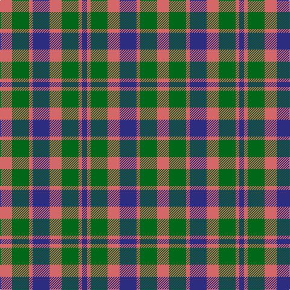

In pattern [BRGRBRGR](/stripes/brgrbrgr/).

This was sourced from house-of-tartan.  It is a [8 stripe tartan](/stripes/stripes8/).

Original link http://www.house-of-tartan.scotland.net/house/TartanViewjs.asp?colr=Def&tnam=534

## Thread count
LR/20 G28 LR6 DB28 LR20 G28 LR6 DB/8

## Palette
Each colour and the base-6 reference it is a variant of.

| Colour | Shade | Base |
|---|---|---|
| DB | <code style="background-color:#2C2C80;">#2C2C80</code> `oklch(35.0% 0.138 276.6)` <small>#2C2C80</small> | B <code style="background-color:#2A418A;">#2A418A</code> |
| G | <code style="background-color:#006818;">#006818</code> `oklch(45.0% 0.142 145.0)` <small>#006818</small> | G <code style="background-color:#006100;">#006100</code> |
| LR | <code style="background-color:#D46868;">#D46868</code> `oklch(64.5% 0.137 21.6)` <small>#D46868</small> | R <code style="background-color:#CC0000;">#CC0000</code> |

# Sample pattern

## Nearest tartans

The nearest existing variants by ΔTartan distance.

1. [Flora, MacDonald](/setts/s8/r3db3r3db10g10r3g3r3~x2/) — ΔT 0.95
1. [Fiddes](/setts/s11/g16r12db16r6db4r6db7r20db8g8db12~x2/) — ΔT 1.13
1. [Flora MacDonald](/setts/s8/r3dg3r3dg10db10r3db3r3~x2/) — ΔT 1.15
1. [Wilson's No.214](/setts/s8/g4r3t1k1t3~x4/) — ΔT 1.24
1. [Holden Monaro Corporate Tartan Tartan Number: 8700. Earliest known date: 1831 Holden Monaro GTS 1978 car seats. Reproduction colours. Warp 162 threads Weft 202 threads. Last weaving went through with slight difference. Sett size = 4 3/8th - 4 3/4 inch (112mm - 120mm) See products available Copyright © Blair Urquhart, Comrie, 2015](/setts/s8/lr10dt3lr3dt3lr3dt11dy11o3~x2/) — ΔT 1.25
1. [Hebrides #8](/setts/s8/db7r3g7r1g7r3db7t1~x2/) — ΔT 1.32
1. [Gow](/setts/s8/r4dg4r1db4r4~x12/) — ΔT 1.33
1. [Tyndrum](/setts/s10/o6k1o1k1o2k4lo6k1o2k2~x8/) — ΔT 1.34
1. [Stewart (Artefact)](/setts/s7/r2g4db8r9g9k2r2~x4/) — ΔT 1.35
1. [Tyndrum District Tartan Tartan Number: 1128. Earliest known date: 1983 Tyndrum is a village in northwest Perthshire on the rail line between Glasgow and Fort William. Specimen seen in Mairi MacIntyre's shop, Fort William 1983. See products available Copyright © Blair Urquhart, Comrie, 2015](/setts/s10/o6k1o1k1o2k4dy6k1o2k2~x4/) — ΔT 1.38

## Neighbour map

Every grey dot is one of 14299 variants placed by the first two principal components of the ΔTartan feature space (44% of its variance). Red is this tartan; blue dots are its nearest — click one to open its page.

<svg viewBox="0 0 640 380" role="img" style="max-width:100%;height:auto;border:1px solid #e0e0e0;border-radius:4px;display:block" xmlns="http://www.w3.org/2000/svg"><image href="/nn/cloud.v1.png" width="640" height="380"/><a href="/setts/s8/r3db3r3db10g10r3g3r3~x2/"><circle cx="170.3" cy="274.1" r="4" fill="#3465a4"><title>Flora, MacDonald</title></circle></a><a href="/setts/s11/g16r12db16r6db4r6db7r20db8g8db12~x2/"><circle cx="195.3" cy="265.8" r="4" fill="#3465a4"><title>Fiddes</title></circle></a><a href="/setts/s8/r3dg3r3dg10db10r3db3r3~x2/"><circle cx="175.3" cy="275.0" r="4" fill="#3465a4"><title>Flora MacDonald</title></circle></a><a href="/setts/s8/g4r3t1k1t3~x4/"><circle cx="117.4" cy="249.9" r="4" fill="#3465a4"><title>Wilson's No.214</title></circle></a><a href="/setts/s8/lr10dt3lr3dt3lr3dt11dy11o3~x2/"><circle cx="141.5" cy="250.1" r="4" fill="#3465a4"><title>Holden Monaro Corporate Tartan Tartan Number: 8700. Earliest known date: 1831 Holden Monaro GTS 1978 car seats. Reproduction colours. Warp 162 threads Weft 202 threads. Last weaving went through with slight difference. Sett size = 4 3/8th - 4 3/4 inch (112mm - 120mm) See products available Copyright © Blair Urquhart, Comrie, 2015</title></circle></a><a href="/setts/s8/db7r3g7r1g7r3db7t1~x2/"><circle cx="193.7" cy="247.0" r="4" fill="#3465a4"><title>Hebrides #8</title></circle></a><a href="/setts/s8/r4dg4r1db4r4~x12/"><circle cx="170.8" cy="295.3" r="4" fill="#3465a4"><title>Gow</title></circle></a><a href="/setts/s10/o6k1o1k1o2k4lo6k1o2k2~x8/"><circle cx="203.2" cy="224.9" r="4" fill="#3465a4"><title>Tyndrum</title></circle></a><a href="/setts/s7/r2g4db8r9g9k2r2~x4/"><circle cx="160.1" cy="252.5" r="4" fill="#3465a4"><title>Stewart (Artefact)</title></circle></a><a href="/setts/s10/o6k1o1k1o2k4dy6k1o2k2~x4/"><circle cx="213.7" cy="231.5" r="4" fill="#3465a4"><title>Tyndrum District Tartan Tartan Number: 1128. Earliest known date: 1983 Tyndrum is a village in northwest Perthshire on the rail line between Glasgow and Fort William. Specimen seen in Mairi MacIntyre's shop, Fort William 1983. See products available Copyright © Blair Urquhart, Comrie, 2015</title></circle></a><circle cx="180.5" cy="273.0" r="5" fill="#c00000"/></svg>

ID: /setts/s8/o10g14o3db14o10g14o3db4~x2/
