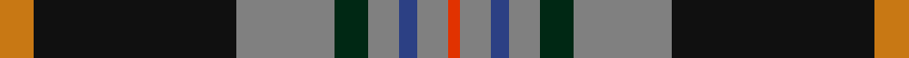
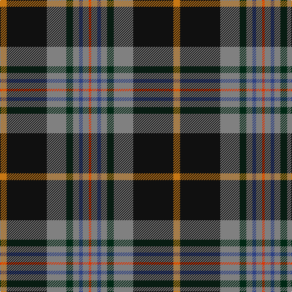

This page is one **sett** — a single exact thread-count. It belongs to the [tartan](/tartans/o11k66n32dg11n10b6n10r4/)
(the same proportion at any scale), whose colour order is pattern [RGBGGGKR](/stripes/rgbgggkr/).

Sourced from register-of-tartans.  It is a [8 stripe tartan](/stripes/stripes8/).

Original link https://www.tartanregister.gov.uk/tartanDetails.aspx?ref=5327

## Register references

External register numbers recorded for this tartan.

- Scottish Register of Tartans: [5327](https://www.tartanregister.gov.uk/tartanDetails.aspx?ref=5327)
- Scottish Tartans Authority (ITI): 7398
- Scottish Tartans World Register: 3052

## Thread count
O/11 K66 N32 DG11 N10 B6 N10 R/4

## Palette
Each colour and the base-6 reference it is a variant of.

| Colour | Shade | Base |
|---|---|---|
| B | <code style="background-color:#2C4084;">#2C4084</code> `oklch(39.4% 0.117 268.3)` <small>#2C4084</small> | B <code style="background-color:#2A418A;">#2A418A</code> |
| DG | <code style="background-color:#002814;">#002814</code> `oklch(24.4% 0.059 156.5)` <small>#002814</small> | G <code style="background-color:#006100;">#006100</code> |
| K | <code style="background-color:#101010;">#101010</code> `oklch(17.3% 0.000 89.9)` <small>#101010</small> | K <code style="background-color:#000000;">#000000</code> |
| N | <code style="background-color:#808080;">#808080</code> `oklch(60.0% 0.000 89.9)` <small>#808080</small> | G <code style="background-color:#006100;">#006100</code> |
| O | <code style="background-color:#C87814;">#C87814</code> `oklch(64.5% 0.141 63.8)` <small>#C87814</small> | R <code style="background-color:#CC0000;">#CC0000</code> |
| R | <code style="background-color:#E13200;">#E13200</code> `oklch(59.2% 0.215 33.6)` <small>#E13200</small> | R <code style="background-color:#CC0000;">#CC0000</code> |

# Sample pattern

## Nearest tartans

The nearest existing variants by ΔTartan distance, with this tartan at the top so the swatches line up against it.

ΔTartan

Tartan

Sett

—

<a href="/ttd/edit/#slug=o11k66y32dg11y10db6y10r4">Turnbull, Dress Bruce (Personal)</a> <a class="nn-out" href="/setts/s8/o11k66y32dg11y10db6y10r4/" title="open its dictionary page">↗</a>

0.46

<a href="/ttd/edit/#slug=lo11k66o32dg11o10db6o10lo4">Royal College of General Practitioners</a> <a class="nn-out" href="/setts/s8/lo11k66o32dg11o10db6o10lo4/" title="open its dictionary page">↗</a>

0.60

<a href="/ttd/edit/#slug=r5t2k30n26ly2n2db4~x2">Milne-Murtaugh (Personal)</a> <a class="nn-out" href="/setts/s7/r5t2k30n26ly2n2db4~x2/" title="open its dictionary page">↗</a>

0.79

<a href="/ttd/edit/#slug=lo3k2o15k10dt23r2dt1w2~x2">Vienna Highlander (Fashion)</a> <a class="nn-out" href="/setts/s8/lo3k2o15k10dt23r2dt1w2~x2/" title="open its dictionary page">↗</a>

0.84

<a href="/ttd/edit/#slug=m5y2k30y26y2y2k4~x2">Milne-Murtagh (2009)</a> <a class="nn-out" href="/setts/s7/m5y2k30y26y2y2k4~x2/" title="open its dictionary page">↗</a>

0.93

<a href="/ttd/edit/#slug=db46ly4db4ly4db6k16n66lb11r6">Scottish Association for Neurological Sciences</a> <a class="nn-out" href="/setts/s9/db46ly4db4ly4db6k16n66lb11r6/" title="open its dictionary page">↗</a>

0.94

<a href="/ttd/edit/#slug=k45lo10g7r3w4db13w9r6~x2">Legion of Frontiersmen (Corporate)</a> <a class="nn-out" href="/setts/s8/k45lo10g7r3w4db13w9r6~x2/" title="open its dictionary page">↗</a>

0.96

<a href="/ttd/edit/#slug=b3k2r2k12g10ly1k1g2lb2~x4">Roderick Dhu</a> <a class="nn-out" href="/setts/s9/b3k2r2k12g10ly1k1g2lb2~x4/" title="open its dictionary page">↗</a>

0.99

<a href="/ttd/edit/#slug=lo9k8lo30k4lb8k4db24k54r14k4lr8">Dublin County Crest (Fashion)</a> <a class="nn-out" href="/setts/s11/lo9k8lo30k4lb8k4db24k54r14k4lr8/" title="open its dictionary page">↗</a>

1.01

<a href="/ttd/edit/#slug=y16k2y6k2r2k2db15g1db1w2~x2">Otago</a> <a class="nn-out" href="/setts/s10/y16k2y6k2r2k2db15g1db1w2~x2/" title="open its dictionary page">↗</a>

1.02

<a href="/ttd/edit/#slug=w5k26ly2dg24dt7k3r3~x2">Cornish Hunting District Tartan Tartan Number: 1568. Earliest known date: 1984 The Cornish Hunting tartan was first produced in 1984, and was marketed by the firm, Cornovi Creations, Cornwall. It is based on the Cornish National tartan designed by E.E. Morton-Nance, who regarded tartan as the heritage of all Celts, not Scots alone. (P Smith and G Teall, District Tartans, 1992) The hunting sett replaces the 'National' yellow with dark green and the azure with a darker shade of blue. Cornish Hunting is a registered design (No. 514267). See products available Copyright © Blair Urquhart, Comrie, 2015</a> <a class="nn-out" href="/setts/s7/w5k26ly2dg24dt7k3r3~x2/" title="open its dictionary page">↗</a>

## Neighbour map

Every grey dot is one of 14299 variants placed by the first two principal components of the ΔTartan feature space (44% of its variance). Red is this tartan; blue dots are its nearest — click one to open its page.

<svg viewBox="0 0 640 380" role="img" style="max-width:100%;height:auto;border:1px solid #e0e0e0;border-radius:4px;display:block" xmlns="http://www.w3.org/2000/svg"><image href="/nn/cloud.v1.png" width="640" height="380"/><a href="/setts/s8/lo11k66o32dg11o10db6o10lo4/"><circle cx="206.2" cy="126.5" r="4" fill="#3465a4"><title>Royal College of General Practitioners</title></circle></a><a href="/setts/s7/r5t2k30n26ly2n2db4~x2/"><circle cx="235.4" cy="144.2" r="4" fill="#3465a4"><title>Milne-Murtaugh (Personal)</title></circle></a><a href="/setts/s8/lo3k2o15k10dt23r2dt1w2~x2/"><circle cx="201.9" cy="119.3" r="4" fill="#3465a4"><title>Vienna Highlander (Fashion)</title></circle></a><a href="/setts/s7/m5y2k30y26y2y2k4~x2/"><circle cx="243.5" cy="148.3" r="4" fill="#3465a4"><title>Milne-Murtagh (2009)</title></circle></a><a href="/setts/s9/db46ly4db4ly4db6k16n66lb11r6/"><circle cx="216.1" cy="127.9" r="4" fill="#3465a4"><title>Scottish Association for Neurological Sciences</title></circle></a><a href="/setts/s8/k45lo10g7r3w4db13w9r6~x2/"><circle cx="182.8" cy="121.4" r="4" fill="#3465a4"><title>Legion of Frontiersmen (Corporate)</title></circle></a><a href="/setts/s9/b3k2r2k12g10ly1k1g2lb2~x4/"><circle cx="187.3" cy="145.8" r="4" fill="#3465a4"><title>Roderick Dhu</title></circle></a><a href="/setts/s11/lo9k8lo30k4lb8k4db24k54r14k4lr8/"><circle cx="174.0" cy="122.8" r="4" fill="#3465a4"><title>Dublin County Crest (Fashion)</title></circle></a><a href="/setts/s10/y16k2y6k2r2k2db15g1db1w2~x2/"><circle cx="206.3" cy="110.9" r="4" fill="#3465a4"><title>Otago</title></circle></a><a href="/setts/s7/w5k26ly2dg24dt7k3r3~x2/"><circle cx="196.2" cy="163.3" r="4" fill="#3465a4"><title>Cornish Hunting District Tartan Tartan Number: 1568. Earliest known date: 1984 The Cornish Hunting tartan was first produced in 1984, and was marketed by the firm, Cornovi Creations, Cornwall. It is based on the Cornish National tartan designed by E.E. Morton-Nance, who regarded tartan as the heritage of all Celts, not Scots alone. (P Smith and G Teall, District Tartans, 1992) The hunting sett replaces the 'National' yellow with dark green and the azure with a darker shade of blue. Cornish Hunting is a registered design (No. 514267). See products available Copyright © Blair Urquhart, Comrie, 2015</title></circle></a><circle cx="219.0" cy="133.6" r="5" fill="#c00000"/></svg>

ID: /setts/s8/o11k66y32dg11y10db6y10r4/
