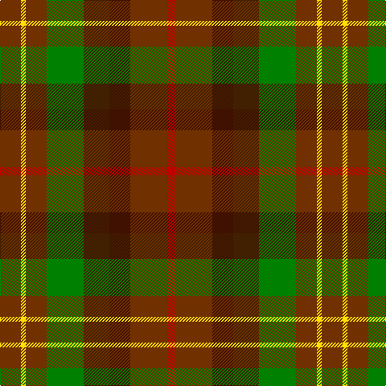

This page is one **sett** — a single exact thread-count. It belongs to the [tartan](/tartans/o13ly3o13g23dy16dr13o23r5/)
(the same proportion at any scale), whose colour order is pattern [RRBGGRYR](/stripes/rrbggryr/).

Sourced from weddslist.  It is a [8 stripe tartan](/stripes/stripes8/).

Original link http://www.weddslist.com/cgi-bin/tartans/pg.pl?source=sts

## Thread count
T/26 Y6 T26 G46 DR32 DRa26 T46 R/10

## Palette

Palette: <strong>custom</strong>
<table><thead><tr><th>Colour</th><th>Threads</th><th>Shade</th><th>Base</th><th>OKLCh</th></tr></thead><tbody><tr><td>T/</td><td style="text-align:right;font-variant-numeric:tabular-nums">26</td><td><code style="background-color:#703000;">#703000</code> <small style="color:#888">#703000</small></td><td>R <code style="background-color:#CC0000;">#CC0000</code></td><td><small style="color:#888">oklch(39.1% 0.105 49.1)</small></td></tr><tr><td>Y</td><td style="text-align:right;font-variant-numeric:tabular-nums">6</td><td><code style="background-color:#FFE000;">#FFE000</code> <small style="color:#888">#FFE000</small></td><td>Y <code style="background-color:#F2BF00;">#F2BF00</code></td><td><small style="color:#888">oklch(90.5% 0.188 99.1)</small></td></tr><tr><td>T</td><td style="text-align:right;font-variant-numeric:tabular-nums">26</td><td><code style="background-color:#703000;">#703000</code> <small style="color:#888">#703000</small></td><td>R <code style="background-color:#CC0000;">#CC0000</code></td><td><small style="color:#888">oklch(39.1% 0.105 49.1)</small></td></tr><tr><td>G</td><td style="text-align:right;font-variant-numeric:tabular-nums">46</td><td><code style="background-color:#008000;">#008000</code> <small style="color:#888">#008000</small></td><td>G <code style="background-color:#006100;">#006100</code></td><td><small style="color:#888">oklch(52.0% 0.177 142.5)</small></td></tr><tr><td>DR</td><td style="text-align:right;font-variant-numeric:tabular-nums">32</td><td><code style="background-color:#402000;">#402000</code> <small style="color:#888">#402000</small></td><td>G <code style="background-color:#006100;">#006100</code></td><td><small style="color:#888">oklch(28.2% 0.066 60.5)</small></td></tr><tr><td>DRa</td><td style="text-align:right;font-variant-numeric:tabular-nums">26</td><td><code style="background-color:#401000;">#401000</code> <small style="color:#888">#401000</small></td><td>B <code style="background-color:#2A418A;">#2A418A</code></td><td><small style="color:#888">oklch(25.3% 0.079 39.9)</small></td></tr><tr><td>T</td><td style="text-align:right;font-variant-numeric:tabular-nums">46</td><td><code style="background-color:#703000;">#703000</code> <small style="color:#888">#703000</small></td><td>R <code style="background-color:#CC0000;">#CC0000</code></td><td><small style="color:#888">oklch(39.1% 0.105 49.1)</small></td></tr><tr><td>R/</td><td style="text-align:right;font-variant-numeric:tabular-nums">10</td><td><code style="background-color:#C00000;">#C00000</code> <small style="color:#888">#C00000</small></td><td>R <code style="background-color:#CC0000;">#CC0000</code></td><td><small style="color:#888">oklch(50.7% 0.208 29.2)</small></td></tr></tbody></table>

# Sample pattern

## Nearest tartans

The nearest existing variants by ΔTartan distance, with this tartan at the top so the swatches line up against it.

ΔTartan

Tartan

Sett

—

<a href="/ttd/edit/#slug=o13ly3o13g23dy16dr13o23r5~x2">Unidentified 2</a> <a class="nn-out" href="/setts/s8/o13ly3o13g23dy16dr13o23r5~x2/" title="open its dictionary page">↗</a>

1.36

<a href="/ttd/edit/#slug=dr5lo1dr5g9do5dy4dr7r2~x4">Leighton (Personal)</a> <a class="nn-out" href="/setts/s8/dr5lo1dr5g9do5dy4dr7r2~x4/" title="open its dictionary page">↗</a>

1.39

<a href="/ttd/edit/#slug=dr20lo4dr20g35do20dy16dr28r8">Leighton (Personal)</a> <a class="nn-out" href="/setts/s8/dr20lo4dr20g35do20dy16dr28r8/" title="open its dictionary page">↗</a>

1.47

<a href="/ttd/edit/#slug=dy8r1dy8g8k8db8dy8r2~x2">MacDuff Hunting Clan Tartan Tartan Number: 1654. Earliest known date: 1906 STS records (sic) 'Sett may be quite wrong. (S.S. May 86)' See products available Copyright © Blair Urquhart, Comrie, 2015</a> <a class="nn-out" href="/setts/s8/dy8r1dy8g8k8db8dy8r2~x2/" title="open its dictionary page">↗</a>

1.57

<a href="/ttd/edit/#slug=dg2ly1dg6r4r6k1r2~x4">Unidentified Printing #3</a> <a class="nn-out" href="/setts/s7/dg2ly1dg6r4r6k1r2~x4/" title="open its dictionary page">↗</a>

1.62

<a href="/ttd/edit/#slug=g3db1g6r6lo1r6n6db1n6r2n6lb1~x4">Wcwm 1243</a> <a class="nn-out" href="/setts/s12/g3db1g6r6lo1r6n6db1n6r2n6lb1~x4/" title="open its dictionary page">↗</a>

1.63

<a href="/ttd/edit/#slug=do10r2do10g17k12db9do9r2~x2">MacDuff Hunting</a> <a class="nn-out" href="/setts/s8/do10r2do10g17k12db9do9r2~x2/" title="open its dictionary page">↗</a>

1.68

<a href="/ttd/edit/#slug=db8lo1g12r10y2r6y2r4~x4">Indiana &quot;Cardinal&quot; (District)</a> <a class="nn-out" href="/setts/s8/db8lo1g12r10y2r6y2r4~x4/" title="open its dictionary page">↗</a>

1.69

<a href="/setts/s10/dy2lr1dy5k4do5o1~x4/">Huntly #3</a>

1.69

<a href="/ttd/edit/#slug=g4lr2g8do8o2do8o16k2do5lr2o5ly2~x2">Blaylock Hunting</a> <a class="nn-out" href="/setts/s12/g4lr2g8do8o2do8o16k2do5lr2o5ly2~x2/" title="open its dictionary page">↗</a>

1.73

<a href="/ttd/edit/#slug=r1dy7db7k7g7dy7r1~x4">Tennant Family Tartan Tartan Number: 1653. Earliest known date: 1930 MacGregor-Hastie made few notes about his sample collection. In December 1967, Captain Tennant wrote to the Scottish Tartans Society, saying, &quot;.. and I have no objection to other Tennants wearing it (Tennant tartan) but their problem will be to get hold of it ... I don't know of any other Tennant tartan and that is why I think my father designed this one.&quot; The head of the Tennant family is Lord Glenconner, descended from John Tennant of Blairston, Ayr. (1635). See products available Copyright © Blair Urquhart, Comrie, 2015</a> <a class="nn-out" href="/setts/s7/r1dy7db7k7g7dy7r1~x4/" title="open its dictionary page">↗</a>

## Neighbour map

Every grey dot is one of 14299 variants placed by the first two principal components of the ΔTartan feature space (44% of its variance). Red is this tartan; blue dots are its nearest — click one to open its page.

<svg viewBox="0 0 640 380" role="img" style="max-width:100%;height:auto;border:1px solid #e0e0e0;border-radius:4px;display:block" xmlns="http://www.w3.org/2000/svg"><image href="/nn/cloud.v1.png" width="640" height="380"/><a href="/setts/s8/dr5lo1dr5g9do5dy4dr7r2~x4/"><circle cx="222.0" cy="240.5" r="4" fill="#3465a4"><title>Leighton (Personal)</title></circle></a><a href="/setts/s8/dr20lo4dr20g35do20dy16dr28r8/"><circle cx="222.0" cy="242.9" r="4" fill="#3465a4"><title>Leighton (Personal)</title></circle></a><a href="/setts/s8/dy8r1dy8g8k8db8dy8r2~x2/"><circle cx="215.8" cy="263.8" r="4" fill="#3465a4"><title>MacDuff Hunting Clan Tartan Tartan Number: 1654. Earliest known date: 1906 STS records (sic) 'Sett may be quite wrong. (S.S. May 86)' See products available Copyright © Blair Urquhart, Comrie, 2015</title></circle></a><a href="/setts/s7/dg2ly1dg6r4r6k1r2~x4/"><circle cx="180.4" cy="235.2" r="4" fill="#3465a4"><title>Unidentified Printing #3</title></circle></a><a href="/setts/s12/g3db1g6r6lo1r6n6db1n6r2n6lb1~x4/"><circle cx="165.5" cy="202.2" r="4" fill="#3465a4"><title>Wcwm 1243</title></circle></a><a href="/setts/s8/do10r2do10g17k12db9do9r2~x2/"><circle cx="191.5" cy="248.8" r="4" fill="#3465a4"><title>MacDuff Hunting</title></circle></a><a href="/setts/s8/db8lo1g12r10y2r6y2r4~x4/"><circle cx="236.8" cy="205.4" r="4" fill="#3465a4"><title>Indiana &quot;Cardinal&quot; (District)</title></circle></a><a href="/setts/s10/dy2lr1dy5k4do5o1~x4/"><circle cx="167.1" cy="260.3" r="4" fill="#3465a4"><title>Huntly #3</title></circle></a><a href="/setts/s12/g4lr2g8do8o2do8o16k2do5lr2o5ly2~x2/"><circle cx="174.3" cy="185.9" r="4" fill="#3465a4"><title>Blaylock Hunting</title></circle></a><a href="/setts/s7/r1dy7db7k7g7dy7r1~x4/"><circle cx="167.6" cy="261.1" r="4" fill="#3465a4"><title>Tennant Family Tartan Tartan Number: 1653. Earliest known date: 1930 MacGregor-Hastie made few notes about his sample collection. In December 1967, Captain Tennant wrote to the Scottish Tartans Society, saying, &quot;.. and I have no objection to other Tennants wearing it (Tennant tartan) but their problem will be to get hold of it ... I don't know of any other Tennant tartan and that is why I think my father designed this one.&quot; The head of the Tennant family is Lord Glenconner, descended from John Tennant of Blairston, Ayr. (1635). See products available Copyright © Blair Urquhart, Comrie, 2015</title></circle></a><circle cx="184.7" cy="232.3" r="5" fill="#c00000"/></svg>

ID: /setts/s8/o13ly3o13g23dy16dr13o23r5~x2/
