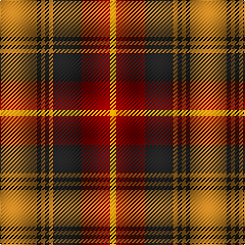

**Bands:** [RBRBRBRY](/stripes/rbrbrbry/) · **Stripes:** [O DT O DT O DT R LY](/stripes/stripes8/) O DT O DT O DT R LY

This was sourced from register-of-tartans.  It is a [8 band tartan](/bands/bands8/).

Original link https://www.tartanregister.gov.uk/tartanDetails.aspx?ref=4069

## Attestations

This cloth appears in 2 source records; the oldest owns this page.

- 01/01/2002 — Talladale (register-of-tartans, [record](https://www.tartanregister.gov.uk/tartanDetails.aspx?ref=4069))
- pre 2002 — Talladale (Fashion) (tartans-authority, [record](http://www.tartansauthority.com/tartan-ferret/display/5143/))

## Register references

External register numbers recorded for this tartan.

- Scottish Register of Tartans: [4069](https://www.tartanregister.gov.uk/tartanDetails.aspx?ref=4069)
- Scottish Tartans Authority (ITI): 5143

## Thread count
LT/36 K4 LT4 K4 LT4 K28 DR28 DY/6

## Palette
Each colour and its ΔE from the base-6 reference it is a variant of.

| Colour | Shade | Base | ΔE (OKLab) |
|---|---|---|---|
| DR | <code style="background-color:#8C0000;">#8C0000</code> `#8C0000` | R <code style="background-color:#CC0000;">#CC0000</code> | 0.14 |
| DY | <code style="background-color:#C89800;">#C89800</code> `#C89800` | Y <code style="background-color:#F2BF00;">#F2BF00</code> | 0.12 |
| K | <code style="background-color:#202020;">#202020</code> `#202020` | B <code style="background-color:#2A418A;">#2A418A</code> | 0.20 |
| LT | <code style="background-color:#B47820;">#B47820</code> `#B47820` | R <code style="background-color:#CC0000;">#CC0000</code> | 0.18 |

# Sample pattern

## Nearest tartans

The nearest existing variants by ΔTartan distance.

1. [Lindsay #3](/setts/s9/dg12k1dg1k1dg1r5r10k1r2~x2/) — ΔT 0.78
1. [Logan - 1819 (with yellow)](/setts/s7/dp8r3ly1r3dg14r3ly1~x4/) — ΔT 0.92
1. [Earle's Flame](/setts/s8/k10y24r3y3r24dg3y6k6~x2/) — ΔT 0.94
1. [Fulton (1999) (Name)](/setts/s9/db3k5r2g2r3g12r6k1r3~x4/) — ΔT 0.97
1. [Logan with Yellow](/setts/s7/dp8r3ly1r3g14r3ly1~x4/) — ΔT 1.00
1. [Leitrim](/setts/s10/y3dr18y4dr3y4r13y3y18dr2lo3~x2/) — ΔT 1.01
1. [Montrose (Graham)](/setts/s9/y1k1r8dg8k6y4r8k1y1~x8/) — ΔT 1.02
1. [Lindsay #2](/setts/s9/dg12dg1dg1dg1dg1k5r10k1r2~x2/) — ΔT 1.04
1. [Lennox](/setts/s7/r2r1r10r2g10lr1g2~x4/) — ΔT 1.06
1. [Convention of the Baronage (Corp)](/setts/s9/g3r9t1g9r1g1r9db9r1~x4/) — ΔT 1.07

## Neighbour map

Every grey dot is one of 14299 variants placed by the first two principal components of the ΔTartan feature space (44% of its variance). Red is this tartan; blue dots are its nearest — click one to open its page.

<svg viewBox="0 0 640 380" role="img" style="max-width:100%;height:auto;border:1px solid #e0e0e0;border-radius:4px;display:block" xmlns="http://www.w3.org/2000/svg"><image href="/nn/cloud.v1.png" width="640" height="380"/><a href="/setts/s9/dg12k1dg1k1dg1r5r10k1r2~x2/"><circle cx="259.2" cy="167.1" r="4" fill="#3465a4"><title>Lindsay #3</title></circle></a><a href="/setts/s7/dp8r3ly1r3dg14r3ly1~x4/"><circle cx="248.6" cy="180.2" r="4" fill="#3465a4"><title>Logan - 1819 (with yellow)</title></circle></a><a href="/setts/s8/k10y24r3y3r24dg3y6k6~x2/"><circle cx="225.7" cy="201.4" r="4" fill="#3465a4"><title>Earle's Flame</title></circle></a><a href="/setts/s9/db3k5r2g2r3g12r6k1r3~x4/"><circle cx="209.9" cy="190.3" r="4" fill="#3465a4"><title>Fulton (1999) (Name)</title></circle></a><a href="/setts/s7/dp8r3ly1r3g14r3ly1~x4/"><circle cx="247.4" cy="177.9" r="4" fill="#3465a4"><title>Logan with Yellow</title></circle></a><a href="/setts/s10/y3dr18y4dr3y4r13y3y18dr2lo3~x2/"><circle cx="247.8" cy="185.5" r="4" fill="#3465a4"><title>Leitrim</title></circle></a><a href="/setts/s9/y1k1r8dg8k6y4r8k1y1~x8/"><circle cx="192.3" cy="199.0" r="4" fill="#3465a4"><title>Montrose (Graham)</title></circle></a><a href="/setts/s9/dg12dg1dg1dg1dg1k5r10k1r2~x2/"><circle cx="247.5" cy="167.1" r="4" fill="#3465a4"><title>Lindsay #2</title></circle></a><a href="/setts/s7/r2r1r10r2g10lr1g2~x4/"><circle cx="285.0" cy="198.1" r="4" fill="#3465a4"><title>Lennox</title></circle></a><a href="/setts/s9/g3r9t1g9r1g1r9db9r1~x4/"><circle cx="251.9" cy="197.2" r="4" fill="#3465a4"><title>Convention of the Baronage (Corp)</title></circle></a><circle cx="221.5" cy="191.6" r="5" fill="#c00000"/></svg>

ID: /setts/s8/o18dt2o2dt2o2dt14r14ly3~x2/
