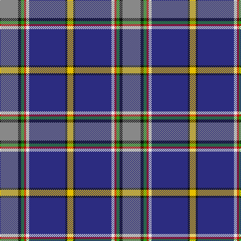

This page is one **sett** — a single exact thread-count. It belongs to the [tartan](/tartans/o18k3g3r2w3db36k2ly6/)
(the same proportion at any scale), whose colour order is pattern [RKGRWBKY](/stripes/rkgrwbky/).

Sourced from register-of-tartans.  It is a [8 stripe tartan](/stripes/stripes8/).

Original link https://www.tartanregister.gov.uk/tartanDetails.aspx?ref=2971

## Also known as

This cloth is also recorded under:

- M'Kleod Personal

3 attestations — the source records this cloth was collapsed from (oldest owns this page)

<ul>
<li>01/09/2003 — M'Kleod (register-of-tartans, <a href="https://www.tartanregister.gov.uk/tartanDetails.aspx?ref=2971">record</a>)</li>
<li>Sept 2003 — M'Kleod (Name) (tartans-authority, <a href="http://www.tartansauthority.com/tartan-ferret/display/5985/">record</a>)</li>
<li>undated — M'Kleod Personal Tartan Tartan Number: 5985. Earliest known date: 2003 The unusual spelling raised a query with the recording authority. The recording was passed on the basis that the design was categorised as personal. See products available Copyright © Blair Urquhart, Comrie, 2015 (house-of-tartan, <a href="http://www.house-of-tartan.scotland.net/house/TartanViewjs.asp?colr=Def&tnam=5985">record</a>)</li>
</ul>

## Register references

External register numbers recorded for this tartan.

- Scottish Register of Tartans: [2971](https://www.tartanregister.gov.uk/tartanDetails.aspx?ref=2971)
- Scottish Tartans Authority (ITI): 5985

## Thread count
N/36 K6 G6 R4 LN6 DB72 K4 Y/12

## Palette

Palette: <strong>Tartan Register</strong>
<table><thead><tr><th>Colour</th><th>Threads</th><th>Shade</th><th>Base</th><th>OKLCh</th></tr></thead><tbody><tr><td>N/</td><td style="text-align:right;font-variant-numeric:tabular-nums">36</td><td><code style="background-color:#888888;">#888888</code> <small style="color:#888">#888888</small></td><td>R <code style="background-color:#CC0000;">#CC0000</code></td><td><small style="color:#888">oklch(62.7% 0.000 89.9)</small></td></tr><tr><td>K</td><td style="text-align:right;font-variant-numeric:tabular-nums">6</td><td><code style="background-color:#101010;">#101010</code> <small style="color:#888">#101010</small></td><td>K <code style="background-color:#000000;">#000000</code></td><td><small style="color:#888">oklch(17.3% 0.000 89.9)</small></td></tr><tr><td>G</td><td style="text-align:right;font-variant-numeric:tabular-nums">6</td><td><code style="background-color:#289C18;">#289C18</code> <small style="color:#888">#289C18</small></td><td>G <code style="background-color:#006100;">#006100</code></td><td><small style="color:#888">oklch(60.6% 0.191 141.6)</small></td></tr><tr><td>R</td><td style="text-align:right;font-variant-numeric:tabular-nums">4</td><td><code style="background-color:#C80000;">#C80000</code> <small style="color:#888">#C80000</small></td><td>R <code style="background-color:#CC0000;">#CC0000</code></td><td><small style="color:#888">oklch(52.3% 0.215 29.2)</small></td></tr><tr><td>LN</td><td style="text-align:right;font-variant-numeric:tabular-nums">6</td><td><code style="background-color:#E0E0E0;">#E0E0E0</code> <small style="color:#888">#E0E0E0</small></td><td>W <code style="background-color:#F7F7F7;">#F7F7F7</code></td><td><small style="color:#888">oklch(90.7% 0.000 89.9)</small></td></tr><tr><td>DB</td><td style="text-align:right;font-variant-numeric:tabular-nums">72</td><td><code style="background-color:#2C2C80;">#2C2C80</code> <small style="color:#888">#2C2C80</small></td><td>B <code style="background-color:#2A418A;">#2A418A</code></td><td><small style="color:#888">oklch(35.0% 0.138 276.6)</small></td></tr><tr><td>K</td><td style="text-align:right;font-variant-numeric:tabular-nums">4</td><td><code style="background-color:#101010;">#101010</code> <small style="color:#888">#101010</small></td><td>K <code style="background-color:#000000;">#000000</code></td><td><small style="color:#888">oklch(17.3% 0.000 89.9)</small></td></tr><tr><td>Y/</td><td style="text-align:right;font-variant-numeric:tabular-nums">12</td><td><code style="background-color:#E8C000;">#E8C000</code> <small style="color:#888">#E8C000</small></td><td>Y <code style="background-color:#F2BF00;">#F2BF00</code></td><td><small style="color:#888">oklch(81.9% 0.168 93.7)</small></td></tr></tbody></table>

# Sample pattern

## Nearest tartans

The nearest existing variants by ΔTartan distance, with this tartan at the top so the swatches line up against it.

ΔTartan

Tartan

Sett

—

<a href="/ttd/edit/#slug=o18k3g3r2w3db36k2ly6~x2">M'Kleod</a> <a class="nn-out" href="/setts/s8/o18k3g3r2w3db36k2ly6~x2/" title="open its dictionary page">↗</a>

0.80

<a href="/ttd/edit/#slug=p8g31r4y4db17b64w4">Manx National</a> <a class="nn-out" href="/setts/s7/p8g31r4y4db17b64w4/" title="open its dictionary page">↗</a>

0.82

<a href="/ttd/edit/#slug=db39o3k14o3t14ly4w2dr2~x2">Unidentified, Lady's kilt</a> <a class="nn-out" href="/setts/s8/db39o3k14o3t14ly4w2dr2~x2/" title="open its dictionary page">↗</a>

1.08

<a href="/setts/s8/db39dyi3k14dyi3t14ly4w2dy2~x2/">Unidentified Lady's kilt</a>

1.09

<a href="/ttd/edit/#slug=dp4g13db5ly3t6ly3db5n6db28w2~x2">Highland, Blue (Corporate)</a> <a class="nn-out" href="/setts/s10/dp4g13db5ly3t6ly3db5n6db28w2~x2/" title="open its dictionary page">↗</a>

1.16

<a href="/ttd/edit/#slug=dp4db20ly1db2ly1db4ly4dg4w4r4~x2">Yukon (asymmetric)</a> <a class="nn-out" href="/setts/s10/dp4db20ly1db2ly1db4ly4dg4w4r4~x2/" title="open its dictionary page">↗</a>

1.19

<a href="/ttd/edit/#slug=k1ri4k1w3k1g7k2db16r2lo1~x2">Twempy</a> <a class="nn-out" href="/setts/s10/k1ri4k1w3k1g7k2db16r2lo1~x2/" title="open its dictionary page">↗</a>

1.20

<a href="/ttd/edit/#slug=db46ly4db4ly4db6k16o66w11r6">Scottish Association for N.S. (Corp)</a> <a class="nn-out" href="/setts/s9/db46ly4db4ly4db6k16o66w11r6/" title="open its dictionary page">↗</a>

1.23

<a href="/ttd/edit/#slug=r4w4g4ly4db4ly1db2ly1db20p4~x2">Yukon</a> <a class="nn-out" href="/setts/s10/r4w4g4ly4db4ly1db2ly1db20p4~x2/" title="open its dictionary page">↗</a>

1.23

<a href="/ttd/edit/#slug=dp4db20ly1db2ly1db4ly4g4w4r4~x2">Yukon District Tartan Tartan Number: 1907. Earliest known date: 1984 Lord Lyon records a symetrical version. See products available Copyright © Blair Urquhart, Comrie, 2015</a> <a class="nn-out" href="/setts/s10/dp4db20ly1db2ly1db4ly4g4w4r4~x2/" title="open its dictionary page">↗</a>

1.24

<a href="/ttd/edit/#slug=lo2k8db48lb9o12m3o9m3o12dg8lo2~x2">Heston (Name)</a> <a class="nn-out" href="/setts/s11/lo2k8db48lb9o12m3o9m3o12dg8lo2~x2/" title="open its dictionary page">↗</a>

## Neighbour map

Every grey dot is one of 14359 variants placed by the first two principal components of the ΔTartan feature space (44% of its variance). Red is this tartan; blue dots are its nearest — click one to open its page.

<svg viewBox="0 0 640 380" role="img" style="max-width:100%;height:auto;border:1px solid #e0e0e0;border-radius:4px;display:block" xmlns="http://www.w3.org/2000/svg"><image href="/nn/cloud.v1.png" width="640" height="380"/><a href="/setts/s7/p8g31r4y4db17b64w4/"><circle cx="208.9" cy="116.9" r="4" fill="#3465a4"><title>Manx National</title></circle></a><a href="/setts/s8/db39o3k14o3t14ly4w2dr2~x2/"><circle cx="207.4" cy="101.7" r="4" fill="#3465a4"><title>Unidentified, Lady's kilt</title></circle></a><a href="/setts/s8/db39dyi3k14dyi3t14ly4w2dy2~x2/"><circle cx="231.1" cy="115.3" r="4" fill="#3465a4"><title>Unidentified Lady's kilt</title></circle></a><a href="/setts/s10/dp4g13db5ly3t6ly3db5n6db28w2~x2/"><circle cx="205.2" cy="123.0" r="4" fill="#3465a4"><title>Highland, Blue (Corporate)</title></circle></a><a href="/setts/s10/dp4db20ly1db2ly1db4ly4dg4w4r4~x2/"><circle cx="248.0" cy="105.3" r="4" fill="#3465a4"><title>Yukon (asymmetric)</title></circle></a><a href="/setts/s10/k1ri4k1w3k1g7k2db16r2lo1~x2/"><circle cx="161.7" cy="96.1" r="4" fill="#3465a4"><title>Twempy</title></circle></a><a href="/setts/s9/db46ly4db4ly4db6k16o66w11r6/"><circle cx="194.0" cy="111.7" r="4" fill="#3465a4"><title>Scottish Association for N.S. (Corp)</title></circle></a><a href="/setts/s10/r4w4g4ly4db4ly1db2ly1db20p4~x2/"><circle cx="248.3" cy="103.8" r="4" fill="#3465a4"><title>Yukon</title></circle></a><a href="/setts/s10/dp4db20ly1db2ly1db4ly4g4w4r4~x2/"><circle cx="244.7" cy="102.5" r="4" fill="#3465a4"><title>Yukon District Tartan Tartan Number: 1907. Earliest known date: 1984 Lord Lyon records a symetrical version. See products available Copyright © Blair Urquhart, Comrie, 2015</title></circle></a><a href="/setts/s11/lo2k8db48lb9o12m3o9m3o12dg8lo2~x2/"><circle cx="191.2" cy="83.3" r="4" fill="#3465a4"><title>Heston (Name)</title></circle></a><circle cx="221.0" cy="96.8" r="5" fill="#c00000"/></svg>

ID: /setts/s8/o18k3g3r2w3db36k2ly6~x2/
