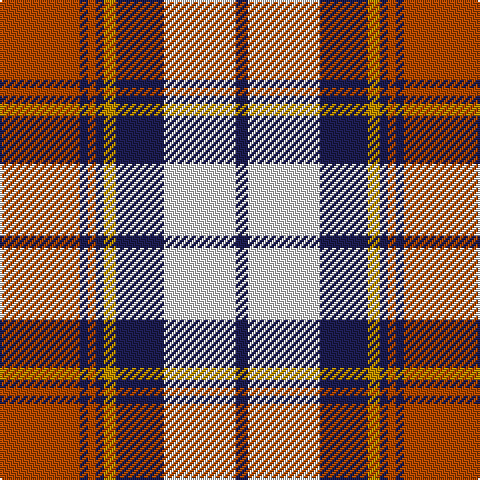

**Bands:** [RBRBYBWB](/stripes/rbrbybwb/) · **Stripes:** [O DB O DB LO DB W DB](/stripes/stripes8/) O DB O DB LO DB W DB

This was sourced from register-of-tartans.  It is a [8 band tartan](/bands/bands8/).

Original link https://www.tartanregister.gov.uk/tartanDetails.aspx?ref=1692

## Attestations

This cloth appears in 2 source records; the oldest owns this page.

- 01/01/1999 — Heriot (register-of-tartans, [record](https://www.tartanregister.gov.uk/tartanDetails.aspx?ref=1692))
- pre 1999 — Heriot (Fashion) (tartans-authority, [record](http://www.tartansauthority.com/tartan-ferret/display/7258/))

## Register references

External register numbers recorded for this tartan.

- Scottish Register of Tartans: [1692](https://www.tartanregister.gov.uk/tartanDetails.aspx?ref=1692)
- Scottish Tartans Authority (ITI): 7258
- Scottish Tartans World Register: 2776

## Thread count
DO/40 DB4 DO4 DB4 DY6 DB24 LN36 DB/6

## Palette
Each colour and its ΔE from the base-6 reference it is a variant of.

| Colour | Shade | Base | ΔE (OKLab) |
|---|---|---|---|
| DB | <code style="background-color:#1C1C50;">#1C1C50</code> `#1C1C50` | B <code style="background-color:#2A418A;">#2A418A</code> | 0.14 |
| DO | <code style="background-color:#B04800;">#B04800</code> `#B04800` | R <code style="background-color:#CC0000;">#CC0000</code> | 0.08 |
| DY | <code style="background-color:#BC8C00;">#BC8C00</code> `#BC8C00` | Y <code style="background-color:#F2BF00;">#F2BF00</code> | 0.16 |
| LN | <code style="background-color:#E0E0E0;">#E0E0E0</code> `#E0E0E0` | W <code style="background-color:#F7F7F7;">#F7F7F7</code> | 0.07 |
| LT | <code style="background-color:#A08858;">#A08858</code> `#A08858` | Y <code style="background-color:#F2BF00;">#F2BF00</code> | 0.21 |

# Sample pattern

## Nearest tartans

The nearest existing variants by ΔTartan distance.

1. [Bannock Bane M.407](/setts/s8/db4dy3db21dy2w14o22dy3o4~x2/) — ΔT 0.70
1. [MacPherson](/setts/s9/db1r1k8r1db1r1w8r1db1~x6/) — ΔT 0.94
1. [Unidentified (ex Tony Murray)](/setts/s8/dt8w22dt5w4k24r6k2r6~x2/) — ΔT 0.97
1. [Bannockbane, Dark Tan](/setts/s8/dr4ly2dr13ly1w8t13ly2t4~x2/) — ΔT 0.97
1. [Bannockbane](/setts/s8/dr2r2dr15r1w10o15r2o2~x2/) — ΔT 1.04
1. [Glasgow](/setts/s7/dg20r3y3r15w19dg3t2~x2/) — ΔT 1.08
1. [Bannock Bane M.405](/setts/s8/do4r3do21r2w14o22r3o4~x2/) — ΔT 1.09
1. [Unnamed](/setts/s10/r18ly2b6ly2b4ly2b12ly3r4g2~x2/) — ΔT 1.12
1. [Thompson Grey Family Tartan Tartan Number: 1611. Earliest known date: pre 2003 Designed for Lord Thomson of Fleet in 1958 based on a sample in the Moy Hall collection dating from the mid 19th century. The tartan is also suitable for MacTavishs and Thompsons, who claim descent from the Clan MacIntosh. See products available Copyright © Blair Urquhart, Comrie, 2015](/setts/s6/r2o20k5w10k10r2~x2/) — ΔT 1.13
1. [Holden Beige (Corporate)](/setts/s8/lb13k3lb3k3lb3k15lo18r3~x2/) — ΔT 1.14

## Neighbour map

Every grey dot is one of 14299 variants placed by the first two principal components of the ΔTartan feature space (44% of its variance). Red is this tartan; blue dots are its nearest — click one to open its page.

<svg viewBox="0 0 640 380" role="img" style="max-width:100%;height:auto;border:1px solid #e0e0e0;border-radius:4px;display:block" xmlns="http://www.w3.org/2000/svg"><image href="/nn/cloud.v1.png" width="640" height="380"/><a href="/setts/s8/db4dy3db21dy2w14o22dy3o4~x2/"><circle cx="159.4" cy="166.8" r="4" fill="#3465a4"><title>Bannock Bane M.407</title></circle></a><a href="/setts/s9/db1r1k8r1db1r1w8r1db1~x6/"><circle cx="151.8" cy="147.9" r="4" fill="#3465a4"><title>MacPherson</title></circle></a><a href="/setts/s8/dt8w22dt5w4k24r6k2r6~x2/"><circle cx="140.2" cy="164.5" r="4" fill="#3465a4"><title>Unidentified (ex Tony Murray)</title></circle></a><a href="/setts/s8/dr4ly2dr13ly1w8t13ly2t4~x2/"><circle cx="163.9" cy="170.8" r="4" fill="#3465a4"><title>Bannockbane, Dark Tan</title></circle></a><a href="/setts/s8/dr2r2dr15r1w10o15r2o2~x2/"><circle cx="191.4" cy="153.4" r="4" fill="#3465a4"><title>Bannockbane</title></circle></a><a href="/setts/s7/dg20r3y3r15w19dg3t2~x2/"><circle cx="134.8" cy="157.9" r="4" fill="#3465a4"><title>Glasgow</title></circle></a><a href="/setts/s8/do4r3do21r2w14o22r3o4~x2/"><circle cx="185.4" cy="171.2" r="4" fill="#3465a4"><title>Bannock Bane M.405</title></circle></a><a href="/setts/s10/r18ly2b6ly2b4ly2b12ly3r4g2~x2/"><circle cx="204.3" cy="167.1" r="4" fill="#3465a4"><title>Unnamed</title></circle></a><a href="/setts/s6/r2o20k5w10k10r2~x2/"><circle cx="174.6" cy="192.3" r="4" fill="#3465a4"><title>Thompson Grey Family Tartan Tartan Number: 1611. Earliest known date: pre 2003 Designed for Lord Thomson of Fleet in 1958 based on a sample in the Moy Hall collection dating from the mid 19th century. The tartan is also suitable for MacTavishs and Thompsons, who claim descent from the Clan MacIntosh. See products available Copyright © Blair Urquhart, Comrie, 2015</title></circle></a><a href="/setts/s8/lb13k3lb3k3lb3k15lo18r3~x2/"><circle cx="128.9" cy="191.2" r="4" fill="#3465a4"><title>Holden Beige (Corporate)</title></circle></a><circle cx="168.6" cy="161.4" r="5" fill="#c00000"/></svg>

ID: /setts/s8/o20db2o2db2lo3db12w18db3~x2/
