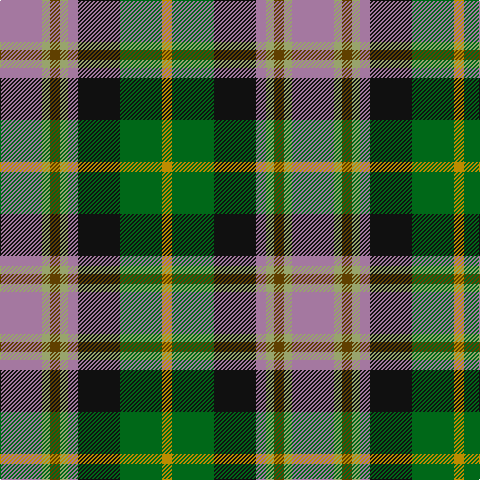

This page is one **sett** — a single exact thread-count. It belongs to the [tartan](/tartans/o21ly4dy5ly4o5k21g21lo5/)
(the same proportion at any scale), whose colour order is pattern [RYGYRKGY](/stripes/rygyrkgy/).

Sourced from tartans-authority.  It is a [8 stripe tartan](/stripes/stripes8/).

Original link http://www.tartansauthority.com/tartan-ferret/display/8262/

## Thread count
LP/42 LT8 T10 LT8 LP10 K42 G42 DY/10

## Palette

Palette: <strong>Tartan Register</strong> <small style="color:#888">(4 of 6 colours)</small>
<table><thead><tr><th>Colour</th><th>Threads</th><th>Shade</th><th>Base</th><th>OKLCh</th></tr></thead><tbody><tr><td>LP/</td><td style="text-align:right;font-variant-numeric:tabular-nums">42</td><td><code style="background-color:#A478A0;">#A478A0</code> <small style="color:#888">#A478A0</small></td><td>R <code style="background-color:#CC0000;">#CC0000</code></td><td><small style="color:#888">oklch(63.0% 0.078 329.6)</small></td></tr><tr><td>LT</td><td style="text-align:right;font-variant-numeric:tabular-nums">8</td><td><code style="background-color:#98A46C;">#98A46C</code> <small style="color:#888">#98A46C</small></td><td>Y <code style="background-color:#F2BF00;">#F2BF00</code></td><td><small style="color:#888">oklch(69.5% 0.078 118.3)</small></td></tr><tr><td>T</td><td style="text-align:right;font-variant-numeric:tabular-nums">10</td><td><code style="background-color:#604000;">#604000</code> <small style="color:#888">#604000</small></td><td>G <code style="background-color:#006100;">#006100</code></td><td><small style="color:#888">oklch(39.8% 0.083 76.8)</small></td></tr><tr><td>LT</td><td style="text-align:right;font-variant-numeric:tabular-nums">8</td><td><code style="background-color:#98A46C;">#98A46C</code> <small style="color:#888">#98A46C</small></td><td>Y <code style="background-color:#F2BF00;">#F2BF00</code></td><td><small style="color:#888">oklch(69.5% 0.078 118.3)</small></td></tr><tr><td>LP</td><td style="text-align:right;font-variant-numeric:tabular-nums">10</td><td><code style="background-color:#A478A0;">#A478A0</code> <small style="color:#888">#A478A0</small></td><td>R <code style="background-color:#CC0000;">#CC0000</code></td><td><small style="color:#888">oklch(63.0% 0.078 329.6)</small></td></tr><tr><td>K</td><td style="text-align:right;font-variant-numeric:tabular-nums">42</td><td><code style="background-color:#101010;">#101010</code> <small style="color:#888">#101010</small></td><td>K <code style="background-color:#000000;">#000000</code></td><td><small style="color:#888">oklch(17.3% 0.000 89.9)</small></td></tr><tr><td>G</td><td style="text-align:right;font-variant-numeric:tabular-nums">42</td><td><code style="background-color:#006818;">#006818</code> <small style="color:#888">#006818</small></td><td>G <code style="background-color:#006100;">#006100</code></td><td><small style="color:#888">oklch(45.0% 0.142 145.0)</small></td></tr><tr><td>DY/</td><td style="text-align:right;font-variant-numeric:tabular-nums">10</td><td><code style="background-color:#BC8C00;">#BC8C00</code> <small style="color:#888">#BC8C00</small></td><td>Y <code style="background-color:#F2BF00;">#F2BF00</code></td><td><small style="color:#888">oklch(66.8% 0.137 84.1)</small></td></tr></tbody></table>

# Sample pattern

## Nearest tartans

The nearest existing variants by ΔTartan distance, with this tartan at the top so the swatches line up against it.

ΔTartan

Tartan

Sett

—

<a href="/ttd/edit/#slug=o21ly4dy5ly4o5k21g21lo5~x2">Labrador Club of Scotland (Corporate</a> <a class="nn-out" href="/setts/s8/o21ly4dy5ly4o5k21g21lo5~x2/" title="open its dictionary page">↗</a>

0.49

<a href="/ttd/edit/#slug=m21lg4do5lg4m5k21g21lo5~x2">Caledonian Labrador Retrievers</a> <a class="nn-out" href="/setts/s8/m21lg4do5lg4m5k21g21lo5~x2/" title="open its dictionary page">↗</a>

0.81

<a href="/ttd/edit/#slug=m21db4dr5db4m5k21g21ly5~x2">Caledonian Labrador Retrievers</a> <a class="nn-out" href="/setts/s8/m21db4dr5db4m5k21g21ly5~x2/" title="open its dictionary page">↗</a>

0.94

<a href="/ttd/edit/#slug=k20ly4db13w4g30w4r13~x2">South Africa 1994 (Fashion)</a> <a class="nn-out" href="/setts/s7/k20ly4db13w4g30w4r13~x2/" title="open its dictionary page">↗</a>

0.99

<a href="/ttd/edit/#slug=w1db6g1db1g1db1g4m5lo1~x4">McLion</a> <a class="nn-out" href="/setts/s9/w1db6g1db1g1db1g4m5lo1~x4/" title="open its dictionary page">↗</a>

1.06

<a href="/ttd/edit/#slug=r3dg2n2dg3k6db2o10db2~x2">Burnfoot Check</a> <a class="nn-out" href="/setts/s8/r3dg2n2dg3k6db2o10db2~x2/" title="open its dictionary page">↗</a>

1.08

<a href="/ttd/edit/#slug=r22t6db10ly4r4w4g22db8ly3">Unnamed No 14</a> <a class="nn-out" href="/setts/s9/r22t6db10ly4r4w4g22db8ly3/" title="open its dictionary page">↗</a>

1.11

<a href="/ttd/edit/#slug=o4k1w1k1w1k1o4n2dg6r1~x6">Mitsukoshi Sendai</a> <a class="nn-out" href="/setts/s10/o4k1w1k1w1k1o4n2dg6r1~x6/" title="open its dictionary page">↗</a>

1.12

<a href="/ttd/edit/#slug=lo6r8k4w6y16k13lr19k5~x2">Kilkenny County Crest (Fashion)</a> <a class="nn-out" href="/setts/s8/lo6r8k4w6y16k13lr19k5~x2/" title="open its dictionary page">↗</a>

1.13

<a href="/ttd/edit/#slug=db8r2db3r4db13w2o13w2g13r4g4ly2g8~x2">Bowie</a> <a class="nn-out" href="/setts/s13/db8r2db3r4db13w2o13w2g13r4g4ly2g8~x2/" title="open its dictionary page">↗</a>

1.13

<a href="/ttd/edit/#slug=g13w2g10k5r13k3r5dt15o5~x2">Glen Chalmadale</a> <a class="nn-out" href="/setts/s9/g13w2g10k5r13k3r5dt15o5~x2/" title="open its dictionary page">↗</a>

## Neighbour map

Every grey dot is one of 14299 variants placed by the first two principal components of the ΔTartan feature space (44% of its variance). Red is this tartan; blue dots are its nearest — click one to open its page.

<svg viewBox="0 0 640 380" role="img" style="max-width:100%;height:auto;border:1px solid #e0e0e0;border-radius:4px;display:block" xmlns="http://www.w3.org/2000/svg"><image href="/nn/cloud.v1.png" width="640" height="380"/><a href="/setts/s8/m21lg4do5lg4m5k21g21lo5~x2/"><circle cx="64.6" cy="188.8" r="4" fill="#3465a4"><title>Caledonian Labrador Retrievers</title></circle></a><a href="/setts/s8/m21db4dr5db4m5k21g21ly5~x2/"><circle cx="62.8" cy="189.7" r="4" fill="#3465a4"><title>Caledonian Labrador Retrievers</title></circle></a><a href="/setts/s7/k20ly4db13w4g30w4r13~x2/"><circle cx="79.8" cy="179.3" r="4" fill="#3465a4"><title>South Africa 1994 (Fashion)</title></circle></a><a href="/setts/s9/w1db6g1db1g1db1g4m5lo1~x4/"><circle cx="120.7" cy="177.2" r="4" fill="#3465a4"><title>McLion</title></circle></a><a href="/setts/s8/r3dg2n2dg3k6db2o10db2~x2/"><circle cx="60.9" cy="192.3" r="4" fill="#3465a4"><title>Burnfoot Check</title></circle></a><a href="/setts/s9/r22t6db10ly4r4w4g22db8ly3/"><circle cx="89.6" cy="163.7" r="4" fill="#3465a4"><title>Unnamed No 14</title></circle></a><a href="/setts/s10/o4k1w1k1w1k1o4n2dg6r1~x6/"><circle cx="79.2" cy="165.4" r="4" fill="#3465a4"><title>Mitsukoshi Sendai</title></circle></a><a href="/setts/s8/lo6r8k4w6y16k13lr19k5~x2/"><circle cx="20.9" cy="203.2" r="4" fill="#3465a4"><title>Kilkenny County Crest (Fashion)</title></circle></a><a href="/setts/s13/db8r2db3r4db13w2o13w2g13r4g4ly2g8~x2/"><circle cx="89.1" cy="171.7" r="4" fill="#3465a4"><title>Bowie</title></circle></a><a href="/setts/s9/g13w2g10k5r13k3r5dt15o5~x2/"><circle cx="91.3" cy="197.2" r="4" fill="#3465a4"><title>Glen Chalmadale</title></circle></a><circle cx="70.7" cy="192.2" r="5" fill="#c00000"/></svg>

ID: /setts/s8/o21ly4dy5ly4o5k21g21lo5~x2/
