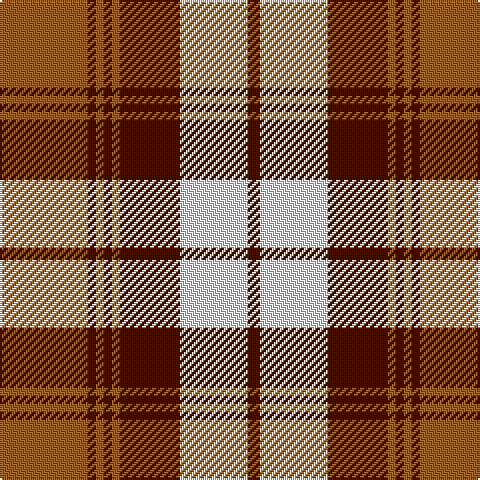

In pattern [BWBRBRBR](/stripes/bwbrbrbr/).

This was sourced from weddslist.  It is a [8 stripe tartan](/stripes/stripes8/).

Original link http://www.weddslist.com/cgi-bin/tartans/pg.pl?source=sts

## Also known as

This cloth is also recorded under:

- Turnberry, Manx Snaefell

## Thread count
LT/44 DR4 LT4 DR4 LT4 DR30 LN34 DR/6

## Palette
Each colour and the base-6 reference it is a variant of.

| Colour | Shade | Base |
|---|---|---|
| DR | <code style="background-color:#401000;">#401000</code> `oklch(25.3% 0.079 39.9)` <small>#401000</small> | B <code style="background-color:#2A418A;">#2A418A</code> |
| LN | <code style="background-color:#E0E0E0;">#E0E0E0</code> `oklch(90.7% 0.000 89.9)` <small>#E0E0E0</small> | W <code style="background-color:#F7F7F7;">#F7F7F7</code> |
| LT | <code style="background-color:#906030;">#906030</code> `oklch(53.1% 0.089 63.7)` <small>#906030</small> | R <code style="background-color:#CC0000;">#CC0000</code> |

# Sample pattern

## Nearest tartans

The nearest existing variants by ΔTartan distance.

1. [Turnberry Manx Snaefell Family Tartan Tartan Number: 1749. Earliest known date: 1981 A coincidence. See products available Copyright © Blair Urquhart, Comrie, 2015](/setts/s8/lo22do2lo2do2lo2do15w17do3~x2/) — ΔT 0.54
1. [Kildonan Brown (Fashion)](/setts/s9/dy22do3dy3do3dy3do9lb28do3lb6~x2/) — ΔT 0.65
1. [Lindsay](/setts/s9/g20db2g2db2g2db8r24db2r3~x2/) — ΔT 0.75
1. [Lindsay Dress Red](/setts/s9/dg26r3dg3r3dg3r11w27r3w5~x2/) — ΔT 1.00
1. [Snaefell (District)](/setts/s8/y22dy2y2dy2y2dy14w16dy3~x2/) — ΔT 1.07
1. [Orange Fanaticos (Corporate)](/setts/s7/t12lo75k22w12k22w16t8/) — ΔT 1.11
1. [Napier Rose](/setts/s11/k4w2k2w2k2w4k2w2k4lr12w1~x4/) — ΔT 1.12
1. [Glassary #2](/setts/s8/db4r1ly12r2ly2r12ly1db4~x4/) — ΔT 1.19
1. [Bannockbane](/setts/s8/dr2lo2dr15lo1w10o15lo2o2~x2/) — ΔT 1.20
1. [Bannockbane Orange Stripes](/setts/s8/do2lo2do15lo1w10lo15lo2lo2~x2/) — ΔT 1.23

## Neighbour map

Every grey dot is one of 14299 variants placed by the first two principal components of the ΔTartan feature space (44% of its variance). Red is this tartan; blue dots are its nearest — click one to open its page.

<svg viewBox="0 0 640 380" role="img" style="max-width:100%;height:auto;border:1px solid #e0e0e0;border-radius:4px;display:block" xmlns="http://www.w3.org/2000/svg"><image href="/nn/cloud.v1.png" width="640" height="380"/><a href="/setts/s8/lo22do2lo2do2lo2do15w17do3~x2/"><circle cx="222.6" cy="175.0" r="4" fill="#3465a4"><title>Turnberry Manx Snaefell Family Tartan Tartan Number: 1749. Earliest known date: 1981 A coincidence. See products available Copyright © Blair Urquhart, Comrie, 2015</title></circle></a><a href="/setts/s9/dy22do3dy3do3dy3do9lb28do3lb6~x2/"><circle cx="235.8" cy="179.7" r="4" fill="#3465a4"><title>Kildonan Brown (Fashion)</title></circle></a><a href="/setts/s9/g20db2g2db2g2db8r24db2r3~x2/"><circle cx="253.9" cy="161.2" r="4" fill="#3465a4"><title>Lindsay</title></circle></a><a href="/setts/s9/dg26r3dg3r3dg3r11w27r3w5~x2/"><circle cx="204.3" cy="169.6" r="4" fill="#3465a4"><title>Lindsay Dress Red</title></circle></a><a href="/setts/s8/y22dy2y2dy2y2dy14w16dy3~x2/"><circle cx="247.7" cy="189.7" r="4" fill="#3465a4"><title>Snaefell (District)</title></circle></a><a href="/setts/s7/t12lo75k22w12k22w16t8/"><circle cx="198.6" cy="172.1" r="4" fill="#3465a4"><title>Orange Fanaticos (Corporate)</title></circle></a><a href="/setts/s11/k4w2k2w2k2w4k2w2k4lr12w1~x4/"><circle cx="187.9" cy="159.5" r="4" fill="#3465a4"><title>Napier Rose</title></circle></a><a href="/setts/s8/db4r1ly12r2ly2r12ly1db4~x4/"><circle cx="235.8" cy="169.8" r="4" fill="#3465a4"><title>Glassary #2</title></circle></a><a href="/setts/s8/dr2lo2dr15lo1w10o15lo2o2~x2/"><circle cx="186.2" cy="149.5" r="4" fill="#3465a4"><title>Bannockbane</title></circle></a><a href="/setts/s8/do2lo2do15lo1w10lo15lo2lo2~x2/"><circle cx="185.6" cy="151.1" r="4" fill="#3465a4"><title>Bannockbane Orange Stripes</title></circle></a><circle cx="225.6" cy="175.6" r="5" fill="#c00000"/></svg>

ID: /setts/s8/o22dr2o2dr2o2dr15w17dr3~x2/
