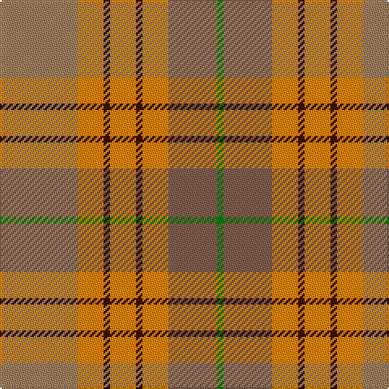

In pattern [GRYBYBYR](/stripes/grybybyr/).

This was sourced from weddslist.  It is a [8 stripe tartan](/stripes/stripes8/).

Original link http://www.weddslist.com/cgi-bin/tartans/pg.pl?source=sts

## Thread count
LT/48 O16 DR4 O16 DR4 O16 LTa30 G/4

## Palette
Each colour and the base-6 reference it is a variant of.

| Colour | Shade | Base |
|---|---|---|
| DR | <code style="background-color:#401000;">#401000</code> `oklch(25.3% 0.079 39.9)` <small>#401000</small> | B <code style="background-color:#2A418A;">#2A418A</code> |
| G | <code style="background-color:#008000;">#008000</code> `oklch(52.0% 0.177 142.5)` <small>#008000</small> | G <code style="background-color:#006100;">#006100</code> |
| LT | <code style="background-color:#A08060;">#A08060</code> `oklch(62.2% 0.060 66.3)` <small>#A08060</small> | R <code style="background-color:#CC0000;">#CC0000</code> |
| LTa | <code style="background-color:#806050;">#806050</code> `oklch(51.7% 0.049 47.8)` <small>#806050</small> | R <code style="background-color:#CC0000;">#CC0000</code> |
| O | <code style="background-color:#FF8500;">#FF8500</code> `oklch(74.0% 0.183 55.1)` <small>#FF8500</small> | Y <code style="background-color:#F2BF00;">#F2BF00</code> |

# Sample pattern

## Nearest tartans

The nearest existing variants by ΔTartan distance, with this tartan at the top so the swatches line up against it.

ΔTartan

Tartan

Sett

—

<a href="/ttd/edit/#slug=o24lo8dr2lo8dr2lo8o15g2~x2">Unidentified from Winnipeg</a> <a class="nn-out" href="/setts/s8/o24lo8dr2lo8dr2lo8o15g2~x2/" title="open its dictionary page">↗</a>

1.49

<a href="/ttd/edit/#slug=o2lo14o14r1o2r2b2r2o20b2~x4">Star Is Born, A</a> <a class="nn-out" href="/setts/s10/o2lo14o14r1o2r2b2r2o20b2~x4/" title="open its dictionary page">↗</a>

1.50

<a href="/ttd/edit/#slug=w6lr27dr6o40lr44w8o4">Susan G Komen 06</a> <a class="nn-out" href="/setts/s7/w6lr27dr6o40lr44w8o4/" title="open its dictionary page">↗</a>

1.58

<a href="/ttd/edit/#slug=r5lp2y24lr2y2lr2y6lr8r6lr8ly4~x2">Tasmanian</a> <a class="nn-out" href="/setts/s11/r5lp2y24lr2y2lr2y6lr8r6lr8ly4~x2/" title="open its dictionary page">↗</a>

1.62

<a href="/ttd/edit/#slug=lo36do15lo9r31lo5do4r16~x2">Manhattan Ethnic</a> <a class="nn-out" href="/setts/s7/lo36do15lo9r31lo5do4r16~x2/" title="open its dictionary page">↗</a>

1.63

<a href="/ttd/edit/#slug=lr2o1r10o12o10lr6r10o1lr2~x2">Unidentified, Sett</a> <a class="nn-out" href="/setts/s9/lr2o1r10o12o10lr6r10o1lr2~x2/" title="open its dictionary page">↗</a>

1.65

<a href="/ttd/edit/#slug=t24r27g20lo6g20r2w3~x2">Buchanhaven Heritage</a> <a class="nn-out" href="/setts/s7/t24r27g20lo6g20r2w3~x2/" title="open its dictionary page">↗</a>

1.68

<a href="/ttd/edit/#slug=k2y1dg12y12r12k1r2~x4">PSD: Operation Iraqi Freedom</a> <a class="nn-out" href="/setts/s7/k2y1dg12y12r12k1r2~x4/" title="open its dictionary page">↗</a>

1.69

<a href="/ttd/edit/#slug=g28lo18db4lo18r3r2r3r2r3r2r3~x2">Commonwealth Games - 2014</a> <a class="nn-out" href="/setts/s11/g28lo18db4lo18r3r2r3r2r3r2r3~x2/" title="open its dictionary page">↗</a>

1.69

<a href="/ttd/edit/#slug=o24r24w3g21ly2r1ly2o6r2~x2">Henry, W.A.</a> <a class="nn-out" href="/setts/s9/o24r24w3g21ly2r1ly2o6r2~x2/" title="open its dictionary page">↗</a>

1.69

<a href="/ttd/edit/#slug=lr2dy1r10o12dy10lr6r10dy1lr2~x2">Unidentified Sett</a> <a class="nn-out" href="/setts/s9/lr2dy1r10o12dy10lr6r10dy1lr2~x2/" title="open its dictionary page">↗</a>

## Neighbour map

Every grey dot is one of 14299 variants placed by the first two principal components of the ΔTartan feature space (44% of its variance). Red is this tartan; blue dots are its nearest — click one to open its page.

<svg viewBox="0 0 640 380" role="img" style="max-width:100%;height:auto;border:1px solid #e0e0e0;border-radius:4px;display:block" xmlns="http://www.w3.org/2000/svg"><image href="/nn/cloud.v1.png" width="640" height="380"/><a href="/setts/s10/o2lo14o14r1o2r2b2r2o20b2~x4/"><circle cx="276.8" cy="137.2" r="4" fill="#3465a4"><title>Star Is Born, A</title></circle></a><a href="/setts/s7/w6lr27dr6o40lr44w8o4/"><circle cx="219.1" cy="195.6" r="4" fill="#3465a4"><title>Susan G Komen 06</title></circle></a><a href="/setts/s11/r5lp2y24lr2y2lr2y6lr8r6lr8ly4~x2/"><circle cx="293.0" cy="176.1" r="4" fill="#3465a4"><title>Tasmanian</title></circle></a><a href="/setts/s7/lo36do15lo9r31lo5do4r16~x2/"><circle cx="245.0" cy="220.1" r="4" fill="#3465a4"><title>Manhattan Ethnic</title></circle></a><a href="/setts/s9/lr2o1r10o12o10lr6r10o1lr2~x2/"><circle cx="260.7" cy="220.0" r="4" fill="#3465a4"><title>Unidentified, Sett</title></circle></a><a href="/setts/s7/t24r27g20lo6g20r2w3~x2/"><circle cx="225.6" cy="208.4" r="4" fill="#3465a4"><title>Buchanhaven Heritage</title></circle></a><a href="/setts/s7/k2y1dg12y12r12k1r2~x4/"><circle cx="214.7" cy="201.1" r="4" fill="#3465a4"><title>PSD: Operation Iraqi Freedom</title></circle></a><a href="/setts/s11/g28lo18db4lo18r3r2r3r2r3r2r3~x2/"><circle cx="253.2" cy="138.9" r="4" fill="#3465a4"><title>Commonwealth Games - 2014</title></circle></a><a href="/setts/s9/o24r24w3g21ly2r1ly2o6r2~x2/"><circle cx="246.8" cy="137.5" r="4" fill="#3465a4"><title>Henry, W.A.</title></circle></a><a href="/setts/s9/lr2dy1r10o12dy10lr6r10dy1lr2~x2/"><circle cx="214.9" cy="191.1" r="4" fill="#3465a4"><title>Unidentified Sett</title></circle></a><circle cx="230.4" cy="187.7" r="5" fill="#c00000"/></svg>

ID: /setts/s8/o24lo8dr2lo8dr2lo8o15g2~x2/
