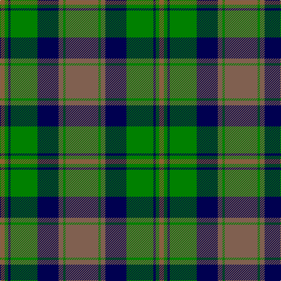

In pattern [RGBGBRGR](/stripes/rgbgbrgr/).

This was sourced from weddslist.  It is a [8 stripe tartan](/stripes/stripes8/).

Original link http://www.weddslist.com/cgi-bin/tartans/pg.pl?source=sts

## Thread count
LTa/56 G4 LTa8 DB36 G46 DB4 G6 LT/8

## Palette
Each colour and the base-6 reference it is a variant of.

| Colour | Shade | Base |
|---|---|---|
| DB | <code style="background-color:#000050;">#000050</code> `oklch(19.5% 0.135 264.1)` <small>#000050</small> | B <code style="background-color:#2A418A;">#2A418A</code> |
| G | <code style="background-color:#008000;">#008000</code> `oklch(52.0% 0.177 142.5)` <small>#008000</small> | G <code style="background-color:#006100;">#006100</code> |
| LT | <code style="background-color:#906030;">#906030</code> `oklch(53.1% 0.089 63.7)` <small>#906030</small> | R <code style="background-color:#CC0000;">#CC0000</code> |
| LTa | <code style="background-color:#806050;">#806050</code> `oklch(51.7% 0.049 47.8)` <small>#806050</small> | R <code style="background-color:#CC0000;">#CC0000</code> |

# Sample pattern

## Nearest tartans

The nearest existing variants by ΔTartan distance.

1. [Dunedin Chapter (Corporate)](/setts/s10/t39g3t3g20k3g20k3g3k20r3~x2/) — ΔT 0.73
1. [Maine Acadia](/setts/s9/g5k1lo2k1g19k15lo2y20g3~x2/) — ΔT 0.84
1. [Ayrton](/setts/s9/r3dg2k1dg20k9t20k1t2r3~x2/) — ΔT 0.89
1. [Cathcart](/setts/s8/g8lr4dt21g6r7g1r1g8~x2/) — ΔT 0.95
1. [MacNeish Htg](/setts/s11/r6g3k3o24g4k10g4r2g24r6g2~x2/) — ΔT 0.98
1. [MacTavish Hunting Clan Tartan Tartan Number: 232. Earliest known date: pre 2003 See Lord Thomson See products available Copyright © Blair Urquhart, Comrie, 2015](/setts/s6/t3dy26g4t13k13t2~x2/) — ΔT 1.02
1. [Durie (Clan)](/setts/s9/db12r1db1r1db1r4g12ly1g2~x4/) — ΔT 1.03
1. [Aitchison (Personal)](/setts/s9/k2dt3k2dt18k11dt2k11g25dp2~x2/) — ΔT 1.03
1. [McWilliams Wedding (Personal)](/setts/s9/r2g10k12n1ly2n14k1n1g2~x2/) — ΔT 1.03
1. [Norwich No.052](/setts/s8/g19w1db12t2db2t2db2t16~x2/) — ΔT 1.04

## Neighbour map

Every grey dot is one of 14299 variants placed by the first two principal components of the ΔTartan feature space (44% of its variance). Red is this tartan; blue dots are its nearest — click one to open its page.

<svg viewBox="0 0 640 380" role="img" style="max-width:100%;height:auto;border:1px solid #e0e0e0;border-radius:4px;display:block" xmlns="http://www.w3.org/2000/svg"><image href="/nn/cloud.v1.png" width="640" height="380"/><a href="/setts/s10/t39g3t3g20k3g20k3g3k20r3~x2/"><circle cx="231.5" cy="176.8" r="4" fill="#3465a4"><title>Dunedin Chapter (Corporate)</title></circle></a><a href="/setts/s9/g5k1lo2k1g19k15lo2y20g3~x2/"><circle cx="252.7" cy="172.2" r="4" fill="#3465a4"><title>Maine Acadia</title></circle></a><a href="/setts/s9/r3dg2k1dg20k9t20k1t2r3~x2/"><circle cx="236.8" cy="158.8" r="4" fill="#3465a4"><title>Ayrton</title></circle></a><a href="/setts/s8/g8lr4dt21g6r7g1r1g8~x2/"><circle cx="271.1" cy="192.5" r="4" fill="#3465a4"><title>Cathcart</title></circle></a><a href="/setts/s11/r6g3k3o24g4k10g4r2g24r6g2~x2/"><circle cx="234.9" cy="177.7" r="4" fill="#3465a4"><title>MacNeish Htg</title></circle></a><a href="/setts/s6/t3dy26g4t13k13t2~x2/"><circle cx="251.9" cy="214.7" r="4" fill="#3465a4"><title>MacTavish Hunting Clan Tartan Tartan Number: 232. Earliest known date: pre 2003 See Lord Thomson See products available Copyright © Blair Urquhart, Comrie, 2015</title></circle></a><a href="/setts/s9/db12r1db1r1db1r4g12ly1g2~x4/"><circle cx="267.4" cy="182.6" r="4" fill="#3465a4"><title>Durie (Clan)</title></circle></a><a href="/setts/s9/k2dt3k2dt18k11dt2k11g25dp2~x2/"><circle cx="221.5" cy="198.9" r="4" fill="#3465a4"><title>Aitchison (Personal)</title></circle></a><a href="/setts/s9/r2g10k12n1ly2n14k1n1g2~x2/"><circle cx="191.3" cy="160.0" r="4" fill="#3465a4"><title>McWilliams Wedding (Personal)</title></circle></a><a href="/setts/s8/g19w1db12t2db2t2db2t16~x2/"><circle cx="236.3" cy="175.5" r="4" fill="#3465a4"><title>Norwich No.052</title></circle></a><circle cx="231.6" cy="188.1" r="5" fill="#c00000"/></svg>

ID: /setts/s8/o28g2o4db18g23db2g3o4~x2/
