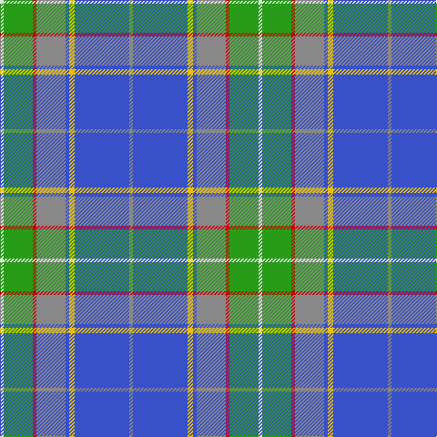

**Bands:** [RBYBRRGW](/stripes/rbybrrgw/) · **Stripes:** [O B LY B O R G W](/stripes/stripes8/) O B LY B O R G W

This was sourced from tartans-authority.  It is a [8 band tartan](/bands/bands8/).

Original link http://www.tartansauthority.com/tartan-ferret/display/8259/

## Thread count
LN/4 G32 R4 N32 B4 Y6 B60 N/4

## Palette
Each colour and its ΔE from the base-6 reference it is a variant of.

| Colour | Shade | Base | ΔE (OKLab) |
|---|---|---|---|
| B | <code style="background-color:#3850C8;">#3850C8</code> `#3850C8` | B <code style="background-color:#2A418A;">#2A418A</code> | 0.11 |
| G | <code style="background-color:#289C18;">#289C18</code> `#289C18` | G <code style="background-color:#006100;">#006100</code> | 0.19 |
| LN | <code style="background-color:#E0E0E0;">#E0E0E0</code> `#E0E0E0` | W <code style="background-color:#F7F7F7;">#F7F7F7</code> | 0.07 |
| N | <code style="background-color:#888888;">#888888</code> `#888888` | R <code style="background-color:#CC0000;">#CC0000</code> | 0.24 |
| R | <code style="background-color:#C80000;">#C80000</code> `#C80000` | R <code style="background-color:#CC0000;">#CC0000</code> | 0.01 |
| Y | <code style="background-color:#E8C000;">#E8C000</code> `#E8C000` | Y <code style="background-color:#F2BF00;">#F2BF00</code> | 0.02 |

# Sample pattern

## Nearest tartans

The nearest existing variants by ΔTartan distance.

1. [O'Donohue Personal)](/setts/s10/b24w2b6g9r6b3r6g35k2ly2~x2/) — ΔT 0.85
1. [Hek Family (Sunningdale, Berwick on Tweed)](/setts/s9/lt1w2g12k2lt2k2n15lt2ly1~x2/) — ΔT 0.96
1. [Texas Blue Bonnet](/setts/s11/g5r1db10w1r1w1t10w1t10w1ly1~x4/) — ΔT 1.02
1. [Queensferry High (School)](/setts/s9/lr5lb3lb7lr5lb27b8dt43w3lb3/) — ΔT 1.08
1. [Manx National District Tartan Tartan Number: 186. Earliest known date: pre 2003 Thread count of the sample donated by Dr. D.G. Teall in 1987, when the cloth was commercially available on the island. It differs slightly from the sett recorded by Stewart in 1959, but the design is essentially the same. D C Stewart's Nomindex (Name Index) notes. Th is seven-colour tartan was designed by Miss Patricia 'Paddy' McQaid as the Manx National Tartan at the instigation in 1958 of the Rt. Hon the Lord Sempill who was Chairman of Ellynyn ny Gael - a Manx Gaelic Society. The colours were explained as follows: light blue of the sky, dark blue of the sea, green of the hills & valleys, white of the cottages, purple of the heather, gold of the gorse in bloom and reddish brown of the bracken. The tartan was registered with the Tartans Society on 3rd November 1959 and Paddy McQuaid held the sole rights to production for some years. The tartan was very popular with the Royal Family of the day. See products available Copyright © Blair Urquhart, Comrie, 2015](/setts/s7/dp2g8r1ly1db6t15w1~x4/) — ΔT 1.10
1. [Los Angeles](/setts/s8/ly4db24t5g2db3k5t33r2~x2/) — ΔT 1.12
1. [South Canterbury Jubillee (Corporate](/setts/s8/t36db5g5w2r4w2r9w22~x2/) — ΔT 1.12
1. [McCartney (Night)](/setts/s11/db4g2db24g8b2r2b2ly2b10db2w3~x2/) — ΔT 1.13
1. [Glen Lyon (Fashion)](/setts/s7/lo3n14k5w1o11db1o3~x4/) — ΔT 1.22
1. [Nova Scotia (Province)](/setts/s9/w2db20g2g2g2g4g8ly2r1~x2/) — ΔT 1.24

## Neighbour map

Every grey dot is one of 14313 variants placed by the first two principal components of the ΔTartan feature space (44% of its variance). Red is this tartan; blue dots are its nearest — click one to open its page.

<svg viewBox="0 0 640 380" role="img" style="max-width:100%;height:auto;border:1px solid #e0e0e0;border-radius:4px;display:block" xmlns="http://www.w3.org/2000/svg"><image href="/nn/cloud.v1.png" width="640" height="380"/><a href="/setts/s10/b24w2b6g9r6b3r6g35k2ly2~x2/"><circle cx="241.8" cy="122.8" r="4" fill="#3465a4"><title>O'Donohue Personal)</title></circle></a><a href="/setts/s9/lt1w2g12k2lt2k2n15lt2ly1~x2/"><circle cx="182.5" cy="123.8" r="4" fill="#3465a4"><title>Hek Family (Sunningdale, Berwick on Tweed)</title></circle></a><a href="/setts/s11/g5r1db10w1r1w1t10w1t10w1ly1~x4/"><circle cx="200.6" cy="138.4" r="4" fill="#3465a4"><title>Texas Blue Bonnet</title></circle></a><a href="/setts/s9/lr5lb3lb7lr5lb27b8dt43w3lb3/"><circle cx="197.0" cy="122.1" r="4" fill="#3465a4"><title>Queensferry High (School)</title></circle></a><a href="/setts/s7/dp2g8r1ly1db6t15w1~x4/"><circle cx="186.2" cy="130.7" r="4" fill="#3465a4"><title>Manx National District Tartan Tartan Number: 186. Earliest known date: pre 2003 Thread count of the sample donated by Dr. D.G. Teall in 1987, when the cloth was commercially available on the island. It differs slightly from the sett recorded by Stewart in 1959, but the design is essentially the same. D C Stewart's Nomindex (Name Index) notes. Th is seven-colour tartan was designed by Miss Patricia 'Paddy' McQaid as the Manx National Tartan at the instigation in 1958 of the Rt. Hon the Lord Sempill who was Chairman of Ellynyn ny Gael - a Manx Gaelic Society. The colours were explained as follows: light blue of the sky, dark blue of the sea, green of the hills &amp; valleys, white of the cottages, purple of the heather, gold of the gorse in bloom and reddish brown of the bracken. The tartan was registered with the Tartans Society on 3rd November 1959 and Paddy McQuaid held the sole rights to production for some years. The tartan was very popular with the Royal Family of the day. See products available Copyright © Blair Urquhart, Comrie, 2015</title></circle></a><a href="/setts/s8/ly4db24t5g2db3k5t33r2~x2/"><circle cx="251.3" cy="128.4" r="4" fill="#3465a4"><title>Los Angeles</title></circle></a><a href="/setts/s8/t36db5g5w2r4w2r9w22~x2/"><circle cx="194.7" cy="115.3" r="4" fill="#3465a4"><title>South Canterbury Jubillee (Corporate</title></circle></a><a href="/setts/s11/db4g2db24g8b2r2b2ly2b10db2w3~x2/"><circle cx="231.5" cy="128.8" r="4" fill="#3465a4"><title>McCartney (Night)</title></circle></a><a href="/setts/s7/lo3n14k5w1o11db1o3~x4/"><circle cx="181.6" cy="163.9" r="4" fill="#3465a4"><title>Glen Lyon (Fashion)</title></circle></a><a href="/setts/s9/w2db20g2g2g2g4g8ly2r1~x2/"><circle cx="231.0" cy="114.0" r="4" fill="#3465a4"><title>Nova Scotia (Province)</title></circle></a><circle cx="216.4" cy="139.3" r="5" fill="#c00000"/></svg>

ID: /setts/s8/o2b30ly3b2o16r2g16w2~x2/
