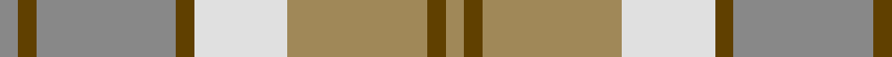
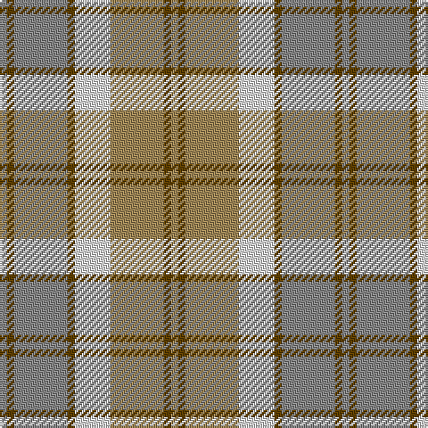

This page is one **sett** — a single exact thread-count. It belongs to the [tartan](/tartans/n2t2n15t2ln10lt15t2lt2/)
(the same proportion at any scale), whose colour order is pattern [RGRGWYGY](/stripes/rgrgwygy/).

Sourced from register-of-tartans.  It is a [8 stripe tartan](/stripes/stripes8/).

Original link https://www.tartanregister.gov.uk/tartanDetails.aspx?ref=199

## Register references

External register numbers recorded for this tartan.

- Scottish Register of Tartans: [199](https://www.tartanregister.gov.uk/tartanDetails.aspx?ref=199)
- Scottish Tartans Authority (ITI): 1306
- Scottish Tartans World Register: 1306

## Thread count
N/4 T4 N30 T4 LN20 LT30 T4 LT/4

## Palette
Each colour and the base-6 reference it is a variant of.

| Colour | Shade | Base |
|---|---|---|
| LN | <code style="background-color:#E0E0E0;">#E0E0E0</code> `oklch(90.7% 0.000 89.9)` <small>#E0E0E0</small> | W <code style="background-color:#F7F7F7;">#F7F7F7</code> |
| LT | <code style="background-color:#A08858;">#A08858</code> `oklch(63.7% 0.071 84.0)` <small>#A08858</small> | Y <code style="background-color:#F2BF00;">#F2BF00</code> |
| N | <code style="background-color:#888888;">#888888</code> `oklch(62.7% 0.000 89.9)` <small>#888888</small> | R <code style="background-color:#CC0000;">#CC0000</code> |
| T | <code style="background-color:#604000;">#604000</code> `oklch(39.8% 0.083 76.8)` <small>#604000</small> | G <code style="background-color:#006100;">#006100</code> |

# Sample pattern

## Nearest tartans

The nearest existing variants by ΔTartan distance, with this tartan at the top so the swatches line up against it.

ΔTartan

Tartan

Sett

—

<a href="/ttd/edit/#slug=o2dy2o15dy2w10lo15dy2lo2~x2">Bannockbane Grey #2</a> <a class="nn-out" href="/setts/s8/o2dy2o15dy2w10lo15dy2lo2~x2/" title="open its dictionary page">↗</a>

0.44

<a href="/ttd/edit/#slug=o2o2o15w10o2y15o2y2~x2">Bannockbane, Grey</a> <a class="nn-out" href="/setts/s8/o2o2o15w10o2y15o2y2~x2/" title="open its dictionary page">↗</a>

1.13

<a href="/ttd/edit/#slug=lb4n2lb18r2n5o16r2o2r2o2~x2">Clyde Trade Tartan Tartan Number: 1296. Earliest known date: pre 1992 See Strathclyde District See products available Copyright © Blair Urquhart, Comrie, 2015</a> <a class="nn-out" href="/setts/s10/lb4n2lb18r2n5o16r2o2r2o2~x2/" title="open its dictionary page">↗</a>

1.27

<a href="/ttd/edit/#slug=lb4n2lb18r2n5y16r2y2r2y2~x2">Clyde</a> <a class="nn-out" href="/setts/s10/lb4n2lb18r2n5y16r2y2r2y2~x2/" title="open its dictionary page">↗</a>

1.37

<a href="/ttd/edit/#slug=b3r2o16r2b3r2g16r2b3~x4">MacPherson Gathering 1996</a> <a class="nn-out" href="/setts/s9/b3r2o16r2b3r2g16r2b3~x4/" title="open its dictionary page">↗</a>

1.67

<a href="/ttd/edit/#slug=y25w2t4lo7t4w2lo25w2t4lo7~x2">O'Monaghan (Personal)</a> <a class="nn-out" href="/setts/s10/y25w2t4lo7t4w2lo25w2t4lo7~x2/" title="open its dictionary page">↗</a>

1.71

<a href="/ttd/edit/#slug=y2w19lr2w2y3w3y3lr6ly25w2~x2">Llama (Fashion)</a> <a class="nn-out" href="/setts/s10/y2w19lr2w2y3w3y3lr6ly25w2~x2/" title="open its dictionary page">↗</a>

1.72

<a href="/ttd/edit/#slug=t24r27g20lo6g20r2w3~x2">Buchanhaven Heritage</a> <a class="nn-out" href="/setts/s7/t24r27g20lo6g20r2w3~x2/" title="open its dictionary page">↗</a>

1.74

<a href="/ttd/edit/#slug=o2w1lo17o14w15o2w2~x2">North American Sheep Breeders Association</a> <a class="nn-out" href="/setts/s7/o2w1lo17o14w15o2w2~x2/" title="open its dictionary page">↗</a>

1.74

<a href="/ttd/edit/#slug=n2w2ly7lb14n2w2~x2">Cairngorm</a> <a class="nn-out" href="/setts/s6/n2w2ly7lb14n2w2~x2/" title="open its dictionary page">↗</a>

1.79

<a href="/ttd/edit/#slug=g5lb15lb11lb2lb1lb1g4~x4">Highlands Country Club (Corporate)</a> <a class="nn-out" href="/setts/s7/g5lb15lb11lb2lb1lb1g4~x4/" title="open its dictionary page">↗</a>

## Neighbour map

Every grey dot is one of 14299 variants placed by the first two principal components of the ΔTartan feature space (44% of its variance). Red is this tartan; blue dots are its nearest — click one to open its page.

<svg viewBox="0 0 640 380" role="img" style="max-width:100%;height:auto;border:1px solid #e0e0e0;border-radius:4px;display:block" xmlns="http://www.w3.org/2000/svg"><image href="/nn/cloud.v1.png" width="640" height="380"/><a href="/setts/s8/o2o2o15w10o2y15o2y2~x2/"><circle cx="220.7" cy="217.2" r="4" fill="#3465a4"><title>Bannockbane, Grey</title></circle></a><a href="/setts/s10/lb4n2lb18r2n5o16r2o2r2o2~x2/"><circle cx="263.5" cy="186.9" r="4" fill="#3465a4"><title>Clyde Trade Tartan Tartan Number: 1296. Earliest known date: pre 1992 See Strathclyde District See products available Copyright © Blair Urquhart, Comrie, 2015</title></circle></a><a href="/setts/s10/lb4n2lb18r2n5y16r2y2r2y2~x2/"><circle cx="250.1" cy="180.2" r="4" fill="#3465a4"><title>Clyde</title></circle></a><a href="/setts/s9/b3r2o16r2b3r2g16r2b3~x4/"><circle cx="227.3" cy="212.1" r="4" fill="#3465a4"><title>MacPherson Gathering 1996</title></circle></a><a href="/setts/s10/y25w2t4lo7t4w2lo25w2t4lo7~x2/"><circle cx="212.4" cy="171.2" r="4" fill="#3465a4"><title>O'Monaghan (Personal)</title></circle></a><a href="/setts/s10/y2w19lr2w2y3w3y3lr6ly25w2~x2/"><circle cx="265.8" cy="155.7" r="4" fill="#3465a4"><title>Llama (Fashion)</title></circle></a><a href="/setts/s7/t24r27g20lo6g20r2w3~x2/"><circle cx="225.6" cy="208.4" r="4" fill="#3465a4"><title>Buchanhaven Heritage</title></circle></a><a href="/setts/s7/o2w1lo17o14w15o2w2~x2/"><circle cx="274.9" cy="201.5" r="4" fill="#3465a4"><title>North American Sheep Breeders Association</title></circle></a><a href="/setts/s6/n2w2ly7lb14n2w2~x2/"><circle cx="262.9" cy="213.8" r="4" fill="#3465a4"><title>Cairngorm</title></circle></a><a href="/setts/s7/g5lb15lb11lb2lb1lb1g4~x4/"><circle cx="241.3" cy="191.3" r="4" fill="#3465a4"><title>Highlands Country Club (Corporate)</title></circle></a><circle cx="214.4" cy="214.2" r="5" fill="#c00000"/></svg>

ID: /setts/s8/o2dy2o15dy2w10lo15dy2lo2~x2/
