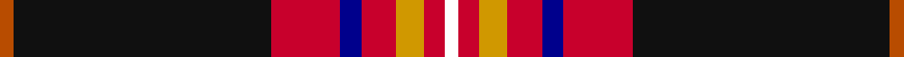

In pattern [RKRBRYRW](/stripes/rkrbryrw/).

This was sourced from register-of-tartans.  It is a [8 stripe tartan](/stripes/stripes8/).

Original link https://www.tartanregister.gov.uk/tartanDetails.aspx?ref=11059

## Register references

External register numbers recorded for this tartan.

- Scottish Register of Tartans: [11059](https://www.tartanregister.gov.uk/tartanDetails.aspx?ref=11059)

## Thread count
DO/4 K74 R20 DB6 R10 DY8 R6 W/4

## Palette
Each colour and the base-6 reference it is a variant of.

| Colour | Shade | Base |
|---|---|---|
| DB | <code style="background-color:#00008C;">#00008C</code> `oklch(28.9% 0.200 264.1)` <small>#00008C</small> | B <code style="background-color:#2A418A;">#2A418A</code> |
| DO | <code style="background-color:#B84C00;">#B84C00</code> `oklch(55.1% 0.156 45.5)` <small>#B84C00</small> | R <code style="background-color:#CC0000;">#CC0000</code> |
| DY | <code style="background-color:#D09800;">#D09800</code> `oklch(71.4% 0.147 82.1)` <small>#D09800</small> | Y <code style="background-color:#F2BF00;">#F2BF00</code> |
| K | <code style="background-color:#101010;">#101010</code> `oklch(17.3% 0.000 89.9)` <small>#101010</small> | K <code style="background-color:#000000;">#000000</code> |
| R | <code style="background-color:#C8002C;">#C8002C</code> `oklch(52.6% 0.212 22.0)` <small>#C8002C</small> | R <code style="background-color:#CC0000;">#CC0000</code> |
| W | <code style="background-color:#FFFFFF;">#FFFFFF</code> `oklch(100.0% 0.000 89.9)` <small>#FFFFFF</small> | W <code style="background-color:#F7F7F7;">#F7F7F7</code> |

# Sample pattern

## Nearest tartans

The nearest existing variants by ΔTartan distance, with this tartan at the top so the swatches line up against it.

ΔTartan

Tartan

Sett

—

<a href="/ttd/edit/#slug=o2k37r10db3r5lo4r3w2~x2">Westin Kierland</a> <a class="nn-out" href="/setts/s8/o2k37r10db3r5lo4r3w2~x2/" title="open its dictionary page">↗</a>

0.26

<a href="/ttd/edit/#slug=o2k37r10db3r5ly4r3w2~x2">Westin Kierland</a> <a class="nn-out" href="/setts/s8/o2k37r10db3r5ly4r3w2~x2/" title="open its dictionary page">↗</a>

0.56

<a href="/ttd/edit/#slug=lo2k38r10db3r5ly4r3lb2~x2">Westin Kierland (Corporate)</a> <a class="nn-out" href="/setts/s8/lo2k38r10db3r5ly4r3lb2~x2/" title="open its dictionary page">↗</a>

0.83

<a href="/ttd/edit/#slug=dr62ly7g7r3w3db13w3r5~x2">Legion of Frontiersmen</a> <a class="nn-out" href="/setts/s8/dr62ly7g7r3w3db13w3r5~x2/" title="open its dictionary page">↗</a>

0.87

<a href="/ttd/edit/#slug=do62ly7g7r3w3db13w3r5~x2">Legion of Frontiersmen</a> <a class="nn-out" href="/setts/s8/do62ly7g7r3w3db13w3r5~x2/" title="open its dictionary page">↗</a>

1.25

<a href="/ttd/edit/#slug=db6w3r14k3lo2k2w2k38w2k2lo2~x2">Norwegian Night</a> <a class="nn-out" href="/setts/s11/db6w3r14k3lo2k2w2k38w2k2lo2~x2/" title="open its dictionary page">↗</a>

1.30

<a href="/ttd/edit/#slug=dp3lo2r19r4dp6k36dp2lo3~x2">Hyland Evening (Personal)</a> <a class="nn-out" href="/setts/s8/dp3lo2r19r4dp6k36dp2lo3~x2/" title="open its dictionary page">↗</a>

1.31

<a href="/ttd/edit/#slug=g18g2db5r45db3db18db3r5w2">MacNiven</a> <a class="nn-out" href="/setts/s9/g18g2db5r45db3db18db3r5w2/" title="open its dictionary page">↗</a>

1.33

<a href="/ttd/edit/#slug=k60w2r10dg6w4r15ly10~x2">Iberia Dress, Black (Fashion)</a> <a class="nn-out" href="/setts/s7/k60w2r10dg6w4r15ly10~x2/" title="open its dictionary page">↗</a>

1.36

<a href="/ttd/edit/#slug=r8m12k6m33k72o6k8w6">Sreijsener (Name)</a> <a class="nn-out" href="/setts/s8/r8m12k6m33k72o6k8w6/" title="open its dictionary page">↗</a>

1.40

<a href="/ttd/edit/#slug=g18g2db5r45lb3db18lb3r8lb2~x2">MacNiven</a> <a class="nn-out" href="/setts/s9/g18g2db5r45lb3db18lb3r8lb2~x2/" title="open its dictionary page">↗</a>

## Neighbour map

Every grey dot is one of 14299 variants placed by the first two principal components of the ΔTartan feature space (44% of its variance). Red is this tartan; blue dots are its nearest — click one to open its page.

<svg viewBox="0 0 640 380" role="img" style="max-width:100%;height:auto;border:1px solid #e0e0e0;border-radius:4px;display:block" xmlns="http://www.w3.org/2000/svg"><image href="/nn/cloud.v1.png" width="640" height="380"/><a href="/setts/s8/o2k37r10db3r5ly4r3w2~x2/"><circle cx="297.4" cy="100.3" r="4" fill="#3465a4"><title>Westin Kierland</title></circle></a><a href="/setts/s8/lo2k38r10db3r5ly4r3lb2~x2/"><circle cx="313.3" cy="108.5" r="4" fill="#3465a4"><title>Westin Kierland (Corporate)</title></circle></a><a href="/setts/s8/dr62ly7g7r3w3db13w3r5~x2/"><circle cx="326.8" cy="92.1" r="4" fill="#3465a4"><title>Legion of Frontiersmen</title></circle></a><a href="/setts/s8/do62ly7g7r3w3db13w3r5~x2/"><circle cx="316.0" cy="91.1" r="4" fill="#3465a4"><title>Legion of Frontiersmen</title></circle></a><a href="/setts/s11/db6w3r14k3lo2k2w2k38w2k2lo2~x2/"><circle cx="317.5" cy="90.7" r="4" fill="#3465a4"><title>Norwegian Night</title></circle></a><a href="/setts/s8/dp3lo2r19r4dp6k36dp2lo3~x2/"><circle cx="254.5" cy="113.0" r="4" fill="#3465a4"><title>Hyland Evening (Personal)</title></circle></a><a href="/setts/s9/g18g2db5r45db3db18db3r5w2/"><circle cx="257.3" cy="94.2" r="4" fill="#3465a4"><title>MacNiven</title></circle></a><a href="/setts/s7/k60w2r10dg6w4r15ly10~x2/"><circle cx="316.5" cy="109.3" r="4" fill="#3465a4"><title>Iberia Dress, Black (Fashion)</title></circle></a><a href="/setts/s8/r8m12k6m33k72o6k8w6/"><circle cx="319.5" cy="153.6" r="4" fill="#3465a4"><title>Sreijsener (Name)</title></circle></a><a href="/setts/s9/g18g2db5r45lb3db18lb3r8lb2~x2/"><circle cx="281.0" cy="109.9" r="4" fill="#3465a4"><title>MacNiven</title></circle></a><circle cx="300.3" cy="102.1" r="5" fill="#c00000"/></svg>

ID: /setts/s8/o2k37r10db3r5lo4r3w2~x2/
