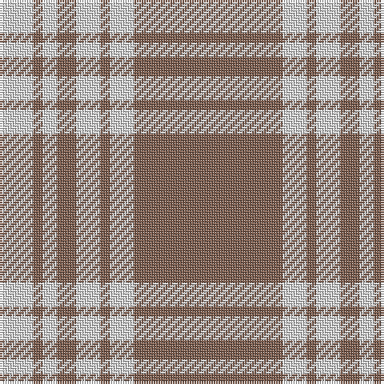

This page is one **sett** — a single exact thread-count. It belongs to the [tartan](/tartans/lt31ln5lt2ln5lt4ln3lt2ln7/)
(the same proportion at any scale), whose colour order is pattern [RWRWRWRW](/stripes/rwrwrwrw/).

Sourced from weddslist.  It is a [8 stripe tartan](/stripes/stripes8/).

Original link http://www.weddslist.com/cgi-bin/tartans/pg.pl?source=sts

## Thread count
LT/62 LN10 LT4 LN10 LT8 LN6 LT4 LN/14

## Palette
Each colour and the base-6 reference it is a variant of.

| Colour | Shade | Base |
|---|---|---|
| LN | <code style="background-color:#E0E0E0;">#E0E0E0</code> `oklch(90.7% 0.000 89.9)` <small>#E0E0E0</small> | W <code style="background-color:#F7F7F7;">#F7F7F7</code> |
| LT | <code style="background-color:#806050;">#806050</code> `oklch(51.7% 0.049 47.8)` <small>#806050</small> | R <code style="background-color:#CC0000;">#CC0000</code> |

# Sample pattern

## Nearest tartans

The nearest existing variants by ΔTartan distance, with this tartan at the top so the swatches line up against it.

ΔTartan

Tartan

Sett

—

<a href="/ttd/edit/#slug=o31w5o2w5o4w3o2w7~x2">Menzies, Brown &amp; White</a> <a class="nn-out" href="/setts/s8/o31w5o2w5o4w3o2w7~x2/" title="open its dictionary page">↗</a>

1.41

<a href="/ttd/edit/#slug=dy31w5dy2w5dy4w3dy2w7~x2">Menzies Brown &amp; White</a> <a class="nn-out" href="/setts/s8/dy31w5dy2w5dy4w3dy2w7~x2/" title="open its dictionary page">↗</a>

1.64

<a href="/ttd/edit/#slug=lo38w9lo3do9w3~x2">Loch Tummel Trade Tartan Tartan Number: 1751. Earliest known date: pre 2003 Nothing See products available Copyright © Blair Urquhart, Comrie, 2015</a> <a class="nn-out" href="/setts/s5/lo38w9lo3do9w3~x2/" title="open its dictionary page">↗</a>

1.74

<a href="/ttd/edit/#slug=t11ly2r1ly2r1~x4">Carlisle, Ancient</a> <a class="nn-out" href="/setts/s5/t11ly2r1ly2r1~x4/" title="open its dictionary page">↗</a>

1.77

<a href="/ttd/edit/#slug=lo72dt16w9dt4w5dt16~x2">Machair</a> <a class="nn-out" href="/setts/s6/lo72dt16w9dt4w5dt16~x2/" title="open its dictionary page">↗</a>

1.83

<a href="/ttd/edit/#slug=db3lo3db24lo30db3lo2~x2">Auburn University (Alabama)</a> <a class="nn-out" href="/setts/s6/db3lo3db24lo30db3lo2~x2/" title="open its dictionary page">↗</a>

1.84

<a href="/ttd/edit/#slug=ly5n1ly1n12r1~x8">Ceredigion (Personal)</a> <a class="nn-out" href="/setts/s5/ly5n1ly1n12r1~x8/" title="open its dictionary page">↗</a>

1.85

<a href="/ttd/edit/#slug=o38w9o3dr9w3~x2">Loch Tummel</a> <a class="nn-out" href="/setts/s5/o38w9o3dr9w3~x2/" title="open its dictionary page">↗</a>

1.87

<a href="/ttd/edit/#slug=n6lb2n25lb25n2lb6~x2">Erskine, Grey</a> <a class="nn-out" href="/setts/s6/n6lb2n25lb25n2lb6~x2/" title="open its dictionary page">↗</a>

2.02

<a href="/ttd/edit/#slug=w20k2w20lo5k3w3lo4k2">Guzzo Dress (Personal)</a> <a class="nn-out" href="/setts/s8/w20k2w20lo5k3w3lo4k2/" title="open its dictionary page">↗</a>

2.02

<a href="/ttd/edit/#slug=lr18k1ly3k1lr2r2k2r2lr2~x4">Anthony Plaid Ecru</a> <a class="nn-out" href="/setts/s9/lr18k1ly3k1lr2r2k2r2lr2~x4/" title="open its dictionary page">↗</a>

## Neighbour map

Every grey dot is one of 14299 variants placed by the first two principal components of the ΔTartan feature space (44% of its variance). Red is this tartan; blue dots are its nearest — click one to open its page.

<svg viewBox="0 0 640 380" role="img" style="max-width:100%;height:auto;border:1px solid #e0e0e0;border-radius:4px;display:block" xmlns="http://www.w3.org/2000/svg"><image href="/nn/cloud.v1.png" width="640" height="380"/><a href="/setts/s8/dy31w5dy2w5dy4w3dy2w7~x2/"><circle cx="425.5" cy="170.6" r="4" fill="#3465a4"><title>Menzies Brown &amp; White</title></circle></a><a href="/setts/s5/lo38w9lo3do9w3~x2/"><circle cx="409.2" cy="200.0" r="4" fill="#3465a4"><title>Loch Tummel Trade Tartan Tartan Number: 1751. Earliest known date: pre 2003 Nothing See products available Copyright © Blair Urquhart, Comrie, 2015</title></circle></a><a href="/setts/s5/t11ly2r1ly2r1~x4/"><circle cx="408.1" cy="208.3" r="4" fill="#3465a4"><title>Carlisle, Ancient</title></circle></a><a href="/setts/s6/lo72dt16w9dt4w5dt16~x2/"><circle cx="382.0" cy="178.5" r="4" fill="#3465a4"><title>Machair</title></circle></a><a href="/setts/s6/db3lo3db24lo30db3lo2~x2/"><circle cx="385.0" cy="197.5" r="4" fill="#3465a4"><title>Auburn University (Alabama)</title></circle></a><a href="/setts/s5/ly5n1ly1n12r1~x8/"><circle cx="433.6" cy="218.8" r="4" fill="#3465a4"><title>Ceredigion (Personal)</title></circle></a><a href="/setts/s5/o38w9o3dr9w3~x2/"><circle cx="408.1" cy="198.0" r="4" fill="#3465a4"><title>Loch Tummel</title></circle></a><a href="/setts/s6/n6lb2n25lb25n2lb6~x2/"><circle cx="356.8" cy="221.4" r="4" fill="#3465a4"><title>Erskine, Grey</title></circle></a><a href="/setts/s8/w20k2w20lo5k3w3lo4k2/"><circle cx="400.8" cy="174.1" r="4" fill="#3465a4"><title>Guzzo Dress (Personal)</title></circle></a><a href="/setts/s9/lr18k1ly3k1lr2r2k2r2lr2~x4/"><circle cx="383.3" cy="115.6" r="4" fill="#3465a4"><title>Anthony Plaid Ecru</title></circle></a><circle cx="452.7" cy="177.1" r="5" fill="#c00000"/></svg>

ID: /setts/s8/o31w5o2w5o4w3o2w7~x2/
