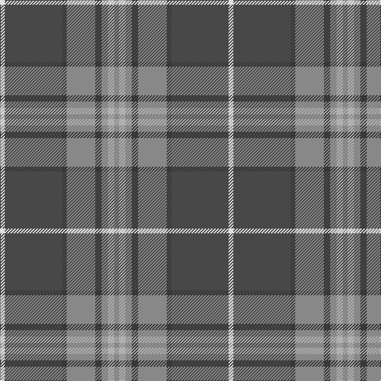

In pattern [RYRBRBBW](/stripes/ryrbrbbw/).

This was sourced from house-of-tartan.  It is a [8 stripe tartan](/stripes/stripes8/).

Original link http://www.house-of-tartan.scotland.net/house/TartanViewjs.asp?colr=Def&tnam=6821

## Thread count
LN/6 N72 DN6 Na36 DN8 Na8 Nb8 Na/6

## Palette
Each colour and its ΔE from the base-6 reference it is a variant of.

| Colour | Shade | Base | ΔE (OKLab) |
|---|---|---|---|
| DN | <code style="background-color:#383838;">#383838</code> `#383838` | B <code style="background-color:#2A418A;">#2A418A</code> | 0.14 |
| LN | <code style="background-color:#E0E0E0;">#E0E0E0</code> `#E0E0E0` | W <code style="background-color:#F7F7F7;">#F7F7F7</code> | 0.07 |
| N | <code style="background-color:#484848;">#484848</code> `#484848` | B <code style="background-color:#2A418A;">#2A418A</code> | 0.12 |
| Na | <code style="background-color:#888888;">#888888</code> `#888888` | R <code style="background-color:#CC0000;">#CC0000</code> | 0.24 |
| Nb | <code style="background-color:#B0B0B0;">#B0B0B0</code> `#B0B0B0` | Y <code style="background-color:#F2BF00;">#F2BF00</code> | 0.18 |
| W | <code style="background-color:#F8F8F8;">#F8F8F8</code> `#F8F8F8` | W <code style="background-color:#F7F7F7;">#F7F7F7</code> | 0.00 |

# Sample pattern

## Nearest tartans

The nearest existing variants by ΔTartan distance.

1. [Hebridean Granite (Fashion)](/setts/s8/o3lr4o4k4o18k3n36w3~x2/) — ΔT 0.40
1. [Bressuire (District)](/setts/s7/r1g4lo1g3r4n15w1~x4/) — ΔT 0.86
1. [Scotch Mist](/setts/s8/n4o4n4k4n18k3do38w3~x2/) — ΔT 0.98
1. [Tasmanian](/setts/s11/m2lr1dg12y1dg1y1dg3y4m3y4ly2~x4/) — ΔT 1.02
1. [Hawaii (District)](/setts/s8/t4r1ly1t12do4y10ly1r3~x4/) — ΔT 1.07
1. [Royal Deeside (District)](/setts/s6/r4y2db4y35t27r3~x2/) — ΔT 1.10
1. [Graeme Heckenberg Hunting](/setts/s7/db3g13lr1o3lr1db10lo1~x2/) — ΔT 1.14
1. [Gammell (Personal)](/setts/s8/t32r3t3r3t3r10g24r3~x2/) — ΔT 1.16
1. [Hebridean Granite](/setts/s14/lr4o4k4o18k3n36w3n36k3o18k4o4lr4o3~x2/) — ΔT 1.17
1. [Deeside, Royal](/setts/s6/lp4dy2dp4dy35n27r3~x2/) — ΔT 1.18

## Neighbour map

Every grey dot is one of 14299 variants placed by the first two principal components of the ΔTartan feature space (44% of its variance). Red is this tartan; blue dots are its nearest — click one to open its page.

<svg viewBox="0 0 640 380" role="img" style="max-width:100%;height:auto;border:1px solid #e0e0e0;border-radius:4px;display:block" xmlns="http://www.w3.org/2000/svg"><image href="/nn/cloud.v1.png" width="640" height="380"/><a href="/setts/s8/o3lr4o4k4o18k3n36w3~x2/"><circle cx="291.6" cy="166.8" r="4" fill="#3465a4"><title>Hebridean Granite (Fashion)</title></circle></a><a href="/setts/s7/r1g4lo1g3r4n15w1~x4/"><circle cx="332.7" cy="183.3" r="4" fill="#3465a4"><title>Bressuire (District)</title></circle></a><a href="/setts/s8/n4o4n4k4n18k3do38w3~x2/"><circle cx="329.9" cy="186.1" r="4" fill="#3465a4"><title>Scotch Mist</title></circle></a><a href="/setts/s11/m2lr1dg12y1dg1y1dg3y4m3y4ly2~x4/"><circle cx="268.3" cy="168.4" r="4" fill="#3465a4"><title>Tasmanian</title></circle></a><a href="/setts/s8/t4r1ly1t12do4y10ly1r3~x4/"><circle cx="249.8" cy="190.8" r="4" fill="#3465a4"><title>Hawaii (District)</title></circle></a><a href="/setts/s6/r4y2db4y35t27r3~x2/"><circle cx="341.8" cy="186.8" r="4" fill="#3465a4"><title>Royal Deeside (District)</title></circle></a><a href="/setts/s7/db3g13lr1o3lr1db10lo1~x2/"><circle cx="261.7" cy="190.9" r="4" fill="#3465a4"><title>Graeme Heckenberg Hunting</title></circle></a><a href="/setts/s8/t32r3t3r3t3r10g24r3~x2/"><circle cx="303.8" cy="201.7" r="4" fill="#3465a4"><title>Gammell (Personal)</title></circle></a><a href="/setts/s14/lr4o4k4o18k3n36w3n36k3o18k4o4lr4o3~x2/"><circle cx="300.0" cy="154.0" r="4" fill="#3465a4"><title>Hebridean Granite</title></circle></a><a href="/setts/s6/lp4dy2dp4dy35n27r3~x2/"><circle cx="337.9" cy="188.3" r="4" fill="#3465a4"><title>Deeside, Royal</title></circle></a><circle cx="303.0" cy="173.3" r="5" fill="#c00000"/></svg>

ID: /setts/s8/o3lr4o4do4o18do3n36w3~x2/
