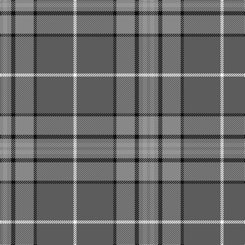

**Bands:** [RYRKRKBW](/stripes/ryrkrkbw/) · **Stripes:** [O LR O K O K N W](/stripes/stripes8/) O LR O K O K N W

This was sourced from tartans-authority.  It is a [8 band tartan](/bands/bands8/).

Original link http://www.tartansauthority.com/tartan-ferret/display/6821/

## Thread count
W/6 Na72 K6 Nb36 K8 Nb8 N8 Nb/6

## Palette
Each colour and its ΔE from the base-6 reference it is a variant of.

| Colour | Shade | Base | ΔE (OKLab) |
|---|---|---|---|
| K | <code style="background-color:#101010;">#101010</code> `#101010` | K <code style="background-color:#000000;">#000000</code> | 0.17 |
| N | <code style="background-color:#A0A0A0;">#A0A0A0</code> `#A0A0A0` | Y <code style="background-color:#F2BF00;">#F2BF00</code> | 0.21 |
| Na | <code style="background-color:#5C5C5C;">#5C5C5C</code> `#5C5C5C` | B <code style="background-color:#2A418A;">#2A418A</code> | 0.15 |
| Nb | <code style="background-color:#888888;">#888888</code> `#888888` | R <code style="background-color:#CC0000;">#CC0000</code> | 0.24 |
| W | <code style="background-color:#F8F8F8;">#F8F8F8</code> `#F8F8F8` | W <code style="background-color:#F7F7F7;">#F7F7F7</code> | 0.00 |

# Sample pattern

## Nearest tartans

The nearest existing variants by ΔTartan distance.

1. [Hebridean Granite Fashion Tartan Tartan Number: 6821. Earliest known date: 2005 For a new House of Edgar collection. Intended to emulate the gray morning suit perhaps. See products available Copyright © Blair Urquhart, Comrie, 2015](/setts/s8/o3lr4o4do4o18do3n36w3~x2/) — ΔT 0.40
1. [Tasmanian](/setts/s11/m2lr1dg12y1dg1y1dg3y4m3y4ly2~x4/) — ΔT 1.03
1. [Hawaii (District)](/setts/s8/t4r1ly1t12do4y10ly1r3~x4/) — ΔT 1.10
1. [Bressuire (District)](/setts/s7/r1g4lo1g3r4n15w1~x4/) — ΔT 1.11
1. [Hilton Hotel Hong Kong (Corporate)](/setts/s10/m4g10m2g2m24g2m2g16m2g1~x2/) — ΔT 1.20
1. [Graeme Heckenberg Hunting](/setts/s7/db3g13lr1o3lr1db10lo1~x2/) — ΔT 1.20
1. [Hebridean Granite](/setts/s14/lr4o4k4o18k3n36w3n36k3o18k4o4lr4o3~x2/) — ΔT 1.23
1. [Un-named Dutch](/setts/s7/n2r10n10o3r2lr24w2~x2/) — ΔT 1.23
1. [Gammell (Personal)](/setts/s8/t32r3t3r3t3r10g24r3~x2/) — ΔT 1.24
1. [Speyside Blue (Fashion)](/setts/s8/n32k3n3k3b5k8o21k4~x2/) — ΔT 1.28

## Neighbour map

Every grey dot is one of 14299 variants placed by the first two principal components of the ΔTartan feature space (44% of its variance). Red is this tartan; blue dots are its nearest — click one to open its page.

<svg viewBox="0 0 640 380" role="img" style="max-width:100%;height:auto;border:1px solid #e0e0e0;border-radius:4px;display:block" xmlns="http://www.w3.org/2000/svg"><image href="/nn/cloud.v1.png" width="640" height="380"/><a href="/setts/s8/o3lr4o4do4o18do3n36w3~x2/"><circle cx="303.0" cy="173.3" r="4" fill="#3465a4"><title>Hebridean Granite Fashion Tartan Tartan Number: 6821. Earliest known date: 2005 For a new House of Edgar collection. Intended to emulate the gray morning suit perhaps. See products available Copyright © Blair Urquhart, Comrie, 2015</title></circle></a><a href="/setts/s11/m2lr1dg12y1dg1y1dg3y4m3y4ly2~x4/"><circle cx="268.3" cy="168.4" r="4" fill="#3465a4"><title>Tasmanian</title></circle></a><a href="/setts/s8/t4r1ly1t12do4y10ly1r3~x4/"><circle cx="249.8" cy="190.8" r="4" fill="#3465a4"><title>Hawaii (District)</title></circle></a><a href="/setts/s7/r1g4lo1g3r4n15w1~x4/"><circle cx="332.7" cy="183.3" r="4" fill="#3465a4"><title>Bressuire (District)</title></circle></a><a href="/setts/s10/m4g10m2g2m24g2m2g16m2g1~x2/"><circle cx="295.6" cy="135.2" r="4" fill="#3465a4"><title>Hilton Hotel Hong Kong (Corporate)</title></circle></a><a href="/setts/s7/db3g13lr1o3lr1db10lo1~x2/"><circle cx="261.7" cy="190.9" r="4" fill="#3465a4"><title>Graeme Heckenberg Hunting</title></circle></a><a href="/setts/s14/lr4o4k4o18k3n36w3n36k3o18k4o4lr4o3~x2/"><circle cx="300.0" cy="154.0" r="4" fill="#3465a4"><title>Hebridean Granite</title></circle></a><a href="/setts/s7/n2r10n10o3r2lr24w2~x2/"><circle cx="251.4" cy="170.0" r="4" fill="#3465a4"><title>Un-named Dutch</title></circle></a><a href="/setts/s8/t32r3t3r3t3r10g24r3~x2/"><circle cx="303.8" cy="201.7" r="4" fill="#3465a4"><title>Gammell (Personal)</title></circle></a><a href="/setts/s8/n32k3n3k3b5k8o21k4~x2/"><circle cx="267.1" cy="197.7" r="4" fill="#3465a4"><title>Speyside Blue (Fashion)</title></circle></a><circle cx="291.6" cy="166.8" r="5" fill="#c00000"/></svg>

ID: /setts/s8/o3lr4o4k4o18k3n36w3~x2/
