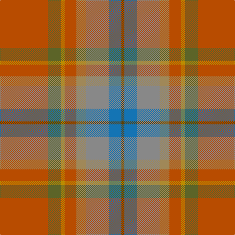

In pattern [GBRYRYGR](/stripes/gbryrygr/).

This was sourced from tartans-authority.  It is a [8 stripe tartan](/stripes/stripes8/).

Original link http://www.tartansauthority.com/tartan-ferret/display/8642/

## Thread count
DO/98 G26 DY8 DO24 LT20 N46 B26 T/6

## Palette
Each colour and its ΔE from the base-6 reference it is a variant of.

| Colour | Shade | Base | ΔE (OKLab) |
|---|---|---|---|
| B | <code style="background-color:#1474B4;">#1474B4</code> `#1474B4` | B <code style="background-color:#2A418A;">#2A418A</code> | 0.15 |
| DO | <code style="background-color:#B84C00;">#B84C00</code> `#B84C00` | R <code style="background-color:#CC0000;">#CC0000</code> | 0.08 |
| DY | <code style="background-color:#BC8C00;">#BC8C00</code> `#BC8C00` | Y <code style="background-color:#F2BF00;">#F2BF00</code> | 0.16 |
| G | <code style="background-color:#5C6428;">#5C6428</code> `#5C6428` | G <code style="background-color:#006100;">#006100</code> | 0.10 |
| LT | <code style="background-color:#A08858;">#A08858</code> `#A08858` | Y <code style="background-color:#F2BF00;">#F2BF00</code> | 0.21 |
| N | <code style="background-color:#888888;">#888888</code> `#888888` | R <code style="background-color:#CC0000;">#CC0000</code> | 0.24 |
| T | <code style="background-color:#604000;">#604000</code> `#604000` | G <code style="background-color:#006100;">#006100</code> | 0.14 |

# Sample pattern

## Nearest tartans

The nearest existing variants by ΔTartan distance.

1. [Broons, The (DC Thomson)](/setts/s9/r3k1y8ly1dy7ly1y19y25k1~x2/) — ΔT 1.98
1. [Meath Irish County Tartan Tartan Number: 2269. Earliest known date: 1996 One of a series of Irish District tartans designed by Polly Wittering of the House of Edgar, with colours reminiscent of the Country with soft warm colours dominating. See products available Copyright © Blair Urquhart, Comrie, 2015](/setts/s12/lo5n2o14dy9dg8n3o3n3o3n3dg19ly3~x2/) — ΔT 2.07
1. [State Seal of Mississippi (Fashion)](/setts/s9/y48o26lb5dy7lb10y3b7o10r3~x2/) — ΔT 2.07
1. [Jardine of Castlemilk Family Tartan Tartan Number: 1432. Earliest known date: c.1978 The chiefly house is Jardine of Applegirth, a baronetcy created in 1672. The Jardines of Castlemilk in Dumfriesshire settled there in the early fourteenth century. The tartan is approved by Col Jardine. The darker brown is recorded as "J.Br", and the lighter as "Olive Br" in the Lyon Books. See products available Copyright © Blair Urquhart, Comrie, 2015](/setts/s8/o9o9y9o1t1o9t1o1~x4/) — ΔT 2.14
1. [Golden Heather, The](/setts/s10/r2ly20o2ly2r3lo3r3lo6lo24ly2~x2/) — ΔT 2.22
1. [Pubcrawlers (Corporate)](/setts/s7/g3dy4g2dy22n5r16ly3~x2/) — ΔT 2.23
1. [Australian Donkey](/setts/s9/k4y13m3lr7w3o25r2o3o4~x2/) — ΔT 2.27
1. [Stewart Camel (Lochcarron)](/setts/s14/y3dy3dg2dy6y7dg2y3dg2lo3dg5y3b3y20dy2~x2/) — ΔT 2.28
1. [Clarks No.1](/setts/s10/dt5t2dt11y2dt2y6o17o9dt1o1~x2/) — ΔT 2.30
1. [Tasmanian](/setts/s11/r5lp2y24lr2y2lr2y6lr8r6lr8ly4~x2/) — ΔT 2.32

## Neighbour map

Every grey dot is one of 14299 variants placed by the first two principal components of the ΔTartan feature space (44% of its variance). Red is this tartan; blue dots are its nearest — click one to open its page.

<svg viewBox="0 0 640 380" role="img" style="max-width:100%;height:auto;border:1px solid #e0e0e0;border-radius:4px;display:block" xmlns="http://www.w3.org/2000/svg"><image href="/nn/cloud.v1.png" width="640" height="380"/><a href="/setts/s9/r3k1y8ly1dy7ly1y19y25k1~x2/"><circle cx="321.4" cy="153.7" r="4" fill="#3465a4"><title>Broons, The (DC Thomson)</title></circle></a><a href="/setts/s12/lo5n2o14dy9dg8n3o3n3o3n3dg19ly3~x2/"><circle cx="211.1" cy="194.2" r="4" fill="#3465a4"><title>Meath Irish County Tartan Tartan Number: 2269. Earliest known date: 1996 One of a series of Irish District tartans designed by Polly Wittering of the House of Edgar, with colours reminiscent of the Country with soft warm colours dominating. See products available Copyright © Blair Urquhart, Comrie, 2015</title></circle></a><a href="/setts/s9/y48o26lb5dy7lb10y3b7o10r3~x2/"><circle cx="242.6" cy="140.2" r="4" fill="#3465a4"><title>State Seal of Mississippi (Fashion)</title></circle></a><a href="/setts/s8/o9o9y9o1t1o9t1o1~x4/"><circle cx="315.6" cy="241.0" r="4" fill="#3465a4"><title>Jardine of Castlemilk Family Tartan Tartan Number: 1432. Earliest known date: c.1978 The chiefly house is Jardine of Applegirth, a baronetcy created in 1672. The Jardines of Castlemilk in Dumfriesshire settled there in the early fourteenth century. The tartan is approved by Col Jardine. The darker brown is recorded as &quot;J.Br&quot;, and the lighter as &quot;Olive Br&quot; in the Lyon Books. See products available Copyright © Blair Urquhart, Comrie, 2015</title></circle></a><a href="/setts/s10/r2ly20o2ly2r3lo3r3lo6lo24ly2~x2/"><circle cx="252.7" cy="147.0" r="4" fill="#3465a4"><title>Golden Heather, The</title></circle></a><a href="/setts/s7/g3dy4g2dy22n5r16ly3~x2/"><circle cx="317.1" cy="215.4" r="4" fill="#3465a4"><title>Pubcrawlers (Corporate)</title></circle></a><a href="/setts/s9/k4y13m3lr7w3o25r2o3o4~x2/"><circle cx="192.3" cy="117.4" r="4" fill="#3465a4"><title>Australian Donkey</title></circle></a><a href="/setts/s14/y3dy3dg2dy6y7dg2y3dg2lo3dg5y3b3y20dy2~x2/"><circle cx="250.7" cy="168.3" r="4" fill="#3465a4"><title>Stewart Camel (Lochcarron)</title></circle></a><a href="/setts/s10/dt5t2dt11y2dt2y6o17o9dt1o1~x2/"><circle cx="259.7" cy="186.8" r="4" fill="#3465a4"><title>Clarks No.1</title></circle></a><a href="/setts/s11/r5lp2y24lr2y2lr2y6lr8r6lr8ly4~x2/"><circle cx="293.0" cy="176.1" r="4" fill="#3465a4"><title>Tasmanian</title></circle></a><circle cx="294.9" cy="170.9" r="5" fill="#c00000"/></svg>

ID: /setts/s8/o49y13lo4o12lo10o23b13dy3~x2/
