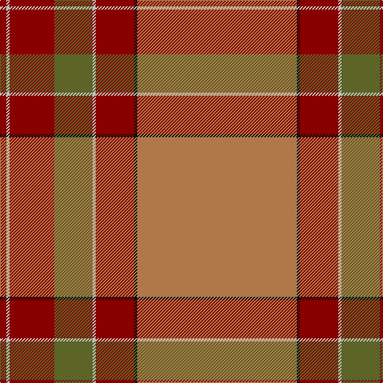

**Bands:** [RKRWGRWR](/stripes/rkrwgrwr/) · **Stripes:** [O K R LB Y R LB R](/stripes/stripes8/) O K R LB Y R LB R

This was sourced from tartans-authority.  It is a [8 band tartan](/bands/bands8/).

Original link http://www.tartansauthority.com/tartan-ferret/display/3323/

## Thread count
LT/200 K4 DR48 N4 G48 DR56 N4 DR/8

## Palette
Each colour and its ΔE from the base-6 reference it is a variant of.

| Colour | Shade | Base | ΔE (OKLab) |
|---|---|---|---|
| DR | <code style="background-color:#880000;">#880000</code> `#880000` | R <code style="background-color:#CC0000;">#CC0000</code> | 0.15 |
| G | <code style="background-color:#5C6428;">#5C6428</code> `#5C6428` | G <code style="background-color:#006100;">#006100</code> | 0.10 |
| K | <code style="background-color:#101010;">#101010</code> `#101010` | K <code style="background-color:#000000;">#000000</code> | 0.17 |
| LT | <code style="background-color:#B07848;">#B07848</code> `#B07848` | R <code style="background-color:#CC0000;">#CC0000</code> | 0.17 |
| N | <code style="background-color:#C0C0C0;">#C0C0C0</code> `#C0C0C0` | W <code style="background-color:#F7F7F7;">#F7F7F7</code> | 0.17 |

# Sample pattern

## Nearest tartans

The nearest existing variants by ΔTartan distance.

1. [MacBrair Hunting](/setts/s8/lo57k1r12lb1g12r14lb1r2~x2/) — ΔT 1.02
1. [MacByrd (Personal)](/setts/s8/y50k1r12lb1y12r14lb1r2~x4/) — ΔT 1.18
1. [Smith Hunting (Name)](/setts/s10/lo60w1r15w1lo9r15w1y9w1r15~x2/) — ΔT 1.28
1. [Connacht](/setts/s10/lo64g4o1g4o1g4o64dr2o2dr8~x2/) — ΔT 1.52
1. [MacPherson Of Cluny](/setts/s11/r5n2r2dg42r5n36r70n2ly2r7dg2~x2/) — ΔT 1.56
1. [MacPherson Of Cluny](/setts/s11/r5n2r2dg42r5n36r70n2ly2r7dg2/) — ΔT 1.56
1. [Bell of Ardbel (Personal)](/setts/s10/do7r4do4r25dp1y32dp4y2w2y5~x2/) — ΔT 1.64
1. [Down, County](/setts/s9/o64dr9o11dr4lb2lo2n5dr2lo13~x2/) — ΔT 1.67
1. [Slessor (Personal)](/setts/s8/dg2lo1dg11r50lo12db2lo4db2~x2/) — ΔT 1.71
1. [Chisholm D](/setts/s10/r6lr1r24n6dg2n1dg2n1dg12r1~x2/) — ΔT 1.73

## Neighbour map

Every grey dot is one of 14299 variants placed by the first two principal components of the ΔTartan feature space (44% of its variance). Red is this tartan; blue dots are its nearest — click one to open its page.

<svg viewBox="0 0 640 380" role="img" style="max-width:100%;height:auto;border:1px solid #e0e0e0;border-radius:4px;display:block" xmlns="http://www.w3.org/2000/svg"><image href="/nn/cloud.v1.png" width="640" height="380"/><a href="/setts/s8/lo57k1r12lb1g12r14lb1r2~x2/"><circle cx="442.4" cy="104.9" r="4" fill="#3465a4"><title>MacBrair Hunting</title></circle></a><a href="/setts/s8/y50k1r12lb1y12r14lb1r2~x4/"><circle cx="450.8" cy="134.1" r="4" fill="#3465a4"><title>MacByrd (Personal)</title></circle></a><a href="/setts/s10/lo60w1r15w1lo9r15w1y9w1r15~x2/"><circle cx="461.8" cy="127.9" r="4" fill="#3465a4"><title>Smith Hunting (Name)</title></circle></a><a href="/setts/s10/lo64g4o1g4o1g4o64dr2o2dr8~x2/"><circle cx="409.2" cy="111.1" r="4" fill="#3465a4"><title>Connacht</title></circle></a><a href="/setts/s11/r5n2r2dg42r5n36r70n2ly2r7dg2~x2/"><circle cx="421.2" cy="135.6" r="4" fill="#3465a4"><title>MacPherson Of Cluny</title></circle></a><a href="/setts/s11/r5n2r2dg42r5n36r70n2ly2r7dg2/"><circle cx="421.2" cy="135.6" r="4" fill="#3465a4"><title>MacPherson Of Cluny</title></circle></a><a href="/setts/s10/do7r4do4r25dp1y32dp4y2w2y5~x2/"><circle cx="338.9" cy="130.3" r="4" fill="#3465a4"><title>Bell of Ardbel (Personal)</title></circle></a><a href="/setts/s9/o64dr9o11dr4lb2lo2n5dr2lo13~x2/"><circle cx="390.8" cy="96.9" r="4" fill="#3465a4"><title>Down, County</title></circle></a><a href="/setts/s8/dg2lo1dg11r50lo12db2lo4db2~x2/"><circle cx="459.8" cy="116.0" r="4" fill="#3465a4"><title>Slessor (Personal)</title></circle></a><a href="/setts/s10/r6lr1r24n6dg2n1dg2n1dg12r1~x2/"><circle cx="418.9" cy="153.6" r="4" fill="#3465a4"><title>Chisholm D</title></circle></a><circle cx="425.8" cy="114.2" r="5" fill="#c00000"/></svg>

ID: /setts/s8/o50k1r12lb1y12r14lb1r2~x4/
