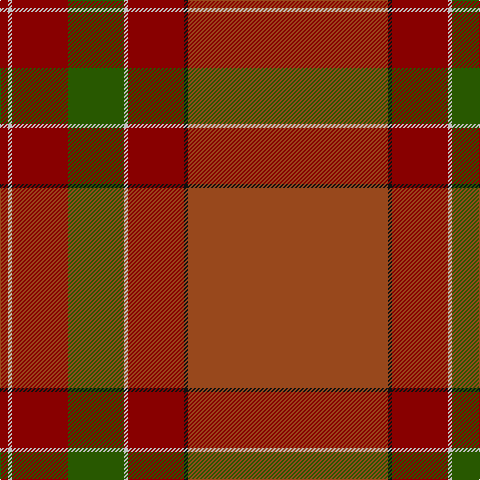

This page is one **sett** — a single exact thread-count. It belongs to the [tartan](/tartans/o50k1r14lb1dg14r14lb1r2/)
(the same proportion at any scale), whose colour order is pattern [RKRWGRWR](/stripes/rkrwgrwr/).

Sourced from tartans-authority.  It is a [8 stripe tartan](/stripes/stripes8/).

Original link http://www.tartansauthority.com/tartan-ferret/display/3321/

## Also known as

This cloth is also recorded under:

- McBrayer Htg

2 attestations — the source records this cloth was collapsed from (oldest owns this page)

<ul>
<li>pre 2002 — McBrayer Htg (Personal) (tartans-authority, <a href="http://www.tartansauthority.com/tartan-ferret/display/3321/">record</a>)</li>
<li>undated — McBrayer (register-of-tartans, <a href="https://www.tartanregister.gov.uk/tartanDetails.aspx?ref=5206">record</a>)</li>
</ul>

## Register references

External register numbers recorded for this tartan.

- Scottish Register of Tartans: [5206](https://www.tartanregister.gov.uk/tartanDetails.aspx?ref=5206)
- Scottish Tartans Authority (ITI): 3321

## Thread count
T/200 K4 DR56 N4 G56 DR56 N4 DR/8

## Palette

Palette: <strong>Tartan Register</strong>
<table><thead><tr><th>Colour</th><th>Threads</th><th>Shade</th><th>Base</th><th>OKLCh</th></tr></thead><tbody><tr><td>T/</td><td style="text-align:right;font-variant-numeric:tabular-nums">200</td><td><code style="background-color:#98481C;">#98481C</code> <small style="color:#888">#98481C</small></td><td>R <code style="background-color:#CC0000;">#CC0000</code></td><td><small style="color:#888">oklch(49.6% 0.121 46.1)</small></td></tr><tr><td>K</td><td style="text-align:right;font-variant-numeric:tabular-nums">4</td><td><code style="background-color:#101010;">#101010</code> <small style="color:#888">#101010</small></td><td>K <code style="background-color:#000000;">#000000</code></td><td><small style="color:#888">oklch(17.3% 0.000 89.9)</small></td></tr><tr><td>DR</td><td style="text-align:right;font-variant-numeric:tabular-nums">56</td><td><code style="background-color:#880000;">#880000</code> <small style="color:#888">#880000</small></td><td>R <code style="background-color:#CC0000;">#CC0000</code></td><td><small style="color:#888">oklch(39.4% 0.162 29.2)</small></td></tr><tr><td>N</td><td style="text-align:right;font-variant-numeric:tabular-nums">4</td><td><code style="background-color:#C0C0C0;">#C0C0C0</code> <small style="color:#888">#C0C0C0</small></td><td>W <code style="background-color:#F7F7F7;">#F7F7F7</code></td><td><small style="color:#888">oklch(80.8% 0.000 89.9)</small></td></tr><tr><td>G</td><td style="text-align:right;font-variant-numeric:tabular-nums">56</td><td><code style="background-color:#285800;">#285800</code> <small style="color:#888">#285800</small></td><td>G <code style="background-color:#006100;">#006100</code></td><td><small style="color:#888">oklch(41.0% 0.122 135.8)</small></td></tr><tr><td>DR</td><td style="text-align:right;font-variant-numeric:tabular-nums">56</td><td><code style="background-color:#880000;">#880000</code> <small style="color:#888">#880000</small></td><td>R <code style="background-color:#CC0000;">#CC0000</code></td><td><small style="color:#888">oklch(39.4% 0.162 29.2)</small></td></tr><tr><td>N</td><td style="text-align:right;font-variant-numeric:tabular-nums">4</td><td><code style="background-color:#C0C0C0;">#C0C0C0</code> <small style="color:#888">#C0C0C0</small></td><td>W <code style="background-color:#F7F7F7;">#F7F7F7</code></td><td><small style="color:#888">oklch(80.8% 0.000 89.9)</small></td></tr><tr><td>DR/</td><td style="text-align:right;font-variant-numeric:tabular-nums">8</td><td><code style="background-color:#880000;">#880000</code> <small style="color:#888">#880000</small></td><td>R <code style="background-color:#CC0000;">#CC0000</code></td><td><small style="color:#888">oklch(39.4% 0.162 29.2)</small></td></tr></tbody></table>

# Sample pattern

## Nearest tartans

The nearest existing variants by ΔTartan distance, with this tartan at the top so the swatches line up against it.

ΔTartan

Tartan

Sett

—

<a href="/ttd/edit/#slug=o50k1r14lb1dg14r14lb1r2~x4">McBrayer Htg (Personal)</a> <a class="nn-out" href="/setts/s8/o50k1r14lb1dg14r14lb1r2~x4/" title="open its dictionary page">↗</a>

1.14

<a href="/ttd/edit/#slug=y50k1r12lb1y12r14lb1r2~x4">MacByrd (Personal)</a> <a class="nn-out" href="/setts/s8/y50k1r12lb1y12r14lb1r2~x4/" title="open its dictionary page">↗</a>

1.61

<a href="/ttd/edit/#slug=dy36k3o6k3do10o5do3lo4k1dy2~x2">Mead (Tennessee) Hunting (Personal)</a> <a class="nn-out" href="/setts/s10/dy36k3o6k3do10o5do3lo4k1dy2~x2/" title="open its dictionary page">↗</a>

1.79

<a href="/ttd/edit/#slug=o7r4o4r25dp1y32dp4y2w2y5~x2">Bell of Ardbel (Name)</a> <a class="nn-out" href="/setts/s10/o7r4o4r25dp1y32dp4y2w2y5~x2/" title="open its dictionary page">↗</a>

1.80

<a href="/ttd/edit/#slug=o80o8o4dy4lr4dy45n8">Isaia (Fashion)</a> <a class="nn-out" href="/setts/s7/o80o8o4dy4lr4dy45n8/" title="open its dictionary page">↗</a>

1.87

<a href="/ttd/edit/#slug=y4dr52k20do9y2lo1~x2">Jack, John (Fife) (Personal)</a> <a class="nn-out" href="/setts/s6/y4dr52k20do9y2lo1~x2/" title="open its dictionary page">↗</a>

1.96

<a href="/ttd/edit/#slug=dr7m4dr4m25p1dy32p4dy2w2dy5~x2">Bell, John</a> <a class="nn-out" href="/setts/s10/dr7m4dr4m25p1dy32p4dy2w2dy5~x2/" title="open its dictionary page">↗</a>

1.97

<a href="/ttd/edit/#slug=r5n2r2dg42r5n36r70n2ly2r7dg2~x2">MacPherson Of Cluny</a> <a class="nn-out" href="/setts/s11/r5n2r2dg42r5n36r70n2ly2r7dg2~x2/" title="open its dictionary page">↗</a>

1.97

<a href="/ttd/edit/#slug=r5n2r2dg42r5n36r70n2ly2r7dg2">MacPherson Of Cluny</a> <a class="nn-out" href="/setts/s11/r5n2r2dg42r5n36r70n2ly2r7dg2/" title="open its dictionary page">↗</a>

2.00

<a href="/ttd/edit/#slug=o50k1r12lb1y12r14lb1r2~x4">MacByrd (Personal)</a> <a class="nn-out" href="/setts/s8/o50k1r12lb1y12r14lb1r2~x4/" title="open its dictionary page">↗</a>

2.09

<a href="/ttd/edit/#slug=lo60w1r15w1lo9r15w1y9w1r15~x2">Smith Hunting (Name)</a> <a class="nn-out" href="/setts/s10/lo60w1r15w1lo9r15w1y9w1r15~x2/" title="open its dictionary page">↗</a>

## Neighbour map

Every grey dot is one of 14299 variants placed by the first two principal components of the ΔTartan feature space (44% of its variance). Red is this tartan; blue dots are its nearest — click one to open its page.

<svg viewBox="0 0 640 380" role="img" style="max-width:100%;height:auto;border:1px solid #e0e0e0;border-radius:4px;display:block" xmlns="http://www.w3.org/2000/svg"><image href="/nn/cloud.v1.png" width="640" height="380"/><a href="/setts/s8/y50k1r12lb1y12r14lb1r2~x4/"><circle cx="450.8" cy="134.1" r="4" fill="#3465a4"><title>MacByrd (Personal)</title></circle></a><a href="/setts/s10/dy36k3o6k3do10o5do3lo4k1dy2~x2/"><circle cx="413.0" cy="146.8" r="4" fill="#3465a4"><title>Mead (Tennessee) Hunting (Personal)</title></circle></a><a href="/setts/s10/o7r4o4r25dp1y32dp4y2w2y5~x2/"><circle cx="360.3" cy="142.5" r="4" fill="#3465a4"><title>Bell of Ardbel (Name)</title></circle></a><a href="/setts/s7/o80o8o4dy4lr4dy45n8/"><circle cx="442.2" cy="184.4" r="4" fill="#3465a4"><title>Isaia (Fashion)</title></circle></a><a href="/setts/s6/y4dr52k20do9y2lo1~x2/"><circle cx="491.3" cy="169.7" r="4" fill="#3465a4"><title>Jack, John (Fife) (Personal)</title></circle></a><a href="/setts/s10/dr7m4dr4m25p1dy32p4dy2w2dy5~x2/"><circle cx="364.1" cy="146.4" r="4" fill="#3465a4"><title>Bell, John</title></circle></a><a href="/setts/s11/r5n2r2dg42r5n36r70n2ly2r7dg2~x2/"><circle cx="421.2" cy="135.6" r="4" fill="#3465a4"><title>MacPherson Of Cluny</title></circle></a><a href="/setts/s11/r5n2r2dg42r5n36r70n2ly2r7dg2/"><circle cx="421.2" cy="135.6" r="4" fill="#3465a4"><title>MacPherson Of Cluny</title></circle></a><a href="/setts/s8/o50k1r12lb1y12r14lb1r2~x4/"><circle cx="425.8" cy="114.2" r="4" fill="#3465a4"><title>MacByrd (Personal)</title></circle></a><a href="/setts/s10/lo60w1r15w1lo9r15w1y9w1r15~x2/"><circle cx="461.8" cy="127.9" r="4" fill="#3465a4"><title>Smith Hunting (Name)</title></circle></a><circle cx="460.3" cy="146.3" r="5" fill="#c00000"/></svg>

ID: /setts/s8/o50k1r14lb1dg14r14lb1r2~x4/
