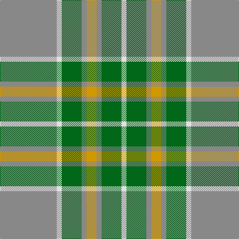

This page is one **sett** — a single exact thread-count. It belongs to the [tartan](/tartans/o57w5g20o5lo10/)
(the same proportion at any scale), whose colour order is pattern [RWGRYRGW](/stripes/rwgryrgw/).

Sourced from register-of-tartans.  It is a [8 stripe tartan](/stripes/stripes8/).

Original link https://www.tartanregister.gov.uk/tartanDetails.aspx?ref=1902

## Register references

External register numbers recorded for this tartan.

- Scottish Register of Tartans: [1902](https://www.tartanregister.gov.uk/tartanDetails.aspx?ref=1902)
- Scottish Tartans Authority (ITI): 1309
- Scottish Tartans World Register: 1309

## Thread count
N/114 LN10 G40 N10 DY20 N10 G40 LN/10

## Palette

Palette: <strong>Tartan Register</strong> <small style="color:#888">(5 of 6 colours)</small>
<table><thead><tr><th>Colour</th><th>Threads</th><th>Shade</th><th>Base</th><th>OKLCh</th></tr></thead><tbody><tr><td>N/</td><td style="text-align:right;font-variant-numeric:tabular-nums">114</td><td><code style="background-color:#888888;">#888888</code> <small style="color:#888">#888888</small></td><td>R <code style="background-color:#CC0000;">#CC0000</code></td><td><small style="color:#888">oklch(62.7% 0.000 89.9)</small></td></tr><tr><td>LN</td><td style="text-align:right;font-variant-numeric:tabular-nums">10</td><td><code style="background-color:#E0E0E0;">#E0E0E0</code> <small style="color:#888">#E0E0E0</small></td><td>W <code style="background-color:#F7F7F7;">#F7F7F7</code></td><td><small style="color:#888">oklch(90.7% 0.000 89.9)</small></td></tr><tr><td>G</td><td style="text-align:right;font-variant-numeric:tabular-nums">40</td><td><code style="background-color:#006818;">#006818</code> <small style="color:#888">#006818</small></td><td>G <code style="background-color:#006100;">#006100</code></td><td><small style="color:#888">oklch(45.0% 0.142 145.0)</small></td></tr><tr><td>N</td><td style="text-align:right;font-variant-numeric:tabular-nums">10</td><td><code style="background-color:#888888;">#888888</code> <small style="color:#888">#888888</small></td><td>R <code style="background-color:#CC0000;">#CC0000</code></td><td><small style="color:#888">oklch(62.7% 0.000 89.9)</small></td></tr><tr><td>DY</td><td style="text-align:right;font-variant-numeric:tabular-nums">20</td><td><code style="background-color:#D09800;">#D09800</code> <small style="color:#888">#D09800</small></td><td>Y <code style="background-color:#F2BF00;">#F2BF00</code></td><td><small style="color:#888">oklch(71.4% 0.147 82.1)</small></td></tr><tr><td>N</td><td style="text-align:right;font-variant-numeric:tabular-nums">10</td><td><code style="background-color:#888888;">#888888</code> <small style="color:#888">#888888</small></td><td>R <code style="background-color:#CC0000;">#CC0000</code></td><td><small style="color:#888">oklch(62.7% 0.000 89.9)</small></td></tr><tr><td>G</td><td style="text-align:right;font-variant-numeric:tabular-nums">40</td><td><code style="background-color:#006818;">#006818</code> <small style="color:#888">#006818</small></td><td>G <code style="background-color:#006100;">#006100</code></td><td><small style="color:#888">oklch(45.0% 0.142 145.0)</small></td></tr><tr><td>LN/</td><td style="text-align:right;font-variant-numeric:tabular-nums">10</td><td><code style="background-color:#E0E0E0;">#E0E0E0</code> <small style="color:#888">#E0E0E0</small></td><td>W <code style="background-color:#F7F7F7;">#F7F7F7</code></td><td><small style="color:#888">oklch(90.7% 0.000 89.9)</small></td></tr></tbody></table>

# Sample pattern

## Nearest tartans

The nearest existing variants by ΔTartan distance, with this tartan at the top so the swatches line up against it.

ΔTartan

Tartan

Sett

—

<a href="/ttd/edit/#slug=o57w5g20o5lo10~x2">Johore</a> <a class="nn-out" href="/setts/s8/o57w5g20o5lo10~x2/" title="open its dictionary page">↗</a>

0.97

<a href="/ttd/edit/#slug=t32r3t3r3t3r10g24ri3~x2">Gammell (Personal)</a> <a class="nn-out" href="/setts/s8/t32r3t3r3t3r10g24ri3~x2/" title="open its dictionary page">↗</a>

1.25

<a href="/ttd/edit/#slug=r3lg8r2lg18dp5lg3o3lg3o16lg3o3lg3~x2">Dublin Irish County Tartan Tartan Number: 2250. Earliest known date: 1996 One of a series of Irish District tartans designed by Polly Wittering of the House of Edgar, with colours reminiscent of the Country with soft warm colours dominating. See products available Copyright © Blair Urquhart, Comrie, 2015</a> <a class="nn-out" href="/setts/s12/r3lg8r2lg18dp5lg3o3lg3o16lg3o3lg3~x2/" title="open its dictionary page">↗</a>

1.26

<a href="/ttd/edit/#slug=lr30w3lr3w3lr12n30o3n5~x2">Dama Classic (Fashion)</a> <a class="nn-out" href="/setts/s8/lr30w3lr3w3lr12n30o3n5~x2/" title="open its dictionary page">↗</a>

1.35

<a href="/ttd/edit/#slug=g28r2g2r2g8db24y3r2~x2">Leatherneck, U.S.Marine Corps</a> <a class="nn-out" href="/setts/s8/g28r2g2r2g8db24y3r2~x2/" title="open its dictionary page">↗</a>

1.45

<a href="/ttd/edit/#slug=loi15o1loi2lo2loi2o1loi3k8o10loi3~x4">Annan Trade Tartan Tartan Number: 1742. Earliest known date: 1988 This sett appears in Paton's collection which is housed at the Scottish Tartans Museum, Comrie in Perthshire, Scotland. The samples are undated but the collection is known to have been put together around the 1830's, with some additions during the Victorian period. See products available Copyright © Blair Urquhart, Comrie, 2015</a> <a class="nn-out" href="/setts/s10/loi15o1loi2lo2loi2o1loi3k8o10loi3~x4/" title="open its dictionary page">↗</a>

1.47

<a href="/ttd/edit/#slug=db3o7g2r2g14o2g2db3~x2">Daks, Tartan-Loden</a> <a class="nn-out" href="/setts/s8/db3o7g2r2g14o2g2db3~x2/" title="open its dictionary page">↗</a>

1.50

<a href="/ttd/edit/#slug=n8ly2n22g6r2lb10g12n3~x2">Bahamas (District)</a> <a class="nn-out" href="/setts/s8/n8ly2n22g6r2lb10g12n3~x2/" title="open its dictionary page">↗</a>

1.52

<a href="/ttd/edit/#slug=o57w5g20o5ly10">Jahore District Tartan Tartan Number: 1309. Earliest known date: c.1890 [50% actual count] Reputed to have been presented to the Sultan of Jahore by Queen Victoria during his visit to Balmoral around 1890. See products available Copyright © Blair Urquhart, Comrie, 2015</a> <a class="nn-out" href="/setts/s5/o57w5g20o5ly10/" title="open its dictionary page">↗</a>

1.53

<a href="/ttd/edit/#slug=y57w5g20y5ly10">Jahore</a> <a class="nn-out" href="/setts/s5/y57w5g20y5ly10/" title="open its dictionary page">↗</a>

1.54

<a href="/ttd/edit/#slug=t32k2t4k2t8lo29w2k2">Southern Lakes</a> <a class="nn-out" href="/setts/s8/t32k2t4k2t8lo29w2k2/" title="open its dictionary page">↗</a>

## Neighbour map

Every grey dot is one of 14359 variants placed by the first two principal components of the ΔTartan feature space (44% of its variance). Red is this tartan; blue dots are its nearest — click one to open its page.

<svg viewBox="0 0 640 380" role="img" style="max-width:100%;height:auto;border:1px solid #e0e0e0;border-radius:4px;display:block" xmlns="http://www.w3.org/2000/svg"><image href="/nn/cloud.v1.png" width="640" height="380"/><a href="/setts/s8/t32r3t3r3t3r10g24ri3~x2/"><circle cx="303.4" cy="202.3" r="4" fill="#3465a4"><title>Gammell (Personal)</title></circle></a><a href="/setts/s12/r3lg8r2lg18dp5lg3o3lg3o16lg3o3lg3~x2/"><circle cx="299.4" cy="189.8" r="4" fill="#3465a4"><title>Dublin Irish County Tartan Tartan Number: 2250. Earliest known date: 1996 One of a series of Irish District tartans designed by Polly Wittering of the House of Edgar, with colours reminiscent of the Country with soft warm colours dominating. See products available Copyright © Blair Urquhart, Comrie, 2015</title></circle></a><a href="/setts/s8/lr30w3lr3w3lr12n30o3n5~x2/"><circle cx="343.4" cy="208.2" r="4" fill="#3465a4"><title>Dama Classic (Fashion)</title></circle></a><a href="/setts/s8/g28r2g2r2g8db24y3r2~x2/"><circle cx="340.8" cy="187.5" r="4" fill="#3465a4"><title>Leatherneck, U.S.Marine Corps</title></circle></a><a href="/setts/s10/loi15o1loi2lo2loi2o1loi3k8o10loi3~x4/"><circle cx="310.4" cy="171.6" r="4" fill="#3465a4"><title>Annan Trade Tartan Tartan Number: 1742. Earliest known date: 1988 This sett appears in Paton's collection which is housed at the Scottish Tartans Museum, Comrie in Perthshire, Scotland. The samples are undated but the collection is known to have been put together around the 1830's, with some additions during the Victorian period. See products available Copyright © Blair Urquhart, Comrie, 2015</title></circle></a><a href="/setts/s8/db3o7g2r2g14o2g2db3~x2/"><circle cx="304.6" cy="239.6" r="4" fill="#3465a4"><title>Daks, Tartan-Loden</title></circle></a><a href="/setts/s8/n8ly2n22g6r2lb10g12n3~x2/"><circle cx="260.6" cy="202.5" r="4" fill="#3465a4"><title>Bahamas (District)</title></circle></a><a href="/setts/s5/o57w5g20o5ly10/"><circle cx="402.0" cy="219.0" r="4" fill="#3465a4"><title>Jahore District Tartan Tartan Number: 1309. Earliest known date: c.1890 [50% actual count] Reputed to have been presented to the Sultan of Jahore by Queen Victoria during his visit to Balmoral around 1890. See products available Copyright © Blair Urquhart, Comrie, 2015</title></circle></a><a href="/setts/s5/y57w5g20y5ly10/"><circle cx="409.3" cy="223.5" r="4" fill="#3465a4"><title>Jahore</title></circle></a><a href="/setts/s8/t32k2t4k2t8lo29w2k2/"><circle cx="342.0" cy="164.3" r="4" fill="#3465a4"><title>Southern Lakes</title></circle></a><circle cx="328.8" cy="195.8" r="5" fill="#c00000"/></svg>

ID: /setts/s8/o57w5g20o5lo10~x2/
