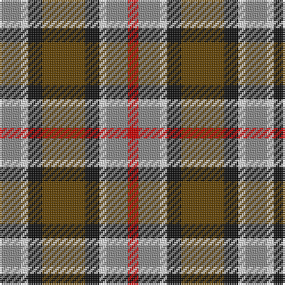

This page is one **sett** — a single exact thread-count. It belongs to the [tartan](/tartans/o6w2k4dy12k4w2o6r3/)
(the same proportion at any scale), whose colour order is pattern [RRWKGKWR](/stripes/rrwkgkwr/).

Sourced from register-of-tartans.  It is a [8 stripe tartan](/stripes/stripes8/).

Original link https://www.tartanregister.gov.uk/tartanDetails.aspx?ref=3978

## Register references

External register numbers recorded for this tartan.

- Scottish Register of Tartans: [3978](https://www.tartanregister.gov.uk/tartanDetails.aspx?ref=3978)
- Scottish Tartans Authority (ITI): 1633
- Scottish Tartans World Register: 1633

## Thread count
N/12 LN4 K8 T24 K8 LN4 N12 R/6

## Palette

Palette: <strong>Tartan Register</strong>
<table><thead><tr><th>Colour</th><th>Threads</th><th>Shade</th><th>Base</th><th>OKLCh</th></tr></thead><tbody><tr><td>N/</td><td style="text-align:right;font-variant-numeric:tabular-nums">12</td><td><code style="background-color:#888888;">#888888</code> <small style="color:#888">#888888</small></td><td>R <code style="background-color:#CC0000;">#CC0000</code></td><td><small style="color:#888">oklch(62.7% 0.000 89.9)</small></td></tr><tr><td>LN</td><td style="text-align:right;font-variant-numeric:tabular-nums">4</td><td><code style="background-color:#E0E0E0;">#E0E0E0</code> <small style="color:#888">#E0E0E0</small></td><td>W <code style="background-color:#F7F7F7;">#F7F7F7</code></td><td><small style="color:#888">oklch(90.7% 0.000 89.9)</small></td></tr><tr><td>K</td><td style="text-align:right;font-variant-numeric:tabular-nums">8</td><td><code style="background-color:#101010;">#101010</code> <small style="color:#888">#101010</small></td><td>K <code style="background-color:#000000;">#000000</code></td><td><small style="color:#888">oklch(17.3% 0.000 89.9)</small></td></tr><tr><td>T</td><td style="text-align:right;font-variant-numeric:tabular-nums">24</td><td><code style="background-color:#604000;">#604000</code> <small style="color:#888">#604000</small></td><td>G <code style="background-color:#006100;">#006100</code></td><td><small style="color:#888">oklch(39.8% 0.083 76.8)</small></td></tr><tr><td>K</td><td style="text-align:right;font-variant-numeric:tabular-nums">8</td><td><code style="background-color:#101010;">#101010</code> <small style="color:#888">#101010</small></td><td>K <code style="background-color:#000000;">#000000</code></td><td><small style="color:#888">oklch(17.3% 0.000 89.9)</small></td></tr><tr><td>LN</td><td style="text-align:right;font-variant-numeric:tabular-nums">4</td><td><code style="background-color:#E0E0E0;">#E0E0E0</code> <small style="color:#888">#E0E0E0</small></td><td>W <code style="background-color:#F7F7F7;">#F7F7F7</code></td><td><small style="color:#888">oklch(90.7% 0.000 89.9)</small></td></tr><tr><td>N</td><td style="text-align:right;font-variant-numeric:tabular-nums">12</td><td><code style="background-color:#888888;">#888888</code> <small style="color:#888">#888888</small></td><td>R <code style="background-color:#CC0000;">#CC0000</code></td><td><small style="color:#888">oklch(62.7% 0.000 89.9)</small></td></tr><tr><td>R/</td><td style="text-align:right;font-variant-numeric:tabular-nums">6</td><td><code style="background-color:#C80000;">#C80000</code> <small style="color:#888">#C80000</small></td><td>R <code style="background-color:#CC0000;">#CC0000</code></td><td><small style="color:#888">oklch(52.3% 0.215 29.2)</small></td></tr></tbody></table>

# Sample pattern

## Nearest tartans

The nearest existing variants by ΔTartan distance, with this tartan at the top so the swatches line up against it.

ΔTartan

Tartan

Sett

—

<a href="/ttd/edit/#slug=o6w2k4dy12k4w2o6r3~x2">Strathblane</a> <a class="nn-out" href="/setts/s8/o6w2k4dy12k4w2o6r3~x2/" title="open its dictionary page">↗</a>

0.65

<a href="/ttd/edit/#slug=lb3g6lb1db1r5db2o5db1lb3~x4">Wombles 7 (Corporate)</a> <a class="nn-out" href="/setts/s9/lb3g6lb1db1r5db2o5db1lb3~x4/" title="open its dictionary page">↗</a>

0.80

<a href="/ttd/edit/#slug=w6r8g24r8db6r8db8w3~x2">Utah Centennial</a> <a class="nn-out" href="/setts/s8/w6r8g24r8db6r8db8w3~x2/" title="open its dictionary page">↗</a>

0.87

<a href="/ttd/edit/#slug=dg3y12ly2k10o10ly3o2~x2">Rothesay</a> <a class="nn-out" href="/setts/s7/dg3y12ly2k10o10ly3o2~x2/" title="open its dictionary page">↗</a>

0.96

<a href="/ttd/edit/#slug=db2y1o1dg6w3o3o1y1">Equorian Olympic</a> <a class="nn-out" href="/setts/s8/db2y1o1dg6w3o3o1y1/" title="open its dictionary page">↗</a>

1.05

<a href="/ttd/edit/#slug=k14w2k3o14lb6r14k2r3~x2">Raytheon</a> <a class="nn-out" href="/setts/s8/k14w2k3o14lb6r14k2r3~x2/" title="open its dictionary page">↗</a>

1.05

<a href="/ttd/edit/#slug=o56k12o7k12o7g50db50ly10">Sikh</a> <a class="nn-out" href="/setts/s8/o56k12o7k12o7g50db50ly10/" title="open its dictionary page">↗</a>

1.10

<a href="/ttd/edit/#slug=r2lo8db2y4k4y1~x6">Thompson (J.C.'s Fancy) (Personal)</a> <a class="nn-out" href="/setts/s6/r2lo8db2y4k4y1~x6/" title="open its dictionary page">↗</a>

1.13

<a href="/ttd/edit/#slug=db16r14g16ly3g16r14db16w3~x2">Forrester (James) (Personal)</a> <a class="nn-out" href="/setts/s8/db16r14g16ly3g16r14db16w3~x2/" title="open its dictionary page">↗</a>

1.14

<a href="/ttd/edit/#slug=lo6r8k4w6y16k13lr19k5~x2">Kilkenny County Crest (Fashion)</a> <a class="nn-out" href="/setts/s8/lo6r8k4w6y16k13lr19k5~x2/" title="open its dictionary page">↗</a>

1.14

<a href="/ttd/edit/#slug=r1dy6db2lb4k4lb1~x6">Thompson's Fancy (Fashion)</a> <a class="nn-out" href="/setts/s6/r1dy6db2lb4k4lb1~x6/" title="open its dictionary page">↗</a>

## Neighbour map

Every grey dot is one of 14299 variants placed by the first two principal components of the ΔTartan feature space (44% of its variance). Red is this tartan; blue dots are its nearest — click one to open its page.

<svg viewBox="0 0 640 380" role="img" style="max-width:100%;height:auto;border:1px solid #e0e0e0;border-radius:4px;display:block" xmlns="http://www.w3.org/2000/svg"><image href="/nn/cloud.v1.png" width="640" height="380"/><a href="/setts/s9/lb3g6lb1db1r5db2o5db1lb3~x4/"><circle cx="51.1" cy="199.2" r="4" fill="#3465a4"><title>Wombles 7 (Corporate)</title></circle></a><a href="/setts/s8/w6r8g24r8db6r8db8w3~x2/"><circle cx="107.8" cy="189.5" r="4" fill="#3465a4"><title>Utah Centennial</title></circle></a><a href="/setts/s7/dg3y12ly2k10o10ly3o2~x2/"><circle cx="67.8" cy="201.3" r="4" fill="#3465a4"><title>Rothesay</title></circle></a><a href="/setts/s8/db2y1o1dg6w3o3o1y1/"><circle cx="96.1" cy="194.6" r="4" fill="#3465a4"><title>Equorian Olympic</title></circle></a><a href="/setts/s8/k14w2k3o14lb6r14k2r3~x2/"><circle cx="107.7" cy="179.0" r="4" fill="#3465a4"><title>Raytheon</title></circle></a><a href="/setts/s8/o56k12o7k12o7g50db50ly10/"><circle cx="142.6" cy="188.6" r="4" fill="#3465a4"><title>Sikh</title></circle></a><a href="/setts/s6/r2lo8db2y4k4y1~x6/"><circle cx="144.0" cy="211.9" r="4" fill="#3465a4"><title>Thompson (J.C.'s Fancy) (Personal)</title></circle></a><a href="/setts/s8/db16r14g16ly3g16r14db16w3~x2/"><circle cx="93.0" cy="239.6" r="4" fill="#3465a4"><title>Forrester (James) (Personal)</title></circle></a><a href="/setts/s8/lo6r8k4w6y16k13lr19k5~x2/"><circle cx="20.9" cy="203.2" r="4" fill="#3465a4"><title>Kilkenny County Crest (Fashion)</title></circle></a><a href="/setts/s6/r1dy6db2lb4k4lb1~x6/"><circle cx="87.7" cy="218.9" r="4" fill="#3465a4"><title>Thompson's Fancy (Fashion)</title></circle></a><circle cx="87.6" cy="206.0" r="5" fill="#c00000"/></svg>

ID: /setts/s8/o6w2k4dy12k4w2o6r3~x2/
